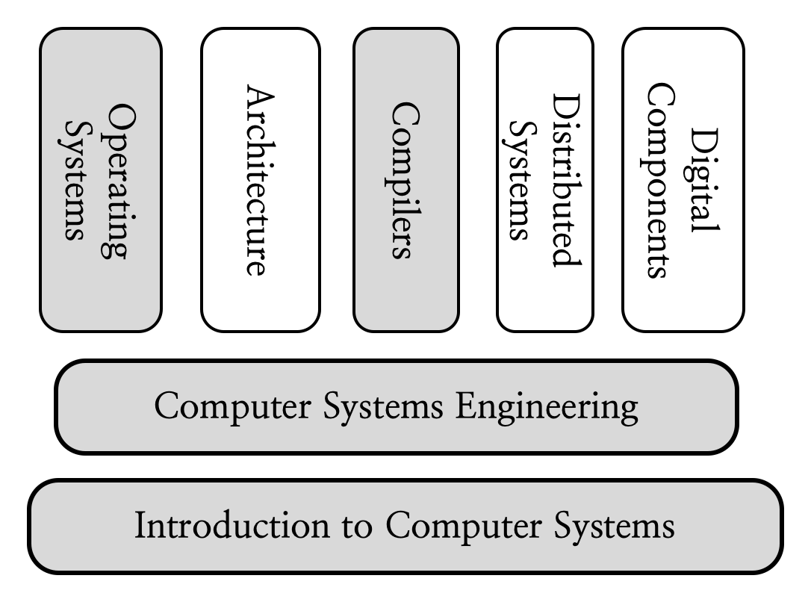
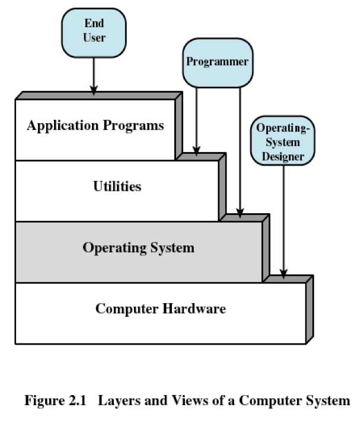
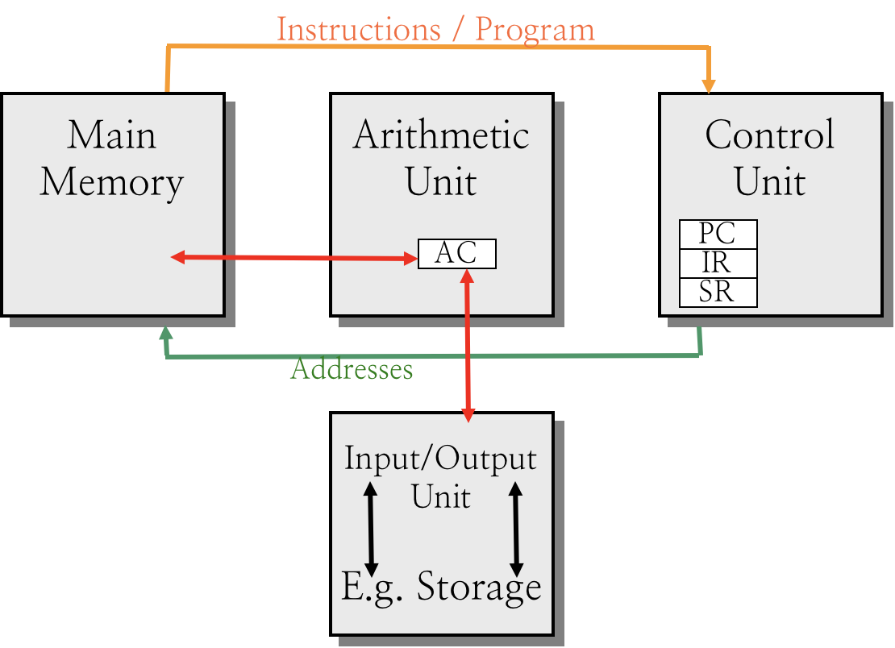
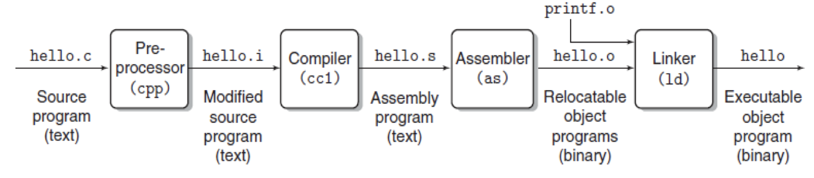

# 1.1 Intro

## Textbook

* 1.2

* 1.4.1

* 1.7(before 1.7.1)

* 1.7.3

* 1.8

* 1.9.2 (the first paragraph), the first 4 asides in chapter 1

## Outline

### Track Map

系统方向的一些关键性课程：其中 ICS 和 CSE 是以上一切的基础。

灰色标注的是我上过的课程。

### Architecture

系统层次主要分为四个层次：系统软件、实用工具、操作系统和计算机硬件。

一般的终端用户（End User）只会接触到应用软件（Application Programs）；平凡的程序员（Programmer）会触及到实用工具（Utilities）和操作系统（Operating System）；而系统设计师（OS Designer）则需要深入到计算机硬件（Computer Hardware）层面。

### Target

学完这门课，应该做到三样转变：

* 从高层抽象（Abstractions）到实现细节（Details）；
* 从应用软件层面（Application Level）到系统层面（System Level）；
* 从 `C++` 到 `C`。

### Features

本课程使用的教材名叫 *Computer Systems: A Programmer's Perspective*（第三版）。

#### Enduring Concepts

在这门课里的一些概念非常基础而通用。事实上，已经有大量的工作建构于此之上，以至于它们可以（且必须）持久、稳定且不过时。

在经过了上个世纪末的「百家争鸣」阶段之後，目前几乎所有的计算机都基于相似的硬件结构、遵循相似的工作方式。

#### Programmer's Perspective

在学这门课的时候，我们要时刻明白自己的立场是 **Programmer**，而不是 OS Designer。我们没有被要求设计一个处理器或者其他的计算机硬件。

我们选择学习知识点的规则：只有当这一知识会影响到我们开发程序的时候，才去学习它。「影响」包括但不限于正确性、性能、功能等等。

以下的所有内容都基于此立场出发。

> Good luck!

## Overview

我们再次搬出这张架构图。可以看到，计算机硬件位于整个计算机系统的基础位置。

那么进一步细分，计算机硬件的架构又如何呢？

### History

#### ABC

Atanasoff–Berry Computer，所谓「阿塔纳索夫-贝瑞计算机」，1941 年生。他是世界上第一台电子计算机，然而只能用于求解线性方程，并非图灵完备。

#### ENIAC

Electronic Numerical Integrator And Computer，所谓「电子数字积分计算机」。世界上第一台图灵完备的计算机，1946 年生。

### Architecture

冯·诺伊曼提出的计算机基础架构如下所示：

其主要特点包括：

1. 数据和代码混合存储。不严格区分数据和代码。
2. 因为 1.，指令代码用二进制数字表示。
3. 计算机执行程序时，自动地从主存储器中依次取出指令执行。

### Operating System

#### Origin

最早的计算机是没有操作系统的。计算机硬件一通电，就自动从 Main Memory 中开始依次取指执行。

这样一旦任何一段代码出现问题，错误就无法控制。

这时候的计算机也还没有「应用软件」和「实用程序」这些层级的抽象；唯一有意义的就是当前 Program Counter 指向的内存地址所能解读出的那条指令。

所以，考虑到应该有一些特殊的、被信赖的特殊指令代码用来管理其他指令的执行。

那么这些代码就组成了原初的操作系统。

#### History

* 1964，IBM 的 OS/360
* 1964，Multics
* 1969，Unix
* 1991，Linux

### Utilities

这里的 Utilities 是指一些开发软件所必需的基础设施。

* 可以是一套工具，比如 GNU 工具链；
* 可以是单个程序，比如 GNU C Compiler 编译器；
* 可以是一套抽象的标准，比如 ANSI C。

#### Compilation

在编译的过程中，我们的输入源代码 `.c` 文件经历了多个过程。

实际上，GNU C Compiler 也是一套工具链共同作用的结果。

##### Pre-processor

由名为 `cpp` 的工具对输入的 `.c` 源代码进行预处理，展开宏等处理预编译指令（如 `#include`、`#define`、`#if` 等）、清除注释等操作。

在此之后，预处理後的源代码文件被更名为 `.i`，交由编译器进行处理。

##### Compiler

> 编译器内部的词法分析、语法分析、树生成、正规化、指令流出、寄存器分配等等，都在这一步里完成。

名为 `cc1` 的程序负责这一部分的工作。

生成的结果是名为 `.s` 的汇编指令文件。

##### Assembler

名为 `as` 的程序负责读入 `.s` 汇编文件，并按照规则生成对应的二进制文件。

生成的结果是 ROF（Relocatable Object File），后缀名为 `.o`。

##### Linker

名为 `ld` 的程序负责将生成的 `.o` 文件们链接起来，生成一个可执行文件（Executable  File）。

> 这部分的具体细节可以在後面的动态/静态链接那一章里学到。

#### C Language

C 语言相比其他隔靴搔痒的语言（没错，就是 Java、Python 等一众）来说更贴近 Unix 系统。毕竟，原本就是为了写 Unix 而发明的嘛。

### Environment 

为了学习 ICS，我们大概按照这样的标准来配置我们的计算机（或者，虚拟机）：

#### Hardware platform

Intel IA-64

#### Operating system

Linux

#### Programming language

ANSI C

#### Utility

GNU stuff

#### Networking

TCP/IP、Sockets

## Summary

感觉啥都说了，又啥也没说…
