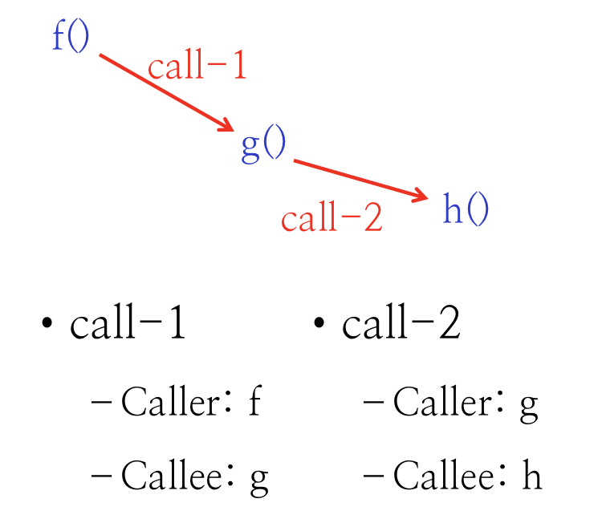

# 1.10 Procedure Call

## Textbook

* 3.7

## Outline

* Procedure Call
* Stack Frame
* Calling Convention
* Recursive

## Calling

### Instruction

* `call <label>`
* 无条件跳转，把控制权交给 `label` 对应的函数

### Other Things to Consider

* Return
  * 函数执行完毕後，需要返回到调用之前的位置
* Passing Data
  * 调用方需要把「参数」传递给被调用方
  * 被调用方需要把「返回值」传递回调用方
* Local Variables
  * 被调用方同样需要空间来存放自己的局部变量
* Registers
  * 被调用方也想要用一些寄存器
  * 但这些寄存器有可能已经在调用方中被用到了

> 都是相当棘手的问题…

## Basic Concept

### Terminology

首先，确认一下称呼。

在一个函数调用之中，发起调用的函数称为「调用方（Caller）」；被调用的函数称为「被调用方（Callee）」。

调用方和被调用方是相对的；例如下图中的 `g()`，对 `call1` 来说是被调用方；而对 `call2` 来说是调用方。



### Control Flow

跟 1.9 中说的一样，函数调用之间也会产生控制流。

不过注意，多次调用同一函数，应该看成分别进入了该函数的不同实例（Instance），而不是多次进入同一函数。否则，下面的控制流分析就会出现问题：


> 这里，`g()` 函数被多次调用，且位于不同的调用层级。

> 控制流不能两次踏入同一层调用级，除非先离开这个调用级。

### Implementation

> 提前剧透：这里的「函数调用实现」基本是一套「约定俗成」和「经验如此」的办法，但大家为了维持 ABI 就一直将就着用到了现在（。

#### Stack Frame Structure

还记得我们在 1.7 里提到的「栈」吗？

每个函数都拥有自己的 `%rsp`，指明了当前栈顶的位置。但在进入另一个函数的时候，显然 `%rsp` 的位置应该变化，否则调用函数把自己的栈弄坏了就不好了。

因此，很显然的一个思路就是，在调用一个更深层次的函数的时候，将它的栈帧定位在当前栈栈帧顶部，并继续向上延伸，这样就绝不会覆盖被调用者的栈帧了。

#### Invoke Call & Return back

首先我们来看第一条需求：在调用完子函数後，必须能回到下一条指令继续执行。也就是，子函数必须有办法取得要返回的地址。

显然，这个值放在栈上是很合适的；因此，我们一般会这么写函数调用：

```assembly
caller:
	push 	<ret_addr>
	jmp		callee
```

即，先把调用完该跑的指令的地址放在栈上，然后把控之前交给被调用方。被调用方在完成了一系列操作之後：

```assembly
callee:
	## doing something great
	## without modifying the stack
	pop		%rbx
	jmp		%rbx
```

上面两段代码实际上已经由硬件提供支持了，可以简单写作：

```assembly
caller:
	## call 会自动取得下一条指令的地址
	## 并把它放入栈中
	call callee
```

```assembly
callee:
	## ret 会自动从栈中弹出返回地址
	ret
```

#### Passing Data

对于 x64 来说，参数不超过 6 个时，就会直接将其放在寄存器中（比较快）。

过多的参数则会被**反序**压入栈中。

（也就是，先压入最後一个参数，最後压入第 7 个参数。）

（这么做的结果就是，参数在内存中实际上是正序排列的，别忘了我们的栈是倒序的。这有利于实现变长参数。）


> * 这种方法要如何确认参数的数量？
> * 答案是不需要确认；因为被调用方自己知道自己的参数数量，所以他默认调用方也已经按照这种规则放好了参数。
>
> > 约定俗成，约定俗成


至于返回值就更暴力了：始终默认放在 `%rax` 中。

因此，在调用 `call` 之前後，调用方需要进行的操作有：

```assembly
    mov		argument1, %rdi
    ## ... 
    mov		argument6, %r9
    push	argumentN
    ## ... 
    push	argument7
    
    call	callee
    
    add		$(N * 8), %rsp			## !! 一定要归还溢出参数占用的栈空间
```

而被调用方就比较简单了；只需要记得把返回值放到 `%rax` 里再 `ret` 就好。

#### Registers

首先明确：所有的 Registers 始终都只为当前活跃的 Procedure 服务。

换句话说，不能允许有一个寄存器里的值放的是上一个 Procedure 相关的东西。

> 主要原因是，想要保证 Procedure 的上下文无关性。
>
> 不论是被谁调用，他的行为应该是一样的。

也就是说，在调用一个 Sub-Procedure 的前後，寄存器可能被任意多个 Procedures 覆写，但为了保证後面指令的正确执行，他们的值不可以改变；其栈也必须保持不变。

因此，x64 提出的做法是：把寄存器分成两种。

一种是 Caller-saved Register，也就是调用者负责保存。即对于一个被调用的 Sub-Procedure，这些寄存器可以任意使用；但调用方在调用前必须先把这些寄存器的值保存起来，否则被损坏了自己承担责任。

保存 Caller-saved Registers 的一般方法是：

```assembly
caller:
	push	%rax
	push	%rdi	## Argument 1
	push	%rsi	## Argument 2
	push	%rdx	## Argument 3
	push	%rcx	## Argument 4
	push	%r8		## Argument 5
	push	%r9		## Argument 6
	push	%r10
	push	%r11
	
	call	callee
	
	pop		%r11
	pop		%r10
	pop		%r9
	pop		%r8
	pop		%rcx
	pop		%rdx
	pop		%rsi
	pop		%rdi
	pop		%rax	## that will replace callee's return value
```

> 上面这些寄存器都是调用者负责保存的。
>
> 不过注意，里边包含六个「传参寄存器」；即，在调用 Sub-Procedure 之後，不能指望前 6 个寄存器的值原样奉还。假如还用得到，那就该在调用之前放在自己的栈帧里。
>
> 再另外，`%rax` 也需要提前保存；因为这是返回值所在的寄存器，你不能指望它不被改写。

另一种是 Callee-saved Register，也就是调用者负责保存。对于一个被调用的 Sub-Procedure，这些寄存器的值不可以随便改；假如要改，则必须在自己的栈中先保存好，在自己退出前恢复这些寄存器的值。

保存 Callee-saved Registers 的一般方法是：

```assembly
callee:
	push	%rbx
	push	%rbp
	push	%r12
	push	%r13
	push	%r14
	push	%r15
	
	## ... do anything crazy
	## ... without crunching the stack
	
	pop		%r15
	pop		%r14
	pop		%r13
	pop		%r12
	pop		%rbp
	pop		%rbx
```

> 注意，通用寄存器中唯一一个既不属于 Caller-saved Register，又不属于 Callee-saved Register 的，就是 `%rsp` 了。

#### Local Variables

最後的一个问题：被调用者的局部变量怎么放？

这个问题我们需要先看看调用一个函数的时候，栈发生了什么变化。


最初，一个人畜无害的普通调用者的栈。`%rsp` 亲切地指向栈顶。

第一步，保存调用者保存的寄存器。这些当然会被放在栈中。

> 这些汇编代码由编译器生成。


第二步，我们开始写入调用参数。假设参数数量超过了 6 个，我们就覆盖了六个参数寄存器，还在栈上放了几个。


> 这一步必须在第一步之後做，否则参数寄存器（同时，也是调用者保存的寄存器）之前的值就被覆盖了。

第三步，我们把返回地址压入栈，以便 Callee 知道该回到哪去。


第四步，把控制权交给 Callee。Callee 到手第一件事，就是保存 Callee-saved Registers。


> 虚线分割两代栈帧。

第五步，Callee 开辟栈空间，保存自己的局部变量。


Callee 执行完了，把返回值放到 `%rax` 中，准备返回控制权给 Caller。

第一步，交还 Local Variables 占用的空间。


> 并没有清空栈里的值，只不过更新了 `%rsp` 而已。
>
> 他们会在有必要的时候被覆盖。

第二步，还原 Callee-saved Registers。


第三步，使用 `ret` 指令，自动弹出返回地址，并跳转到该去的地方。


此後的事情，就是 Caller 把溢出到栈中的参数弹出，还原 Caller-saved Registers。

如此而已。

### Example

来看一个简单的例子。

```c
long sum_10(long a, long b, long c, long d, long e, long f, long g, long h, long i, long j)
{
    return a + b + c + d + e + f + g + h + i + j;
}

long test_sum_10(long x)
{
    return sum_10(0, 0, 0, 0, x, 0, 0, 0, 0, 0);
}
```

关掉优化编译，得到下面的结果：

```assembly
_sum_10:                                ## @sum_10
	.cfi_startproc
## %bb.0:
	pushq	%rbp
	.cfi_def_cfa_offset 16
	.cfi_offset %rbp, -16
	movq	%rsp, %rbp
	.cfi_def_cfa_register %rbp
	leaq	(%rdi,%rsi), %rax
	addq	%rdx, %rax
	addq	%rcx, %rax
	addq	%r8, %rax
	addq	%r9, %rax
	addq	16(%rbp), %rax
	addq	24(%rbp), %rax
	addq	32(%rbp), %rax
	addq	40(%rbp), %rax
	popq	%rbp
	retq
	.cfi_endproc
                                        ## -- End function
```

以及：

```assembly
_test_sum_10:                           ## @test_sum_10
	.cfi_startproc
## %bb.0:
	pushq	%rbp
	.cfi_def_cfa_offset 16
	.cfi_offset %rbp, -16
	movq	%rsp, %rbp
	.cfi_def_cfa_register %rbp
	movq	%rdi, %r8
	xorl	%edi, %edi
	xorl	%esi, %esi
	xorl	%edx, %edx
	xorl	%ecx, %ecx
	xorl	%r9d, %r9d
	pushq	$0
	pushq	$0
	pushq	$0
	pushq	$0
	callq	_sum_10
	addq	$32, %rsp
	popq	%rbp
	retq
	.cfi_endproc
                                        ## -- End function
```

值得留意的一些地方：

* `test_sum_10` 函数在调用 `sum_10` 时，有四个参数溢出到了栈上。
  * 在调用完成之後，直接用 `addq $32, %rsp` 来释放了这部分栈空间。

* 这个例子中，编译器使用 `%rsp` 和 `%rbp` 两个寄存器来定位栈。
  * 用 `%rsp` 确定栈顶，`%rbp` 确定（当前栈帧的）栈底，并用于寻址。
  * 因此，在进行一次调用的时候…
    * 父函数的 `%rbp` 用不着，放到 Stack 里存好待会给它还原
    * 父函数的 `%rsp` 变成自己的 `%rbp`
  * 但在 ICS 教科书里（以及 Compiler Labs 里），只用一个 `%rsp` 也足够了。

## Recursion

有了上面的知识，递归也不算什么了。

说到底，每调用一次函数，相当于进行了一次实例化，碰巧执行了相同的代码，但却生成了不一样的栈帧。

这样，调用别人和调用自己（递归），说到底也没什么不一样。

### Example

```c
long rfact(long n)
{
    long result;

    if (n <= 1)
        result = 1;
    else
        result = n * rfact(n - 1);
    return result;
}
```

> `-Og` 直接把递归调用优化没了…

`-O2` 汇编摘录如下：

```assembly
_rfact:                                 ## @rfact
	pushq	%rbp
	movq	%rsp, %rbp
	subq	$32, %rsp
	movq	%rdi, -8(%rbp)
	cmpq	$1, -8(%rbp)
	jg	LBB0_2
	movq	$1, -16(%rbp)
	jmp	LBB0_3
LBB0_2:
	movq	-8(%rbp), %rax
	movq	-8(%rbp), %rcx
	subq	$1, %rcx
	movq	%rcx, %rdi
	movq	%rax, -24(%rbp)
	callq	_rfact
	movq	-24(%rbp), %rcx
	imulq	%rax, %rcx
	movq	%rcx, -16(%rbp)
LBB0_3:
	movq	-16(%rbp), %rax
	addq	$32, %rsp
	popq	%rbp
	retq
                                        ## -- End function
```

## Summary

栈——完全依赖于约定俗成的实现。

大家都必须严格小心不犯错讲道理，才能实现互相调用。

