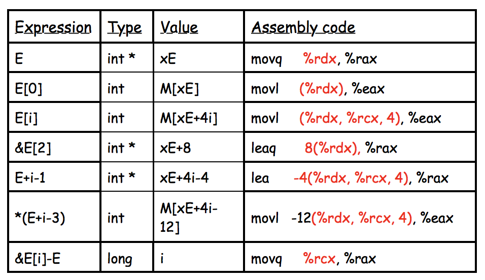

# 1.11 Array

## Textbook

* 3.8

从保存 Scalar 数据到更大规模的数据，我们需要数组。

数组如何读写，在内存中如何分布？编译器又能做出哪些优化？

## Array

### C Declaration

#### Syntax

`T A[N]` 式。`T` 是数组元素的类型，`A` 是数组的名字，`N` 是数组的元素数量。

数组占用的内存空间在编译期就确定，大小是 `sizeof(T) * N`。

通常来说，数组会在内存空间中连续分布。

#### Addressing

单独拿出一个 `A`，她表示数组 `A` 第一个元素的内存位置。因此，要访问数组的第 `i` 个元素（从 0 开始数），就需要访问相对 `A` 偏移 `sizeof(T) * i` 的内存位置。

#### Example

以一个 `char[]` 为例：

```c
char a[] = "hello, world";
```

直接把 `a` 作为 `char *` 使用，可得 `*a = 'h'`；而 `*a  + 1` 则是指向数组中的第 `1`（从 0 开始数）个元素，解引用可得 `'e'`。

> 注意，不同指针的 + 操作，带来的内存步进不同，始终等于其指向类型的 `size`。
>
> 例如，对一个 `u64 *` 指针 `+ 1` 会使得其内存地址增加 8 个字节。而 `char *` 指针 `+ 1` 只会增加 1 个字节。
>
> 如果无法确认目标类型，可以强制转为 `void *`，做加减法也以字节步进。
>
> 这些不同的步长在编译时会被通过 `sizeof` 化为简单的内存偏移量。

### Assembly

回忆汇编中的寻址方式：`(base_addr, offset_count, offset_stride)`，恰好契合了 C 中的语法实现。

例如，类型为 `T[]` 的数组 `A`，对其进行寻址 `A[i]` 即可表示为 `((void *)A, i, sizeof(T))`。

另外，还可以在这段寻址的前方放立即数，作为最终偏移量（当然是字节）。



即便是很复杂的表达式，基本也能一手拿出来。

> 如果用 mov 系列指令，那么会直接把该内存地址的内容挪到目的位置。但如果是 lea 指令，那么这个内存地址不会被解引用，而是直接把内存地址拷过来。

## Nested Array

对于固定大小的嵌套数组，会直接按照「先内层後外层」，也就是 Row Major 的方式压平之后放到内存中。

以 `T D[R][C]` 为例，`D[i][j]` 编译时会被展开成类似于 `(void *)D + sizeof(T) * (C * i + j)` 的形式。

## Variable-Size Arrays

所谓「变长数组」，是 C 特有的语法功能。不要求事先指定数组的大小，而是在传递参数时动态指定。

```c
int var_ele(long n, int A[n][n], long i, long j) {
    return A[i][j];
}
```

这是非常神奇的功能，数组的大小在编译期并没有给出。但在我们上面的讨论中，要对二维数组寻址是必须要有 Column Count 这一信息的。

读汇编，可以得到：

```assembly
	imulq	%rdx, %rdi
	leaq	(%rsi,%rdi,4), %rax
	movl	(%rax,%rcx,4), %eax
	popq	%rbp
	retq
```

简单说，第一行 `imulq %rdx, %rdi` 算出 `n * i`；

第二行 `leaq (%rsi, %rdi, 4), %rax` 算出 `(void *)A + 4 * (n * i)`；

第三行 `movl (%rax, %rcx, 4), %eax` 算出 `M[(void *)A + 4 * (n * i) + 4 * j]` 并返回。

简单说，把之前可以用一个静态值放入的 `n * i` 变成动态得来的，也因此需要增加几条指令来实现。

但总归，计算的东西还是 `M[(void *)A + 4 * (n * i + j)]`，这是不会变的。