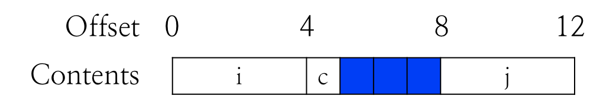
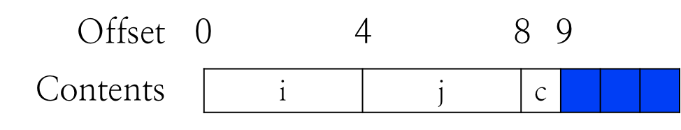

# 1.12 Struct

## Textbook

* 3.9

## Outline

* C 的 `struct`
* C 的 `union`

## C `struct`

### Syntax

把一组 Object 组合成一整个，并分别赋予他们成员名字。

```c
struct rect {
	long llx;   /* X coordinate of lower-left corner */
	long lly;   /* Y coordinate of lower-left corner */
	unsigned long width;  /* Width (in pixels) */
	unsigned long height; /* Height (in pixels) */
	unsigned long color; /* Coding of color */
};		/*
 ^ don't forget this semicolon!
 		*/
```

这样，声明单个的 `struct rect` 就相当于打包了所有的成员变量。通过 `rect_instance.entry` 就可以访问其中的变量。

特别地，假如拿到一个指向 `struct` 的指针，有可以直接通过 `prect->entry` 代替 `(*prect).entry` 的写法。

### Memory Layout

#### Size

C++ `class` 的成员变量的内存布局是不确定的（The Old New Things 的作者提到过，Windows 2000 里还有针对这个错误的 Patch）。而 C `struct` 的内存布局完全确定，类似于数组。指向 `struct` 头部的指针就是指向其第一个成员变量的指针。

每一个成员变量占用各自的空间。

#### Special Entries

不考虑对齐的情况下，`char a[0]` 这样的 Entry 相当于没有，不占用任何额外的空间；你也可以去访问他，但是拿到的内存地址和後一个元素的内存地址完全一致。

有时会采用这种特殊技巧：

```c
struct X {
    int a;
    int b;
    // ...
    char end[0];
}
```

这时，`end` 就标识着 `struct X` 的结尾。

### Assembly

上面提到了，所有的 `struct` 项的内存偏移量都是预先确认好的，因此在汇编时只需要添加一项偏移量即可。

## C `union`

上面的 C `struct` 的成员变量是绝对不会重叠的。但 `union` 则完全相反。

### Syntax

`union` 的写法和 `struct` 非常类似：

```c
union U {
	int c;
    char buf[10];
    float x;
}
```

不同的是，这里所有的成员变量的起始地址都位于同一处，而 `union` 的尺寸则取决于其中变量占用的最大空间。访问其中任何一个成员变量都会得到同一个内存地址的内容，只不过可以把其中的内容作不同的解读。

### Nested `struct` and `union`

`struct` 和 `union` 可以任意嵌套，但总是遵循其内存布局规则。

```c
struct node_t {
	nodetype_t type;
	union {
		struct {
			struct node_t *left;
			struct node_t *right;
		} internal;
		double data[2];
	} info;
};
```

## Alignment

### Assembly

在汇编语言中，加入一条 `.align <X>` 的语句，即可自动添加空白，使得下一条语句的起始地址位于某个可以被 `X` 整除的内存位置。

### `struct` alignment

在 `struct` 中，有两种因为 Alignment 所添加的空白字节。

一般认为，基本类型（如 `int`、`char`、指针等类型）都应该对齐到其自身占用的字节数处。

#### Gap

一种对齐是 `struct` 内部元素之间的对齐，称之为 `gap`。

例如这里，

```c
struct S1 {
	int i;
	char c;
	int j;
};
```

`int j` 占用 4 字节，因此也需要按 4 字节对齐其起始位置。这就是说在 `char c` 的末尾到 `int j` 的开头，有 3 字节的空缺。

 

#### Padding

另一种是，在 `struct` 尾部到下一个元素之间，为了保证下一个元素的对齐而在其尾部添加空白字节，称之为 `padding`。

例如，对于这个 `struct`，

```c
struct S2 {
	int i;
	int j;
	char c;
};

struct S2 d[4];
```



在 `struct S2` 连续排列时，每个 `struct S2` 末尾需要添加三个空白字节，以保证下一个 `struct S2` 的首元素正常对齐。

### Complex Example

```c
struct Xlass {
    short s;
    char c0;
    int i;
    long l;
    char c1;
    char a[2];
    double d;
    char c2;
};

struct Xlass x[2];
```


可以观察到 `struct Xlass` 内部的 gap 和他们之间的 padding。

