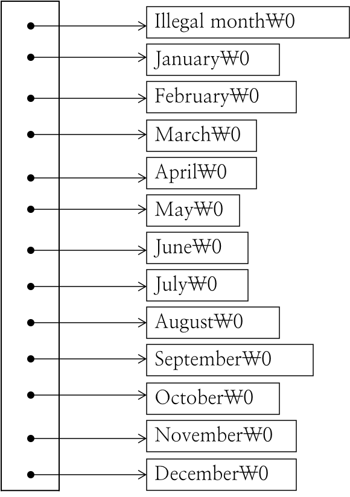
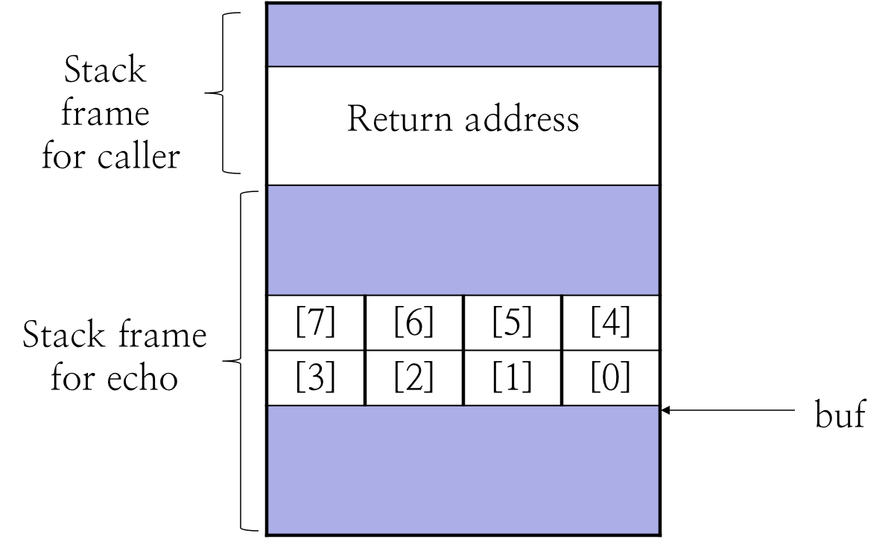
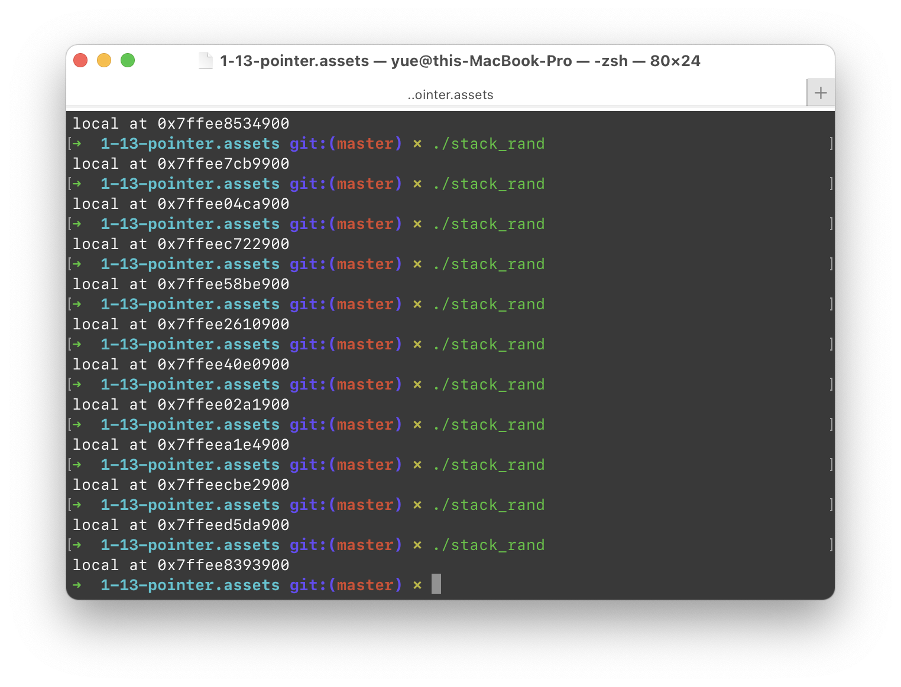
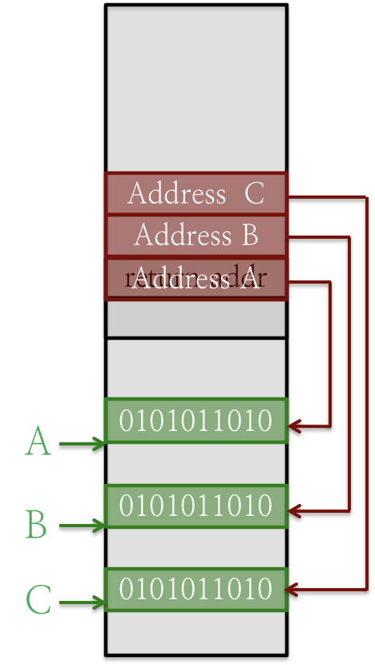

# 1.13 Pointer

## Textbook

* 3.10

## Pointer

### Syntax

每个指针都是有类型的；若其指向的 Object 的类型为 `T`，那么指针的类型就是 `T *`。

指针的「类型」决定了在解引用指针时，应该如何解读指向的这块内存；以及，在进行指针算术运算时的步进（`sizeof(T)`）。

### Void Pointer

指针本身只不过是一个内存地址，可以被任意转换类型（即，任意改变其解读的方式）。

`void *` 就是一种 Generic（泛化的）指针类型，不能直接解引用，算术运算步进总是 1 字节。

### Null Pointer

指的是没有被赋值（提供一个内存地址）的指针，通常来说值为 0。试图解引用它（即在 `0x0` 附近进行访存）会引发异常。

### Arithmetics

对于除了 `void *` 指针之外的 `T *` 类型指针，做算术加减法的步进是 `sizeof(T)`。`void *` 的加减法步进总是 1 字节。

### Assembly

被编译成汇编之後，指针就不过是一个数字了，不再携带任何类型信息。

## Pointer Array

### Syntax

不要把指针当成一个特别的东西，就把它当作是一个 8 字节的无符号数字存储就好了。只不过做算术运算和使用时会有一些特别之处。

例如，下面这段 C 代码：

```c
/* month_name: return name of n-th month */
char *month_name(int n)
{
	static char *name[] = {
		“Illegal month”, 
		“January”, “February”, “March”,
		“April”, “May”, “June”,
		“July”, “August”, “September”,
		“October”, “November”, “December”
	};
	
	return  (n < 1 || n > 12) ? name[0] : name[n];
}
```

`name` 数组中包含着十三个指针，每一个都指向一串字符。不像多维数组，这些字符串未必在内存中连续分布。



### Usage

在 `main` 函数的标准签名中，`argv` 就是一个指针数组，包含着若干 `char *` 指针。

## Pointer to Function

所谓的「函数指针」，即这个指针指向的是一个函数。

会影响函数指针类型的内容包括「函数所有参数的类型，以及函数的返回值」。

对于函数 `ReturnType fun(ParamT1 p1, ParamT2, p2);` 而言，要声明一个指向 `fun` 的，叫做 `pointer_name` 的函数指针，应该这么写：

```c
ReturnType (*pointer_name)(ParamT1, ParamT2);
```

在没有参数时，可以保留一对空参数括号，也可以省略他们。

把函数指针和指针数组结合起来（这是非常常用的一个组合），那么可能会得到这样的声明：

```c
char (*(*x[3])())[5];
```

注意，为了声明指针数组，数组的大小会始终紧贴着「名字」，而不是在声明的末尾。

这里，声明指针数组的部分是 `x[3]`，而 `x` 的类型则由 `char (*(*x))[5]` 决定，他是一个函数指针，没有参数，返回值是 `char *[5]`，即一个指向 `char[5]` 的指针。

## Buffer Overflow

缓冲区的溢出。指一种程序的漏洞（Bug）或是攻击手段。

### Example

例如，写出这样的代码：

```c
/* read input line and write it back */
void echo() {
    char buf[8];	/* way too small! */
    gets(buf);
    puts(buf);
}
```

可想而知，假如我们在要求输入时，输入超过 7 个字符，那么就会写入不该写的内存。更糟糕的是，`buf` 作为定长数组、临时变量，会被完全放在栈上，也就是内存布局对于攻击者来说几乎是透明的。

### Stack



在栈上的所有内容中（参见 `1-10-func`），攻击者最感兴趣的就是 Return Address 了，即函数执行完毕之後要返回的内存地址。

对于那些要求输入字符串的函数来说，要构造一个超长的字符串以覆写字节是非常容易的。

### Defender Solution: ASLR

通常的手段是每次运行时，在栈帧之间添加随机数量的 Padding，使得攻击者无法精确构造出覆盖特定内存地址的字节。

例如，多次运行同一程序，每次都打印出 `main` 函数所在栈帧的第一个临时变量的内存地址，可以发现：




多次运行并统计内存地址，发现：

```
executed 2913 times
min addr: 0x7ffedfc34930
max addr: 0x7ffeefbfa930
range: 0xffc6000
```

内存地址的浮动范围大概在 $2^{28}$ 字节。

据说，32-bit Linux 机器的内存地址浮动在 $2^{23}$ 字节；而 64-bit Linux 机器的内存地址浮动在 $2^{32}$ 字节。

每一次运行程序时，程序的地址空间布局都会不同；包括代码、数据、堆、栈都会浮动。

### Attacker Solution: Nop Sled

对于那些无法确认具体位置的栈，我们可以通过填充空白 `nop` 指令的方式来跳过空洞，从而抵达我们的 Exploit 代码。对于 32 位机器，尝试次数只需要 $2^{15}$ 次；但对于 64 位机器就很难做到。

### Defender Solution: Canary

在栈的尾部，添加一些特殊的数据（称为 Canary），并在进入、返回程序块时，先行确认这些数据是否被损坏，即是否有栈溢出的可能。

例如，用 gcc 加 `-fstack-protector-all` 参数编译的 `echo.c` 就包含了这样的代码：

```assembly
	# ...
	movq	___stack_chk_guard@GOTPCREL(%rip), %rcx
	movq	(%rcx), %rcx
	# ...
```

在执行时会随机生成值并放入栈底，在结束时检查这个值是否被破坏。

> 恶意攻击无法避免破坏金丝雀的原因如下。
>
> 要想绕过 Canary 必定需要执行自己的代码；要想执行自己的代码必定需要覆写栈；但等到有能力操作栈了，这时候值已经被破坏了，无法写回去来掩盖这一事实。
>
> 因为金丝雀的检查代码本身是写在代码段且在运行时动态生成的，很难覆写这部分代码。

### Defender Solution: Mark Stack NX

也就是，把栈所在的内存页标记为 Non-Executable，想要在栈上放自己的代码就会导致异常；这导致「改写返回地址为栈上，并在栈上写自己的代码」这一攻击不再可行。

### Attacker Solution: Code Reuse Attack

这种策略呢，是不去自己写入代码执行，而是从程序的二进制代码中找到自己适用的代码（通常是紧接着 `ret` 的代码），然後通过在栈上放入多个构造过的返回值，来实现操作的内容，间接操纵程序流。

