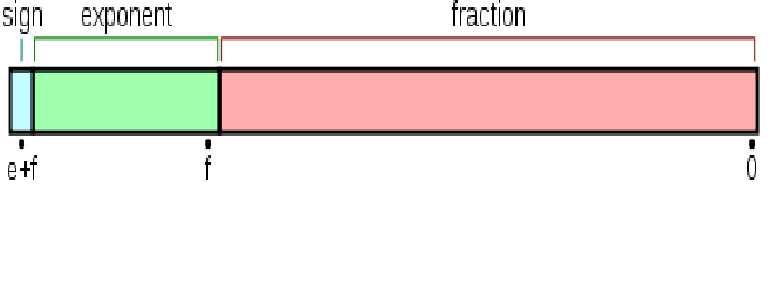
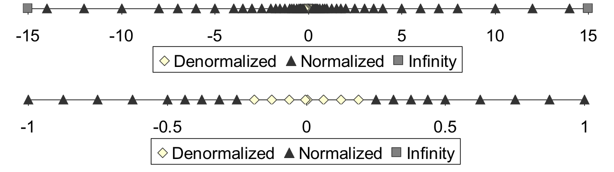

# 1.14 Floating Point

## Textbook

* 2.4

## Outline

* Fractional Binary Numbers
* IEEE 754 Standard
* Rounding Mode
* FP Operations
* Floating Point in C

## Floating Point

### Float Encoding

> 這一部分是照搬了 1.2 Bits 的一部分。复习一下那一段关于 IEEE 754 的说法。

浮点数表示就相当麻烦了…曾经一度有着许多种完全互不兼容的表示法。直到 `IEEE 754` 出现。这套 IEEE 提出的二进制浮点数算术标准拯救并统一了全世界。

众所周知，浮点数相比整数稠密得多；如果简单地采用整数的思路，并不能很好地满足需要。

但我们能用到的还是只有那 $n$ 个 Bit。

#### Regular Form

一般的规约形式下，基础的思路是基于「科学计数法」：用 $(-1)^i \times j \times 2^{k + 2^{e-1} - 1}$ 来表示这个浮点数。

把这 $n$ 个 Bit 分为三部分（从高到低说）：

* 第一部分（符号）：消耗 $1$ 位，用于保存浮点数的正负。对应上面式子的 $i$；
* 第二部分（幂）：消耗若干位，用于保存幂顶数，对应上面式子的 $k$；

> $e$ 为用于存储幂数的位个数；$2^{e-1}-1$ 作为偏移量（Bias）加到幂指数上。

* 第三部分（底数）：消耗若干位，用于保存底数。对应上面式子的 $j$。

> 注意，在规约形式下总是假定整数部分为 $1$，而底数的二进制位对应小数部分。

> 设计 Bias 的目的是，人类对于极大的数字要求一般来说大于极小的数字。
>
> 能够处理 $2^{-4}$ 到 $2^{12}$ 之间的数字，通常要比能够处理  $2^{-8}$ 到 $2^8$ 之间的数字更有意义。

#### Precision

注意到在均匀的数轴上，浮点数的表示是不均匀的；但在对数轴上则均匀。

即，越靠近 $0$，可分辨的两个浮点数的距离越短；越远离 $0$，可分辨的两个浮点数的距离越长。

> 注意！在数字相当大的时候，两个浮点数之间的距离可能大于 $1$。
>
> 即，应该考虑到浮点数 $k = k + 1$ 的情况。

#### Irregular Form

非规约形式：在指数部分完全置为 $0$ 的情况下，此时 Fraction（底数部分）的解读方式突然变化：本来是以 $1$ 为整数部分往后解读的，这样得到的底数应该在 $[1, 2)$ 以内；而在非规约形式下，整数部分改定为 $0$，此时的底数回到 $(0, 1)$ 以内。

#### Single-Precision Float

单精度浮点数占用 $32$ 位。其中，$23$ 位用于保存底数；$8$ 位用于保存幂指数；剩下的 $1$ 位作为符号位。

因此 Bias（偏移量）为 $2^{8 - 1} - 1 = 127$；即指数实际值应该等于幂指数的二进制表示加 $127$。

#### Double-Precision Float

双精度浮点数占用 $64$ 位。其中，$52$ 位用于保存底数；$11$ 位用于保存幂指数；当然还有 $1$ 位作为符号位。

同样的，幂指数偏移量是 $2^{11 - 1} - 1 = 1023$。

#### Special Cases

| 形式       | 指数             | 小数部分 |
| :--------- | :--------------- | :------- |
| 零         | $0$              | $0$      |
| 非规约形式 | $0$              | 非 $0$   |
| 规约形式   | $1$ 到 $2^e - 2$ | 任意     |
| 无穷       | $2^e - 1$        | $0$      |
| `NaN`      | $2^e - 1$        | 非零     |

### Rounding Mode

也就是「做窄化转换」的时候，应该偏向哪个方向。

#### Strategies

在将浮点数转化为整数时，就有四种策略：

* Round Down，即总是取数值上不超过该浮点数的整数作为结果。
* Round Up，即总是取数值上不小于该浮点数的整数作为结果。
* Round Towards Zero，即总是取更靠近 0 侧的整数作为结果。
	* 对于正数转换来说，RTZ 相当于 RD；
	* 而对于负数来说，RTZ 相当于 RU。
* Round to Even，即俗称的「四舍五入」。
	* 注意这里的「入」在正数上就是把 `+0.5` 入为 `+1` 计算；而对于负数来说，则是把 `-0.5` 作为 `-1` 计算。

#### Examples

| Mode              | 1.40 | 1.60 | 1.50 | 2.50 | -1.50 |
| ----------------- | ---- | ---- | ---- | ---- | ----- |
| Round-to-Even     | 1    | 2    | 2    | 2    | -2    |
| Round-toward-zero | 1    | 1    | 1    | 2    | -1    |
| Round-down        | 1    | 1    | 1    | 2    | -2    |
| Round-up          | 2    | 2    | 2    | 3    | -1    |

#### Summary

默认采用的是 Round to Even，即四舍五入。

从统计学上来说，只有他是没有偏向性（unbiased）的。

### Calculation

浮点数的运算比起整数要复杂得多。同时由于其不精确性质，可能还会出现一些反直觉的运算规律，如：

$A = A + B$，其中 $B \ne 0$。这在 $A \gg B$ 时成立。

 #### Addition

对于两个幂指数一样的浮点数而言，加减法可以直接在底数上做，最後调整浮点数形式得到结果即可。

所以在做幂指数不一致的浮点数加减法时，我们应该先把幂指数调整一致，再做加减法，最後复原。

这也就解释了为什么上面的「反直觉运算」会成立；在调整 B 的幂次使得 A、B 同幂次时，B 的底数过小，以至于在加减法完成后，A 的底数没能发生改变。

#### Multiplication

乘法实际上是算简单的。考虑到下面的公式：
$$
(a \times 10^\alpha) \times (b \times 10^\beta) = (a \times b) \times 10 ^{\alpha + \beta}
$$
也就是，只要分别对底数和幂指数做乘法、加法，最後规整化即可。

另外，结果的符号位用 $a$ 和 $b$ 的符号位异或即可。

#### Puzzles

因为上面的这些问题，因此有下面这些猜谜：

* `x ?= (int)(float)x`
	* `float` 的底数只有 24 位，无法完全覆盖 32 位整型。
* `x == (int)(double)x`
	* 而 `double` 的底数有 53 位，足够覆盖 32 位整型。
* `f == (float)(double)f`
	* 毫无疑问；`double` 空间肯定能完全覆盖 `float` 的
* `d ?= (double)(float)d`
	* 也很显然；窄化转换。可能丢失信息。
* `f == -(-f)`
	* 浮点数的符号位是单独存放的；取相反数不会带来精度损失。
* `2/3 != 2/3.0`
	* 或许是最常见的 C 的「Bug」…
* `d < 0.0` => `d * 2 < 0.0`
	* 做乘法时，符号位直接按照异或算出。和精度无关。
* `d > f` => `f < d`
	* 同理；符号位的事情是可以信任的。
* `d * d >= 0.0`
	* 必然；因为结果的符号位是 `d` 的符号位跟自己异或得到的；结果必然是 0，即非负数。
* `(d + f) - d ?= f`
	* 浮点数的四则运算是没有交换律的。
	* 改变顺序很有可能导致结果改变。

