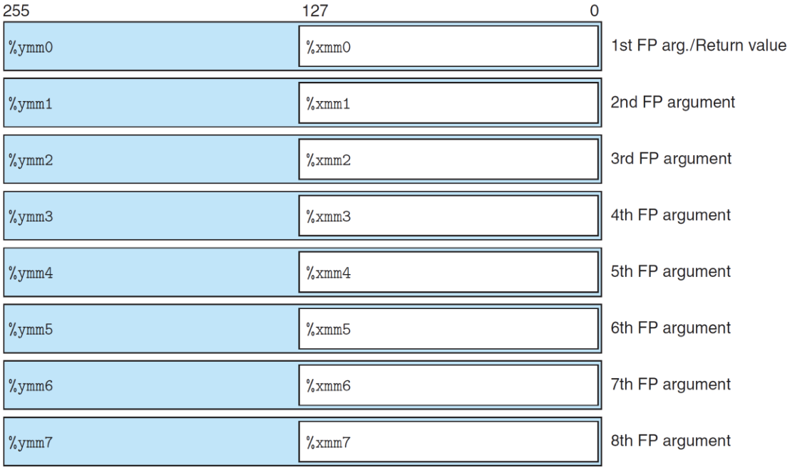
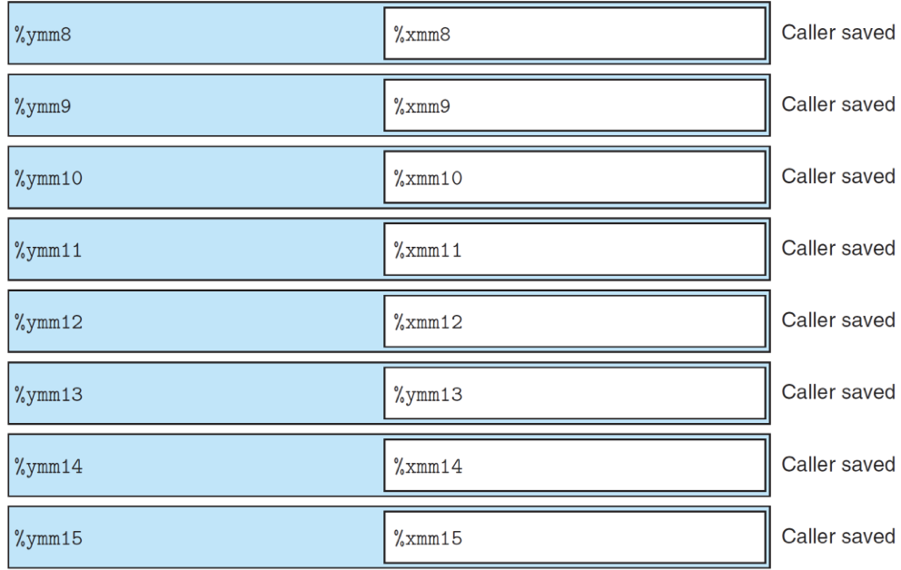

# 1.15 Floating Point Instructions

## Textbook

* 3.11

## Outline

* 保存、读取浮点数
* 移动、转换浮点数
* 做浮点算术运算

## FP Architecture

### x86_64

在 x86_64 的实现中，自 Pentium 开始采用了名为 MMX 的浮点数模块。

#### Registers





存浮点数的寄存器跟存整型的寄存器是完全独立的。

无前缀的 `%mm` 系列寄存器是 64 位；`%xmm` 系列是 128 位；`%ymm` 系列是 256 位。

#### Movement Operations

##### Instructions


`-s` 和 `-d` 後缀分别代表单精度（Single）和双精度（Double）。

##### Example

```c
void set_float(float *dst){
  	*dst = 3.14159;
}
```

汇编出的代码是：

```assembly
LCPI0_0:
	.long	1078530000              ## float 3.14159012

	## ...
	movss	LCPI0_0(%rip), %xmm0    ## xmm0 = mem[0],zero,zero,zero
	movss	%xmm0, (%rax)
	## ...
```

同样因为没有从内存直接到内存的 `mov` 指令，需要一个中间寄存器 `%xmm0` 来临时保存一下。

> 另外这里可以看出编译器对待浮点数常量的态度：直接用 `.long` 表示，并当作浮点数解读。

#### Conversion Operations

##### Instructions


参照上一节的内容，这里的 Rounding 策略都是「朝 0 取整」的。

##### Example

```c
void cast_float(float v, int *dst){
  	*dst = (int)v;
}
```

汇编出的代码是：

```assembly
	## ...
	cvttss2si	-4(%rbp), %eax
	movq	-16(%rbp), %rcx
	movl	%eax, (%rcx)
	## ...
```

同样

```c
void cast_int(int v, float* dst) {
    *dst = (float)v;
}
```

汇编出的代码是：

```assembly
	## ...
	cvtsi2ssl	-4(%rbp), %xmm0
	movq	-16(%rbp), %rax
	movss	%xmm0, (%rax)
	## ...
```

注意所用指令的区别。

#### Arithmetic Operations

##### Instructions


相比于整数，多了几个特别的指令：判断最大值/最小值跟开根号的指令。

##### Examples

```c
#include "math.h"

float float_add(float a, float b)
{
    return a + b;
}

float float_sub(float a, float b)
{
    return a - b;
}

float float_mul(float a, float b)
{
    return a * b;
}

float float_div(float a, float b)
{
    return a / b;
}

float float_max(float a, float b)
{
    return a > b ? a : b;
}

float float_min(float a, float b)
{
    return a < b ? a : b;
}

float float_sqrt(float v)
{
    return sqrtf(v);
}
```

开最高优化 `-Og` 编译，得到的关键指令包括：

```assembly
    addss	%xmm1, %xmm0	## float_add
    subss	%xmm1, %xmm0	## float_sub
    mulss	%xmm1, %xmm0	## float_mul
    divss	%xmm1, %xmm0	## float_div
    maxss	%xmm1, %xmm0	## float_max
    minss	%xmm1, %xmm0	## float_min
    sqrtss	%xmm0, %xmm0	## float_sqrt
```

每个函数都只有一条关键指令。

#### Bitwise Operations

##### Instructions


这是比较特殊的两个指令，用途比较窄。

##### Examples

通常来说 `vxorps` 用来清空一个浮点寄存器的值，像这样：

```assembly
	xorps	%xmm0, %xmm0
```

#### Comparison Operations

##### Instructions


跟整型的比较指令类似，也是设置标识位。另外，S~1~ 跟 S~2~ 只能有一个是内存地址。

##### Example

```c
int cmp(float a, float b)
{
    return a > b ? 1 : -1;
}
```

会编译出：

```assembly
	## ...
	ucomiss	%xmm1, %xmm0
	## ...
```

後面用 `cmov` 就实现了这个函数的效果了。

### Summary

总归，就是把整型里的寄存器跟指令重做了一遍，顺便加了点甜头。

用起来倒没什么区别。