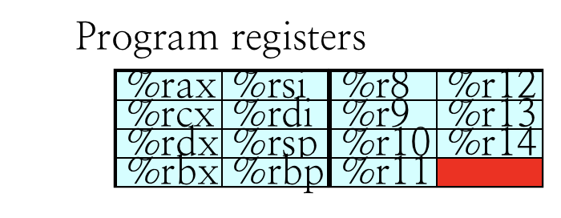

# 1.16 RISC

## Textbook

* 4.1

## Outline

* Y86 指令集
* CPU 设计
* RISC vs. CISC

### Y86 Architecture

#### Registers

和 IA64 完全一致，15 个通用寄存器。

除此之外，还有一个 PC 寄存器 `%rip`。

#### Condition Codes

* OF
	* 是否出现了溢出（Overflow）
* ZF
	* 结果是否是 0（Zero）
* SF
	* 结果是否是负的（Negative）

### Instructions

#### Instructions Encoding

和 IA64 类似，指令长度不一致。

> 注意，上面每一单位的正方形格代表一个「字」，即 4 Bit，也就是十六进制表示中的一位。

#### Registers Encoding

上面标注为 `rA`、`rB` 的位置都会放置寄存器 ID。由于寄存器的数量只有 15 个，因此只需要 4 个 Bit（一个字）就足够了。

#### Function Encoding

上面标注为 `fn` 的位置也是 4 Bit 的编码，用于确定在何种 Conditional Flag 时执行指令。

符合下面的对应关系：

| 0               | 1                  | 2         | 3          | 4              | 5                     | 6            |
| --------------- | ------------------ | --------- | ---------- | -------------- | --------------------- | ------------ |
| Unconditionally | when Less or Equal | when Less | when Equal | when Not Equal | when Greater or Equal | when Greater |

#### Number Encoding

注意到，上面保存立即数（记作 `V`）、内存偏移量（记作 `D`）以及内存地址（记作 `Dest`）的数字都超过了一字节。因此，需要考虑小端、大端法的区别，即字节（8 个 Bit 为一组）之间的排列顺序。

### Stack

和 IA64 的非常类似，同样是一个倒立的栈，仅由栈顶指针 `%rsp` 辅助寻址。

## Labs

在 ICS 的 Lab 里面，写过