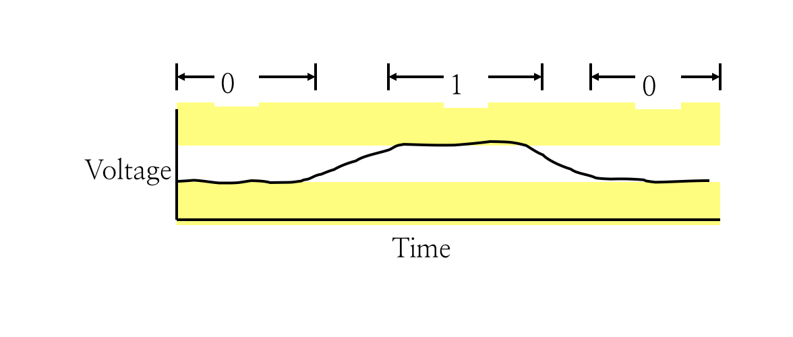
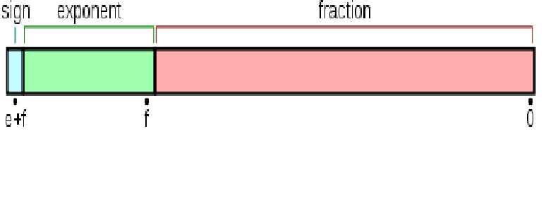

# 1.2 Bits

## Textbook

* 1.1

* 2.1.1

## Representing Information

Bits…我们用这个来表示信息的。

### Why?

现代计算机呢，都是用 Bits 来储存和处理信息的。

换句话说，都是用一种「双值」的信号来保存所有的信息。高高低低的这些信号量，就是「Bits」。

所谓的数字革命，也就是建立在这种基于 Bit 的信号表示之上的。

计算机是基于物理存在的机器；为了存储信息，必须借助物理世界中的量。

用什么样的策略来对应这种关系呢…

### Comparison

#### Decimal Representation

十进制计数法，是基于人类的手指而研发出来的一种计数方法。

使用 `0123456789` 十个数字来计数。

#### Binary Representation

至于二进制表示呢，只用到 `01` 两个数字，或者说「状态」。

虽然对大部分人来说难读难用，但是对计算机来说却很方便处理。

这是真的。因为把真实世界的物理量给一分为二是简单且可靠的——例如，电压。



> 高电平代表 `True` 或 $1$；低电平代表 `False` 或 $0$。

但如果要在一个物理量「电压」里面分出 $10$ 份， 就不那么可靠又简单了——区间势必分的比较细，细微的跳变就更容易造成信号的改变。

#### Analogue Representation

相比于上面的数字信号表示法，还有一种信号表示方法——模拟信号。即，不采用分段函数的方式把它们分段化，而是直接采用时域上连续的函数来映射物理量。

相比于数字信号呢，模拟信号的容错性差、易受干扰。

## Go Binary

### Implementation

综合上面这些信号表示方法，其中唯有 Binary Representation 是最为**简单**的。

不光是听起来简单，而且可以用很简单的电路可靠地实现；且容易大规模地在电路上集成。

### Features

虽然看起来功能上，一个孤立的二进制表示单元相当弱。

但是别忘了指数爆炸这一特性。只要稍微增加一点二进制单元的数量，其表示能力就会爆炸般地增长。

理论上，任何进制的表示能力都是相同的。

### Bytes

我们把八个 Bit（比特、位）组成的联合称为一个 Byte（字节）。

为什么是八个呢？因为碰巧 $2^8 = 256$ 种状态，刚好够存储西语的所有字符。所以，历史传统，就把它叫做「字节」了。

>  事实上，早在 1956 年 7 月，这个词就被 Dr. Werner Buchholz 提出来了。

### Calculating

一个二进制数的表示上类似于 $0$ 和 $1$ 两个数位的组合。跟生活中常用的十进制一样，每个数位代表的值都跟它所在的位数有关。

从右往左数，第 $i$ 位数字对应的权重是 $2 ^ i$。

> 请从 $0$ 开始数！

#### Bin to Oct

因此，以 `b01010` 为例，将其转化为十进制的算式就是：
$$
0 \times 2 ^ 4 + 1 \times 2 ^ 3 + 0 \times 2 ^ 2 + 1 \times 2 ^ 1 + 0 \times 2 ^ 0 = 10
$$

#### Oct to Bin

这就更简单了——在数学里面我们用的方法是连除法；用计算机语言表示，大概是这么一个算法：

```python
# 将 Oct 转化为 Bin 之后
# 其二进制表示的位数不会超过 maxx
maxx = int(log(num, 2))

result = []
for i in range(maxx, -1, -1):
    # 用 2 ** i 从大到小除
	if num // (2 ** i) != 0:
        # 如果能够除则置该位为 1
		num %= (2 ** i)
		result.append('1')
	else:
        # 否则置为 0
		result.append('0')

print(''.join(result))
```

> 相当简单的吧！
>
> 把上面的 $2$ 替换成其他数字，也能简单地实现到其他进制的转换器。

这两种算法应当相当熟悉。对于这两种数字的表示，要相当敏感才行。

## Number Representation

好的，既然我们已经有了二进制单元，我们首先就得考虑考虑怎么用他们来表示数字。

然而，遗憾的是，就连「简单」的数字也不那么简单。我们分成三类讨论：

### Unsigned Integer Encoding

无符号（没有正负之分）的整数——这是最简单的情况了。

只需要按照我们上面的 Naïve Solution，直接按照二进制表示把数字存进去就好了。没有任何争议。

当然，他也只能表示大于等于 $0$ 的整数；且在使用 $n$ Bit 的情况下，能表示不大于 $2 ^ n - 1$ 的所有非负数。

顺带一提，要加两个数字，只需要按照普通的加法计算就可以了。不过注意，和平时的「逢 $10$ 进 $1$ 位」不同，这里我们需要逢 $2$ 就进位。减法也一样。

### Signed Integer Encoding

上面的无符号整数表示法毫无异义；然而到了有符号的数字，就存在一些争议了——我们怎么表示「负号」？

#### Extra Sign-Bit Encoding

把 $n$ 位中的最高位拿出来，用于存储这个数字是正是负——一般而言规定以 $0$ 为正、以 $1$ 为负。

剩余 $n - 1$ 位按照上面的办法解码。

---

这个方法的问题在于：$0$ 存在两种表示方法。

例如，`(0)000 0000` 和 `(1)000 0000​` 都表示同一个数字 $0$，这就带来了不必要的复杂和麻烦。

也是因为上面的原因，他一共只能表示 $2 ^ n - 1$ 个数字；范围是 $[-2^{n - 1} + 1, 2^{n - 1} - 1]$。

另外注意：在这种表示法中，正数和负数、负数和负数是不能互相加和的。如果直接按照上面的方法做加法，正数 $a$ 和负数 $b$ 直接加和会得到 $b - a$（负数位起效）；负数 $c$ 和负数 $d$ 直接加会得到 $- c - d$（符号位溢出）（假设结果能用 $n$ 位表示）。

#### One's-complement Encoding

反码是一种改进式的表示方法：正数仍然是只使用低 $n - 1$ 位，而最高位置为 $0$；正数和 $0$ 直接按位取反後作为相反数的表示。

---

这种表示方法仍然会带来「双〇问题」——`0000 0000 ` 和 `1111 1111` 都代表 0。但是，可以直接对任意正数和负数加减了，结果正确。

表示范围也是 $[-2^{n - 1} + 1, 2^{n - 1} - 1]$。

#### Two's-complement Encoding

补码表示法。正数一如既往只使用低 $n - 1$ 位、最高位置 $0$；而将整数 $a$ 取反之後，再加 $1$ 即可成为 $-a$ 的补码表示。

留意到这里的 $0$ 表示是唯一的——对 `0000 0000​` 取反之後得到 `1111 1111`；再加上 $1$ 就全数溢出，回到了 `0000 0000`。

这里，表示范围是 $[-2^{n - 1}, 2^{n - 1} - 1]$。

加减法仍然适用；并且，无论 $a$ 的正负如何，对 $a$ 的补码表示按位取反之後加一即可得到 $-a$ 的补码表示。

这种方法已经成为了事实标准：只要记住这种就好了。

### Float Encoding

浮点数表示就相当麻烦了…曾经一度有着许多种完全互不兼容的表示法。直到 `IEEE 754` 出现。这套 IEEE 提出的二进制浮点数算术标准拯救并统一了全世界。

众所周知，浮点数相比整数稠密得多；如果简单地采用整数的思路，并不能很好地满足需要。

但我们能用到的还是只有那 $n$ 个 Bit。

#### Regular Form

一般的规约形式下，基础的思路是基于「科学计数法」：用 $(-1)^i \times j \times 2^{k + 2^{e-1} - 1}$ 来表示这个浮点数。

把这 $n$ 个 Bit 分为三部分（从高到低说）：

* 第一部分（符号）：消耗 $1$ 位，用于保存浮点数的正负。对应上面式子的 $i$；
* 第二部分（幂）：消耗若干位，用于保存幂顶数，对应上面式子的 $k$；

> $e$ 为用于存储幂数的位个数；$2^{e-1}-1$ 作为偏移量（Bias）加到幂指数上。

* 第三部分（底数）：消耗若干位，用于保存底数。对应上面式子的 $j$。

> 注意，在规约形式下总是假定整数部分为 $1$，而底数的二进制位对应小数部分。

> 设计 Bias 的目的是，人类对于极大的数字要求一般来说大于极小的数字。
>
> 能够处理 $2^{-4}$ 到 $2^{12}$ 之间的数字，通常要比能够处理  $2^{-8}$ 到 $2^8$ 之间的数字更有意义。


#### Precision

注意到在均匀的数轴上，浮点数的表示是不均匀的；但在对数轴上则均匀。

即，越靠近 $0$，可分辨的两个浮点数的距离越短；越远离 $0$，可分辨的两个浮点数的距离越长。

> 注意！在数字相当大的时候，两个浮点数之间的距离可能大于 $1$。
>
> 即，应该考虑到浮点数 $k = k + 1$ 的情况。

#### Irregular Form

非规约形式：在指数部分完全置为 $0$ 的情况下，此时 Fraction（底数部分）的解读方式突然变化：本来是以 $1$ 为整数部分往后解读的，这样得到的底数应该在 $[1, 2)$ 以内；而在非规约形式下，整数部分改定为 $0$，此时的底数回到 $(0, 1)$ 以内。

#### Single-Precision Float

单精度浮点数占用 $32$ 位。其中，$23$ 位用于保存底数；$8$ 位用于保存幂指数；剩下的 $1$ 位作为符号位。

因此 Bias（偏移量）为 $2^{8 - 1} - 1 = 127$；即指数实际值应该等于幂指数的二进制表示加 $127$。

#### Double-Precision Float

双精度浮点数占用 $64$ 位。其中，$52$ 位用于保存底数；$11$ 位用于保存幂指数；当然还有 $1$ 位作为符号位。

同样的，幂指数偏移量是 $2^{11 - 1} - 1 = 1023$。

#### Special Cases

| 形式       | 指数             | 小数部分 |
| :--------- | :--------------- | :------- |
| 零         | $0$              | $0$      |
| 非规约形式 | $0$              | 非 $0$   |
| 规约形式   | $1$ 到 $2^e - 2$ | 任意     |
| 无穷       | $2^e - 1$        | $0$      |
| `NaN`      | $2^e - 1$        | 非零     |

#### Calculating

可以留意到，浮点数的加减就很难有一个简单的实现了。

因此在实际的计算机实现中，浮点数运算单元都比整数运算单元复杂得多。

### Notice

`int` 和 `unsigned int` 不是整数集 $\N$。远远不是。

`float` 和 `double` 不是实数集 $\R$。远远远远不是。

他们只是 $2^n$ 个不同的状态位，按照一些精巧的对应方法映射到 $2^n$ 个整数/实数而已。

## Hexadecimal Representation

「十六进制」使用 `0123456789ABCDEF` 十六个字符来表示数字。通常以 `0x` 前缀表示十六进制数字。

因为 $2^n$ 进制的表示和二进制之间的转换比较简单。例如，直接采用查表的方法就能实现互相转化：

| Hex  | `0`    | `1`    | `2`    | `3`    | `4`    | `5`    | `6`    | `7`    | `8`    | `9`    | `a`    | `b`    | `c`    | `d`    | `e`    | `f`    |
| :--: | ------ | ------ | ------ | ------ | ------ | ------ | ------ | ------ | ------ | ------ | ------ | ------ | ------ | ------ | ------ | ------ |
| Bin  | `0000` | `0001` | `0010` | `0011` | `0100` | `0101` | `0110` | `0111` | `1000` | `1001` | `1010` | `1011` | `1100` | `1101` | `1110` | `1111` |

而信息密度又比二进制高，因此大家都爱用～

## C Programming Language

一想到 ICS，就想到 Lab，又想到 ANSI C。

多的也不说，把 K&R 读一遍基本就没问题了。

略过。

至于 Assembly Code、Relocatable Object 诸如此类，後面会提到的。

## Manipulating Information

既然我们已经能够用这一串二进制列表示信息了，我们现在就该考虑如何去操作这些 Bits 了。

二进制表示有个特点：只有真假两种状态。而 Boole 大神已经给出了完备的布尔代数运算法则。

#### Four Ops

四则运算（二进制版）。


我们比较不熟悉的就是 Exclusive-Or——可以理解成按位比较。假如一致，则标记为 $0$；否则标记为 $1$。

用单单一个 Exclusive-Or 就能实现其他所有的逻辑运算。

#### Tricky

那个亘古不变、每次说起 Xor 都要说的那个例子，In-place Swap：

```c++
void inplace_swap( int* x, int* y ) {
    if ( *x == *y ) {
        return;
    }
    *x = *x ^ *y;
    *y = *x ^ *y;
    *x = *x ^ *y;
}
```

不过一定注意，假如 `*x == *y`，那么按照这么操作就会把 `*x` 和 `*y` 清空了。一定要注意。

#### Bitset

要单独设置每一位的数字，没看起来那么简单。

需要用到一个名为「掩码」的东西。

##### Set 0

如果要把一个二进制数 `num` 的第 $i$ 位置为 $0$ 的话…

那么我们只需要把 `num` 和 $111...1110111...111$（只有第 $i$ 位是 $0$） 进行 `&` （AND）运算即可。

##### Set 1

如果要把一个二进制数 `num` 的第 $i$ 位置为 $$1 的话…

那么我们只需要把 `num` 和 $000...0001000...000$（只有第 $i$ 位是 $$）1 进行 `|` （OR）运算即可。

#### Bit Count

```c++
int bitCount( int x ) {
    int m1   = 0x11 | ( 0x11 << 8 );
    int mask = m1 | ( m1 << 16 );
    int s    = x & mask;
    s += x >> 1 & mask;
    s += x >> 2 & mask;
    s += x >> 3 & mask;
    /* Now combine high and low order sums */
    s = s + ( s >> 16 );

    /* Low order 16 bits now consists of 4 sums.
       Split into two groups and sum */
    mask = 0xF | ( 0xF << 8 );
    s    = ( s & mask ) + ( ( s >> 4 ) & mask );
    return ( s + ( s >> 8 ) ) & 0x3F;
}
```

