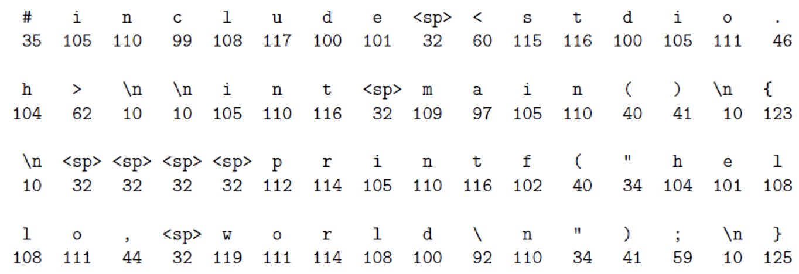
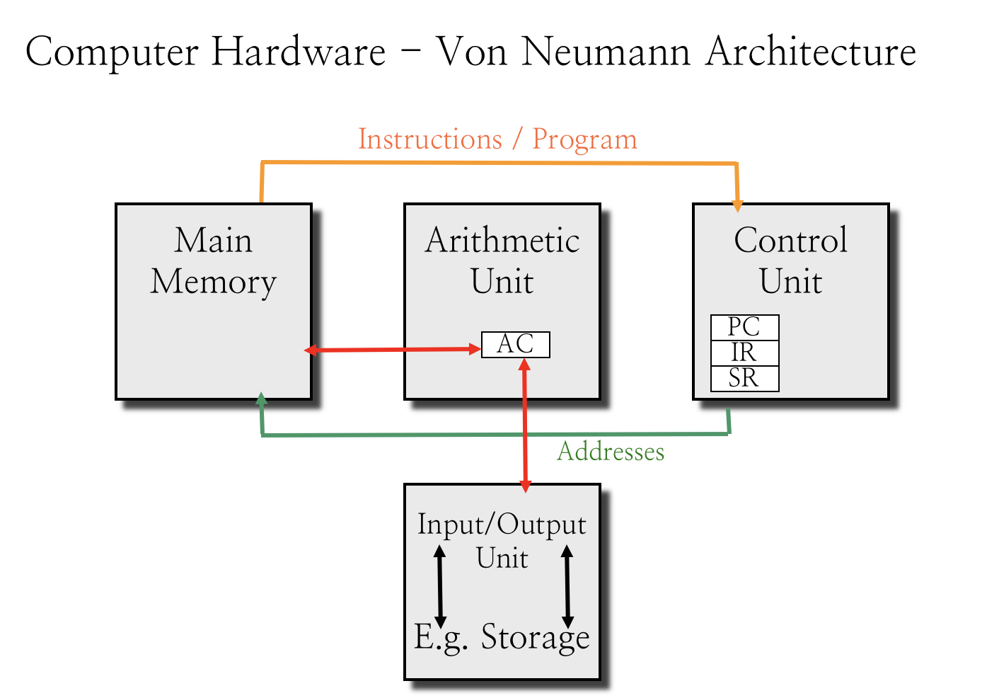
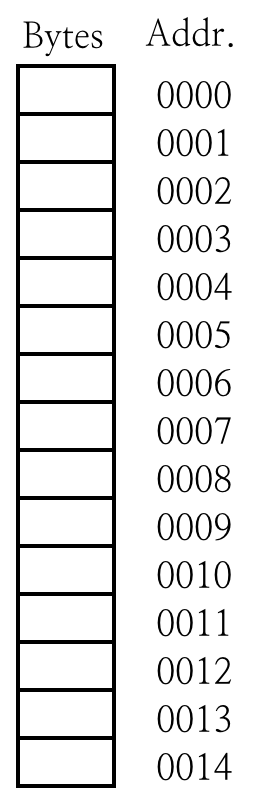

# 1.3 Binary Operations

## The GNU C Compiler Toolchain

在我们用 GCC 的时候，我们在用什么？

我们前面已经提到过了，在我们编译一个 `.c` 文件的时候，实际上经历了「预处理」、「编译」、「汇编」、「链接」等多个步骤。每个步骤都有独立的程序进行处理。

### Source Program

以 `.c`、`.h` 结尾的源代码文件和头文件（通常）以一般 ASCII 编码格式储存。因此，我们的 Hello World 程序看起来是这样：

```python
#include <stdio.h>

int main() {
    printf("hello, world\n");
}
```

实际上是这样的一串字节序列：



当然，无论在什么计算机平台上，这段代码都无法作为可执行文件执行的。

### Modified Source Program

我们将 Source Program（纯文本形式）送入预处理器（Preprocessor）之后，预处理器将会清除注释、展开 Macro（宏），并给出一个「修改过的源代码文件」。

> 可以通过调用程序 `cpp` 或者 `gcc -E` 来单独应用预处理器。

同时，Preprocessor 还会生成形如 `#[file id] [file name] [line id]` 的文件 + 行号注释，以确保可以重定位到未经预处理的源代码文件中。

生成文件的扩展名为 `.i`，他和 Source Program 的编码方式一致，同样也是合法的 C 代码。

### Assembly Code

将上面已经去除注释和宏的预处理过後的代码交给编译器（狭义），就可以得到机器相关的汇编代码，后缀名为 `.s`。

> 可以通过调用程序 `cc1` 或者 `gcc -S` 来单独应用编译器（狭义）。

注意这里的汇编代码仍然是以 ASCII 码助记法表示的指令序列，类似于：

```assembly
multstore:
	pushq %rbx
	movq  %rdx,%rbx
	call  mult2
	movq  %rax, (%rbx)
	popq  %rbx
	ret
```

只不过这已经很接近于机器可执行的指令了。

### Relocatable Object File

上面的 Assembly Code 已经非常接近于机器指令了，只需要按照对应表将其转化为二进制的表示形式（再处理一些 LABEL 事宜），就可以直接成为二进制文件了。

> 可以通过调用程序 `as` 或者 `gcc -c` 来单独应用汇编器。

这一步大概是最没技术含量的了。

### Executable Object Code

Relocatable Object File 和 Executable 到底还差哪一步呢？Well，假如一个程序里完全没有用到任何库函数，仅仅使用了 C 语言本身的保证、System Call 和自己的实现，那就不需要进行任何链接（Link），自己就可以执行。

然而大部分程序都不是这样的，他们都或多或少地、静态或动态地引用了外部的库函数。而这些函数的实现都没有在源文件中以任何形式表现出来。

由 C 实现的库函数同样需要经历上面的过程，变成一个 ROF；而它们并不可能直接被执行（首先他们就没有 作为入口点的 `main` 函数）。所以，需要一个程序把不同的 ROF 给结合在一起，并且处理好他们之间互相调用的关系，最後生成一个真真正正可执行的文件。没有确定的后缀名。

这一步，就叫做链接。具体的操作会在后面的章节里具体讲到。

> 可以通过调用程序 `ld` 或者 `gcc -o` 来单独应用链接器。

总的步骤大概是这样。


## Binary Operations

布尔代数的 And、Or、Not、Exclusive-Or 在上一节里都讲到了。我们这里主要讲一下怎么在 C Language 里应用。

### Bit-wise Operations

`&`、`|`、`~`、`^` 分别对应上面的 And、Or、Not、和 Exclusive-Or。注意它们可以被应用到任何整数类型的变量之中去，包括 `long`、`int`、`short`、`char`。对他们的每一位都进行对应的操作之後，得到结果。

这种「一位一位进行位操作」的方式被称为「Bit-wise」。

> 啥？你说 `bool`？C89 里并没有这个类型（逃

### Logical Operations

指的是 `&&`、`||`、`!` 三个操作符。他们也常常被称为 And、Or 和 Not，但是他们表达的意思、运算的方式都和按位操作符有着很大的区别。

首先要注意的是，他们的返回值都是 $0$ 或 $1$。把它们和 Bit-wise Operations 混合的时候，要尤其注意。

#### `&&`

二元操作符：操作符两边的值如果经过计算後均不为 $0$，则结果为 $1$；否则结果为 $0$。

#### `||`

二元操作符：操作符两边的值如果经过计算後均不为 $1$，则结果为 $0$；否则结果为 $1$。

#### `!`

一元操作符：操作符右边的值如果经过计算後不为 $0$，则结果为 $0$；否则结果为 $1$。

#### Short-cut

尤其要注意的是，`&&` 和 `||` 存在短路求值的情况。即，他们会从左到右地计算表达式；假如首个计算的表达式已经足以给出返回值，那么就不会去求右边的表达式。

用伪代码来表示是这样的：

```python
def logical_and(left: Exp, right: Exp) -> int:
    if left.eval() != 0:
        if right.eval() != 0:
            return 1
        else:
            return 0
    else:
		# right exp was short-cut
        # when left.eval == 0
        return 0
    
def logical_or(left: Exp, right: Exp) -> int:
    if left.eval() == 0:
        if right.eval() == 0:
            return 0
        else:
            return 1
	else:
		# right exp was short-cut
        # when left.eval != 0
        return 1
```

### Shift Operations

移位操作符。`<<` 和 `>>`。

#### Left Shift

二元操作符；左右两边都是一个可以求值为整数的表达式。

`x << a` 就会返回将 `x` 的每一位左移 `a` 位之后得到的结果。

超过最高位的位将被抛弃。

空出来的低位用 $0$ 补齐。

#### Right Shift

二元操作符；左右两边都是一个可以求值为整数的表达式。

`y >> b` 将会返回将 `y` 的所有位右移 `b` 位之后得到的结果。

超过最低位的位将被抛弃。

但是空出来的高位怎么处理，则取决于原变量的类型。

> 如果原变量的类型是 `unsigned`，即无符号的，那么总是采用 $0$ 来补位；
>
> 如果原变量的类型是 `signed`，即有符号的，那么采用原数字的最高位来补位（即，保留原有的符号位不变）。

## Information Storage

我们回忆一下冯·诺伊曼的计算机架构：



指令和数据混合放置，那么要想访问某个主存中的数据位置就必须通过内存地址去 Main Memory 做访存——也就是需要所谓的「指针」。

然而数据并不是只存在于主存储器中；包括硬盘、CD、DVD、网络、闪存盘等等都可能被作为存储介质使用。当然，他们都至少提供了（虚拟的）READ 和 WRITE 操作来让我们读写数据。

### Main Memory



主存储器的数据组织方式是最简单的——每个存储单元的大小都一致（通常以 $8$ 位即一个字节作为一个单元的大小），按照顺序给每个单元从 $0$ 开始编号。

这个编号 ID 就是所谓的「地址」了。

注意，这不是指针——指针是一种数据结构，里面存放的是指向对象的地址。

指针本身也是存放在存储单元里的一个结构。

### Word Size

上面提到了，每个存储单元都有其对应的 ID（也就是地址）。但是，编码这个 ID 的长度可不是无限的；实践中会采用一个定长的数据结构来储存。这也是为了简化指令的设计。

假设给出 $n$ 位用于编码内存地址，那么最多只能够区分 $2^n$ 个不同的存储单元；这也就是「$n$ 位计算机的寻址能力上限」。

## Data Size

### Vaguely Typed

C 对于内置类型的定义是非常模糊的——标准只规定了每种类型的**最小**长度。

因此不同的机器上完全可能有不同长度的类型；加上上面的移位操作是和长度有关的；这就会埋下隐患。

| C  Declaration |                   | Bytes   |         |
| -------------- | ----------------- | ------- | ------- |
| `signed`       | `unsigned`        | $32$ 位 | $64$ 位 |
| `char`         | `unsigned  char`  | 1       | 1       |
| `short`        | `unsigned  short` | 2       | 2       |
| `int`          | `unsigned`        | 4       | 4       |
| `long`         | `unsigned  long`  | 4       | 8       |
| `int32_t`      | `uint_32`         | 4       | 4       |
| `int64_t`      | `uint_64`         | 8       | 8       |
| `char *`       |                   | 4       | 8       |
| `float`        |                   | 4       | 4       |
| `double`       |                   | 8       | 8       |

### OS Dependent

| Data  model | short | int  | long | long  long | pointers | Sample  operating systems                               |
| ----------- | ----- | ---- | ---- | ---------- | -------- | ------------------------------------------------------- |
| LLP64       | 16    | 32   | 32   | 64         | 64       | Microsoft Windows 64-bit (X64/IA64)                     |
| LP64        | 16    | 32   | 64   | 64         | 64       | Most  Unix and Unix-like systems (Solaris, Linux, etc.) |
| ILP64       | 16    | 64   | 64   | 64         | 64       | HAL(Fujitsu  subsidiary)                                |
| SILP64      | 64    | 64   | 64   | 64         | 64       | ?                                                       |

### Definitely Typed

在 C99 里（终于）引入了确定长度的数字类型：在 `stdint.h` 中定义了 `int8_t`、`int16_t`、`int32_t`、`int64_t` 和 `uint8_t`、`uint16_t`、`uint32_t`、`uint64_t` 八种顾名思义的整数类型。

> 可算是清楚了…

这些类型的长度都是和机器、和实现无关的。

