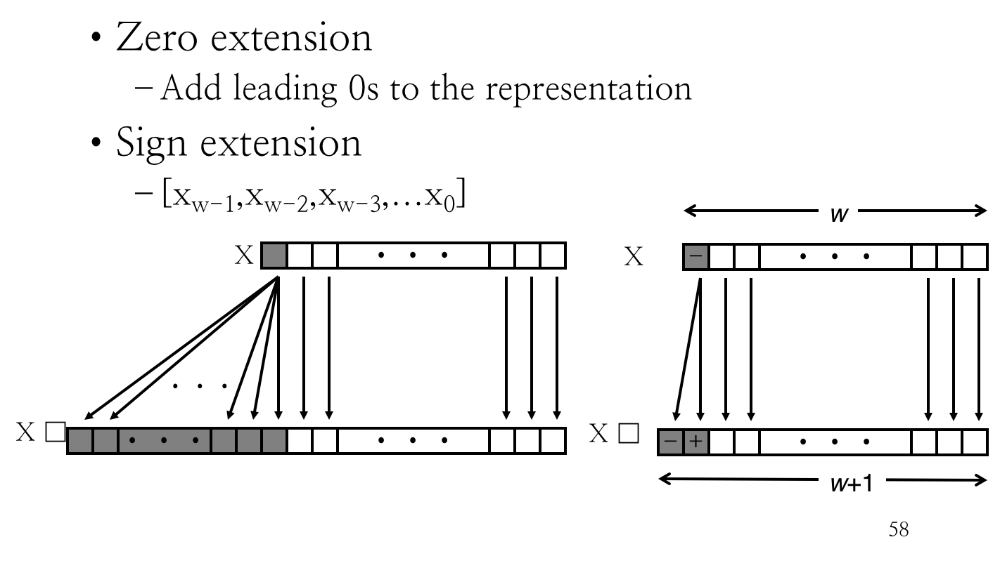

# 1.4 Encoding

## Outline

* Virtual Memory
* Byte Ordering
* Representing String, Code, and Numbers

## Virtual Memory

所谓「虚拟内存」。

### Abstraction

总是要记得，「虚拟内存」并不是实际存在的。

他让单个程序「以为」自己能够独享大量、连续（原文是 monolithic，磐石般的）的内存空间——然而这个空间本身就是虚幻的。

> 实际的计算机系统上不可能只有一个程序，物理内存一定不会是这么分布的。

### Implementation

VM 这层抽象的实现同时包括硬件和软件层面。

#### Software Layer

软件上，大家都默认采用虚拟内存空间进行寻址。在编码的指令中，所有地址都是 VMA。

因此，被送到 CPU 里面的指令同样也是 VMA 地址。

#### Hardware Layer

但是 CPU 最终是要跟 Physical Main Memory 打交道的；

因此在 CPU 和 Memory 之间需要一个翻译器将 VMA 翻译成 PMA，从而去 Memory 中寻址。

#### Other Units

为了实现 VM 的抽象，必须要有支持 VM 模型的软件程式码。因此，编译器和运行时系统也需要对此提供支持。

### Memory Space


对于每一个程序来说，虚拟内存空间都是这样的：从底向上，内存地址逐渐增长。而且都以为整个虚拟内存空间中只有自己和 Kernel 两部分。

> 实际上，每个进程都通过自己独立的 Page Table 映射到了不同的物理内存页中。

## Byte Ordering

上面讲到了…内存空间的事宜。那么，在内存中放什么东西、怎么放东西，又有什么讲究呢？

### Gulliver's Travels

黑童话《格列佛游记》里的故事…Little-Endian 国和 Big-Endian 国为了决定从哪头敲碎鸡蛋而世代交恶，爆发内战。

这两个词倒是传承下来了。

### Ordering Bytes

主要有三种主流的方式。

#### Little Endian

小端：把较低位的字节放在较低的地址位处。

> Intel 采用这种方法。

#### Big Endian

大端：把较低位的字节放在较高的地址位处。

> Sun 和 IBM 采用这种方法。

#### Bi-Endian

比较新潮的处理器可以被配置为使用小端法和大端法中的任意一种。

> 如，ARM 处理器就可以通过置 System Control Register 中的特定一 Bit 来决定是使用大端法还是小端法。

> 例如，「汉」字的 Unicode 编码是 `6C49`。称 `6C` 为高位字节，`49` 为低位字节。
>
> 那么，大端法就会将其编码为 `6C 49`，即高位 `6C` 放在低地址位处；`49` 则放在高地址位处。
>
> 小端法反过来，是 `49 6C`。

> 注意无论大端小端，一个字节内的比特位排列顺序是不会变的。总是符合我们直觉的「由高位到低位依次书写」。

> 注意无论大端小端，字符串（也就是 Byte Span）的排列顺序也是固定的。地址位符合直觉地从索引 0 处向后递增。

## Representing an Object

### Transportability

上面提到的「虚拟内存」也好，「字节序列」也好，在我们写代码的时候几乎都不需要关心。

因为实际上标准库和编译器会为我们处理不同机器的字节序事宜，而操作系统则会为我们解决虚拟内存的映射问题。

我们不能也不应该去插手这些机器相关的事情。这会损害可移植性。

### Pointer

在 C/C++ 里，要访问一块内存空间里的内容，需要用到一个名为「指针」的对象。

#### What's a pointer?

也就是一个特殊的对象而已。这里面包含两件信息：一是他指向对象的内存地址；二是他指向对象的类型。

声明为 `int *` 的指针类型意思是它指向的是 `int` 类型。或者可以用 Swift 的风格，写成 `Pointer<int>`。

#### Pointer to Pointer

另外，别忘了指针本身也就是个对象。因此，指针也可以指向指针——`int **` 也就是 `Pointer<Pointer<int>>`。

> 如果按照 C++11 之前的标准，或许还得写成 `Pointer<Pointer<int> >`。

考虑到类型系统在被编译之後会完全丢失，所以实际上在汇编代码里，指针就仅仅表现为一个内存地址而已。

#### `show_bytes` Function

上面提到过，字节序对于程序来说是不透明的。但是标准又有一样保证：字符串（对 C 来说，`char[]`）的字节序始终和字符位置保持一致。

因此，我们只要把任意类型的指针转化成 `char *`，并把它作为 `char[]` 进行读取，就能得到其真正的内存布局了。

```c
#include "show_bytes.h"
#include <stdio.h>

void show_bytes( byte_pointer start, size_t len ) {
    size_t i;
    for ( i = 0; i < len; i++ )
        printf( "0x%p\t0x%.2x\n", start + i, start[ i ] );
    printf( "\n" );
}
```

用这个实用程序，可以看到不同机器下的实际内存布局。


## Representing Codes

### `sum.c`

给出一个简单的程序 `sum.c`。里面只包括一个毫无用处的函数。

```c
int sum( int x, int y ) {
    return x + y;
}
```

在不同平台下将其编译後可以得到如下二进制文件：

```
Linux 32: 	55 89 e5 8b 45 0c 03 45 08 c9 c3
Windows: 	55 89 e5 8b 45 0c 03 45 08 5d c3
Sun: 		81 c3 e0 08 90 02 00 09
Linux 64: 	55 48 89 e5 89 7d fc 89 75 f8 03 45 fc c9 c3
Darwin:		55 48 89 e5 89 7d fc 89 75 f8 03 75 f8 89 f0 5d c3
```

看起来都不一样呢。

### Disassembly

以 Darwin 平台为例，对上面的代码进行反汇编，可以得到下面的汇编代码：

```assembly
_sum:
    pushq	%rbp
    movq	%rsp, %rbp
    movl	%edi, -4(%rbp)
    movl	%esi, -8(%rbp)
    movl	-4(%rbp), %esi
    addl	-8(%rbp), %esi
    movl	%esi, %eax
    popq	%rbp
    retq
```

> 写完编译器 Lab 之后，对这种简单代码倍感亲切（×

总归，就是，每一段指令都可以被编码成二进制数字，并储存在文件系统中等待被载入内存并执行。

## Represeting Numbers

请回头看 `1-2-bits.md` 里关于无符号整数、有符号整数和浮点数的表示方式。


事实是，存在三类编码方式不完全一致的数字。

然而在实际的编码工作之中，我们又有必要对其进行转换。

### Integral Data Types in C

* Signed Type
  * `char`
  * `short` (`int`)
  * (`int`)
  * `long` (`int`)
* Unsigned Type
  * `unsigned char`
  * `ungisned short` (`int`)
  * `unsigned` (`int`)
  * `unsigned long` (`int`)

括号内的内容代表可以省略。

> 对，假如省略一切类型，会被 fallback 到 `int` 上头。

> 其他很多语言，例如 Java，没有「无符号」这一类型。

### Typical Ranges

#### 32-bit

在一部典型的 32 位操作系统上，C 标准的类型所能表达的数字范围如下：

* `char`：$[-128, 127]$
* `unsigned char`：$[0, 255]$
* `short` (`int`)：$[-32768, 32767]$
* `unsigned short` (`int`)：$[0, 65535]$
* (`int`)：$[-2147483648, 2147483647]$
* `unsigned` (`int`)：$[0, 4294967295]$
* `long` (`int`)：$[-2147483648, 2147483647]$
* `unsigned long` (`int`)：$[0, 4294967295]$
* `int32_t`：$[-2147483648, 2147483647]$
* `uint32_t`：$[0, 4294967295]$
* `int64_t`：$[-9223372036854775800, 9223372036854775800]$
* `uint64_t`：$[0, 18446744073709551615]$

#### 64-bit

64 位则如下：

* `char`：$[-128, 127]$
* `unsigned char`：$[0, 255]$
* `short` (`int`)：$[-32768, 32767]$
* `unsigned short` (`int`)：$[0, 65535]$
* (`int`)：$[-2147483648, 2147483647]$
* `unsigned` (`int`)：$[0, 4294967295]$
* `long` (`int`)：$[-9223372036854775800, 9223372036854775800]$
* `unsigned long` (`int`)：$[0, 18446744073709551615]$
* `int32_t`：$[-2147483648, 2147483647]$
* `uint32_t`：$[0, 4294967295]$
* `int64_t`：$[-9223372036854775800, 9223372036854775800]$
* `uint64_t`：$[0, 18446744073709551615]$

#### Standard

C 标准规定的**最小**范围是：

* `char`：$[-127, 127]$
* `unsigned char`：$[0, 255]$
* `short` (`int`)：$[-32767, 32767]$
* `unsigned short` (`int`)：$[0, 65535]$
* (`int`)：$[-32767, 32767]$
* `unsigned` (`int`)：$[0, 65535]$
* `long` (`int`)：$[-2147483648, 2147483647]$
* `unsigned long` (`int`)：$[0, 4294967295]$
* `int32_t`：$[-2147483648, 2147483647]$
* `uint32_t`：$[0, 4294967295]$
* `int64_t`：$[-9223372036854775800, 9223372036854775800]$
* `uint64_t`：$[0, 18446744073709551615]$

## Converting and Casting

何谓 Convert，何谓 Cast？

* 隐式进行的类型转换称为 Conversion。
* 显式进行的类型转换称为 Casting。

### Signed vs. Unsigned

例如，有符号类型和无符号类型要想互相做 Casting，需要用这样的语法：

```c
int tx, ty;
unsigned /* int */ ux, uy;
tx = (int) ux;
uy = (unsigned /* int */) ty;
```

而隐式的 Conversion 就可以这么写：

```c
int tx, ty;
unsigned /* int */ ux, uy;
tx = ux;
uy = ty;
```

### Unsigned Constants

注意，在 C 里面写出一个数字字面量（如 `-5`，`42`）这样的，默认会把它作为有符号量进行处理。

要想得到一个真正无符号的字面量，则需要在数字後面附加一个 `U`。

例如，`4294967259U` 的类型就是 `unsigned`。

### Casting Convention

在你不知道的时候，可能就进行了 Convention…比如，在进行 `<`、`>`、`==`、`<=`、`>=` 比较的时候。

假如对一个有符号整数和一个无符号整数施加上面的比较，那么有符号数字会被隐含地 Cast 成无符号的数字，再进行比较。

但假如两个都是有符号的整数或是无符号的整数，那么就不需要进行 Casting，直接按照其规则进行比较。


### Expanding and Truncating

现在我们来假想把一个整数类型转换为另一个不同长度的整数类型。

结果要么是变长了要么是变短了。变长了就叫做 Expanding，变短了就叫做 Truncating。

#### Truncating

截短没什么说的，直接把高位切了就行。


#### Expanding

延长呢？假如原始值是个无符号的类型，那么永远在高位填补 $0$（Zero Extension）；

假如原始值是有符号的，那么就需要在高位填补符号位（Sign Extension），以免改变符号。



## Advice

### Avoid Casting

```c
float sum_elements( float a[], unsigned length ) {
    int /* !!! */ i;
    for ( i = 0; i <= length – 1; i++ )
        result += a[ i ];
}
```

在这里，应该将 `i` 直接定义为无符号的类型。

### Careful Manip with Unsigned

```c
/* Prototype for library function strlen */
size_t strlen( const char* s ); /* size_t is usigned */

/* Determine whether string s is longer than string t */
/* WARNING: This function is buggy */
int strlonger( char* s, char* t ) {
    return strlen( s ) - strlen( t ) > 0;
}
```

在对两个 `unsigned` 数字进行加减的时候，一定要非常小心。因为得到的结果也必定是 `unsigned`，要当心负溢出。

### Buggy `getpeername()`

> See `./1-4-encoding.assets/getpeername_illust.c`.

## Summary

* Collections of bits
  * Bit vectors
  * Masks
* Addresses
* Multiprecision Arithmetic

> Numbers are represented by arrays of words

