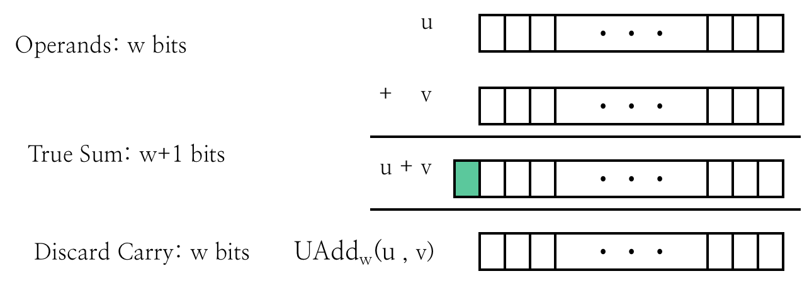
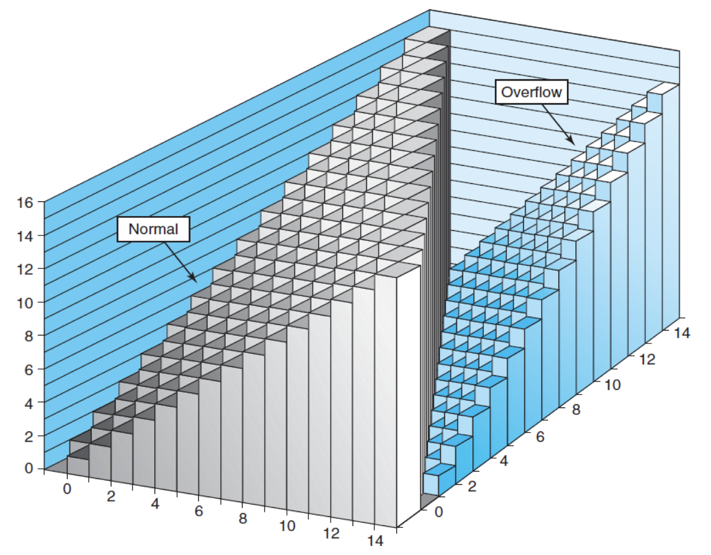
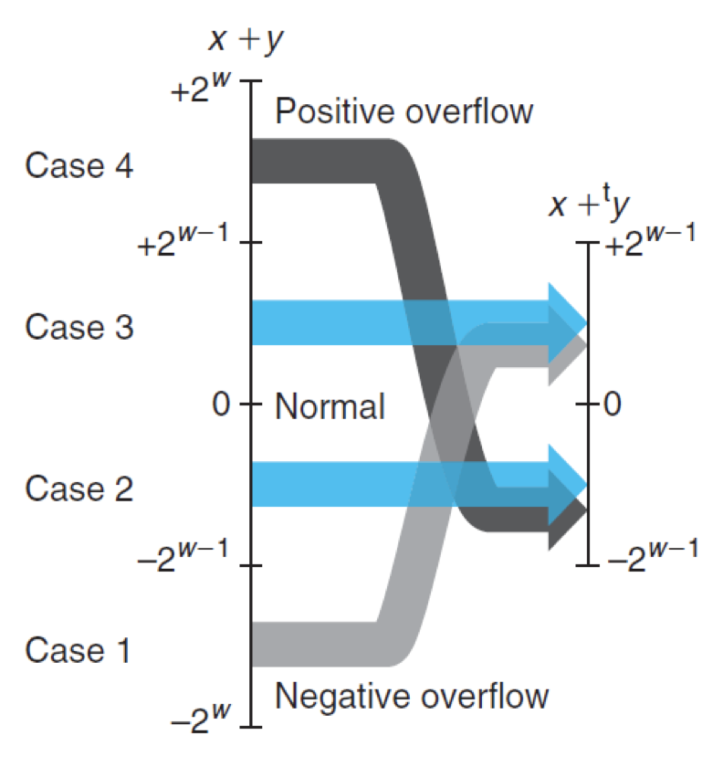
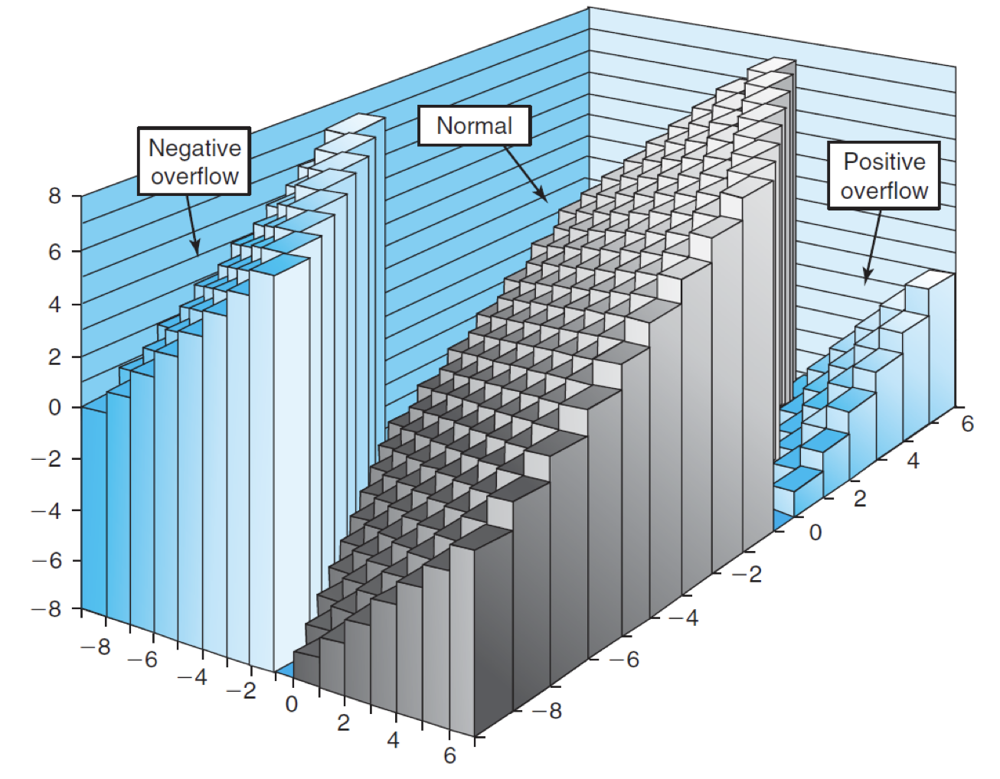
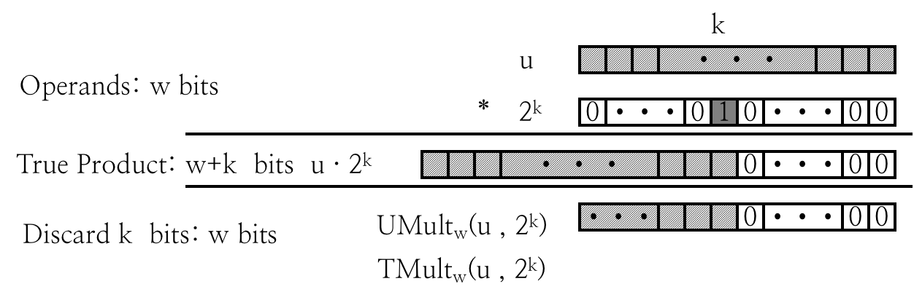

# 1.5 Arithmetic Operations

## Textbook

* 2.3

## Outline

* Arithmetic Operations
  * Unsigned addition, multiplication
  * Signed addition, negation, multiplication
  * Using Shift to perform power-of-2 multiply

> 翻译一下：

* 算数运算
  * 无符号整数的「加」、「乘」
  * 有符号整数的「加」、「反」、「乘」
  * 用位移快速计算 $2$ 的整数次幂

> 敬请开始吧！

## Unsigned Int

### Representation

先回忆一下，无符号整数是怎么被计算机存储的。

无符号数的存储最为简单：直接按照数字的二进制表示，按照字节内「先高位再低位」的顺序，打包放入内存即可。

> 字节之间的顺序，则有大端小端之分。

$n$ Bits 可以表示 $0$ 到 $2^n - 1$ 之间的无符号整数。 

### Unsigned Addition

#### Algorithm

两个无符号数的加法，是最为简单的：从低位到高位依次做加法，同时将 Carry（进）位传递给下一高位一起运算。

最高位的进位（如果有）会被丢弃。



因此，用数学的表示来看，两个 $n$ 位无符号数的「加和」运算可以表示为：
$$
UAdd_w(u, v) = \left\{
\begin{aligned}
u + v &      & ( u + v \lt 2 ^ w ) \\
u + v - 2^w &      & ( u + v \ge 2 ^ w )
\end{aligned}
\right.
$$
也就是 $UAdd_w(u, v) = (u + v) \mod 2^w$。

#### Overflow Check

那么，这里就有了一个很实际的问题：怎么判断两个 `unsigned` 相加有没有产生溢出？

为了解决这个问题，我们对两个数进行分类讨论。

分类讨论的种类越少越好；因为 Overflow 和最高位有关，因此我们对 $u$、$v$ 的最高位（记作 $u_i$、$v_i$）作如下讨论：

* 如果 $u_i$、$v_i$ 均为 $0$
  * 那么即使次高位进位，也不会使得最高位发生进位
  * 直接认定不会发生溢出
* 如果 $u_i$、$v_i$ 均为 $1$
  * 那么无论次高位发不发生进位，最高位都铁定会进位
  * 直接认定会发生溢出
* 如果 $u_i$、$v_i$ 一个是 $0$、一个是 $1$
  * 那么是否溢出就完全取决于次高位是否发生进位。
  * 我们可以就这样逐渐往低位追踪，直到得到结果。但这样还是太慢了。
  * 我们可以这样分析：
    * 如果没有发生溢出，即次高位没有发生进位
    * 那么简单加和得到的结果，最高位就是 $1$
    * 如果发生了溢出，即次高位发生了进位
    * 那么简单加和得到的结果，最高位就是 $0$
  * 这样，就可以将加和後的最高位作为是否溢出的依据

### Mathematics

#### Graph



看起来就是，超过一定高度的值全部被「腰斩」。

#### Abelian Group

无符号整数的加法是一个阿贝尔群。

满足下面三个条件的就可以被称为阿贝尔群：

##### 有限

显然，$n$ 位无符号整数做加法，结果还是一个 $n$ 位无符号整数。

##### 有结合律

$$
UAdd_w(t, UAdd_w(u, v)) = UAdd_w(UAdd_w(t, u), v)
$$

##### 有交换律

$$
UAdd_w(u, v) = UAdd_w(v, u)
$$

##### 有不变元

$$
UAdd_w(t, 0) = t
$$

##### 有逆元

$$
UAdd_w(u, 2^w - u) = 0
$$

## Signed Int

### Representation

这里，我们默认大家都用最为通行的「2 的补码」式有符号数表示方法。

忘记了，回去看 1-2。

### Mathematics

#### Algorithms

$$
TAdd_w(u, v) = \left\{
\begin{aligned}
u + v - 2^w &      & ( Tmax_w \lt u + v ) \\
u + v &      & ( Tmin_w \le u + v \le Tmax_w ) \\
u + v + 2^w &      & (u + v \lt Tmin_w)
\end{aligned}
\right.
$$

可以注意到，两个有符号数加和，可能产生两个方向的溢出：或许是两个负数相加，结果小于 $w$ 位所能表示的最小整数；又或许是两个正数相加，结果大于 $w$ 位所能表示的最大整数。

一个正数和一个负数相加是不会产生溢出的；因为结果一定小于那个正数，且大于那个负数。

可以用一张状态图简单表示：



#### Graph




#### Overflow Check

有符号数的溢出检查稍微麻烦了一点。也是分情况讨论：

* $u$、$v$ 一正一负
  * 根据上面的讨论，这种情况下一定不会溢出
* $u$、$v$ 均为正数
  * 只可能发生正溢出。
  * 假如发生了溢出，那么结果一定是负数。
  * 假如没有发生溢出，那么结果一定是正数。
* $u$、$v$ 均为负数
  * 只可能发生负溢出。
  * 假如发生了溢出，那么结果一定是正数。
  * 假如没有发生溢出，那么结果一定是负数。

1-Liner 可以这么写：

```c++
(u < 0 == v < 0) && (u < 0 != (u + v) < 0)
```

#### Abelian Group

鉴于 $k$ 位有符号数和无符号数可以一一对应，且具有相同的运算规则…

$k$ 位有符号数也是阿贝尔群。

### Subtraction

上面，关于有符号数的加法已经很明白了；那么…有符号数的减法呢？

你可能会说，那还不简单？

```c++
int tsub_ok_buggy(int x, int y)
{
    return tadd_ok(x, -y);
}
```

这是错的。对于 $T_{min}$ 来说，$T_{min} = -T_{min}$。对这个 Case 来说，不行。

## High-level Operations

### Negating

求相反数的方法是固定的：对于「2 的补码」表示法来说，直接采用 `~x + 1` 就可以算出 `-x`。

同时，`~(-x) + 1` = `~(~x + 1) + 1​`，也就是 `x - 1 + 1 = x`。是可以自洽的。

### Multiplication

乘法就比较难办了。

要计算两个 $w$ 位整数 $x$、$y$ 的乘积（Product），该怎么办？

> 有符号和无符号的计算其实没有多大区别。

#### Ranges

* 对于无符号整数来说，$x \times y$ 的结果最小为 $0$（废话），最大为 $(2^w - 1)^2$。

> 最多消耗 $2w$ 位来存储。

*  对于有符号整数来说，$x \times y$ 的结果最小为 $-2^{w - 1} \times (2^{w - 1} - 1)$；最大为 $(-2^{w - 1})^2$。

> 最多消耗 $2w$ 位来存储。

总结：乘法结果最多只需要两倍的位进行存储。

所以，基本上所有的 ISA 都选择用两个寄存器来保存乘法的结果。主要是这么个道理。

#### Power-of-2 Multiply with Shift



非常有趣：因为我们采用二进制的特殊性，只要将数字按位左移 $k$ 位，就相当于将原整数乘上了 $2^k$。

当然，溢出的结果需要概括承受。

## Vulnerability

> 又到了我最喜欢的 Bug 时间

XDR 库的实现里，出现了这样的 Bug：

```c
/*
 * Illustration of code vulnerability similar to that found in
 * Sun’s XDR library.
 */

void* copy_elements( void* ele_src[], int ele_cnt, size_t ele_size ) {
    /*
     * Allocate buffer for ele_cnt objects, each of ele_size bytes
     * and copy from locations designated by ele_src
     */
    void* result = malloc( ele_cnt * ele_size );
    if ( result == NULL )
        /* malloc failed */
        return NULL;
    void* next = result;
    int   i;
    for ( i = 0; i < ele_cnt; i++ ) {
        /* Copy object i to destination */
        memcpy( next, ele_src[ i ], ele_size );

        /* Move pointer to next memory region */
        next += ele_size;
    }
    return result;
}
```

考虑一下 `ele_cnt` 是 $2^{20} + 1$、同时 `ele_size` 是 $2^{12}$ 的情况。

原本，`ele_cnt * ele_size` 应该得到 $4294971392$。用二进制表示就是：

```
1 0000 0000 0000 0000 0001 0000 0000 0000
```

被 32 位整数截断之後的结果就是 `0000 0000 0000 0000 0001 0000 0000 0000`，也就是 $4096$。对于 `malloc` 来说是一个很合理的值。

但是後面的 `for` 遍历是按照原来爆炸大的参数遍历的；`memcpy` 也会踏入不该访问的内存。

这就是 Arithmetic Operations 可能带来的漏洞。