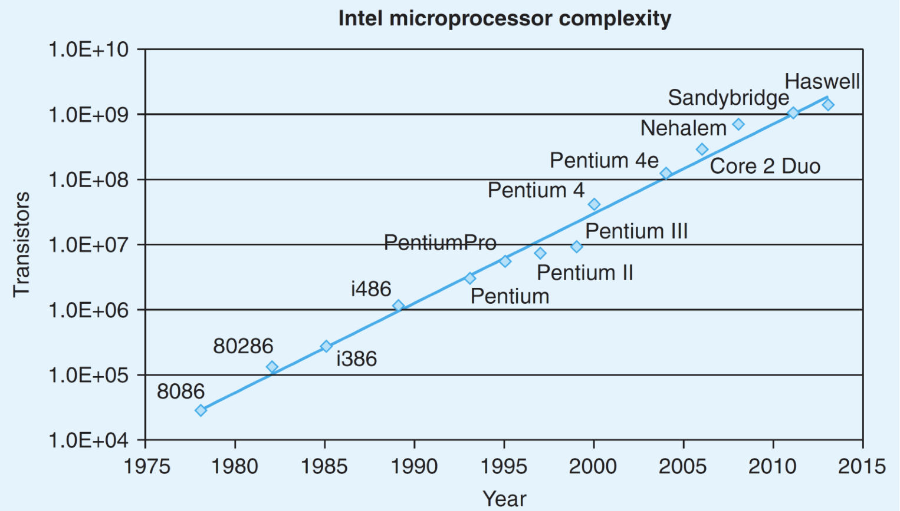
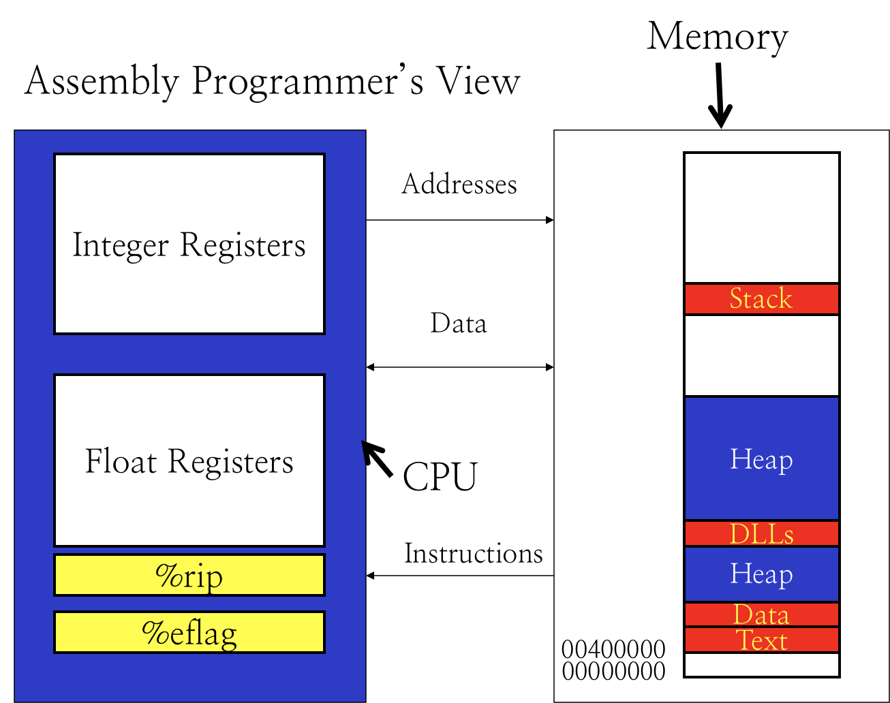
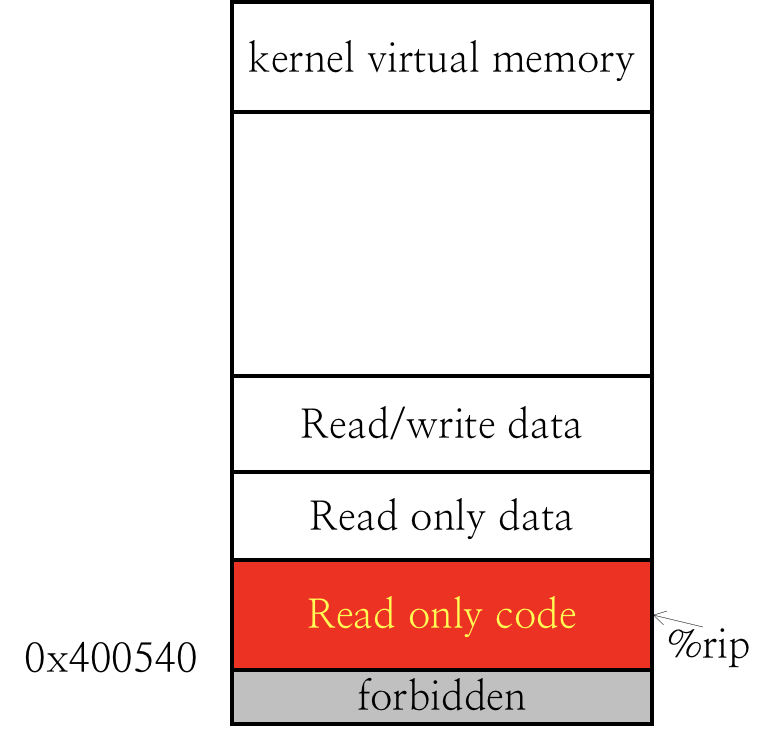
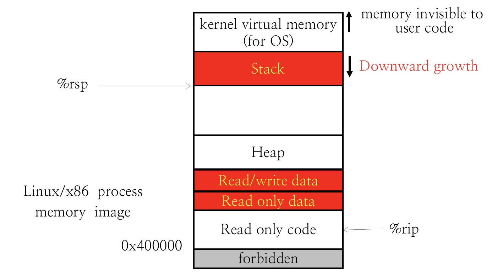

# 1.6 x86 Historical Perspective

## Textbook

* 3.1

## Outline

* Historical Perspective

> 简单说，回顾一下传统的 x86 历史
>
> 啊，懂了，历史课

## History

### Intel's CPU

* 8086
* 80286
* i386
* i486
* Pentium
* Pentium Pro
* Pentium II
* Pentium III
* Pentium 4
* Pentium 4E
* Core 2
* ...
* Core i7
* Xeon Platium 8170
  * 课件释出时最新的 CPU

> 因为前四作 CPU 的名字都以 86 结尾，因此这一套指令集得名 x86。

### AMD's

x86 家族里的 CPU，不光是 Intel 的，还有 AMD（Advanced Micro Devices）插一脚。

在 1999 年率先推出了超过 1GHz 的 CPU；在 2002 年推出了 x86-64，占据了 64 位指令集的主导权。

## Compatibilities

上面提到了，所谓的 x86 实际上分为两个阶段：32 位时代，由 Intel 一手操办的称之为 `IA32`；而 2002 年咸鱼翻身的 AMD 提出的称之为 `AMD64`，或者 `x86-64`（这也是目前的标准了）。

目前 `gcc` 同时支持这两种指令集，也可以明确指明自己需要的编译目标指令集：

```shell
$ gcc -m32 hello.c
```

这是把 `hello.c` 编译到传统的 `IA32`；

```shell
$ gcc hello.c
$ gcc -m64 hello.c
```

这是把 `hello.c` 编译到标准的 `AMD64`，这也是默认选项。

## Moore's Law



> 当价格不变时，集成电路上可容纳的元器件的数目，约每隔 18 到 24 个月便会增加一倍，性能也将提升一倍。换言之，每一美元所能买到的电脑性能，将每隔 18 到 24 个月翻一倍。

事实证明，至少在 2015 年之前，CPU 的发展的确服从了这一规律。

## Assembly Language

所谓的「汇编语言」。

### Comparison

* 高阶语言（High Level Language）
  * 高度抽象
  * 开发高效
  * （大部分）类型安全
  * 可以被解释执行，或者编译到机器码并运行
* 汇编语言（Assembly Language）
  * 只有低阶指令可用
  * 开发低效
  * 容易出错
  * 依赖于特定机器

### Learning

这么一比，好像汇编语言百无一用。那我们为什么还要学呢？

* 进行某些优化需要我们理解汇编
  * 例如，循环展开、Cache 优化
* 分析出代码中的潜在效能瓶颈
  * 这要求我们要会读汇编
* 分析编译类语言的运行时行为，需要理解汇编
  * 因为这时高阶语言抽象已经被编译成汇编了
  * 例如，要分析「栈溢出错误」，就必须了解汇编才可以

最好的学习汇编的方式，就是实际去写一些代码。

### Operand Specifiers

我们就以相对很低级的高阶语言，C 来对比学习 x86 汇编好了。

C 中的一些基础概念包括：

* 变量
  * 可以声明不同种类的数据类型
    * 例如，`int a;`
  * （C 的类型安全仅仅保护了长度…）
* 操作
  * 赋值（Assignment）
    * 例如 `c = 2`
  * 算数运算
    * 例如 `1 + 2`
  * 表达式运算
    * 例如 `foo() + bar()`
* 控制流
  * 循环
    * 例如 `while() {}`、`for(;;) {}`
  * 调用函数、返回
    * 例如 `int foo_ret = foo();`

那么我们来看看，假如要在汇编中实现相同的效果，该怎么办呢？

### Example

先来看一个 C 的例子：

```c
// C code
long mult2(long, long);
void multstore(long x, long y, long *dest)
{
	long t = mult2(x, y);
	*dest = t;
}
```

用 `gcc -S` 把它编译成汇编，可以得到汇编 `mstore.s`。

 `multstore` 函数的关键汇编包括：

```assembly
multstore:
	pushq %rbx
	movq  %rdx,%rbx
	call  mult2
	movq  %rax, (%rbx)
	popq  %rbx
	ret
```

### Instructions

我们先从最简单的部分开始。

#### Assigning

在 C 里，给一个内存地址赋值可以简单地写成 `*dest = val`，这将会把 `dest` 对应的内存地址写入 `val` 值。

而在汇编代码中，给一个内存地址赋值写作 `movq %rax, (%rbx)`，这将会把寄存器 `%rax` 中的值赋给内存位置 `%rbx` 处。

> 寄存器，可以理解成 CPU 内的一些草稿纸；可以在其中随意放置值，也可以读取其中最後保留的值。

#### Function Call

在汇编里面，直接用 `call mult2` 就能把控制权交给 `mult2` 所对应的函数并执行。

`call` 不会帮你处理参数，不会帮你处理栈，也不会帮你写入返回值。上面这些事都是约定俗成做到的。

在调用 `call` 之前，先保存「归调用者保存的寄存器」的值，把被调用函数的参数放在合适的位置（寄存器、栈帧中）；返回之後从 `%rax` 寄存器中读取返回值。

#### Loop

在汇编语言中，也有控制程序流的方式：用 `jmpq LABEL` 就可以强制跳转到某一 `LABEL` 的位置；并不要求 `LABEL` 是一个函数。

用 `cjmpq` 可以条件地进行跳转；C 里的循环多半是被翻译成这个样子：

```assembly
loop_head:
	...
	cjmpq loop_head
over:
	...
```

看一下应该就能明白吧。

## Machine Execution

### CPU & Main Memory



左边这块蓝底色的框框代表 CPU；右边那块透明底色的框框代表主存。

> 这是非常简化的一个模型；例如，这里没有考虑虚拟内存翻译的问题。

CPU 中所有的「内存地址」都对应到 Main Memory 中的一个位置；数据在 CPU 和 Main Memory 之间交换；而 CPU 中所有的 Instruction 都存储在 Main Memory 中。

而 CPU 中真正能储存状态的东西，只不过是那几十个寄存器而已。

### Registers

寄存器，也就是 CPU 中的一些草稿纸。

其中汇编开发者用得到的一些寄存器有：

#### `%rip`

也就是 Program Counter。

不论何时访问这个寄存器的值，这里面存放着的总是「下一条指令」的内存地址。

注意，这里的「下一条指令」就是字面意义上的「下一条」，不是「接下来执行的那一条」。而是在内存中，紧邻着当前这条指令的後面那一条。

> 保存这一信息的原因是，`x86-64` 汇编的指令长度是参差不齐的。

#### `%eflags`

也就是 Conditional Code Register。

在我们进行了一些算术运算之後，CPU 会自动根据运算的结果更新这个 Conditional Code Register。

另外，在执行条件指令时（如 `cmov` 条件移动指令、`cjmp` 条件跳转指令），会读取 `%eflags` 里的内容来决定是否执行操作。

#### General Purpose Registers

其他那些  `%r..`  寄存器都是通用的，可以直接作为操作的运算符。

只不过，我们给其中某些寄存器赋予了一些特定的职能，例如：

* `%rsp`、`%rbp` 用来维护栈
* `%rax` 用来保存函数的返回值
* `%rdi`、`%rsi`…用于保存函数调用的实参

……

总归，小心使用带有特殊语义的寄存器。

### Main Memory Allocation

在我们执行一个程序时，他的内存空间是如何排布的？

#### Figure



> Linux/x86 process memory image

注意这个图的内存地址是「从低到高」；即，在图片中越靠下的元素，其内存地址越低。

从低地址到高地址，依次排布着这些东西：

* 禁止访问的内存地址
  * 从 `0x0` 到 `0x400540`
* 程序代码部分（只读的）
  * 从 `0x400540` 开始
  * `%rip` 应该始终保存着这一区域内某处的内存地址
* 程序数据（只读的）
  * 例如 C 程序中的一些 `const char[]` 都会被保存在这里
* 程序数据（可读可写）
* 大段的空洞
  * 直到 `0xffffff..........`
* 内核映射的虚拟内存地址
  * 始于 `0xffffff`
  * 一看就不是普罗进程应该访问的位置



然而在这其中，程序可访问的内存又分为两部分。

堆（Heap）和栈（Stack）。

Stack 的底部位于程序可访问虚拟内存空间顶端；随着栈上数据的增多，`%rsp`（栈顶指针）逐渐下移。

> 因此，一般申请栈空间的方式就是 `subq $<size>, %rsp`；然后在过程退出时用 `addq $<size>, %rsp` 归还栈空间。

> 在调用一个函数（过程）前後，保证栈指针的位置不变的问题称为「栈平衡」问题。
>
> 任何一个 `function` 都有责任保证自己的生命周期的始终位置 `%rsp` 和 `%rbp` 的正确性。

> 一般来说，在创建进程时就会自动映射好栈所占的内存空间，因此就算不 `subq`、`addq` 也不会出什么大错。

而 Heap 则是通过 `malloc` 系列函数申请的空间，接近 Data 区段。用 `free` 函数来归还所占的空间。

> 不同于栈，这部分内存完全是动态映射的。因此不 `malloc` 直接读写这部分内存，几乎一定会爆 Page Fault。

