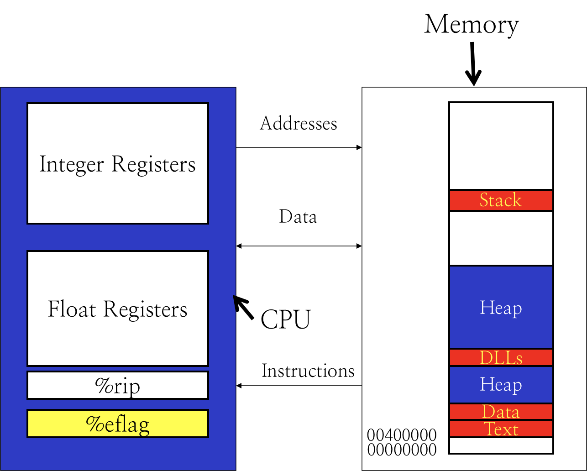

# 1.8 Conditional Codes

## Textbook

* 3.1

上节课提到过，x86-64 的条件跳转是通过设置 `%eflags` 寄存器实现的。`%eflags` 里保存着的，就是被称为 Conditional Codes 的「状态码」。

## CC Setting Operations

大多数算数和逻辑指令都会自动设置状态位。

### Arithmetic & Logical Operations

下面的指令都会更新 `%eflags`：

#### `leaq`

* `leaq <src>, <dest>`
  * 此指令会将 &Source => Destination
  * `src` 必须是 Memory 格式
  * `leaq` 会把 Memory 地址给放到 `dest` 中

一般来说，是在 Memory 包含 `offset`、`stride` 时，方便计算才这么做的，避免自己进行算术运算。

例如下面这个例子：

```c
long *test_leaq(long *src)
{
    return src + 42;
}
```

编译成汇编之後的结果就是：

```assembly
	## ...
	leaq	336(%rdi), %rax
	## ...
```

如果不使用 `leaq` 指令，那么就得写成这样：

```assembly
	## ...
	movq	%rdi, %rax
	addq	$336, %rax
	## ...
```

也算是一种简化吧。

#### `inc` & `dec`

使用方法就是 `inc <dest>` 或者 `dec <dest>`。

把 `dest` 里的值增/减 1。

#### `neg` & `not`

使用方法就是 `neg <dest>` 或者 `not <dest>`。

`neg <dest>` 会将 `<dest>` 的值设为 `- <dest>`。

`not <dest>`  会将 `<dest>` 的值设为 `~ <dest>`（按位取反）。

#### `add` & `sub` & `imul` & `xor` & `or` & `and` & `sal` & `shl` & `sar` & `shr`

这个之前用过了的。

用法是 `<op> <src>, <dest>`。

首先获取 `<src>` 的值，然后将 `<dest>` 和这个值进行操作，并放置到 `<dest>` 中。

比较难懂的几个指令：

* `sal`
  * Shift, Arithmetic, Left
* `shl`
  * Shift, Logical, Left

> 众所周知，左移位没有算数和逻辑之分的；总是在低位补 0。
>
> 所以 `sal` 和 `shl` 其实没分别。

* `sar`
  * Shift, Arithmetic, Right
* `shr`
  * Shift, Logical, Right

注意算数右移位（补最高位）和逻辑右移位（总是补 0）的区别。

#### Summary

整理成一张表：


可以看到，所有的指令都是将「D」（Destination）设定为某个值。

因此，他们更新 Conditional Codes 的策略也类似。

### Special Arithmetic Operations

还有一些特别的算术指令，主要是跟乘法除法相关的。

> 众所周知，两个 64 位的数字做乘法，结果最长可以达到 128 位，所以 Full Multiply 就需要特殊处理。

#### `imulq`

有符号的乘法。

`imulq <src>`，只输入一个 `src`。

`imulq` 会把 `<src>` 的值（64 位）和 `%rax` 寄存器中的值相乘，结果存储在 `R[%rdx]:R[%rax]`（高 64 位 `%rdx`，低 64 位 `%rax`）中。

简单写成 `R[%rdx]:R[%rax] <- S * R[%rax]`。

#### `mulq`

无符号的乘法。

用法和 `imulq` 一致，只不过运算时会把被乘数当作无符号数字处理。

#### `idivq`

`idivq <src>`。

注意，输入的 `src` 会被作为除数使用；而被除数默认你已经放在 `[%rdx]:[%rax]` 这个胶水 128 位寄存器中了。

 计算得到的结果，商放在 `%rax` 里；余数放在 `%rdx` 里。

简单写成：

```
R[%rdx] <- R[%rdx]:R[%rax] % S
R[%rax] <- R[%rdx]:R[%rax] / S
```

#### `divq`

和 `idivq` 用法一样；不过默认数字都是无符号的。

#### `cqto`

不接受任何参数；把 `%rax` 中的值算数扩展到 `R[%rdx]:R[%rax]` 里头去。

> 我猜这个指令的唯一作用就是在调用 `idivq` 之前，构造那个 128 位有符号被除数吧…

#### Summary


### Explicitly Setting Operations

#### `cmp`

`cmp` 指令会强制性地设定 CC，但不会影响除了 `%eflags` 外任何寄存器的值。

调用 `cmp b, a`，相当于运算了一次 `subq b, a`，但实际并没有更新 `a` 的值。

#### `test`

调用 `test b, a`，相当于运算了一次 `andq b, a`，但实际没有更新 `a` 的值。

## Conditional Codes

### Location

还是回到这张冯诺伊曼计算机架构图：



可以看到，所有的算术和逻辑运算都是在 CPU 中计算的；而 `%eflags`，这个 CPU 内的非通用寄存器，也是在每次算术运算之後被更新的。

### Codes

实际上，`%eflags` 里有效内容只有 4 个 0/1 比特。

他们分别是：

#### Carry Flag

简称 `CF`。

假如无符号数的运算产生了溢出，则 `CF` 会被设置为 1；否则设置为 0。

#### Overflow Flag

简称 `OF`。

假如有符号数的运算产生了溢出（无论是正溢出还是负溢出），则 `OF` 会被设置为 1；否则设置为 0。

#### Zero Flag

简称 `ZF`。

这个最简单：假如最近一次运算的结果是 0，则将 `ZF` 设置为 1；否则设置为 0。

#### Sign Flag

简称 `SF`。

假如最近一次运算的结果是有符号数且为负数，则将 `SF` 设置为 1；否则设置为 0。

#### Outsiders

有一些指令会特别地更新 CC。

##### `lea`

`lea` 系列指令永远不会更新 CC。

##### Bit Instructions

位操作系列指令总是将 `CF` 和 `OF` 设置为 0。

> 意即，这样的位操作不可能产生溢出。

##### Shift Instructions

Shift 操作总是将 `OF` 设置为 0。

> 不认为用户刻意的 Shift 是溢出。

而 `CF` 则会被设置为最後一位移出的值。

### Accessing Conditional Codes

怎么利用 Conditional Codes 呢？这里有一张完整的表：


`jmp`、`mov` 系列指令都可以接上上面的这些後缀，来达成选择性执行的效果。

总归，g / a 代表 Greater / Above，l / b 代表 Lesser / Below，e / z 代表 Equal / Zero，n 代表 Not。

只要把这七个字母记住，基本就能知道这个条件支的意思了。