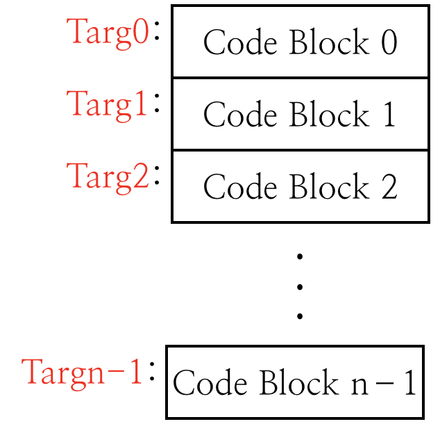
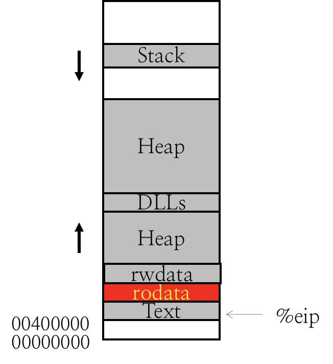
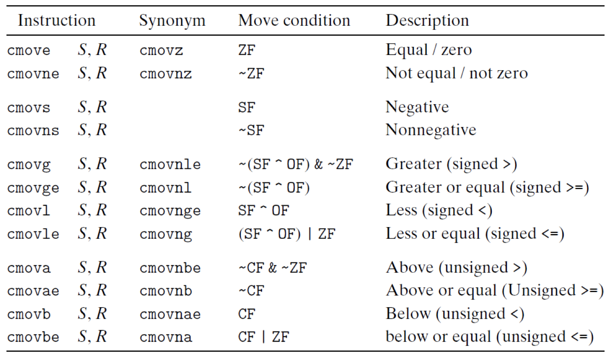

# 1.9 Control Flow

## Textbook

* 3.1

汇编代码执行的顺序，可以称之为「控制流」（Control Flow）。默认情况下会逐条执行。

而要影响控制流，需要使用 `jmp` 族指令。

## Control Flow

### Default

默认情况下，指令会逐条地向下执行，如果没有遇到任何 `call` 或者 `jmp` 指令的话。

###  Alter the Flow

#### Unconditional Jump

下面的跳转指令都是「无条件跳转」，即只要执行到该语句处就会执行跳转。

##### `jmp <LABEL>`

在汇编语言里，可以在任何一行代码前写 `LABEL: `，来给这行代码以标号 `LABEL`。然后，就可以 `jmp` 到那儿了。

```assembly
	movq   $0, %rax
	jmp   .L1
	movq  (%rax), %rdx	## skipped
.L1:
	popq   %rdx
```

在这里，L2 会直接跳到 L5，跳过会产生异常的 L3。

> L4 实际上只是对 L5 的注解，不算代码。

这种 Jump 被称为 Direct Jump（直接跳转），

##### `jmp *<value>`

先计算出 `<value>` 的值，取出它对应的内存位置的内容，然后跳转到该处。

```assembly
	jmpq	*%rcx
```

> 由于这种跳转涉及到解内存地址的字长，因此也有 `-q`、`-d`、`-w`、`-b` 系列後缀。

这种 Jump 被称为 Indirect Jump（间接跳转）。

#### Conditional Jump

可以在 Direct Jump 指令後增加类似于 1-8 里提到的那些条件指令，来实现条件跳转的效果。

### Example

要写出跳转，在 C 里我们可以写「条件判断」、「循环」、或者「`goto` 语句」。

#### `if`

```c
size_t test_if(size_t i)
{
    if (i % 2)
    {
        return 0;
    }
    else
    {
        return 1;
    }
}
```

> 这个函数太简单，因此不能用 `-Og` 编译，不然直接把分支都优化没了…

```assembly
_test_if:                               ## @test_if
	## ...
	andq	$1, %rax
	cmpq	$0, %rax
	je	LBB0_2
## %bb.1:
	movq	$0, -8(%rbp)
	jmp	LBB0_3
LBB0_2:
	movq	$1, -8(%rbp)
LBB0_3:
	movq	-8(%rbp), %rax
	popq	%rbp
	retq
                                        ## -- End function
```

可以看到，一般化的 `if` 可以被化作：

```assembly
	conditional_jump true_cond
	## ... false condition stuff
	unconditional_jmp end
true_cond:
	## ... true condition stuff
end:
	## ... after the if condition
```

这种形式。

#### `while`

```c
size_t test_loop(size_t i)
{
    while (i > 0)
    {
        --i;
    }
    return i;
}
```

> 这个更离谱，`-Og` 直接优化成了 `return 0`…

下面是 `-O2` 的结果：

```assembly
_test_loop:                             ## @test_loop

LBB1_1:                                 ## =>This Inner Loop Header: Depth=1
	cmpq	$0, -8(%rbp)
	jbe	LBB1_3
## %bb.2:                               ##   in Loop: Header=BB1_1 Depth=1
	movq	-8(%rbp), %rax
	addq	$-1, %rax
	movq	%rax, -8(%rbp)
	jmp	LBB1_1
LBB1_3:
	## ... returning stuff
	retq
                                        ## -- End function
```

可以看出，一般化的 `while` 函数可以被化作：

```assembly
head:
	conditional_jump end
	## ... loop content
	unconditional_jump head
end:
	## ... after the loop
```

> `do while` 和 `for` 都可以看作是 `while` 的包装，所以不单独说了）

#### `goto`

```c
size_t test_goto(size_t i)
{
begin:
    if (i > 0)
    {
        goto minus;
    }
    else
    {
        goto end;
    }

minus:
    --i;
    goto begin;

end:
    return i;
}
```

```assembly
_test_goto:                             ## @test_goto
	## ...
LBB2_1:                                 ## =>This Inner Loop Header: Depth=1
	cmpq	$0, -8(%rbp)
	jbe	LBB2_3
## %bb.2:                               ##   in Loop: Header=BB2_1 Depth=1
	jmp	LBB2_4
LBB2_3:
	jmp	LBB2_5
LBB2_4:                                 ##   in Loop: Header=BB2_1 Depth=1
	movq	-8(%rbp), %rax
	addq	$-1, %rax
	movq	%rax, -8(%rbp)
	jmp	LBB2_1
LBB2_5:
	## ...
	popq	%rbp
	retq
                                        ## -- End function
```

基本还原了 C 里面的跳转。

`LBB2_1` 对应 `C.begin`；`LBBR_3` 是 `if` 引入的额外 Label；`LBBR_4` 对应 `C.minus`；`LBBR_5` 对应 `C.end`。

顺便留意到，`if` 语句生成的几个 Label 和我们的 Label 有部分合并（Coalesced）了。

#### `switch`

`switch - case` 的实现比较特别：它依赖于一个叫做「跳转表」（Jump Table）的东西。

简单说，把每个 `case` 对应的内存位置都提出，记录在一张表里，像这样：

```c
switch (op) {
    case val_0:
        // Block_0
    case val_1:
        // Block_1
    // more cases...
    case val_n:
        // Block_n
}
```



然后，就只需要根据 `op` 算出对应的跳转表索引，然后跳到对应内存位置即可。

```c
	target = jTab[idx];
	goto *target;
```

> 注意，直接 `goto` 一个内存地址的行为只在 GNU 的扩展 C 里支持，ANSI C 是不可以的。

但最後编译到汇编里都是一样的：

```assembly
	movq JTAB, %rax					## JTAB 起始地址
	movq IDX, %rbx					## JTAB 索引
	movq (%rax, %rbx, 8), %rax		## 找出索引条目的内存地址
	jmp *%rax						## 取出索引条目，并跳转
```

写一个实际的例子来看看：

```c
void bar();
void baz();

int foo(int op)
{
    switch (op)
    {
    case 1:
        return foo(op + 1);
    case 2:
        bar();
        break;
    case 3:
    case 4:
        baz();
        break;
    case 5:
        return foo(op - 1);
    default:
        break;
    }
    return 0;
}
```

用 `-Og` 编译之後，可以看到编译器生成的跳转表：

```assembly
	.p2align	2, 0x90
	.data_region jt32
.set L0_0_set_1, LBB0_1-LJTI0_0
.set L0_0_set_5, LBB0_5-LJTI0_0
.set L0_0_set_3, LBB0_3-LJTI0_0
.set L0_0_set_4, LBB0_4-LJTI0_0
LJTI0_0:
	.long	L0_0_set_1
	.long	L0_0_set_5
	.long	L0_0_set_3
	.long	L0_0_set_3
	.long	L0_0_set_4
	.end_data_region
```

以及关于跳转的关键代码：

```assembly
	movslq	(%rax,%rdi,4), %rcx		## 取出跳转表条目
	addq	%rax, %rcx				## 加上索引
	jmpq	*%rcx					## 跳转之
```



再回顾 Linux 程序的内存布局图，可以看到，JT（跳转表）就位于其中的 `rodata`（即 Read-only Data）区段。

### `cmov`

#### Example

顺带一提，有些情况下的 `if` 判断可以用 `cmov` 实现，节约指令。例如：

```c
int foo(int arg) {
    int ret = 0;
    if (arg % 17) {
        ret = 42;
    }
    return ret;
}
```

就会被编译出这么一行关键汇编：

```assembly
	## ...
	cmovel	%ecx, %eax
	## ...
```

#### Full Instructions



其实跟之前的 `cc` 後缀很类似…

不过注意，所有的 `cmov` 的 Destination 都必须是寄存器（上面都写作了 *R*）。

> 这一限制大概是受制于流水线的预测执行吧…

