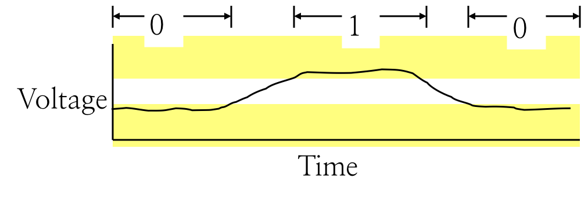

# 2.1 Logical Design & HCL

## Textbook

* 4.2

## Outline

* Logic Design
* Hardware Control Language (HCL)

## Logic Design

### Basic

基于电压的高低来传递数字信号。




三种不同的基础门电路可以根据输入的电压高低输出不同的电压。

> 基本上可以认为没有延迟。

因此，本质上输入一系列电平，就可以从输出端拿到一系列电平，中间的内容就是我们需要通过堆叠这三种电路基本单元来实现的了。


### Example


例如，这个简单的电路就是判断输入 `a` 和输入 `b` 是否一致。假如一致，那么输出 1；否则输出 0。

## HCL Expression

### Syntax

非常简单的一套语法，类似于 C。

#### Single Bit Ops

以下这四个操作符针对单个 Bit 作用：

* `&&`（AND）
* `||`（OR）
* `!`（NOT）
* `()`（Parentheses，用于改变优先级）

#### Multiple Bits Ops

以下操作符针对 64 位数字作用：

* `==`（EQUAL）
	* 比较每一位是否相等（用 `(a && b) || (!a && !b)`），只有每一位都相等才返回一个 `1` 比特；否则返回 `0` 比特。
* `!=`（NOT EQUAL）
* `<`（LESS）
* `<=`（LESS OR EQUAL）
* `>`（GREATER）
* `>=`（GREATER OR EQUAL）


> 数字的每一位都会分别从一条电路中传来，最终拼凑出一个 64 位数字。

#### Variables

另外，还可以声明新的临时变量储存返回结果；例如两个 64 位数字做比较 `A == B` 得到的单个比特就可以存储在 `bool` 类型变量中，像这样：

```c
bool eq = (A == B)
```

而 64 位数字则应该这么表记：

```c
word V = A;
```

> 不成文的规定，小写字母一般用于表示单个比特；而大写字母一般用于表示 64 位字。

#### Case Expression

##### Syntax

```c
Out = [
    s: A;
    t: B;
    u: C;
    1: D;
];
```

这是 HCL 特殊的 `switch-case` 赋值方法。

首先，会从上到下分析每个条目。

每一个条目可以表示为 `condition: Value` 这样。假如遇到一个 `condition` 为真，则立即将其右侧的 `Value` 赋给 `Out`，赋值结束。否则，继续观察下一条目。

通常来说我们会在最下方放置一条 `default` 条目，即将 `condition` 设置为 `1`，就可以确保不会出现无值可赋的情况。

`condition` 可以是任意复杂的逻辑表达式，只要最终能够分析出一个 0 或 1 的比特即可。

##### Example

例如，取出三个数字中的最小值的逻辑电路可以这么设计：

```c
word Min3 = [
    A < B && A < C : A;
    B < A && B < C : B;
    1              : C;
];
```

### Y64 Implementation

我们可以根据上面的语法，设计出 Y64 CPU 的逻辑运算单元：


## Storage

上面所有的电路都是无状态的；即，没有记忆性，给一个输入就有一个确定的输出。这显然不是很好用。

### Sequential Circuits

#### Clocked Registers


被称为「时钟寄存器」；这和 CPU 中的寄存器是两码事。

这个寄存器只能保存一个比特；但重复这个结构多次就能用来储存任意长的字。


每个寄存器都有一个自己的内部状态。在时钟的上升沿到来之前，他会始终输出这个电平。

直到时钟上升沿到来时，会根据此刻的输入电平更新自己的状态，同时更新自己的输出电平。

无数个这样的寄存器组合起来，就让我们的计算机拥有「状态」的概念了。

### Usage

目前常说的内存（RAM，即 Random-access Memories），其中 Random 的意思是可以以几乎相同的时延读取其中任意位置的内容。


本质上和上面的 Register 没什么不同；同样是只有在时钟上升沿才能改写内存，同时可以任意读取其内部状态，只要改写 `address` 的状态来给定一个内存地址。

在掉电之后所有数据全部丢失。

