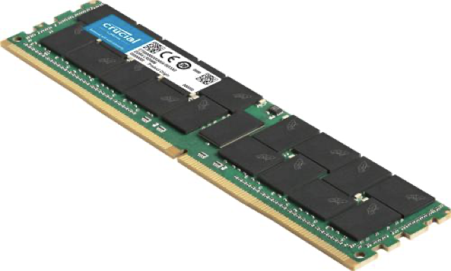
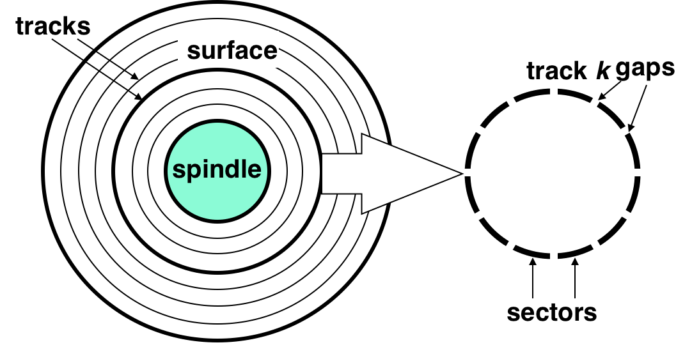
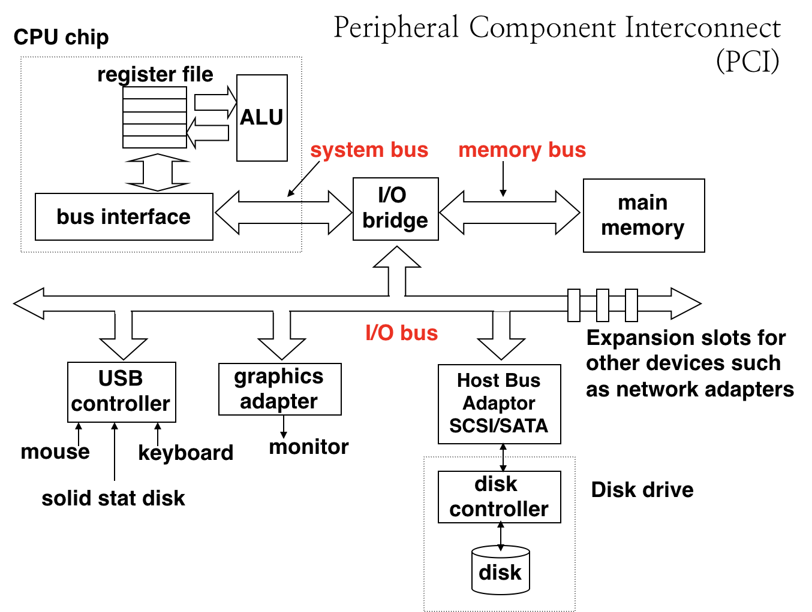
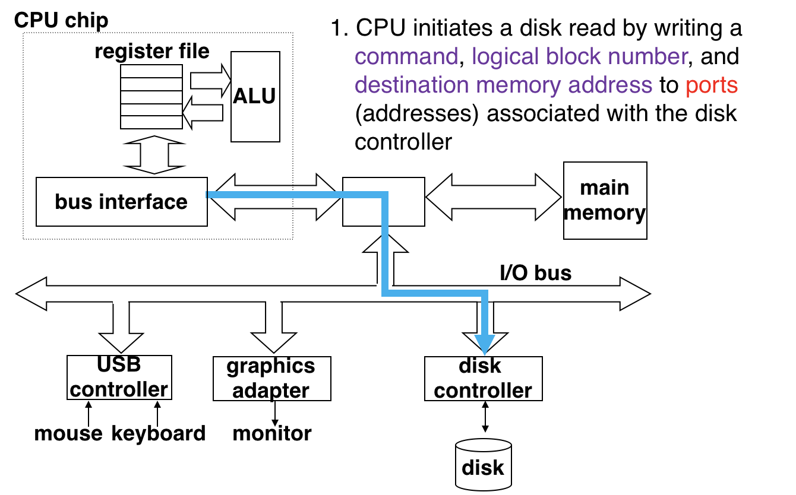
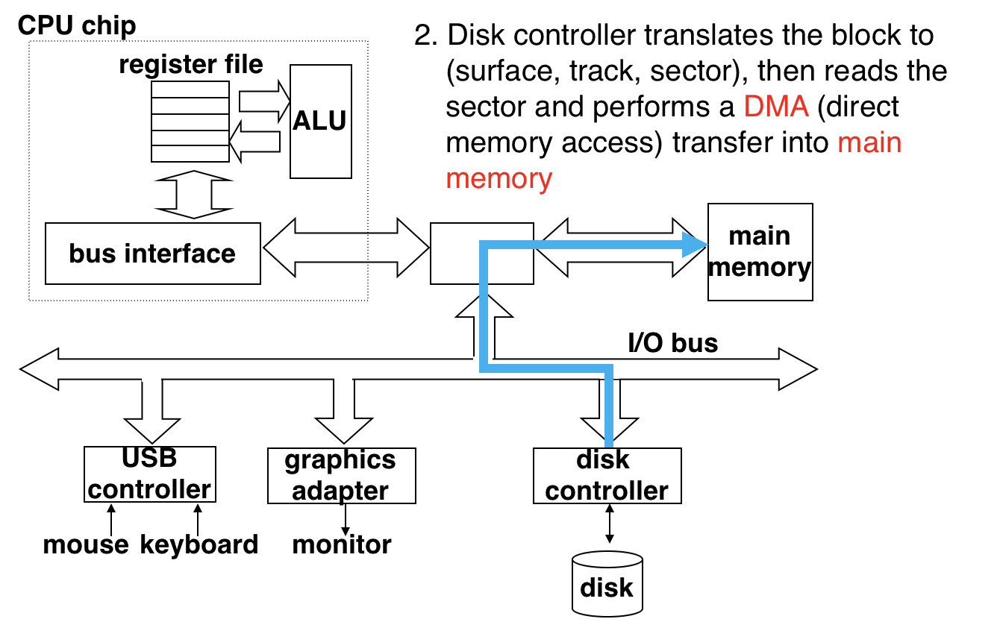
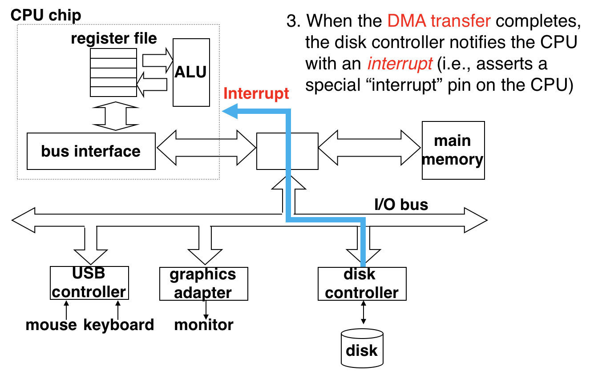
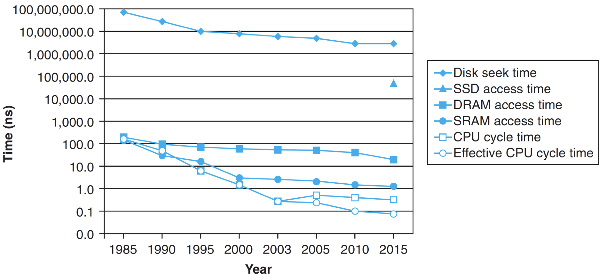

# 2.10 RAM

## Textbook

* 6.1

## Outline

* RAM
* 非易失性内存
* CPU 和主存之间的信息交流
* 主存和磁盘之间的信息交流

## Memory

### Hardware

看起来就是这样的「条状物」。

### Categories

* SRAM
	* `S` is for `Static`。
	* 只要持续上电，其数据就能保留。
	* 对电子噪声干扰不敏感。
* DRAM
	* `D` is for `Dynamic`。
	* 必须持续刷新（每 10 到 100 毫秒）数据才能将其保存。
	* 很容易被干扰。

可以看出，SRAM 在各个方面都优于 DRAM。但是其唯一的问题就是成本高、价格贵、容量做不大。

> 这一部分没什么好讲的

## Disk

这里指的是老式的磁盘，也就是 HDD。

### Structure

内部结构大概长这样：

圆柱形的层叠结构，每一层都是一圈同心圆。

每个圆又可以分为若干个由 Gap 分割的 Sector。

注意，虽然外圈圆比内圈圆要大，但实际上每个圆都有相同的 Sector 个数。

总的来说，整个磁盘的容量应该等于：

厚度层数 × 同心圆的个数 × Sectors 的个数 × 每个 Sector 携带的数据量。

### Reading / Writing

为了提升容量，叠床架屋搞了这么多层，所以不管是读还是写都相当麻烦。

首先，要选择合适的读取面；然后，调整磁头的位置使其指向对应的圆圈；最后，旋转磁盘，定位到具体的 Sector。

定位到之後，读和写的操作就可以类似完成。

### Access Time

这种涉及到机械的操作比起电子化的操作，实在是慢太多了。

有这么一个公式可以估计读、写磁盘的耗时：
$$
T_\mathrm{access} = T_\mathrm{average\ seek} + T_\mathrm{average\ rotation} + T_\mathrm{average\ transfer}
$$
分别代表寻址耗时（将磁头设定到位的时间）、旋转耗时（选中正确的 Sector 的耗时）、传递数据耗时。

通常来说，一个普通的磁头寻址大约需要 9 毫秒。

而 Average Rotation 的耗时则取决于 HDD 的「转速」；例如，一个 5400 转（每分钟）、即每秒 90 转的硬盘，将其旋转到任意位置的平均耗时是 $\dfrac 1 2 \times \dfrac 1 {90}$，即 $\dfrac 1 {180}$ 秒。比起 Seek 时间稍微短一点。

平均的数据转移时间则是将单一一个 Bit 从指定 Sector 中的任意位置读出/写入的耗时。这段时间是最短的，一般只会花费不到 `0.1` 秒的时间。

### Graph

将 Disk 纳入示意图中，他被挂在 I/O Bridge 下面。

## Connect

### CPU & Memory

这两者之间通过 Bus（总线）连接。

#### Graph

左边的灰框里面的部分就是 CPU 芯片内容；Bus 连接彼此，同时中间还插入有许多 I/O 设备等等。

#### Read Transaction

以 CPU 执行指令 `movq A, %rax` 为例。

要想读一块内存内容，CPU 首先把要读的内存地址放在总线上。

主存控制器从总线上读到了这个字之後，就将正确的值放在总线上，稍後传递回 CPU。

CPU 从总线上读到了结果后，就将其拷贝到寄存器 `%rax` 之中。

读内存结束。

#### Write Transaction

写内存稍微复杂一些。

以 CPU 执行 `movq %rax, A` 为例。

首先 CPU 丢一个内存地址给总线。主存得到之後就开始等待「值」的到来。

稍後，CPU 将实际的值 `Y` 放入总线，主存得到後就根据这一对值写内存。

> Easy and Sweet。

### Disk & Memory

一般来说，CPU 不会直接跟 Disk 打交道，因为 CPU 一次只能读一个 Word，真要这么读效率过低。

因此，一般的实现是将 Disk 成批（in bulks）地映射到内存中，CPU 直接跟内存交换信息。

类似于 Disk 的 I/O 设备称为 Memory-mapped I/O。他们会占有一部分固定的地址空间，有一些特殊的寄存器也映射到这里面。

#### Read Transaction

首先，CPU 将一个特殊数字连带要读取的 Block 号放入总线。这个信息会通过总线发给 Disk Controller。

Disk Controller 得到要读取的 Block 号之后，就将这一整个 Block 的内容映射到内存里。

在 Block 成功映射之后，磁盘控制器就通过中断来告知 CPU。

随后，CPU 只要通过读取映射内存中的指定位置就可以读取磁盘了。

> 不管是看 Disk 的寻址方式，还是看内存映射的策略，都可以看出读磁盘非常依赖于「局部性」。
>
> 也就是说，如果总是读取物理上相近的磁盘内容，那么读取速度就会很快；反之则会非常慢。

## SSD

Solid State Disk。固态硬盘。

这已经不像是传统的 Disk 了，反而是跟 RAM 有点类似。

只要给出地址就可以「任意读取」，也就是 Random-Access。「任意」的意思是无论选择读取哪里的内存，都一样快。

注意这里的纵轴是取了对数的。可以看出不同的存储介质的访问速度之间有数量级的差别。

