# 2.11 Locality

## Textbook

* 6.2
* 6.3
* 6.4

## Outline

* 局部性
* 内存的等级制度
* 缓存

## Locality

何谓局部性？

和人类一样，计算机程序也倾向于使用最近使用过的「指令」（「内存」）附近的「指令」（「内存」）。

这种程序的性质被称为「局部性」。

### Definition

#### Categories

##### Temporal Locality

时间局部性。

最近刚刚访问过的项目有较高可能在将来被再度访问。


##### Spatial Locality

空间局部性。

彼此相邻的项目有较高概率相继被访问。


> 通常来说，程序同时具有这两种局部性。

### Compilers' Perspective


### Example

#### `sumvec`

```c
#define N 8

int sumvec(int v[N])
{
    int i, sum = 0;
    for (i = 0; i < N; i++)
        sum += v[i];
    return sum;
}
```

可以简单地观察出程序的访存路径：

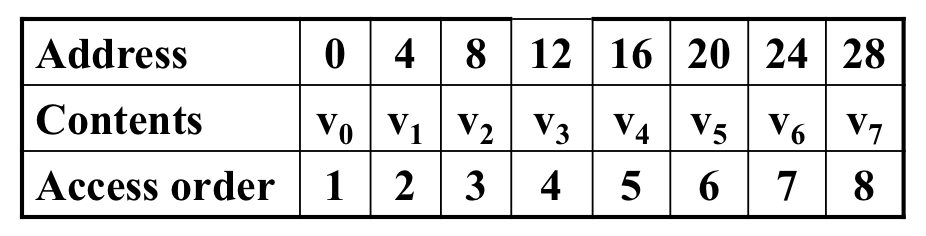

其中，变量 `i`、`sum` 满足时间局部性；而对数组 `v` 则满足空间局部性，且访存步长为 `1`。

> 我们定义 `k` 访存步长为：对一段连续的内存，从每 `k` 个字节中访问其中一个。
>
> `k` 越小，空间局部性越明显；反之越不明显。

#### `sumarrayrows`

考虑另一个函数，它对一个矩阵中的全部元素求和，而且采用的是「先行後列」的方式。

```c
#include "config.h"

int sumarrayrows(int a[M][N])
{
    int i, j, sum = 0;

    for (i = 0; i < M; i++)
        for (j = 0; j < N; j++)
            sum += a[i][j];
    return sum;
}
```

由于我们的多维数组在内存中就是以「先行後列」的方式存储的，因此在 `M = 2`、`N = 3` 时，可以看到 `a` 的寻址规律如下：

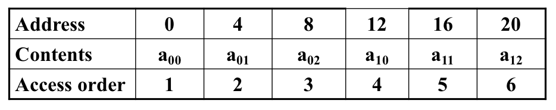

具有规律的 1 步长。

但如果我们换个方式，按照列先求和：

```c
#include "config.h"

int sumarraycols(int a[M][N])
{
    int i, j, sum = 0;

    for (j = 0; j < N; j++)
        for (i = 0; i < M; i++)
            sum += a[i][j];
    return sum;
}
```

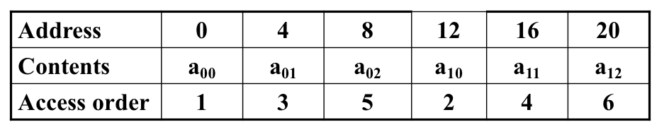

可以看到就没有这么良好的局部性了：步长变大且不规律，导致缓存困难、效率下降。

在 `M`、`N` 变得非常大的时候，这种情况会更糟糕。

#### Latent Locality

事实上，上面的两个例子里还有一个很不明显的局部性，那就是指令的「时间局部性」。

可以看到，`sum += a[i][j]` 这行语句对应的指令在循环中被反复读取执行，这使其有较高概率被放在 `i-cache` 之中。这也是一种局部性。

## Memory Hierarchy

内存的等级结构…是森严的。

### the Major Gap

CPU 和内存之间有着巨大的鸿沟。以寄存器为代表的 SRAM 和以主存为代表的 DRAM 之间的读速、储存空间差异过大，且交流信息相当慢。

早期计算机没有缓存，这就意味着访问一条目数据要么非常快（如果被放在了 CPU 内部的寄存器中），要么非常慢（如果是从内存中取出来的）。这就要求程序极其高效地应用有限的寄存器，也就是保证局部性。

### Cache it!

#### Pyramid

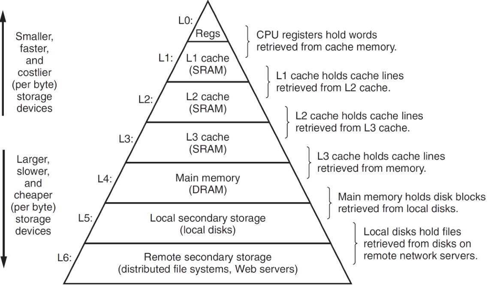

这个金字塔结构非常完美：（通常来说）越靠顶部的缓存级，储存空间越小、读取速度越快；反之越靠底部的缓存级，储存空间越大、读取速度越慢。

#### Cache Idea

内存架构的基本思想是：对每一个缓存级 $k$ 都作为比它更慢一级的缓存级 $k + 1$ 的缓存存在，保存下一级中常用的数据。

CPU 缓存时，从 `L0` 开始依次往下找，直到找到一层保存了这个值的缓存，则返回给 CPU。否则，一直往下找，直到最底层。

> 在实际的单机计算机中，一般存在着 `L0` ～ `L5` 这六层缓存级别。
>
> 存在 `L5` 的原因是在虚拟内存大小超过物理内存大小时，可能会有一部分页被放在磁盘中。

#### Cache Concepts

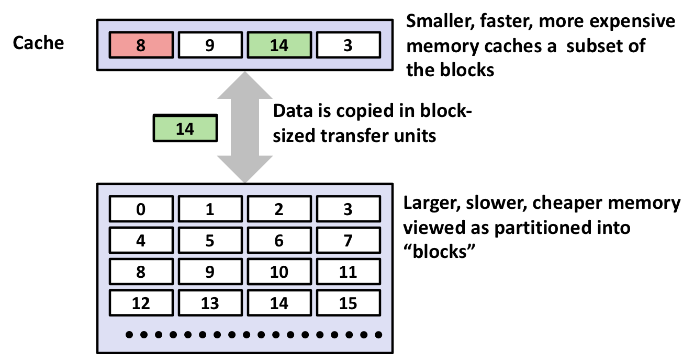

上面也提到了，缓存的要义就是，始终把常用的数据放在访问快的缓存级中，而把不常用的数据放到访问慢的缓存级中。

有几个概念我们需要了解：

##### Hit

在 CPU 自上而下地访问内存级、想要读取一个值时，「在某一个内存级找到了想要的数据」的事件被称为一次「Hit」。

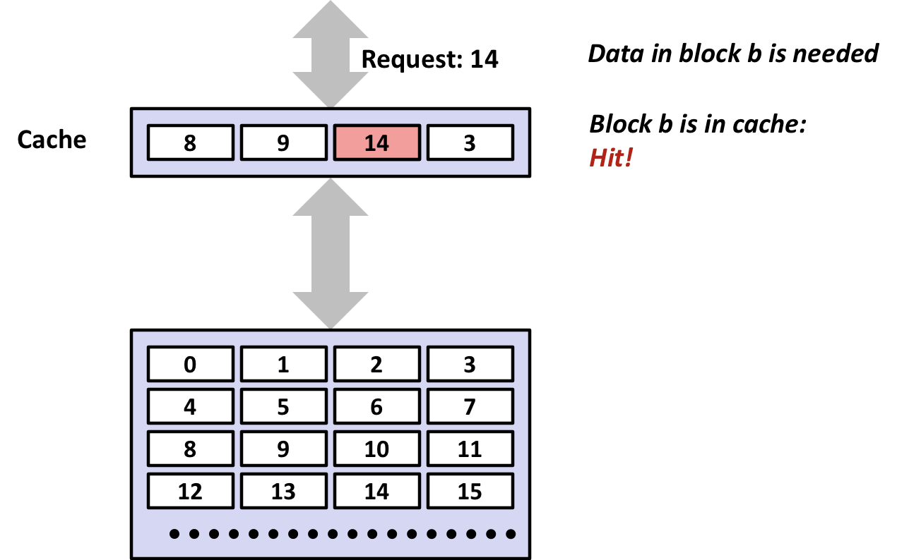

> Hit!

Hit 当然是好的；就不需要再继续往下找了。这代表我们的缓存多少发挥了点作用。

当然，无论如何到最底层的缓存级（它都不能叫缓存级了，因为他不作为任何层级的缓存）都是能 Hit 上的。

##### Miss

和 Hit 相对，有 Hit 就有 Miss。「当读寻址下降到某一层级，却发现该层级没有所需的值」，这种情形就叫做 Miss。

遇到 Miss 之后就得接着往下一层级找。

###### Cold Miss

在这一层级的 Cache 有空位，但却没有 Hit 到的时候，我们可以断定这是因为这个数据之前从没被访问过，所以没有进入 Cache。

称这种情况为 Cold Miss，即在刚开机、所有 Cache 都是空的时候会出现的情况；也称为 Compulsory Miss，即每个值在第一次被读取时，必然发生的 Miss。

###### Capacity Miss

假如这一层级的 Cache 里曾经出现过这个数据，但却在稍後访问时 Cache Miss 了，这就说明由于 Cache 的容量不足导致其被驱逐（Evict）出去了。

这种 Miss 称为 Capacity Miss，即 Cache 容量不足时会出现的情况。

###### Conflict Miss

冲突 Miss。

在将下层 Cache 装载到上层时，不能任意选择一个空位进入，而必须根据其地址、按照一定规律算出。

假如交替访问的两个值只能被放在同一个 Cache 块中，那么每一次访存都会失败。

#### Big Idea

为什么这么构建的内存结构会有用呢？

还是局部性。如果我们把最近访问过的元素（以及靠近它的那些元素）放到高速缓存中，就能在总体上提升程序的运行速度。

## Caches

回到我们之前的七级缓存金字塔。

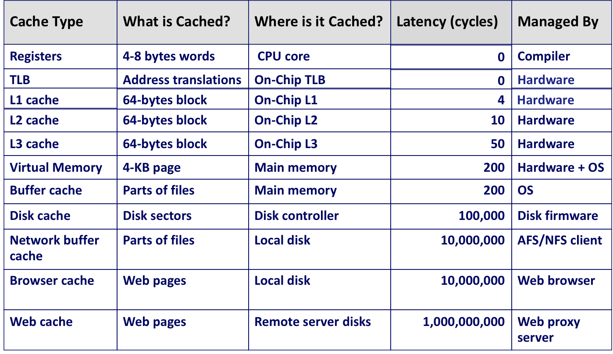

这里是按照层级划分的缓存级的大小、访问延迟时间（按 CPU Cycles 计）、以及由谁管理。

寄存器的分配（或者说，一种非常灵活缓存机制）会在 Compilers 课中了解到。而 VM 及以上的缓存机制会在 OS、Network 课中聊到。

在 ICS 中我们主要关心的是由硬件管理的「L1、L2、L3」三级缓存机制。

这三层缓存机制完全由硬件实现，因此具有较低的复杂度和较低的灵活性。

> 相比之下，寄存器分配非常不灵活，直接由编译器生成指令；而更下层的缓存又太复杂，不容易研究。我们这里就讨论最容易理解的三级内存缓存。

### 3 Level Memory Cache

这三级位于 CPU 和主存之间，处理他们之间的缓存事宜。

#### Structure

每个 Cache 级的结构如下：

首先，每个 Cache 都包含 $S = 2^s$ 个缓存集（Set）。

每个缓存集又包含 $E$ 个缓存行（Line）。

每个缓存行里面又包含了 1 个校验位、$t$ 个 `tag` 位、以及 $B = 2^b$ 个实际保存数据的缓存块（Block）。每个数据块包含 1 字节（8 比特）的数据。

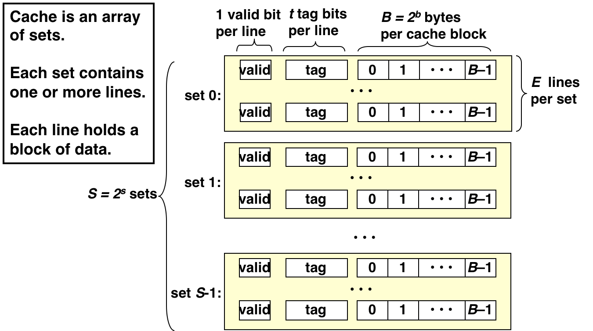

#### Relations

首先，缓存集的个数必须是 $2$ 的非负整数次幂，即
$$
S = 2^s
$$
其中 $s$ 是非负整数。

显然地，有
$$
s = \log_2{S}
$$
其次，缓存行的个数 $E$ 可以任取。

最後，每个缓存行里的有效载荷，也就是缓存块的个数也要是 $2$ 的非负整数次幂，即
$$
B = 2^b
$$
同样显然的，有
$$
b = \log_2{B}
$$

#### Decoding

假设这个缓存的缓存目标的内存大小一共是 $M$ 字节，即是其地址是
$$
m = \log_2{M}
$$
位的。

那么怎么根据这个内存地址，从每一级缓存中查询呢？

首先，我们将内存地址分为三部分：$s$、$b$、$t$。

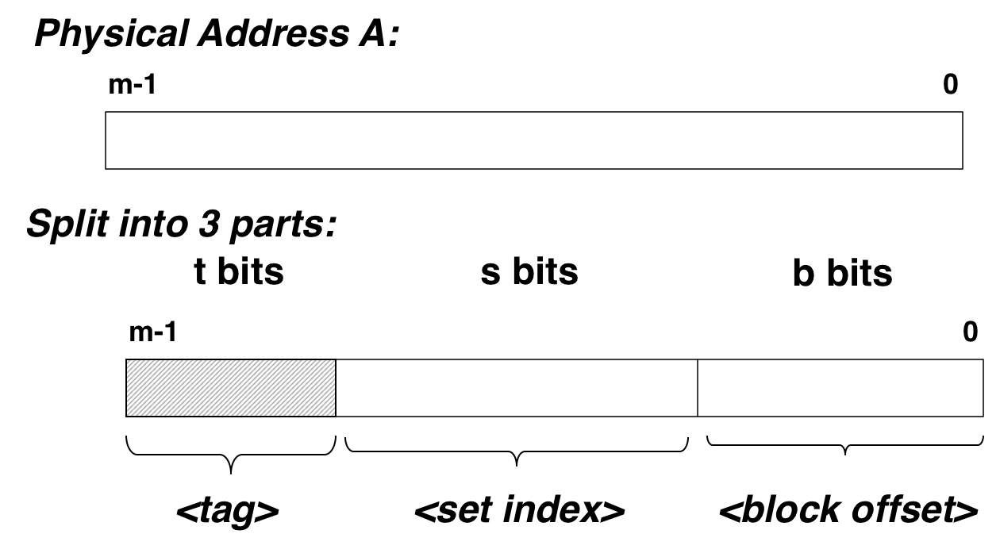

先 `tag`，再 `set_index`，最後 `block_offset`。

很显然的，`set_index`，也就是缓存集的索引，应该等于 $s$。而 `block_offset`，即在一个缓存行中的 $B$ 个 `Block` 中进行索引的标识，他应该是 $b$ 位的。

因此，最後一个未定长度的 `tag`，就是 $t$ 的长度。

因此，我们有
$$
t + s + b = m
$$
这个缓存级别的容量 $C$（字节数）是
$$
C = B \times E \times S
$$
而
$$
M = 2^m = 2^{b + s + t} = B \times S \times 2 ^ t
$$
很显然 $C \lt M$，否则还缓存个什么劲。

也就是，缓存行的个数 $E \lt 2^t$。

#### Try Hitting

当我们拿到一个 $m$ 位长度的内存地址，并想尝试其是否在某一个缓存级 $L_i$ 上存在时，应该这么处理：

首先，根据 $L_i$ 的 $s_i$、$b_i$ 得到一组 $m$ 的划分方式 $(m - s_i - b_i, s_i, b_i)$。记为 $(t_i, s_i, b_i)$。

然后，根据 $s_i$ 找出该缓存级（Level）中的某一个缓存集（Set）。

> 请注意区分缓存级和缓存集！

然后，逐一比对该缓存集中的 $E$ 个缓存行所携带的 `tag`。

如果没有找到和 $t_i$ 匹配的 `tag`，则 Cache Miss。

如果找到了这一缓存行，那么再用 $b_i$ 定位到该行中的特定 Block，得到一个字节的值。Cache Hit。

> 你可能会觉得这种过程太慢了，根本不值得。但实际上这段逻辑由于其极强的规律性可以用逻辑电路实现，因此其执行效率很高。

### Trivial Cases

通过挑选不同的 $S$、$E$、$B$，可以组织出多样的缓存行。

#### Direct-Mapped Caches

指的是那些每个缓存集里只有一条缓存行（$E = 1$）的缓存组织形式。

这种形式下的逻辑电路实现更简单，Tag Match 的效率也非常高。

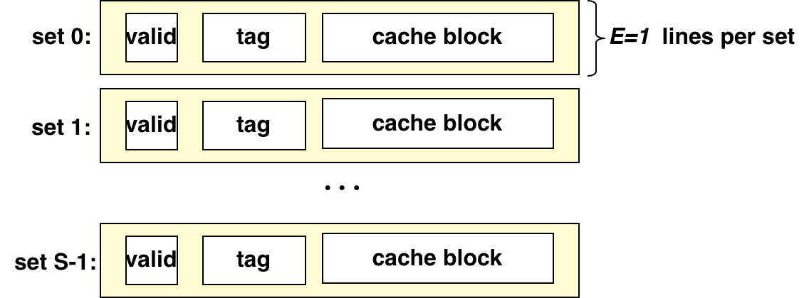

问题也很明显：同时只能缓存一条具有相同 $s_t$ 的内存地址。也就是说会经常地产生 Evict（驱逐）。

#### Set-Associative Caches

指的是 $S > 1$、$E > 1$ 的缓存组织形式。

这种形式比较均衡；不太容易产生 Evict，Tag Match 的效率也比较低。是平时常用的方法。

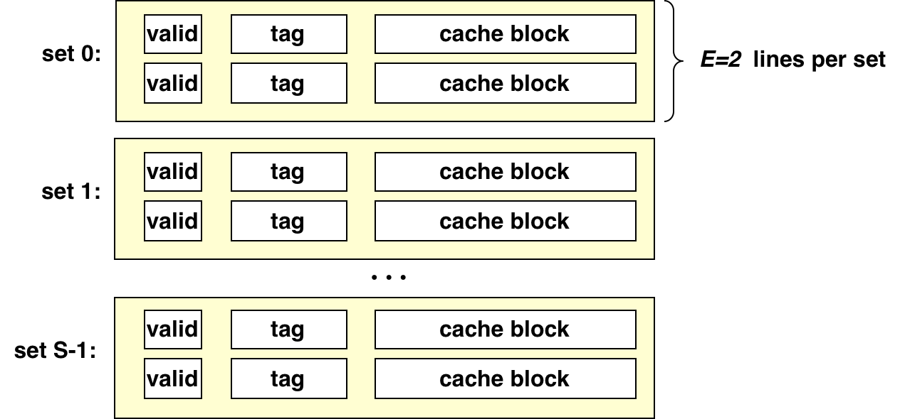

#### Fully-Associative Caches

指的是 $S = 1$ 的缓存组织形式：大家就只有同一个 `Set`，完全规避了 Conflict Miss：除非缓存满了，否则绝不拒绝新的缓存行进入。

问题也很明显：你这个 Tag Match 太慢了…最坏情况下要比对全部 $E$ 行的 `tag` 才能确定 Hit or Miss。

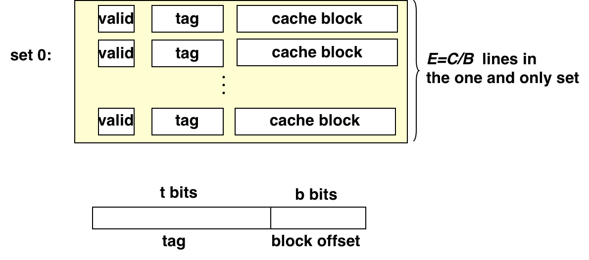

要注意的是此时 `Set` 的数量 $S = 1 = 2^0$，即此时 $s = 0$，没有必要引入 $s$ 位；内存划分退化为两部分。

> 说到底，就是在「Tag Match 速率」和「Conflict Miss 频率」之间做权衡。