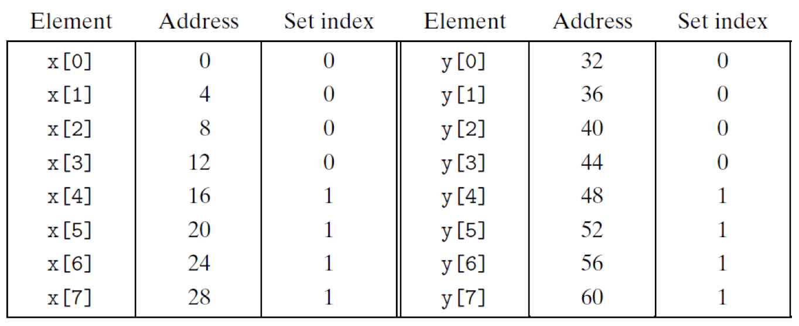

# 2.12 Cache

## Textbook

* 6.4
* 6.5
* 6.6

## Outline

* 缓存知识补完
* 怎么写出「缓存友好」的代码
* 快速矩阵乘法
* 存储器之山

## Cache

### Conflict Miss

上节已经讲过了 Direct-Mapped Caches 的问题：非常容易在缓存实质上有空的时候产生 Evict，最後造成大量的 Conflict Miss。

#### Dot Production

看一个很简单的例子：

```c
// vector dot production calculator
float dotprod(float x[M], float y[M])
{
    float sum = 0.0;
    int i;
    for (i = 0; i < M; ++i) {
        sum += x[i] * y[i];
    }
    return sum;
}
```

这里我们取 `M = 8`。假设 `float` 类型的字段位长是 32 位。

考虑一个包含两个缓存集（$S = 2$）、直接映射（$E = 1$）、每个缓存行有 16 个块（$B = 16$）的缓存级。

显然，整个缓存的容量一共是 $S \times E \times B = 32$ 字节，而上面所有的 `float` 数字一共是 $16$ 个，每个 `float` 占用 $4$ 字节。

看起来没什么问题，整个缓存行可以存下一半的数据。

#### Worst Case

假设 `x[0:7]` 和 `y[0:7]` 在内存中连续分布。那么，读取 `x[0]` 时会将 `x[0:3]` 放入一个缓存行中；读取 `y[0]` 时会将 `y[0:3]` 放入一个缓存行中。

假如 `x` 跟 `y` 被缓存的目标位置不重叠，那么非常好，只需要做 4 次缓存行的更新就可以完成了。

但是，考虑下面的缓存组织结构：



由于我们要对对应着相同 `i` 的 `x[i]` 和 `y[i]` 做乘积，因此每次都会试着将他们纳入缓存行中。

然而遗憾的是，按照这种缓存组织形式，`x[i]` 和 `y[i]` 必定会进入同一个缓存集，也就是每进行一次循环，都会带来两次缓存行的更新。

这个效率甚至还不如没有缓存呢。

#### Best Case

如果我们在 `x[8]` 和 `y[8]` 之间插入 4 字节的 Padding，那么缓存就会这么组织：


这时候就得到了最优解：仅需 4 次缓存行更新就可以完成计算。

### Address Translation

思考这样一个问题：我们在分配缓存行时，会将目标内存地址从左到右地分配成 Tag、Set Index、以及 Block Offset。

为什么 Set Index 在中间呢？如果严格按照从大到小的索引顺序，那应该是 Set Index（确定 Set）、Tag（确定 Line）、Block Offset（确定 Block）才对啊。

其实，重要的原因是根据空间局部性，一个程序访问的大部分内存地址都相近。也就是说，他们相当有可能具有相同的高地址位。如果用这个高地址位来索引 Set Index，那么几乎所有被利用的缓存行都会集中在少数 Set 中，而浪费掉大部分 Sets。

> Fully-Associative Caches 不适用于此。

Block Offset 为什么在最尾部不用说了。因为空间局部性，所以要将相对靠近（也就是低地址位相近）的内存数据一起拿到 Cache Line 中来。

因此，Set Index 只能在中间了。

### Evict

遇到了一次 Miss 的时候，就会让这次 Miss 的结果进入缓存。

在 Compulsory Miss 的情况下，这个无可置疑；但是除此之外的情况（也就是当前可以被放入的缓存块已经满了的情况下），应该如何选择一个位置放入新缓存行呢？

这就涉及到 Evicting（驱逐）策略的问题了。

#### LFU

所谓的驱逐「Less Frequently Used」。

把最不常用（使用频率最低）的那个元素驱逐出去。

#### LRU

所谓的驱逐「Less Recently Used」。

把上次使用时间最靠前的那个元素驱逐出去。

这两种策略需要额外的硬件来实现，同时消耗比较多的时间。

但是总的来说，记录「每个缓存上次使用的时间」和「记录每个缓存被使用的次数」，还是前者的开销稍微小一些。

> 对于 Direct-Mapped Caches 来说，不需要考虑 Evict Line 的选择问题。
>
> 代价就是会遇到更多多余的 Evicting，缓存性能下降。

#### General

如何衡量一个 Evict 算法的好坏？当然是通过 Hit 和 Miss Rate 了。

注意，考虑到实际情况中缓存容量有限，Hit Rate 存在上限。也就是，存在理论上最优的 Evict 算法。

假设我们可以在任意时刻了解从 A 到 Z 的访存顺序，那么就能给出这样的 Evict 算法：

* 始终 Evict 在未来使用频率最低的那一个 Cache Line。

即，在可以预先知道访存序列的情况下，我们可以得到这个最优解。

### General Time Costs


每级缓存的时间开销（以时钟周期为单位）。

## Writing

上面的讨论仅限于「读」。但是，有时候我们还会改写内存的值。那么缓存该如何因应这种情况？

### Write Hit

首先，在写一个内存地址时，肯定是经过缓存的，也就是说，我们可以按照上面相同的办法来验证缓存级中是否存有这个即将被写的地址。

那么检测出来 Hit 之后又能怎么样呢？两种策略。

### Write Through

一种是「写穿透」。

根据缓存第一定理（我说的），$L_i - 1$ 级缓存包含的某个元素，一定也在 $L_i$ 级存在。

因此，我们可以从上（指 CPU）到下（指主存）地检查缓存级；如果发现第 $L_i$ 级包含了该缓存，则一级一级地向下改写所有缓存项，直到最底层（内存）。

这种策略的好处是没有后顾之忧；可以始终保持缓存行的正确性。

坏处就是…写变得非常慢，而且有可能做无用功（比如刚刚辛辛苦苦更新的那个缓存行没过多久就被 Evict 了）。

### Write Back

另一种策略是「写回」，也就是「尽可能推迟更新缓存行」。假如推到最後缓存行 Evict 了，那更妙。

具体策略是，发现一个缓存行被更新了的时候，不去更新值，而是将这一行的「Dirty Bit」设定为 1，代表当前这个缓存行里存储的值已经是陈旧的了。

假如这个缓存行再被读到，发现其 Dirty Bit 为真，再去从更靠下级缓存中取值，并更新之。

假如这个缓存行在被驱逐之前再也没被读过，那么就在驱逐时刷新 Dirty Bit，没有任何不必要的缓存更新开销。

> 实际通常使用 Write Back 策略，即尽量避免不必要的开销，牺牲某一时刻的、不可见的正确性。

## Evaluating

上面提过一嘴，要衡量 Evict 算法好坏，用的是 Hit Rate（缓存命中率）和 Miss Rate（缓存不中率）。

很显然地，有
$$
P_{\mathrm{hit}} = 1 - P_{\mathrm{miss}}
$$
那么这两个衡量标准是不是一样好用呢？非也。

问题在于 Hit 和 Miss 的时间代价是不一样的。

对于某一级缓存 Hit 的访存，耗时大概是 2 个 Cycles。而如果 Miss 了（就算用的是 Write Back 策略），则大约需要 200 个 Cycles。

也就是说，一条访存指令耗时的数学期望是
$$
E_C = 2 \times P_{\mathrm{hit}} + 200 \times P_{\mathrm{miss}}
$$
用 $P_{\mathrm{hit}}$ 表示，结果是
$$
E_C = 2 \times P_{\mathrm{hit}} + 200 \times (1 - P_{\mathrm{hit}}) = 200 - 198 \times P_{\mathrm{hit}}
$$
而用 $P_{\mathrm{miss}}$ 表示，结果是
$$
E_C = 2 \times (1 - P_{\mathrm{miss}}) + 200 \times P_{\mathrm{miss}} = 2 + 198 \times P_{\mathrm{miss}}
$$
很显然，$E_C $ 和 $P_{\mathrm{miss}}$ 几乎成正比例函数关系，而和 $P_{\mathrm{hit}}$ 之间就差得很远。

用实例来说明，就是：

* Hit Rate 99%, aka. Miss Rate 1%
	* 2 × 0.99 + 200 × 0.01 = 4 cycles

* Hit rate 97%, aka. Miss Rate 3%
	* 2 × 0.97 + 200 × 0.03 = 8 cycles

Hit Rate 跟 Average Time 之间的反线性关系很差，要衡量精确的 Average Time 需要更多位有效数字。

反倒是 Miss Rate 能比较好地描述 Average Time，且因为数字一般不大，精度也能更高。

所以，一般衡量都采用 Miss Rate，而非 Hit Rate。