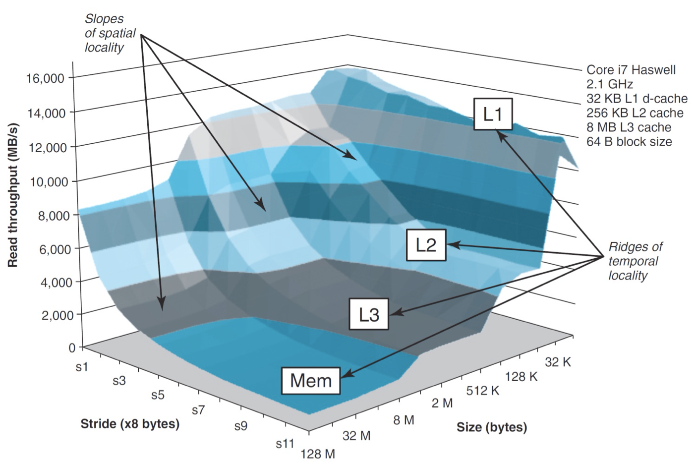

# 2.12 Cache

## Textbook

* 6.4
* 6.5
* 6.6

## Outline

* 缓存知识补完
* 怎么写出「缓存友好」的代码
* 快速矩阵乘法
* 存储器之山

## Cache

### Conflict Miss

上节已经讲过了 Direct-Mapped Caches 的问题：非常容易在缓存实质上有空的时候产生 Evict，最後造成大量的 Conflict Miss。

#### Dot Production

看一个很简单的例子：

```c
// vector dot production calculator
float dotprod(float x[M], float y[M])
{
    float sum = 0.0;
    int i;
    for (i = 0; i < M; ++i) {
        sum += x[i] * y[i];
    }
    return sum;
}
```

这里我们取 `M = 8`。假设 `float` 类型的字段位长是 32 位。

考虑一个包含两个缓存集（$S = 2$）、直接映射（$E = 1$）、每个缓存行有 16 个块（$B = 16$）的缓存级。

显然，整个缓存的容量一共是 $S \times E \times B = 32$ 字节，而上面所有的 `float` 数字一共是 $16$ 个，每个 `float` 占用 $4$ 字节。

看起来没什么问题，整个缓存行可以存下一半的数据。

#### Worst Case

假设 `x[0:7]` 和 `y[0:7]` 在内存中连续分布。那么，读取 `x[0]` 时会将 `x[0:3]` 放入一个缓存行中；读取 `y[0]` 时会将 `y[0:3]` 放入一个缓存行中。

假如 `x` 跟 `y` 被缓存的目标位置不重叠，那么非常好，只需要做 4 次缓存行的更新就可以完成了。

但是，考虑下面的缓存组织结构：


由于我们要对对应着相同 `i` 的 `x[i]` 和 `y[i]` 做乘积，因此每次都会试着将他们纳入缓存行中。

然而遗憾的是，按照这种缓存组织形式，`x[i]` 和 `y[i]` 必定会进入同一个缓存集，也就是每进行一次循环，都会带来两次缓存行的更新。

这个效率甚至还不如没有缓存呢。

#### Best Case

如果我们在 `x[8]` 和 `y[8]` 之间插入 4 字节的 Padding，那么缓存就会这么组织：


这时候就得到了最优解：仅需 4 次缓存行更新就可以完成计算。

### Address Translation

思考这样一个问题：我们在分配缓存行时，会将目标内存地址从左到右地分配成 Tag、Set Index、以及 Block Offset。

为什么 Set Index 在中间呢？如果严格按照从大到小的索引顺序，那应该是 Set Index（确定 Set）、Tag（确定 Line）、Block Offset（确定 Block）才对啊。

其实，重要的原因是根据空间局部性，一个程序访问的大部分内存地址都相近。也就是说，他们相当有可能具有相同的高地址位。如果用这个高地址位来索引 Set Index，那么几乎所有被利用的缓存行都会集中在少数 Set 中，而浪费掉大部分 Sets。

> Fully-Associative Caches 不适用于此。

Block Offset 为什么在最尾部不用说了。因为空间局部性，所以要将相对靠近（也就是低地址位相近）的内存数据一起拿到 Cache Line 中来。

因此，Set Index 只能在中间了。

### Evict

遇到了一次 Miss 的时候，就会让这次 Miss 的结果进入缓存。

在 Compulsory Miss 的情况下，这个无可置疑；但是除此之外的情况（也就是当前可以被放入的缓存块已经满了的情况下），应该如何选择一个位置放入新缓存行呢？

这就涉及到 Evicting（驱逐）策略的问题了。

#### LFU

所谓的驱逐「Less Frequently Used」。

把最不常用（使用频率最低）的那个元素驱逐出去。

#### LRU

所谓的驱逐「Less Recently Used」。

把上次使用时间最靠前的那个元素驱逐出去。

这两种策略需要额外的硬件来实现，同时消耗比较多的时间。

但是总的来说，记录「每个缓存上次使用的时间」和「记录每个缓存被使用的次数」，还是前者的开销稍微小一些。

> 对于 Direct-Mapped Caches 来说，不需要考虑 Evict Line 的选择问题。
>
> 代价就是会遇到更多多余的 Evicting，缓存性能下降。

#### General

如何衡量一个 Evict 算法的好坏？当然是通过 Hit 和 Miss Rate 了。

注意，考虑到实际情况中缓存容量有限，Hit Rate 存在上限。也就是，存在理论上最优的 Evict 算法。

假设我们可以在任意时刻了解从 A 到 Z 的访存顺序，那么就能给出这样的 Evict 算法：

* 始终 Evict 在未来使用频率最低的那一个 Cache Line。

即，在可以预先知道访存序列的情况下，我们可以得到这个最优解。

### General Time Costs


每级缓存的时间开销（以时钟周期为单位）。

## Writing

上面的讨论仅限于「读」。但是，有时候我们还会改写内存的值。那么缓存该如何因应这种情况？

### Write Hit

首先，在写一个内存地址时，肯定是经过缓存的，也就是说，我们可以按照上面相同的办法来验证缓存级中是否存有这个即将被写的地址。

那么检测出来 Hit 之后又能怎么样呢？两种策略。

### Write Through

一种是「写穿透」。

根据缓存第一定理（我说的），$L_i - 1$ 级缓存包含的某个元素，一定也在 $L_i$ 级存在。

因此，我们可以从上（指 CPU）到下（指主存）地检查缓存级；如果发现第 $L_i$ 级包含了该缓存，则一级一级地向下改写所有缓存项，直到最底层（内存）。

这种策略的好处是没有后顾之忧；可以始终保持缓存行的正确性。

坏处就是…写变得非常慢，而且有可能做无用功（比如刚刚辛辛苦苦更新的那个缓存行没过多久就被 Evict 了）。

### Write Back

另一种策略是「写回」，也就是「尽可能推迟更新缓存行」。假如推到最後缓存行 Evict 了，那更妙。

具体策略是，发现一个缓存行被更新了的时候，不去更新值，而是将这一行的「Dirty Bit」设定为 1，代表当前这个缓存行里存储的值已经是陈旧的了。

假如这个缓存行再被读到，发现其 Dirty Bit 为真，再去从更靠下级缓存中取值，并更新之。

假如这个缓存行在被驱逐之前再也没被读过，那么就在驱逐时刷新 Dirty Bit，没有任何不必要的缓存更新开销。

> 实际通常使用 Write Back 策略，即尽量避免不必要的开销，牺牲某一时刻的、不可见的正确性。

## Evaluating

上面提过一嘴，要衡量 Evict 算法好坏，用的是 Hit Rate（缓存命中率）和 Miss Rate（缓存不中率）。

很显然地，有
$$
P_{\mathrm{hit}} = 1 - P_{\mathrm{miss}}
$$
那么这两个衡量标准是不是一样好用呢？非也。

问题在于 Hit 和 Miss 的时间代价是不一样的。

对于某一级缓存 Hit 的访存，耗时大概是 2 个 Cycles。而如果 Miss 了（就算用的是 Write Back 策略），则大约需要 200 个 Cycles。

也就是说，一条访存指令耗时的数学期望是
$$
E_C = 2 \times P_{\mathrm{hit}} + 200 \times P_{\mathrm{miss}}
$$
用 $P_{\mathrm{hit}}$ 表示，结果是
$$
E_C = 2 \times P_{\mathrm{hit}} + 200 \times (1 - P_{\mathrm{hit}}) = 200 - 198 \times P_{\mathrm{hit}}
$$
而用 $P_{\mathrm{miss}}$ 表示，结果是
$$
E_C = 2 \times (1 - P_{\mathrm{miss}}) + 200 \times P_{\mathrm{miss}} = 2 + 198 \times P_{\mathrm{miss}}
$$
很显然，$E_C $ 和 $P_{\mathrm{miss}}$ 几乎成正比例函数关系，而和 $P_{\mathrm{hit}}$ 之间就差得很远。

用实例来说明，就是：

* Hit Rate 99%, aka. Miss Rate 1%
	* 2 × 0.99 + 200 × 0.01 = 4 cycles

* Hit rate 97%, aka. Miss Rate 3%
	* 2 × 0.97 + 200 × 0.03 = 8 cycles

Hit Rate 跟 Average Time 之间的反线性关系很差，要衡量精确的 Average Time 需要更多位有效数字。

反倒是 Miss Rate 能比较好地描述 Average Time，且因为数字一般不大，精度也能更高。

所以，一般衡量都采用 Miss Rate，而非 Hit Rate。

## Cache-Friendly Codes

### Principles

* 程序的局部性越好，其缓存命不中率越低
* 有同样指令流的程序的缓存命不中率越低，运行效率越高

普通的顺序执行代码对缓存的影响不大；比较容易产生差异、也比较好优化的的是「循环」。

简单说，「make the common case go fast」（把最简单、且重复的 Case 加速）效果是最好的。

### Tactics

#### Example 1

还是以 `sumvec` 为例。

``` c
#define N 8

// (pp. 634)
int sumvec(int v[N])
{
    int i, sum = 0;

    for (i = 0; i < N; i++)
        sum += v[i];
    return sum;
}
```

#### Register-holding Variables

我们要了解编译器的变量安排偏好。

首先，像是 `i`、`sum` 这些被频繁读取、使用值变量会被优先地放在寄存器中（同时我们也没有对其进行寻址）。

然后，像是 `v` 这种变量是不可以放入寄存器的，鉴于需要对其（及其偏移量）进行寻址操作。

我们始终假定编译器能够生成优秀的寄存器分配，使得我们无需关心那些平凡的 `overhead cost`。

在这一方面，我们要做的事情只有一样：

* 尽量减少局部变量使用的个数，使得编译器能够将尽可能多的变量塞入寄存器。

> 优化策略一。

#### Memory-accessing

对于不可避免的访存来说，也有讲究。

* 步幅为 1 的访存 Pattern 是最好的。

> 优化策略二。

> 由于装载 Cache Line 时始终会取连续的 Blocks，所以这样的 Pattern 最有利于发挥 Cache 的优势。

对于多维数组而言，「空间局部性」真的很重要，否则很容易造成接近 $100\%$ 的 Miss Rate（每次都 Miss，花时间更新 Cache 后又被 Evict 掉）。

#### Example 2

再看一个例子，涉及到「多维数组」的。

```c
#define M 4
#define N 8
// pp. 635
int sumarrayrows(int a[M][N])
{
    int i, j, sum = 0;

    for (i = 0; i < M; i++)
        for (j = 0; j < N; j++)
            sum += a[i][j];
    return sum;
}
```

对于一个包含两个缓存集（$S = 2$）、直接映射（$E = 1$）、每个缓存行有 16 个块（$B = 16$）的缓存级来说，其 Hit、Miss 情况是这样的：


也就是说，Miss Rate 仅仅是 $25\%$。

但是，仅仅改变一下行和列的求和顺序…

```c
#define M 4
#define N 8
// pp. 636
int sumarraycols(int a[M][N])
{
    int i, j, sum = 0;

    for (j = 0; j < N; j++)
        for (i = 0; i < M; i++)
            sum += a[i][j];
    return sum;
}
```


…就会导致 $100\%$ 的 Cache Miss。

### Matrix Multiplication

#### Basic Idea

考虑一个简单的「方阵相乘」算法。


可以观察出，对于两个 $n \times n$ 的矩阵做乘法，会得到一个新的 $n \times n$ 矩阵。

而如果像上面一样对 $n \times n$ 结果矩阵中的每个元素都独立运算，那么计算每一个元素的代价都是 $n$ 次乘法和 $n - 1$ 次加法，即 $O(n)$ 时间复杂度。

因此，总的时间复杂度应该是 $O(n^3)$ 的。

> 这里我们暂且不考虑「算法课」中提到的快速矩阵乘算法。那个复杂度介于 $O(n^3)$ 和 $\Omega(n^2)$ 之间。

#### Assumptions

我们考虑 $n = 8$ 的两个 $n \times n$ 矩阵乘。矩阵中的每个元素都是 `double` 类型，占用 $8$ 个字节。

目标缓存行只有一个缓存集合，每个缓存行可以保存 $32$ 个字节。

显然，这个缓存最多只能放 $4$ 个 `double` 值。

另外，我们假定编译器已经把除了矩阵变量外的所有变量都放进了寄存器里。

#### `ijk` Implementation

最简单的、最直观的方式就是 `i`、`j`、`k` 遍历法：

```c
#define N 8
// ijk, matrix multiplication
void mat_mul(float a[N][N], float b[N][N], float c[N][N])
{
    float sum;
    for (i = 0; i < N; i++)
    {
        for (j = 0; j < N; j++)
        {
            sum = 0.0;
            for (k = 0; k < N; k++)
                sum += a[i][k] * b[k][j];
            c[i][j] = sum;
        }
    }
}
```


容易看出，对于一个最内层的循环而言，`A` 数组被按行访问（很好！符合内存排列规律），`B` 数组被按列访问（不好！没有办法缓存），`C` 数组只访问一个固定内存位置（也好！符合时间局部性）。

据此，我们可以简单地计算出每个内层循环中的 Miss Rate：

* `A` 数组的 Miss 率是 $25\%$。
	* 按行的访存可以充分利用属于他的缓存行。
* `B` 数组的 Miss 率是 $100\%$。
	* 按列访存完全无法利用缓存行。
* `C` 数组的 Miss 率是 $0%$。
	* 根本不去读 `C` 数组的内容。

#### `jik` Implementation

```c
#define N 8
// jik, matrix multiplication
void mat_mul(float a[N][N], float b[N][N], float c[N][N])
{
    float sum;
    for (j = 0; i < N; i++)
    {
        for (i = 0; j < N; j++)
        {
            sum = 0.0;
            for (k = 0; k < N; k++)
                sum += a[i][k] * b[k][j];
            c[i][j] = sum;
        }
    }
}
```

其实没做什么改动，只不过把遍历的次序改成了 `j`、`i`、`k`。

没有本质变化；最内层循环的寻址规律仍然如同 `ijk`。

#### `kij` Implementation

```c
#define N 8
// kij, matrix multiplication
void mat_mul(float a[N][N], float b[N][N], float c[N][N])
{
    float sum, r;
    for (k = 0; k < N; k++)
    {
        for (i = 0; i < N; i++)
        {
            r = a[i][k];
            for (j = 0; j < N; j++)
                c[i][j] += r * b[k][j];
        }
    }
}
```

会有什么不一样吗？还真会！


这里，我们在外、中层循环处把 `A[i][k]` 的值缓存到了 `r` 中（大概率在寄存器中）。

然后，`B` 和 `C` 的访问都是按行型的了。太美好了！

#### `ikj` Implementation

当然，这跟 `kij` 差不多。

```c
#define N 8
// ikj, matrix multiplication
void mat_mul(float a[N][N], float b[N][N], float c[N][N])
{
    float sum, r;
    for (i = 0; i < N; i++)
    {
        for (k = 0; k < N; k++)
        {
            r = a[i][k];
            for (j = 0; j < N; j++)
                c[i][j] += r * b[k][j];
        }
    }
}
```


#### `jki` Implementation

大概是最差的一种方式…

```c
#define N 8
// jki, matrix multiplication
void mat_mul(float a[N][N], float b[N][N], float c[N][N])
{
    float sum, r;
    for (j = 0; j < N; j++)
    {
        for (k = 0; k < N; k++)
        {
            r = b[k][j];
            for (i = 0; i < N; i++)
                c[i][j] += a[i][k] * r;
        }
    }
}
```


别这么写。

#### `kji` Implementation

```c
#define N 8
// kji, matrix multiplication
void mat_mul(float a[N][N], float b[N][N], float c[N][N])
{
    float sum, r;
    for (k = 0; k < N; k++)
    {
        for (j = 0; j < N; j++)
        {
            r = b[k][j];
            for (i = 0; i < N; i++)
                c[i][j] += a[i][k] * r;
        }
    }
}
```

同 `jki` 类似。两个按列索引。别这么写。

#### Benchmarking


显然，对于我们「先行後列」式存储的矩阵来说， `kij` 和 `ikj` 实现是最好的。`ijk` 和 `jik` 次之；而 `jki` 和 `kji` 最差。

> 假如矩阵改成「先列後行」式存储，那么 `kij`、`ikj` 的地位会和 `jki`、`kji` 对换。

## Memory Mountain

存储器之山。

### Differences

留意到一个事实：在「缓存在最快缓存级中」和「完全没有被缓存」的情况下，访问一个内存地址的耗时差异大概有 40 倍之多。

但是，实际的计算机不仅有一个缓存级，「最快缓存级」和「没有缓存」之间还有 3 个级别。

众所周知，不同的数据集大小、不同的步长（Stride）决定了一段数据能被有效地储存在哪一个缓存级中。



显然，步长越长、数据越大，则越难以被放入较靠近 CPU 的的缓存中，其吞吐量就越低。

如果把 $V_\mathrm{throughput} · B_\mathrm{stride} · B_\mathrm{size}$ 之间的关系画成三维图的形式，大概就是这样一座小山坡。

山坡上对应每一个层级的「缓坡」，对应的都是一个缓存级。

### Details

#### Stride-Sliced Diagram

对某个长度的 Stride 做剖面，就可以得到 $V_\mathrm{throughput}·B_\mathrm{size}$ 之间的二维关系，画成这样：


作为参考，给出这颗 CPU 的各级缓存容量：

* 32 KiB L1 d-cache
* 256 KiB L2 cache
* 8 MiB L3 cache

可以看到，L1 和 L2 级缓存都分别对 32K 工作集和 256 K 工作集起到了加速作用。

但是，在工作集接近 8M 大小时，似乎 L3 缓存不再可用，反而接近于没有 L3 的吞吐量水平。同样的，在工作集接近 256K 大小时，也出现了显著的吞吐量减少。

究其原因，是因为部分指令占用了一些该级别缓存，导致并非该缓存集中的全部空间都能用于存放工作集。

而 L1 缓存却没有这种现象，是因为这一级的数据缓存和指令缓存是分离的（分别位于 d-cache 和 i-cache 中）。

#### Size-Sliced Diagram


按照一个较为适中的 Working Set Size 做划分，结果就很明显了，也没有什么特殊情况。

最後区域一个定值，此时每一个 Stride 都跨越了一个缓存行，缓存失去意义，吞吐量跌到谷底。

