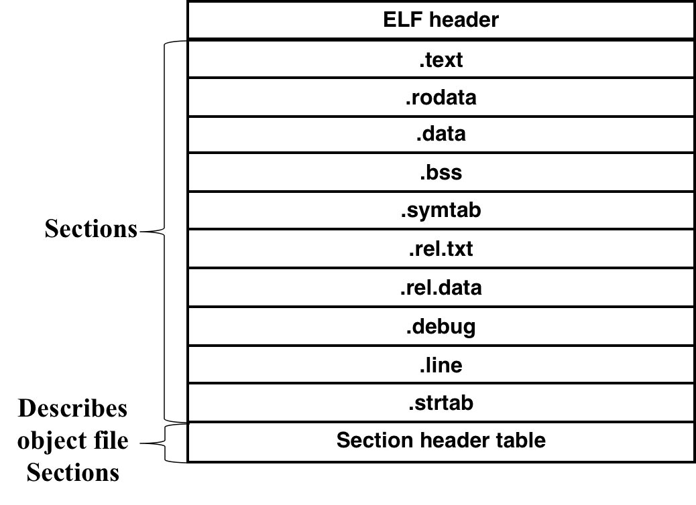
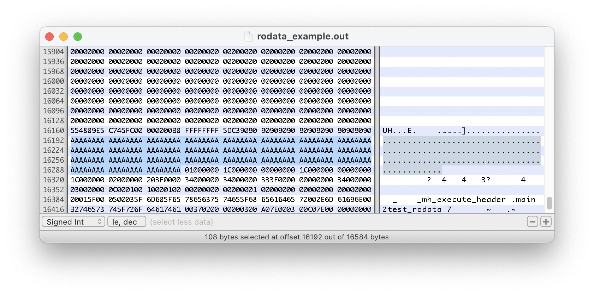

# 2.13 Linking

## Textbook

* 7.1
* 7.2
* 7.3
* 7.4

## Outline

* 链接、及其作用
* 编译器的工作
* 静态链接的输入和输出

## Linking

### Intro

#### Monolithic Compile

想象一下到目前为止我们能理解的「编译」过程，这要求我们提供一个包含 `main` 函数的合法源文件（姑且称之为 `main.c`）。

其中可能包含有其他引入的 `.h` 头文件（`#include` 进来的），但在预处理阶段就被替换成了对应的文件内容。

因此，在这种观点下，是一个庞大的（Monolithic）源文件被交给编译器进行编译，生成可执行文件。


这种编译方式的缺点显而易见：由于不存在模块化，即便是进行了很小范围的更动都需要大规模的重编译。

同样是因为没有模块化，因此公共函数无法共享，或许每个可执行文件都要自带公共库（如 `printf` 的实现等），非常浪费。

#### Module-based Compile

理想中（实际上现实中也是这样啦），我们应该可以在不同的 `.c` 文件中写函数，然后把它们编译到同一个可执行文件中，且他们之间可以互相调用。

举个例子，我们可以这么写代码：

```c
/* main.c */
void swap();

int buf[2] = {1, 2};

int main()
{
    swap();
    return 0;
}
```

```c
/* swap.c */
extern int buf[];

int *bufp0 = &buf[0];
int *bufp1;

void swap()
{
    int temp;
    bufp1 = &buf[1];
    temp = *bufp0;
    *bufp0 = *bufp1;
    *bufp1 = temp;
}
```

然后将他们一同编译，得到一个可执行的程序。

说起来很容易，但是，这套流程具体该怎么实现？

### Separate Compilation

> 所谓的「分离式编译」。

#### Process

目前的编译步骤是，首先将每个源文件分离编译成「可重定位对象文件」（Relocatable Object Files），然后由专门的链接器将她们合成一个可执行文件。

这样区分的好处是，每个模块在单独编译成 ROF（`.o` 文件）之后，可以直接和其他 ROF 自由组合，不必再经过编译步骤。


#### Linker

那么，Linker 是啥？

将传入的 ROF 中所有的代码片段和数据片段打包成一个二进制文件，同时确认模块之间的相互调用，并修正这些调用的内存地址。

Linking 这个过程可以在编译时进行（直接生成可执行文件），也可以在加载时进行（在一个程序启动前加载库文件），也可以在程序执行时动态进行（动态装载库的能力）。

这一节我们先讨论「编译时进行」的、静态的链接过程。

#### Compiler's Drivers

首先，我们还是回到 `gcc` 工具链上来：

* `cpp`（Preprocessor）
	* C 预处理器
	* 对源文件进行预处理、清除注释、展开宏等操作
* `cc1`（Compiler）
	* C 编译器
	* 词法分析
	* 语法分析
	* 生成 AST
	* 分配寄存器
	* 流出汇编指令
* `as`（Assembler）
	* C 汇编器
	* 根据汇编指令生成二进制 ROF 文件
* `ld`（Linker）
	* 链接器
	* 将多个 ROF 文件合并生成单个可执行文件

如果我们手动代替 `gcc` 的职责、分别调用这些功能的话，大概应该这么写：

```shell
unix$ gcc -Og -o prog main.c swap.c 
unix$ cpp [other args] main.c /tmp/main.i  
unix$ cc1 /tmp/main.i main.c -Og [other args] -o /tmp/main.s 
unix$ as [other args] -o /tmp/main.o /tmp/main.s 
	# <similar process for swap.c>
unix$ ld -o prog [system obj files] /tmp/main.o /tmp/swap.o 
unix$
```

### Relocatable Object File

#### Example

依然以 `main.c`、`swap.c` 为例，这两个源文件会被编译成什么样子？

首先分析一下其中的函数、变量以及调用关系。

* 函数

	* 两个，`main()` 和 `swap()`。
	* 其中 `main()` 函数调用 `swap()`。

* 全局变量

	* `buf`、`bufp0`、`bufp1` 都是全局变量。

	* `buf`、`bufp0` 被赋予了初始值，而 `bufp1` 没有（他会被隐含地初始化为 0）。

	* > 是否有被赋非 0 初始值很重要，请留意。

#### Compile It!

为了方便观察，我们借助 `-S` 指令生成汇编代码来观察。

##### `swap.c`

观察 `swap.c` 中的三个全局变量被对待的方式，可以看到：

```assembly
	.section	__DATA,__data
	.globl	_bufp0                  ## @bufp0
	.p2align	3
_bufp0:
	.quad	_buf
	.comm	_bufp1,8,3              ## @bufp1
.subsections_via_symbols
```

三位都被声明在 `.section __DATA,__data` 区段。

`_bufp0`（对应源代码中的 `bufp0`）被用 `.globl` 修饰。

而在下方则是用 `_bufp0:` 定义，且赋予初值 `_buf` 的 `_bufp0` Label，以及 `.comm` 修饰的 `_bufp1`。

> 注意区别：`_bufp0: ...` 是定义全局变量，`.comm _bufp1,x,x` 也是定义全局变量，但是 `.quad _buf` 是引用 `_buf` 变量，将该内存位置对应的 64 位值搬移到指定的内存位置来。

##### Usage

在 `swap.c` 生成的汇编之中，`bufp1` 和 `bufp0` 的地址直接利用 `%rip` 做相对索引得到。至于 `buf` 则是直呼其名。

```assembly
swap:
	pushq	%rbp
	movq	%rsp, %rbp
	movq	$buf+4, bufp1(%rip)
	movq	bufp0(%rip), %rax
	movl	(%rax), %eax
	movl	%eax, -4(%rbp)
	movq	bufp0(%rip), %rax
	movq	bufp1(%rip), %rdx
	movl	(%rdx), %edx
	movl	%edx, (%rax)
	movq	bufp1(%rip), %rax
	movl	-4(%rbp), %edx
	movl	%edx, (%rax)
	nop
	popq	%rbp
	ret
```

也就是说，在 `swap.c` 文件中声明的所有变量在该文件中被使用时，都是完全「位置无关」的。由于采用了 `%rip`相对寻址，因此无论整个 ROF 被加载到何处，只要段落之间的相对位置不变，代码都可以正常运行。

##### Usage from Another Place

`swap.c` 自己引用自己这里初始化的全局变量，上面已经提到了。

那么，`main.c` 函数中如果使用了 `swap.c` 中的一个函数，那该如何编译呢？

回答是：留空。因为编译和链接是可以分开做的，因此实际上编译 `main.c` 时，完全有可能无法得知 `swap.c` 的任何内容，更别说这个函数的实现位于哪里了。

因此，如果我们直接读取 `main.o` 的指令段，会发现其中调用外部函数的部分，是用 `0` 填充的。


但是，这部分的数据绝对没有丢失，只不过不在「指令」这一段里而已。

#### Declaration & Definition

##### D'n D

首先，假如一个函数在一个文件中完全没有出现过，没有任何信息提供，那么这连编译都过不去。尽管我们后续会进行分离式编译以补充这个函数的定义，也不行。

因此，我们在 `main.c` 函数中，需要首先进行一次「声明」；也就是，告知编译器这个函数的签名（包括其名称、参数类型、返回值等信息），以进行语法分析。

也就是，`main.c` 的首行中提到的：

```c
void swap();
```

实际上，我们观察一下汇编，会发现这个 `_swap` 的声明根本没有转化为实际的汇编语句。

> 这也就是「函数可以声明多次、却只能实现一次」的道理。

##### Header Files

因此，如果你是一个 C 库作者，仅仅发布你的库分离编译后的 ROF 是不行的；因为如果没有「函数声明」，别人没法用。

因此，库作者一般会把自己实现的全部函数都在一个特殊的文件中声明一遍，要用这个库的人只需要 `#include` 之，就相当于进行了这一系列声明了。

> 这就是头文件啦。

#### Link it!

好了，目前我们有了一堆分离编译过的 `.o` 文件。当然残缺不全，如果不经处理不可能直接搬到内存中运行。

我们要做的唯一一件事情就是：修正所有「外部变量及函数」的引用，并将所有 `.o` 合并成一个可执行文件。

##### Targets

例如，在链接后得到的可执行文件中，`main` 函数相关代码应该是这样：

```assembly
4004d6 <main>:
  4004d6:	55						push   %rbp
  4004d7:	48 89 e5				mov    %rsp,%rbp
  4004da:	b8 00 00 00 00			mov    $0x0,%eax
  4004df:	e8 07 00 00 00			callq  4004eb <swap>
  4004e4:	b8 00 00 00 00			mov    $0x0,%eax
  4004e9:	5d						pop    %rbp
  4004ea:	c3						retq 
```

此处的 `callq` 已经正确地指向了 `4004eb`（用相对 `%rip` 的 `callq`）。由于他们都位于指令区段，因此这个偏移量不大。

而那些全局变量的引用呢？

```assembly
00000000004004eb <swap>:
  4004eb:	55								push   %rbp
  4004ec:	48 89 e5						mov    %rsp,%rbp
  4004ef:	48 c7 05 4e 0b 20 00			movq   $0x601034,0x200b4e(%rip)
  4004f6:	34 10 60 00						bufp1= &buf[1]
  4004fa:	48 8b 05 37 0b 20 00 mov		0x200b37(%rip),%rax			get bufp0
  400501:	8b 00							mov    (%rax),%eax
  400503:	89 45 fc						mov    %eax,-0x4(%rbp)
  400506:	48 8b 05 2b 0b 20 00 mov		0x200b2b(%rip),%rax			get bufp0
  40050d:	48 8b 15 34 0b 20 00 mov		0x200b34(%rip),%rdx			get bufp1
  400514:	8b 12							mov    (%rdx),%edx
  400516:	89 10							mov    %edx,(%rax)			*bufp0 = *bufp1
  400518:	48 8b 05 29 0b 20 00 mov		0x200b29(%rip),%rax			get bufp0
  40051f:	8b 55 fc						mov    -0x4(%rbp),%edx
  400522:	89 10							mov    %edx,(%rax)
```

同样依据 `(%rip)` 进行相对寻址。因为指令区段（只读的）和数据区段（可读可写的）相距比较远，因此这里的偏移量相比上面的都大了不少。

##### With the Help of Compilers

为了让链接器能够完成这样的工作，编译器已经将每个文件所定义、声明的全局变量、函数都放到了 ROF 的特殊区段之中。但是，他们的位置需要重新被填充。

例如，`main.o` 中，`main` 函数位于 `.txt` 区段的 `0` 位置，但是在结果二进制文件中位于 `0x4004d6`。同时，其中 `buf` 变量位于 `.data` 区段的 `0` 位置，但是最终被定位到了 `0x601030`。

链接器已经记录了那些目前暂时采用相对寻址，而以全 `0` 填充的代码位置。在信息充足之后，会将他们填充上正确的值。

```assembly
    e8 00 00 00 00
	# ->
	e8 07 00 00 00			# call 4004eb <swap>
							# (%rip: 0x4004e4)
    48 8b 05 00 00 00 00
	# ->
	48 8b 05 37 0b 20 00	# mov 0x200b37(%rip), %rax  
							# (%rip: 0x400501)
00<bufp0>:
    00:		00 00 00 00 00 00 00 00
	# ->
601038<bufp0>:
    601038: 	30 10 60 00 00 00 00 00
```

例如，`call` 指令的调用地址（因为采用相对寻址，所以这个值还跟这条代码所在的内存地址有关）就被更新了；按照小端法读出的内存偏移量是 `+0x7`。`mov` 的待遇类似。而 `bufp0` 这个函数呢，在 `.data` 区段中是刚好位于 `0x0` 的位置，但是被链接到可执行文件中之后，就变成了 `0x601038`。

## Structure

### Object Files

简而言之，Object Files 可以分为下面几类：

* Relocatable（可重定位的）Object File
	* 其中内存寻址都避免了绝对寻址，而是采用 `(%rip)` 相对寻址的可执行文件。
	* 这种 Object File 可以简单地被链接器同其他文件链接。
	* 其中不仅包含指令，还包含许多数据区段。
		* 代码指令独占一段。
		* 初始化了的全局变量占一段。
		* 未初始化的全局变量占一段。
* Executable（可执行的）Object File
	* 已经打包完成可以被直接执行了的 Object File。
* Shared（共享的）Object File
	* 一类特殊的可重定位文件。
	* 不一定要由链接器负责处理，可以在任何时候（包括可执行文件装载时和程序运行时）动态链接。

### ELF

是 Executable & Linkable Format（ELF）的简称。

按字面意思理解，就是既（可能）可以被拿来运行、又可以拿来链接（包括静态和动态链接）的一种统一格式。

那么，来看看它的具体结构吧！

#### Sections



#### ELF Header

文件的一开头包含了这些重要信息：

* Magic Number（魔数）
	* 一组特殊的数字，用来确认这是个 ELF 文件
	* 被定义为 `\0x7f`、`E`、`L`、`F`
	* `e_ident` 的前四个字节必须填充这些值，否则将不被认为是 ELF 格式文件
* Type（类型）
	* 在 `.o`（是可重定位文件）、`exec`（是可执行文件）、`.so`（是共享库）之间选择一种
* Machine（及其平台）
	* 确认这个 ELF 所对应的机器平台、内核类型、等等
* Byte Ordering（字节序）
	* 决定大端或小端
* Section Header Table（段头表）的起始地址
	* 段头表，其实就是个地址数组，其中的每个地址都指向了一个 Section 条目的头
	* 像是题图中的 `.text`、`.rodata` 之类的，每个都是一个 Section
	* 因为 Section 长度不定，所以才需要准备一张段头表，以备查阅
	* 而这张段头表在哪里呢？实际上是被放在了所有 Section 都结束之後的最後
	* 因为他的位置也不确定，所以才需要在 Header 中保存这张段头表的起始地址
* （以及其它一些不想说的东西）

```c
typedef uint64_t Elf64_Addr;
typedef uint16_t Elf64_Half;
typedef uint64_t Elf64_Off;
typedef int32_t	Elf64_Sword;
typedef int64_t	Elf64_Sxword;
typedef uint32_t Elf64_Word;
typedef uint64_t Elf64_Lword;
typedef uint64_t Elf64_Xword;

typedef struct {
	unsigned char	e_ident[16];	/* ELF identification */
	Elf64_Half		e_type;			/* Object file type */
	Elf64_Half		e_machine;		/* Machine type */
	Elf64_Word		e_version;		/* Object file version */
	Elf64_Addr		e_entry;		/* Entry point address */
	Elf64_Off		e_phoff;		/* Program header offset */
	Elf64_Off		e_shoff;		/* Section header offset */
	Elf64_Word		e_flags;		/* Processor-specific flags */
	Elf64_Half		e_ehsize;		/* ELF header size */
	Elf64_Half		e_phentsize;	/* Size of program header entry */
	Elf64_Half		e_phnum;		/* Number of program header entries */
	Elf64_Half		e_shentsize;	/* Size of section header entry */
	Elf64_Half		e_shnum;		/* Number of section header entries */
	Elf64_Half		e_shstrndx;		/* Section name string table index */
} Elf64_Ehdr;
```

表现在代码中，就是这个样子的一个 `struct`。

#### Section Header

> 注意，上面讨论的 Header 是 ELF 文件的总领 Header。这里要讨论的是保存在段头表里的 Section Header。不要混淆。

段头表条目就简单多了。

```c
typedef struct {
	Elf64_Word		sh_name;		/* Section name (index into the
					   				   section header string table). */
	Elf64_Word		sh_type;		/* Section type. */
	Elf64_Xword		sh_flags;		/* Section flags. */
	Elf64_Addr		sh_addr;		/* Address in memory image. */
	Elf64_Off		sh_offset;		/* Offset in file. */
	Elf64_Xword		sh_size;		/* Size in bytes. */
	Elf64_Word		sh_link;		/* Index of a related section. */
	Elf64_Word		sh_info;		/* Depends on section type. */
	Elf64_Xword		sh_addralign;	/* Alignment in bytes. */
	Elf64_Xword		sh_entsize;		/* Size of each entry in section. */
} Elf64_Shdr;
```

其中，我们需要重点关注的有下面几项：

* `sh_name`

	* 顾名思义，保存的是这个 Section 的名字
	* 但是，这里放的不是字符串指针，而是特殊区段 `strtab`（专门保存字符串的一个区段）中的索引。用这个索引可以找出要求字符串的地址

* `sh_type`

	* 在下面几种中择一：
		* `SHT_PROGBITS`
		* `SHT_SYMTAB`
		* `SHT_STRTAB`
		* `SHT_REL`
		* `SHT_NOBITS`

	> 可以留意到这里有个问题：每一个 Section 的名字需要依赖 `strtab` 区段才能确定，但是如果不知道每个 Section 的名字，该如何找到 `strtab` 区段呢？
	>
	> 答案是依靠 `sh_type`。`strtab` 区段拥有特别的类型标识 `SHT_STRTAB`。

* `sh_addr`
	* 对于那些需要被拷贝到内存中执行的区段（主要是指令代码）来说，设置 `sh_addr` 来制定将其拷贝到何处开始的内存空间中
* `sh_offset`
	* 从 ELF 文件头开始，数到当前区段的头为止，经过的字节数
* `sh_size`
	* 这个区段的大小（字节数）
* `sh_addralign`
	* 指明内存布局策略
* `sh_entsize`
	* 某些类型的 Section 是一张表，这一项用于指明表中每个条目的大小（字节数）

#### Sections

下面介绍一些特别的 Section。

##### `.strtab`

通常位于 ELF 的尾部。其实就是一堆字符串叠在一起。用 `\0` 来标识一个字符串的结束。

不仅仅包含程序中用到的静态字符串，Section 的名字和 Symbol 的名字也存在这里。

特别地规定，这一区段的内存以 `\0` 开始，以 `\0` 结束。

没有复杂的索引机制。要想找到第 5 个字符串，只有从头开始遍历，等待遇到第 5 个 `\0`。

> 简单点也好。

##### `.debug`

一般来说不会生成这个区段，除非用 `gcc -g`。

包含丰富内容，如侦错用符号表、临时变量、类型别名（`typedef`）、全局变量、以及完整的一份源代码。

> 机器用不着这些东西。一般是写 Debugger 的人读取这些信息。

##### `.line`

包含弱一些的侦错辅助信息。记录汇编代码和「源代码的行号」之间的映射关系。

这样，当你的程序 SegFault 的时候，你就能确认到底是哪行代码的锅了。

##### `.text`

这段没什么说的，单纯就是一堆程序代码。

##### `.rodata`

一些只读的数据（且不是字符串）。例如，如下所示的常数数组。

```c
const int test_rodata[] = { 0xaaaaaaaa, /* ... */ 0xaaaaaaaa };
```




##### `.data`

保存着（非平凡）初始化过的全局变量和 C 风格静态（`static`）变量。

##### `.bss`

> 有可能是 `Block Started by Symbol` 或 `Better Save Space` 的缩写。

包含未初始化的，或者被初始化为 `0` 的全局、静态变量。

特别留意，这一段虽然在 Section Header Table（段头表）中被定义了，但是实际上却没有被分配任何段空间。

原因是，即使将这些变量保存下来，也没有任何好处（毕竟，如果没有必要对他们进行初始化，那么这个变量的初始值就不重要了）。所以干脆将这些变量从 ELF 文件中扫除出去，等到真正被装入内存执行时，再去给 `.bss` 分配空间，给这些变量腾地方。这样，就自然而然地将它们初始化为 `0` 了不是吗。

> 但是，显然地，这种策略没有办法保存各个变量的名字及其他信息。
>
> 这件事情交给 `.symtab` 区段来做。

那是下节课的事情了。