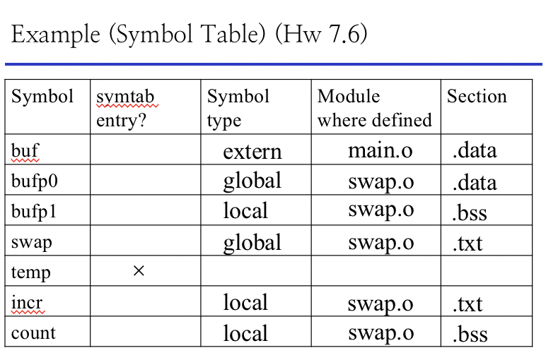

# 2.14 Symbol

> 本篇系 2.13 没讲完的 Linking 的延续。

## Textbook

* 7.3
* 7.4
* 7.5

## Outline

* Object 文件
* ELF 标准格式
* 符号表
* 重定位的过程

## Symbol

### Intro

众所周知（才怪），所有涉及到外部变量的指令，在 Relocatable 文件中均表现为全 0 填充。换句话说，在指令部分中已经不包含任何符号信息了。

因此为了後续的重定向，需要在其他地方保存这些信息。

### Symbol Table

在 ELF 文件的 `.symtab` 区段之中，保存着所有关于「全局符号」的信息。

有三种符号会被保存：

* 定义在此文件中的全局符号
* 此文件中引用的外部全局符号
* 局部符号

一个一个说。

#### Defined Global Symbols

在此文件中被定义的全局符号。

所有在顶层块（不被包含在任何花括号中的块）中被定义的、未被 `static` 关键字修饰的符号，都会被归为此类。

这样的符号可以在被链接之後，为外部代码所引用。

#### Referenced Global Symbols

有来有回，自然有些模块也会引用外部 Defined 的 Global Symbols。而这些符号并没有被「实现（Implement）」，只是被「声明（Declared）」了。

> 这里，对于一个函数来说，Implementation 指的是形如
>
> ```c
> int foo(int a) {
>     return a + 1;
> }
> ```
>
> 这样地一并提供其名称、签名、返回值、以及具体实现。
>
> 而 Declaration 指的是形如

> ```c
> int foo(int /* a  形参名称可以省略*/);
> ```

> 仅仅包含其名称、签名、返回值的函数骨架。
>
> 类推到对一个变量来说，Declaration 就是仅仅声明其类型，而不为其赋予值。但 Implementation 就是在声明其类型的同时，赋予其一个初始值。
>
> ```c
> int a;			// declaration
> int b = 42;		// implementation
> ```

从 ELF 的角度来看，对于一个符号的 Implementation 会将其放入 Defined Global Symbols 中；而对于一个符号的 Declaration（或者，在使用这个符号时隐含地 Declaration）会将其放入 Referenced Global Symbols 中。

但是，在把一串包含各种符号的文件组合在一起的时候，同一名称的变量只能被 Implement 一次（但可以被任意多次 Declaration，无论是显式还是隐式地）。

例如，完全可以在一个文件中提供一份关于 `int foo(int)` 的实现，然后在若干个文件中包含上 `int foo(int)` 的声明（这就是分发库 + 头文件的工作原理）。他们是可以被分离编译的。

C 没有名字空间（`namespace`）的概念，因此问题就这么简单。

#### Local Symbols

当前语句块中定义的 `static`（静态）符号。这些符号可以上下文无关地被该语句块中的任意代码访问，类似于「小圈子里的全局变量」。这些就会被放到这一区段内。

> 注意，不重叠的语句块中，允许定义重名的静态符号。
>
> 参见 Example 中的 `x`。

至于那些更「局部」一些的符号，例如某函数实现中的定义的一些变量，则根本不会进入符号表。

> 有时候进行外部符号声明时，会在其前方加入 `extern` 前缀，同样表示这是一个声明。
>
> 在 C++ 中，这个关键字还有另外的用途：`extern "C"` 放在声明前，代表按照 C 风格的声明来翻译函数名称，而非 C++式的、为了重载搞得特别丑的那一种。

#### Example

```c
extern int a;
int f()
{
    static int x = 1; //x.1
    int b = 2;
    return x + b;
}

int g()
{
    static int x = 1; //x.2
    return x + a;
}
```

这些符号会被放在什么位置呢？

* `a`：外部符号的声明。
	* 应该放在 Referenced Global Symbols 区。
* `f`、`g`：全局符号的实现。
	* 应该放在 Defined Global Symbols 区。
* `x`：局部静态变量。
	* 应该放在 Local Symbols 区。
	* 注意由于重名的问题，在 ELF 文件中符号会被自动重命名。
* `b`：临时变量。
	* 根本不会进入符号表。

为什么我们要单独地把 `static` 修饰的局部符号专门提出来，而普通的临时符号不必呢？主要是因为普通的临时符号不必要单独开辟内存空间，直接放在上下文相关的「栈」上就可以了；然而 `static` 修饰的变量要求是上下文无关的，因此无法被分配在栈上。

上节课提到过，有初始值的静态变量放在 `.data` 区，没有初始值的或者初始化为 0 的放在 `.bss` 区。在拷贝到内存中之後，会给其中每个符号分配空间。

### Symbol Generations

`.symtab`，顾名思义，就是一张表，里面放着一堆符号条目。

符号从 C 源文件中的定义，直到 

例如，对于下面的这段代码：

```c
extern int buf[];
int *bufp0 = &buf[0];
static int *bufp1;

static void incr()
{
    static int count = 0;
    count++;
}
```

> 在编译时手动加了几个引用，否则整个 `incr` 跟 `bufp1` 就都被优化掉了（

用 `-S` 编译之後，包含的一些符号有：

```assembly
	.section	__DATA,__data
	.globl	_bufp0                  ## @bufp0
	.zerofill __DATA,__bss,_bufp1,8,3       ## @bufp1
	.zerofill __DATA,__bss,_incr.count,4,2  ## @incr.count
```

可以看到，`count` 跟 `bufp1` 都被声明为 `.bss` 区中。而 `bufp0` 就好好地定义在 `.data` 区。

简单说，有资格进入符号表的符号包括：

* statical local
* global
* extern

他们分别位于：

* `.text`
* `.data`
* `.bss`




请一定理解一下。

#### Table Entry

```c
typedef struct {
 	int		name;		/* string table offset */
	char 	type: 4;	/* function or data (4 bits) */
			binding: 4;	/* local or global  (4 bits) */
 	char	reserved;	/* unused */
	short	section;	/* section header index */
	long	value;		/* section offset, or abs address */
	long	size;		/* Object size in bytes */
} Elf64_Symbol;
```

> 留意这里的特殊语法：用 `:i` 来按比特拆分基本数据结构来存储。

简单说，每一个条目包含符号名（以 `.strtab` 索引的方式体现）、类型（是函数（`.FUNC`）还是数据（`.OBJECT`）？当然未定义的也有 `.NOTYPE`）、`binding`（是局部还是全局？）、所在区段 `section`、以及这个符号在对应区段内位置的偏移量、以及所占用的内存字节数。

尤其注意，`section` 值的选择有讲究。

* `.txt`
	* 如果是代码，那么一定会落在这一区
* `.data`
	* 有初始化的全局符号或 `static` 符号
* `.bss`
	* 没有初始化或初始化为 0 的 `static` 符号
	* 初始化为 0 的全局符号
* `ABS`
	* 如果这个符号不应该被重定位，那么就设定这个值
* `UNDEF`
	* 在外部被实现的符号
* `COMMON`
	* 没有初始化的全局符号

> 要注意 `COMMON` 和 `.bss` 的细微区别。
>
> 区别在于，`.bss` 区段的符号是真的会在程序执行时，开辟内存空间的；而 `.COMMON` 呢，没有初始化的全局符号只不过是声明而已。没有必要给他开辟空间。

