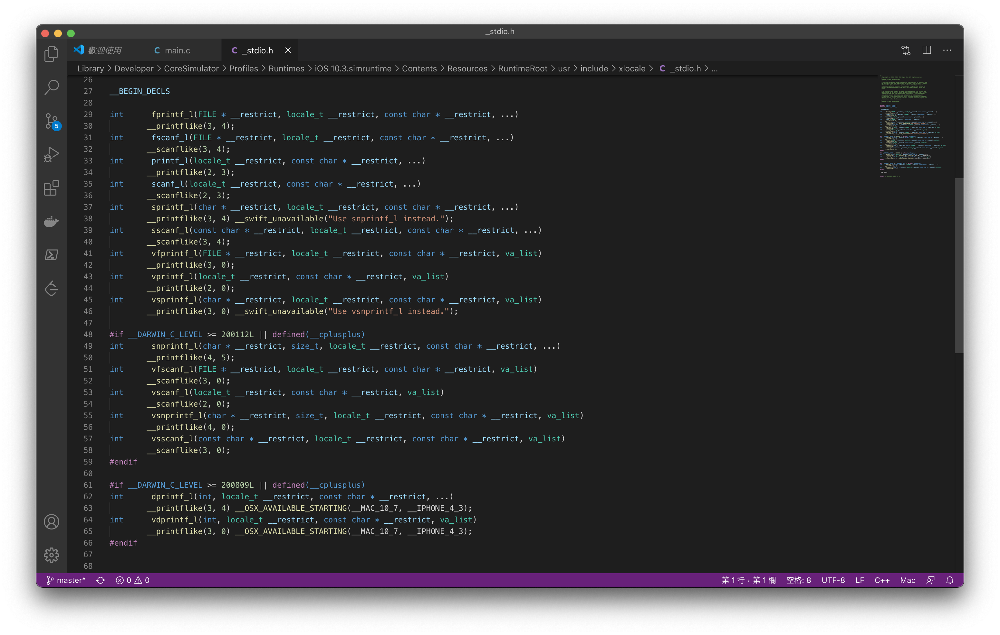
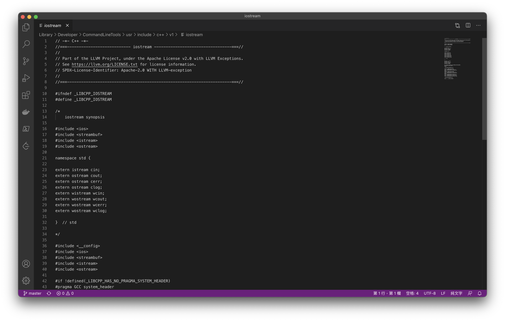
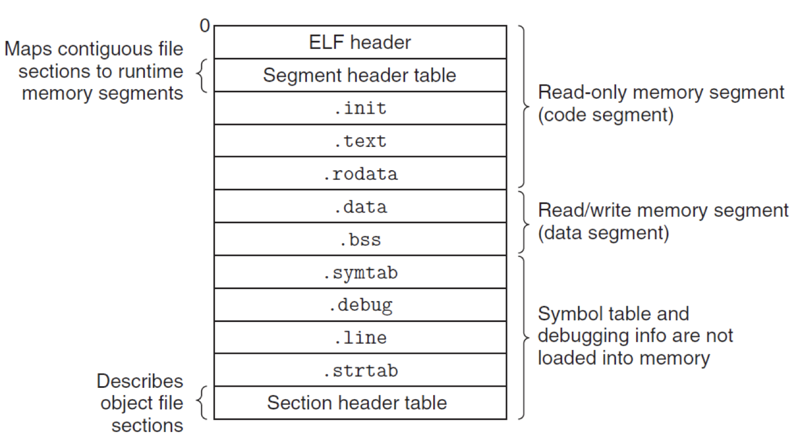
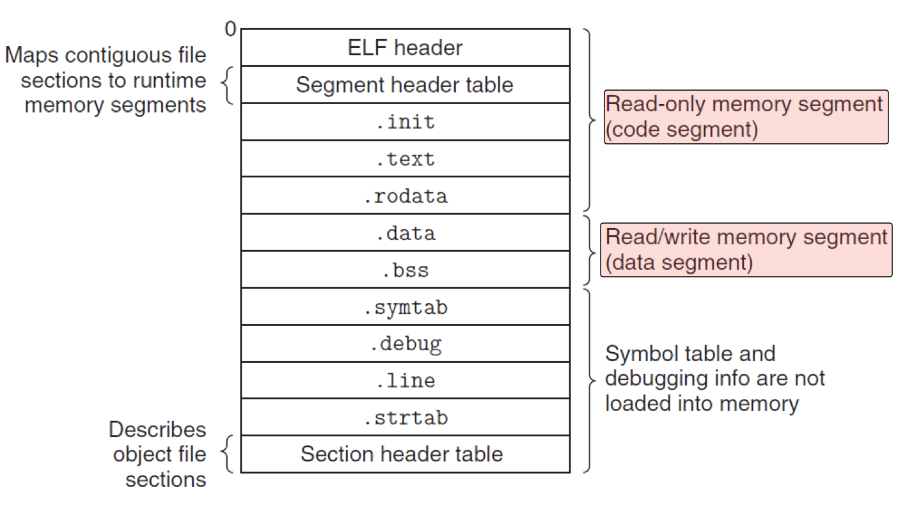

# 2.15 Relocation

## Textbook

* 7.6
* 7.7
* 7.8
* 7.9

## Outline

* Relocation
* Multiple Defined Global Symbol
* Archived Files (static libraries)
* Executable Object Files
* Loading

## Relocation

回到我们最初的问题：怎么把那些出现在 `.text` 区段「未知符号」的空缺位置填上正确的值？

### Steps

#### Assembler's Quest

首先，想要填充这样的「空缺位置」，就得先记录下哪里是「空缺的」。也就是，Assembler 在生成汇编时、遇到不认识的符号（会把它当作全局符号对待），就生成一个「嘿这里需要重定位」的条目放在 ELF Relocatable Object File 的 `.rel` 区段。

注意，如果要重定位的是一个过程或函数，重定位条目会被放在 `.rel.text` 区段，表示这里需要用一个「指令地址（或者说函数指针）」替换；如果是数据则会被放在 `.rel.data` 区段，表示这里需要用一个「指针（指向目标数据）」替换。

> 为什么这是必要的？因为在遇到未知符号时生成「空洞」这件事已经丢失了信息。原来的「符号名字」丢失了，但是应当代替之的「符号地址」却没有到来。
>
> 因此，必须要在某个位置记录下这一内容。

#### Relocation Entry

这个 Relocation Entry 真的非常简单：

```c
typedef struct {
    long offset;
    long type: 32,
    	 symbol: 32;
    long addend;
 } Elf64_Rela;
```

> 同样有一个 `Elf64_Rel`，相比于 `Elf64_Rela` 仅仅少了一个 `long addend` 条目；即无法纪录

不过还是有一些需要注意的东西。

##### Global Functions

以一个全局函数为例子：

```assembly
9      e8 00 00 00 00	callq 	e<main+0xe>   swap();
```

| `offset` | `a`             |
| -------- | --------------- |
| `symbol` | `swap`          |
| `type`   | `R_X86_64_PC32` |
| `addend` | `-4`            |

* `offset`，当然就是在 `.txt` 区段中，到这个符号内存位置的偏移量了。
* `symbol`，当然就是 `.symtab` 中的符号索引了。
	* 鉴于这是个引用外部的全局变量，因此会作为 Referenced Global Symbol 被放在符号表之中。
	* 这个符号的更多信息就请去查 `.symtab`。这里不再存储一份重复的了。
* `addend`：在找出这个符号之後，需要在其上加的偏移量。
* `type`：`R_X86_64_PC32`。
	* 这里的 `PC32` 的意义是，假如最终链接生成的可执行文件不超过 2GB，那么就可以用一个 32 位的 PC-Relative 偏移量来指明其位置。默认状态下，`gcc` 使用的编译模式（Small Code Model）就能保证这一点。
	* 当然，主要的原因是 `callq` 只给了 4 个字节放「要调用的位置相对于此处的相对地址偏移」。因此只好用 `PC32`。
	* 或许以后会出现 `R_X86_64_PC64`。你应该要知道这是什么意思。

最终，在这个内存位置会被填入 S + A - P；即符号的实际位置（Symbol Value）加偏移量（Addend）减当前的 PC 值（`%rip`）。

不过，考虑到在执行 `callq` 这条指令时，由于 `callq` 本身占用了 5 个字节，因此 `%rip` 应该等于 `&callq + 5`。但是我们并不是在 `&callq` 处填写数据，而是在 `&callq + 1` 处（这里才是放内存位置的地方）。因此实际上，我们所拿到的偏移量（用 `&swap - &<HOLE>` 得到的）要比真实的 `%rip` Offset 大 4 字节。所以，我们才需要在 `addend` 中 `-4`。

> `callq` 同理。

##### Global Variables

至于普通的变量来说，则不会用这么麻烦的方式；因为这里有 64 位的 HOLE，即对应 `type`「`R_X86_64_64`」。他不依赖于 PC 进行寻址，而是放置在一个固定的位置。

> 假如连变量的位置都还要 `%rip` 间接寻址，那你读数组岂不是非常麻烦？

因此，实际上做的就是把符号的地址拿进来而已。当然如果设置了 `r.addend` 也会把他加上来，只不过在这里我们没有什么特别理由加上类似于 `-4` 的东西（毕竟它根本不依赖于 `%rip`）。

当然，还有来自 32 位编译系统的历史遗留：`R_X86_64_32 ` 根 `R_X86_64_64` 表现完全一致，只不过只填充一个 32 位的 HOLE。

因此，就是这样。

##### Relocator

一个重定位函数很可能会这么实现：

```c++
for (auto &s : sections) {
    for (auto &r : relocation_entries) {
        auto refptr = s + r.offset; // 这是这个「空穴」实际的位置
        
        if (r.type & R_X86_64_PC32) {
            // 这个是依赖于 PC 的相对寻址！
            auto refaddr = &s + r.offset;
            // refaddr 就是 ref 的运行时地址
            *refptr = dynamic_cast<unsigned>(&r.symbol + r.addend - refaddr);
            // 如果要把他当作 PC-Relative 用，就得设置 refaddr 为 -4
        } else if (r.type & (R_X86_64_64 | R_X86_64_32 /* | ... more historical types */)) {
            *refptr = dynamic_cast<unsigned>(&r.symbol + r.addend);
            // 这个简单
        } else {
            assert(!"Oh! I can't handle such kind of type!");
        }
    }
}
```

##### Explicit Declaration

> 请注意 C 的隐式声明规则：假如你在引用库的时候，没有引用其对应的头文件中包含的函数声明，那么也 OK。
>
> 编译时遇到不认识的符号，会自动对其进行一次「隐式声明」；即，按照调用的方法进行一次声明。
>
> 结果没有区别：他们都会作为外部符号被放入符号表中。
>
> 那为什么我们还要引入头文件的声明呢？
>
> 1. 隐式的声明常常出问题。
>
> 由于编译器缺乏必要的信息，因此标准规定：所有未知的变量都隐式声明为 `int` 类型；而函数呢？尽管其参数都可以被确定类型，但返回值没有办法，也会被隐式声明为 `int` 类型。
>
> 这就带来了可能的不一致和危险。
>
> 2. 编码不安全。
>
> 设想依赖于隐式声明、且仅仅调用了一次的函数。假如这个函数调用的值不小心传错了，并不会导致这个模块的编译失败（因为自动进行了隐式声明，只不过是错误的）。这个问题要到链接时才能暴露，而推迟问题的出现总是不好的。
>
> 因此可以认为：对函数声明来说，显式的比隐式的好。
>
> 当然，现在要用 `gcc` 进行隐式声明，则需要打开 `-Wimplicit-function-declaration` 开关。否则，会抛出如下的错误：
>
> ```
> error: implicit declaration of function 'invisible_function' is invalid in C99
> ```

#### Link's Job

>  Linker

Linker 要做的事情就是（按照她自己的喜欢）把输入的一堆 ELF 文件链接成一个 Executable（当然，还是以 ELF 的格式）。同时，在安排完全之後，即各个符号的位置确定之後，就会开始根据每个文件的 `.elf` 区段，对其中的 HOLE 进行填充。

当然，如果在此过程中发现了冲突（例如，ODR 规则的违反、缺失的符号等等），Linker 就会停止运行，并且抛出一个以 `ld:` 开头的错误信息：

```
ld: symbol(s) not found for architecture x86_64
```

> 这就是一个「符号缺失」的链接错误。

### Multiply Defined Global Symbols

多重定义的「全局变量」。应该怎么处理？

#### Definition

C++ 中有一个 ODR 规则；即 One Definition Rule[Sutter: Exceptional C++]。即，一个 `class` 和非內联的函数不能被不同地定义多次。那么祖师爷 C 里面是怎么处理的呢？

首先，把符号的定义分成两类：

##### Strong Definition

所有的全局函数实现都是强定义。有提供初始值的全局变量初始化都是强定义（不论是否初始化为 `0`）。

> 类似于 `int foo(int x) { ... }` 和 `char x = '2';` 这样的称为强定义。

##### Weak Definition

没有初始化的全局变量声明，就是弱定义。

> 类似于 `char y;` 这样的称为弱定义。

下面，声明我们的规则：

* 同一符号不允许多次强定义。
* 同一符号被一次强定义和多次弱定义，以强定义为有效。
* 同一符号仅仅被多次弱定义，则可能任意取其中之一。

> 所以，如果要声明一个全局变量，请尽量为他提供初始值（以免其类型被覆盖）；或者，如果那根本不需要是世界全局的，那么用 `static` 修饰她，不要让她污染外部名字空间。

> 注意，函数声明不认为是定义。可以理解成「助记符」。

### Packaging Common Functions

#### Intro

这种编译方式的最大好处，就是「把常用函数打包」。

例如，基本大家都会用的 `cstdlib`。注意，`#include <stdio.h>` 这种方式完全没有引入任何标准库的实现；仅仅是包含了下面这么一点点函数声明而已：



显然，仅仅 `#include` 这么一个文件（相当于把这里面的内容复制到文件头部）并没有提供实现。那么如何提供实现呢？我们可以有两种不同的策略：

* 把一类的函数实现放到一个源文件（`.c` 或者别的什么）中，所有想用这些函数的人都得 `#include` 她。
	* 这实际上就是 C++ 的策略；例如，`#include <iostream>` 就是实实在在的源代码。
	* 
	* 这么做的理由当然是 C++ 的模版（`template`）无法被彻底地分离式编译，即便是曾经的 `export` 关键字也无法消除对「库源代码」的依赖。
	* 而且，就算是没有用到的那些函数代码也会造成开销（拖慢编译，等等）。
	* 所以你知道为啥 C++ 编译那么慢了吧.png
* 或者，把每个函数都放在不同的源文件中，库的用户需要哪些，就引用哪些。
	* 这毫无疑问增大了用户的负担；因为要用一个函数就要 `#include` 一下，那不跟写 Java 一样）

C 没有采用上面的这些方法；用户可以简单地 `#include` 一整个部分库，而不会因此而造成额外开销。

#### Static Libraries

首先，库的开发者先将库的实现编译成 ELF 格式，然后叫她 `libc.a` 之类的名字。同时，按照实际类型将库中提供的函数分付在不同的头文件中。

用户按照需要 `#include` 需要的头文件，在实际编译时带上 `/usr/lib/libm.a` 和 `/usr/libc.a` 之类的说明，就好像说「链接器如果要找外部符号，到标准库里找！」。

因为 Linker 只会把需要的符号定义放入可执行文件，因此实际上耗费并不高。

同样，作为用户你也可以写自己的「库函数」：

```shell
unix> gcc -c addvec.c multvec.c
unix> ar rcs libvector.a addvec.o multvec.o
```

例如，这段代码代表先用 `gcc` 把 `addvec.c` 和 `multvec.c` 编译成 `.o`（Object）文件；然后，用 `ar rcs` 爸他们打包成静态库 `libvector.a`。

> `ar` 是 Archiver 的简写；`rcs` 代表增量编译：指明仅仅编译那些发生了变化的文件。

到此为止，库的编译宣告结束；之后他就可以直接参与到 Linker 之中，最後生成可执行文件。


## Execute

现在我们生成了可执行文件（还是以 ELF 格式）。

那么，OS 遇到这个 ELF 时，该怎么执行她？



### Format Checking

首先，我想确认你到底是不是 Executable ELF。

这可以通过检查 ELF Header 中的 `type` 类型来确认。除此之外，从中可以读出整个文件的尺寸、区段信息，这可以帮助 OS 分配内存空间，并将其拷贝到内存中。

### Section Copying

注意，不同的区段会受到不同的对待。并非是将整个 ELF 文件的内容连续、完全地拷贝到内存中（OS 也要节约啊）。



例如，ELF Header、Segment Table、`.init`、`.text`、`.rodata` 保存着的是只读的指令、数据。他们会被拷贝到只读的内存区段之中。

而 `.data`、`.bss` 则应该是可读可写的；因此他们会被拷贝到可读可写的内存区段之中。

> 注意：`.bss` 在 ELF 之中是不占空间的；但在 Section Header Table 之中给出了其预计大小；这一区段会被开辟内存区域。

> 回忆：`.bss` 保存的是【没有初始化或初始化为 0 的】`static` 变量、【初始化为 0 的】全局变量。他们不携带初始数据信息，因此在 ELF 中只要表示出「有他们的存在」就够了。
>
> 但是，在装载运行时他们是需要占用空间的（值可能变化）。因此会采用这种特别的策略。

至于其他的 `.symtab`、`.strtab`、以及其他的 Debug 区段，根本就进不去内存。

> 注意，`.strtab` 保存的是符号名字、区段名字之类的信息；而你在 C 源文件中声明的 `const char theAnswerToTheWorldTheUniverseAndEverything[] = "blablablabla";` 则会被放在 `.rodata` 中。

Section Header Table 也是不需要的；因为在装载完成之后，设置好 `%rip` 之后（默认是 `_start` 这个位置，对所有的 C 程序都一样），代码就会良好地自动运行了。不需要再寻求「区段」这个抽象。

因此 Section Header Table 也就功成身退了。