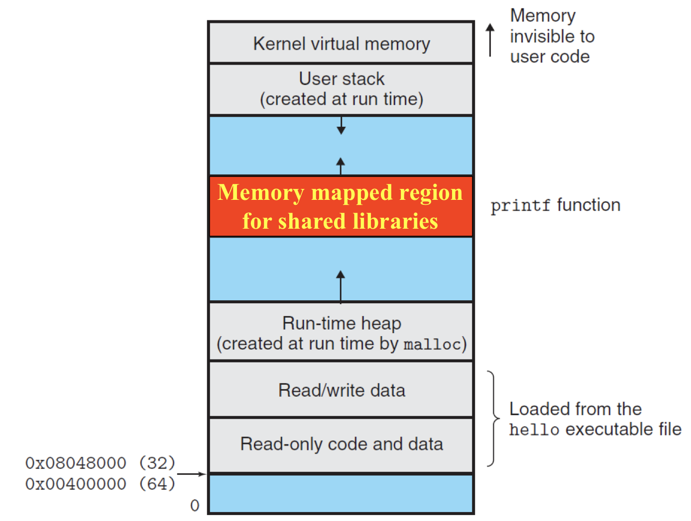
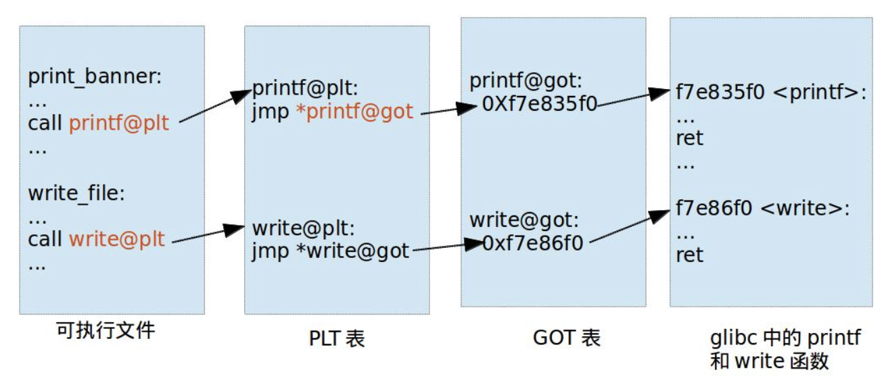

# 2.16 Dynamic Link

更复杂的东西总该有点好处。否则没人会用的。

## Textbook

* 7.8
* 7.9
* 7.10
* 7.11
* 7.12

## Outline

* Dynamic Linking
* Position Independence Code, aka. PIC
* Loading and Linking Shared Libraries from Apps

## Go Dynamic

### Intro

传统的静态链接有他的问题：如果我们修了一点共享库里的 Bug，那么任何依赖于他的代码都需要重新编译（或者，最好地情况下，重新链接）。

另外，这种情况下几乎所有的可执行文件都携带了一份库包含在其体内。每个 C 程序都包含一份自己的 `cstdlib`。这不仅是浪费磁盘空间的问题——因为这些代码最终都会被装入内存，这还会浪费内存（更难忍）。

### Idea

如果我们仅仅提供一份共享的 `cstdlib`，所有程序在运行时去做动态读取，不是很好吗？

总之，我们期望的结果是，每个库仅仅在单一一个文件中出现一次，而不是静态链接到程序内部。对此文件的更新、修改不必触发重新编译。

目前大家还在用的所有操作系统都实现了动态链接。Linux 下面，动态链接库会被放在 `.so` 文件中。Windows 下则是 `.dll`（Dynamic Link Library）。macOS 下是 `.dylib`。

> 反动的 iOS 不允许用户自定义跨应用的动态链接库。修「正」的 macOS 近几个版本也收紧了调用外部库的权限。

### Two-steps Linking's

先介绍一种「两步链接」，或者叫「部分链接」的动态链接实现策略。

#### Building a Library

首先，我们精心地设计了一套优秀的库函数，想要将其发布为动态链接库。该怎么做呢？

首先是，要用 `gcc -shared -fPIC` 编译她。`-shared` 代表将文件创建为共享库的格式；而 `-fPIC` 则告诉 gcc，应该生成位置无关的代码。

也就是说，库函数的代码不能依赖于某个特定的内存位置（所有的寻址都应该是 Relative 的）。

#### Compiling Codes

现在，我们写了一个 `main2.c`，其中 `#include` 了库提供的头文件 `vector.h`。

注意，虽然我们希望「动态链接」时，不要把库函数的代码打包到可执行文件中去，但是在链接时，我们还是要提供动态链接库文件，其中的重定位表、符号表信息等仍然必要。

链接器如果发现传入的是一个动态链接库（如，`.so`），那么他就不会做完全的链接，而是生成一个不包含库函数的「部分链接文件」。


当我们给 `gcc` 的命令行中提供 `.so` 文件时，会自动采取这种「部分链接」策略。

#### What's in there?

部分链接的时候，有什么东西进入了可执行文件呢？

* 代码和数据段：都不进入。
	* 根据动态链接的规范，这些东西应该在运行时动态加载的。
* 重定位表、符号表：部分进入。
	* 这些信息对于生成文件是必要的。

#### When it's running

在程序运行时，会发生这样的事情：


在 `p2` 运行时，会通过 Loader 函数（底层实现借助 `execve`）将对应的动态库装入内存，最终正常运行。

动态链接这件事本身基于一个「动态链接库」`ld-linux.so`。

首先，`execve` 将 `.so` 加载进入内存，然后根据编译时复制进入的 RelocTable 和 SymTable 做一下重定位。

动态链接结束之後，他们所在的内存地址就固定下来了，在此次运行时不再改变。

因此，实际上一个程序能够动态链接的库，在编译时期就已经被确定了。他不能动态链接一个未知的库。

显然 ，如果一个动态库在修改之後，RelocTable 和 SymTable 发生了变化，那就需要重新编译了。

程序内存结构中，在堆和栈之间大片的空白中，有一片是专用于动态链接库内存映射的。



> 因为虚拟内存的存在，因此 OS 可以掌管所有动态库的链接事宜，在需要的时候采取「多对一映射」的方式节约内存。

这种链接方式是程序一打开，`ld-linux` 就会帮你加载好所有的库，修正好指针，程序代码可以直接用。

#### `ld-linux.so`

这个是啥？看名字，他也是个「动态链接库」文件？

实际上，他是个特殊的库。它的作用读取可执行文件的头，确定其所需要的动态库、在文件系统中确定其位置、并将其装载进入内存、并根据可执行文件的 RelocTable、SymTable 修正好指针（也就是作二次链接）。

> 实际上在我们执行一个两步动态链接的程序时，OS 会首先将控制权交给 `ld-linux.so` （先于我们的程序！），并将程序地址作为参数传入。`ld-linux` 会通过读取可执行文件 ELF 的头、符号表、重定位表来确认要加载的动态库，并根据两张表做好指针修正工作（二次链接）。

因为部分链接时，我们并没有将 `.so` 打包进去，所以在运行时这些 `.so` 可能在任意位置，而无法被提前知道。`ld-linux.so` 就专门负责根据一套特定的规则寻找 `.so` 文件。

> 这种「两次链接」的方式不用自己（为了动态链接这件事）写任何代码，编译器（在指定要两步链接时）自动生成了大量代码，使得程序启动时「自动进行二次链接」、「自动寻找库位置」、等等。

##### Where to find it?

说了这么多，既然 `ld-linux.so` 能定位其他动态链接库的位置，那他自己的位置，该从哪里读到呢？答案是：gcc 编译时就写死在 ELF 头里了。

确切来说，是写在 `PT_INTERP` 区段中；Linux 规范说明，如果一个 ELF 头部定义了 `PT_INTERP`，OS 就应该创建 `PT_INTERP` 的运行映射，并将控制权交予她；由这个 Loader 定位、加载所有动态库，再启动程序。

> 趣闻：为了增加灵活性，`PT_INTERP` 是定位到一个符号链接（这个链接 Link 跟我们现在做的 Linking 系两码事）处的。而创建链接的程序 `ln` 本身也依赖于动态链接机制。
>
> 因此，如果这个符号链接丢失了，是没有办法用 `ln` 修复这个问题的——没有符号链接机制，`ln` 根本跑不起来。
>
> > 因此，某些发行版贴心地提供了一份 `sln`（Static `ln`），免得遇到这种糟糕的情况。

### Running Time Linking

那么，有没有不在编译时就确定内容的「动态链接」方式呢？有的。这样，编译器就不会自动为你生成涉及到 `ld-linux` 的代码，不会自动帮你找到你需要的动态链接库的地址。

换句话说，你需要自己在程序启动时加载动态链接库（在此期间，确认你没有在用这些库！），自己解决循环引用，自己寻找 `.so` 的地址，自行处理失败。

说得很复杂，其实也还好。具体来说，编程者需要手动调用 Linux `dlopen()` 系统调用来进行动态加载。

#### Building a Library

这两种方式调的动态链接库完全一致，无需用不同方式编译。

#### Compiling Codes

对于需要手动动态链接的代码，编译时需要用 `-rdynamic` 来指明将本文件中所有的符号（除开那些静态的、局部的）都放入符号表，而不仅仅是用到的外部符号。

> 原因是，有一些 `.so` 函数可能会回调主程序中的一些函数、或者引用一些符号。假如不提供这些信息的话，这些调用就传达不到了。
>
> 两步编译用不到这个开关的原因是——已经提供了 （固定的）`.so` 文件，只要查一查他的符号表就知道哪些符号是有必要的，因此不需要把所有符号都丢进来。
>
> > 说明：在生成可执行文件时，符号表大部分都被丢弃了。因为静态的可执行文件不再需要链接，保留他已经没有用了。
> >
> > 然而，在这种特殊的情况下，仍然需要保留部分符号表以便动态链接之用。
> >
> > 请试着理解为什么 Two-steps Linking/Compiling Codes/What's in there? 中，为何符号表、重定位表是 Partially Copied（部分拷贝）进入可执行文件。

#### Function Calls

首先，`#include <dlfcn.h>` 才能调用这些动态链接函数。

非常简单，只有四个：

```c
void *dlopen(const char *filename, int flag);
	// returns: ptr to handle if OK, NULL on error

void *dlsym(void *handle, char *symbol);
	// returns: ptr to symbol if OK, NULL on error

int dlclose(void *handle);
	// returns: 0 if OK, -1 on error

const char dlerror(void);
	// returns: errormsg if previous call to
	// dlopen, dlysym, or dlclose failed,
	// NULL if previous call was OK
```

> 这里，用到了 Herb Sutter 深恶痛绝的 `get_this_function_for_error_type_and_message()` 语法。

用起来也是很简单：

1. 用 `dlopen("./lib/best_lib.so", RTLD_LAZY)` 懒加载一个动态链接库，把结果存到一个 `void* handle` 句柄指针中。（请在这里做好错误检查。）
2. 用 `dlsym(handle, "symbol_name")` 通过句柄从动态链接库中找出符号地址，以 `void *` 形式返回。（同样请在这里做好错误检查。）
3. 在动态库**使用结束**（而并非是符号加载结束）之後，用 `dlclose(handle)` 卸载这个动态链接库。（错误。检查。）

> 注意，在动态链接库卸载之後，句柄和通过这个句柄取出的所有符号地址全部失效。

### Compare two Approaches

这两种策略有什么区别呢？

1. 两步链接相对还是比较静态——不能够在运行时自由选择加载任意库；库的版本升级导致符号表不兼容改变时，需要重新编译。每次都是启动前把所有库加载一遍，开销较大。但是胜在方便——不需要自己改任何代码，编译器和 OS 帮你做好了绝大多数工作。
2. 运行时链接实在是非常动态——可以任意加载库，甚至部分库（符号）加载失败也不影响程序执行流。同样，更新版本也变得非常简单——有时候我们只需要替换一个 `.dll` 就可以修复很多 Bug。另外，懒加载（用时加载）的方式也使得程序更高效；对于那些对性能、时间极其敏感的 Web 程序，这会是一个好办法。

> 很像是 Pimpl 惯用法…

## Position Independent Code

我们说，所有的动态链接库，都必须带 `-fPIC` 开关编译。即，生成位置无关的代码（任何位置的代码都可以自由地调用之）。为什么？

主要原因是：同一时刻可能有很多个内存中的程序在使用同一个动态链接库。比如，现在基本上大家的内存空间中都有一块 `libc`。如果这段代码是内存无关的，那么我们就可以仅仅保留一份拷贝，让大家都来用。这不是很好吗？

### Implementation

那么，怎么才能让我们的库「任意位置可用」呢？

* a) 对任何 App，让我们的库始终映射到同一个内存地址

这显然是非常低效率，影响内存布局自由度，也不应该采用的办法。

* b) 相对寻址，不论被映射到哪个内存地址，代码仍然能正确运行（PIC）

听起来很美好，但到底该怎么实现呢？

### PIC Problems

我们先来分析分析，问题出在哪里。

* 对库内部函数的调用

这不会有问题；内部函数的调用全部是「相对寻址」的方式，无论被放到哪里都能正确定位到。

* 对外部函数的调用

这里就出现问题了：被装载到不同位置，也就是说「库」和「宿主程序」的偏差值是不一定的——那么，就不存在一种「重定位」的方法，使得其对所有的宿主程序都能正确运行。

* 对全局变量的调用

全局变量里放的是绝对地址，结果跟外部函数调用一样，没有办法写出一个位置无关的地址。

### Solution: GOT & PLT

隐藏不一致性，提供统一性的最佳方法——加一层。

#### Naïve Solution

> 注意：这不是 Linux 的真正解决方案！

既然最基本的问题在于：不同 App 中，共享库映射的内存地址不一致，那么我们就在一张表里记录一下偏差值，不就好了？

因此就有了 GOT（Global Offset Table）。这是一张每个 App 独有的表，被放在 `.data` 段的最开头（足见其重要性）。

那么，GOT 该怎么用呢？首先，对于那些运行时动态链接的库调用，编译链接时是无法对其做任何假设的（甚至是它到底在那个 `.so` 里都不知道）。

例如，对于运行时动态链接的 `printf` 来说，链接器会生成类似于这样的一段 stub 代码：

```assembly
.text
...
# 不是直接调用 printf（因为地址还不知道），而是其对应的 stub 函数
call printf_stub
...

printf_stub:
    mov rax, [printf_address]		# 获取 printf 重定位之后的地址
    jmp rax							# 跳过去执行 printf 函数
    # 这里用 %rax 是为了不破坏 call 之前精心设置的传参寄存器
    # %rax 放返回值，肯定不是拿来传参的，所以没问题

.data
...
printf_address:
　　# 这里储存 printf 函数重定位后的地址
```

简单说，每一个位置不定的符号，都需要一段「stub 函数」、以及一个「地址段」。

那么，我们干脆把他们都提出来作为两张表——这样，stub 函数构成了 PLT 表，而重定位後的地址表，则构成了 GOT 表。



> https://www.zhihu.com/people/ivan-lam-50

理想状态下，本该是这样的。

#### Solution: Lazy Reloc

Linux 总是把该做的事情往后推，直到不能再推的时候才去做。

因此，实际的 PLT 包含了一个状态位，用来指明着这个符号是否已经被重定位了，并借此实现懒加载。如果一个符号从未被调用，就永远不会被加载。

```c
void printf_plt()
{
    if (printf_got->state != RELOCATED) { // 如果没完成重定位
        printf_got->addr = lookup_printf();
        // 直到最後一刻才进行地址解析，填写地址
        printf_got->state = RELOCATED;
        // 设置「是否已重定位」标识
    }

    jmp *printf_got->addr;
}
```

问题非常明显：耗费了多余的空间来存放状态位。能不能减少这部分开销呢？

省钱狂魔 Linux 提供了这样的方案：

```c
void printf_plt()
{
address_good:
    jmp *printf_got;
    // 链接器将 printf_got 填成下一语句 lookup_printf 的地址
	lookup_printf();
    // 调用重定位函数查找 printf 地址，并写到 printf_got
    goto address_good;
    
    assert(!"should never return");
}
```

首先，假如 `printf` 没有被重定位，那么直接将 `printf_got` 的内容设定为 `printf_plt` 的 `jmp` 下一条指令的地址，表现在结果上，就是 `jmp *printf_got` 没发挥作用（白跳了）。这样，控制流就会流向 `lookup_printf` 并做重定位，然后再回到一开始进行跳转。

这一次跳转必然会成功。

> 注意，因为这里采用的是 `jmp` 而非 `call`，所以实际上，第一次跳转的开销几乎是 0；甚至，就连 CPU 的指令预测都可能不会失败。

#### Summary

GOT 表被存放在 `.data` 区段（运行时需要更新），而 PLT 存放在 `.text` 区段——静态生成的 stab 函数无需更新（在一个安全的系统上，也不允许更新）。

他们协同配合，实现了良好的「运行时链接」功能。其中 `printf_plt` 的懒实现最为巧妙。