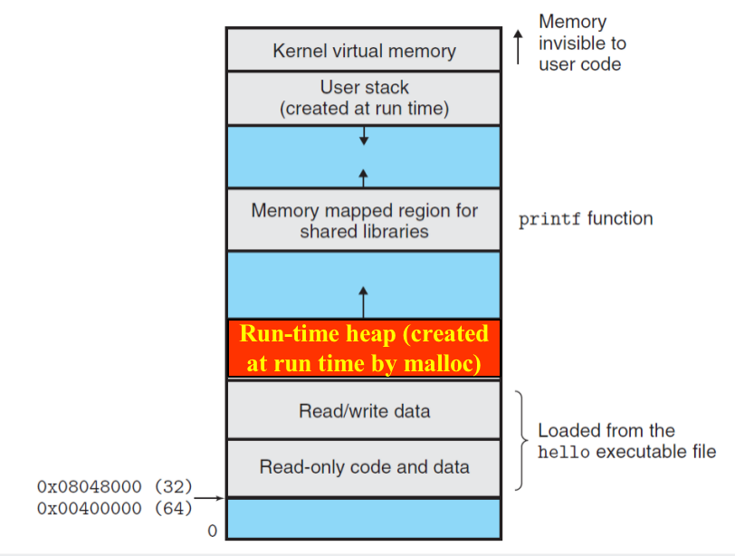

2.17 `malloc`

> 论「`malloc`」

## Textbook

* 9.9

## Outline

* C 标准库中的 `malloc`（当然还有 `free`）
* 动态的内存分配

## Dynamic Memory Allocation

### Intro

动态内存分配是很必要的。并不是所有的内存需要都可以在编译器确定下来。例如，网络上传来的一个数据包，其大小就是不确定的（需要根据包头动态分配）。

再例如 C 惯用法中，接收用户输入的缓冲区大概会这么写：

```c
char buf[I_BET_NO_ONE_WILL_INPUT_ANYTHING_GREATER_THAN_THIS];
```

这种做法由于其内存浪费（只输入几个字符而已，为什么却消耗 1024 字节的栈空间？）、以及比较严重的、涉及到栈溢出的安全问题（参见 ICS Lab 3），已经不怎么使用了。

目前稍微靠谱一点的可变字符串实现（例如 `std::basic_string`）都提供了安全的、动态、变长的功能。这些都基于内存的动态分配。

### Explicit & Implicit

显式好还是隐式好？

#### C: Explicit

在 C 中，要想申领一块动态分配的空间，就得使用 `size` 参数，调用 `xxxalloc` 家族的函数，得到一个 `void *` 指针。需要归还这部分空间时，用这个指针 `void *` 作为参数调用 `free` 即可。

只读写 `(void *)` 到 `(void *) + size` 区域内的内存是安全的；但是如果意外写出了这个区域（尤其是这块空间的边缘）很可能会导致严重问题。

可以看到，C 中对于动态内存分配没有多少包装：要多少就申请，用完了就归还。想要读写外部的内存也没人拦着，但是要承担挂掉的风险。

#### C++: Fusion

C++ 的 `new`（包括 `new []`） 和 `delete`（包括 `delete []`）基本也是这种基于指针和编程者自觉的套路。如果编程者忘记了（或者是恶意地这么干），想要弄崩内存分配机制简直太容易了。

不过，C++ 的功能实在太多，以至于我们可以用完全不同的手法来实现这一功能。其中的智能指针算是对于指针的一层封装。

她利用了 C++ 中关于类的隐式析构的规则：即，对于一个非内建类型的局部实例，在离开其作用域时，其析构函数会自动被调用。

这就允许我们写出这样的代码（示例）：

```c++
template<typename T>
class SmartPointer {
public:
    SmartPointer(T* p) : p(p) {}
    ~SmartPointer() {
        if (this->p != nullptr) {
            delete this->p;
        }
    }
private:
    // make it private and invisible to outside
    T* p;
}

some_scope {
    SmartPointer<int> smp(new int);
    
    // use smp in this scope
    
    // before leaving this scope
    // SmartPointer<T> will be destructed automatically
    // no need to worry about memory leak
}
```

实际上标准库的智能指针实现比这个实现复杂的多。但是大概说明了一种思路：有可能使用 C++ 实现隐式的内存自动释放。

> 实际上苹果之前对着 Objective-C 搞的 ARC（自动引用计数）那一套也跟这没两样。就是计算引用次数，在失效位置自动插入释放函数而已。

#### Others: Implicit

再高级一点的语言很多就没有手动管理内存的机制了，都是直接上 Garbage Collection（内存占了先占着，等没了再清理释放）。

这个就不是这门课该讨论的了（交给 Compilers）。

### Terminologies

#### Heap

动态分配的内存会被放置在堆（Heap）上。



和逆向增长地址的 Stack（栈）不同，其内存地址一般是正向增长的。

#### Memory Leak

根据 Explicit DMA 的语法，调用 `free` 的参数必须是分配时得到的 `void *` 指针。换句话说，如果你弄丢了分配时的 `void *` 指针，那么你就永远没有办法归还这块内存了。

这个唤作「内存泄漏」，或者「記憶體流失」。

#### Double-Free

如果我们拿着一个指针 Free 了两次，就会产生「两次释放」错误。

第一次释放之后，保存着内存分配块的元数据已经改变了，再次对其进行 Free 会产生不可预知的情况，大部分情况下是 Segmentation Fault 告终。

## Implementation

