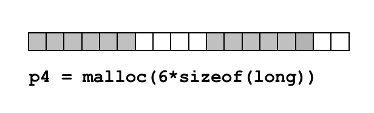
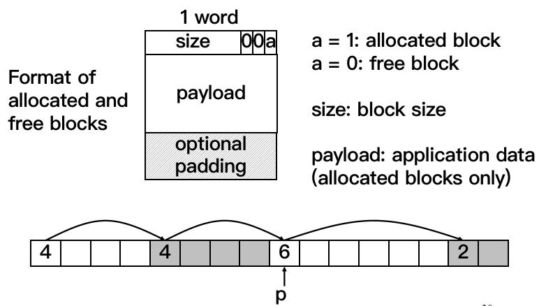
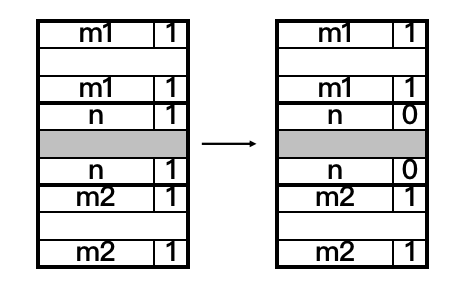
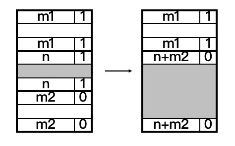
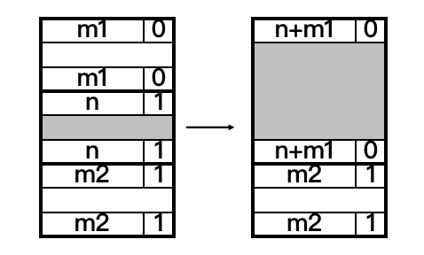
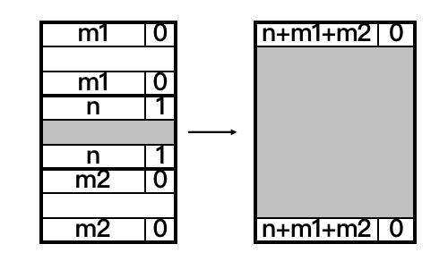

2.17 `malloc`

> 论「`malloc`」

## Textbook

* 9.9

## Outline

* C 标准库中的 `malloc`（当然还有 `free`）
* 动态的内存分配

## Dynamic Memory Allocation

### Intro

动态内存分配是很必要的。并不是所有的内存需要都可以在编译器确定下来。例如，网络上传来的一个数据包，其大小就是不确定的（需要根据包头动态分配）。

再例如 C 惯用法中，接收用户输入的缓冲区大概会这么写：

```c
char buf[I_BET_NO_ONE_WILL_INPUT_ANYTHING_GREATER_THAN_THIS];
```

这种做法由于其内存浪费（只输入几个字符而已，为什么却消耗 1024 字节的栈空间？）、以及比较严重的、涉及到栈溢出的安全问题（参见 ICS Lab 3），已经不怎么使用了。

目前稍微靠谱一点的可变字符串实现（例如 `std::basic_string`）都提供了安全的、动态、变长的功能。这些都基于内存的动态分配。

### Explicit & Implicit

显式好还是隐式好？

#### C: Explicit

在 C 中，要想申领一块动态分配的空间，就得使用 `size` 参数，调用 `xxxalloc` 家族的函数，得到一个 `void *` 指针。需要归还这部分空间时，用这个指针 `void *` 作为参数调用 `free` 即可。

只读写 `(void *)` 到 `(void *) + size` 区域内的内存是安全的；但是如果意外写出了这个区域（尤其是这块空间的边缘）很可能会导致严重问题。

可以看到，C 中对于动态内存分配没有多少包装：要多少就申请，用完了就归还。想要读写外部的内存也没人拦着，但是要承担挂掉的风险。

#### C++: Fusion

C++ 的 `new`（包括 `new []`） 和 `delete`（包括 `delete []`）基本也是这种基于指针和编程者自觉的套路。如果编程者忘记了（或者是恶意地这么干），想要弄崩内存分配机制简直太容易了。

不过，C++ 的功能实在太多，以至于我们可以用完全不同的手法来实现这一功能。其中的智能指针算是对于指针的一层封装。

她利用了 C++ 中关于类的隐式析构的规则：即，对于一个非内建类型的局部实例，在离开其作用域时，其析构函数会自动被调用。

这就允许我们写出这样的代码（示例）：

```c++
template<typename T>
class SmartPointer {
public:
    SmartPointer(T* p) : p(p) {}
    ~SmartPointer() {
        if (this->p != nullptr) {
            delete this->p;
        }
    }
private:
    // make it private and invisible to outside
    T* p;
}

some_scope {
    SmartPointer<int> smp(new int);
    
    // use smp in this scope
    
    // before leaving this scope
    // SmartPointer<T> will be destructed automatically
    // no need to worry about memory leak
}
```

实际上标准库的智能指针实现比这个实现复杂的多。但是大概说明了一种思路：有可能使用 C++ 实现隐式的内存自动释放。

> 实际上苹果之前对着 Objective-C 搞的 ARC（自动引用计数）那一套也跟这没两样。就是计算引用次数，在失效位置自动插入释放函数而已。

#### Others: Implicit

再高级一点的语言很多就没有手动管理内存的机制了，都是直接上 Garbage Collection（内存占了先占着，等没了再清理释放）。

这个就不是这门课该讨论的了（交给 Compilers）。

### Terminologies

#### Heap

动态分配的内存会被放置在堆（Heap）上。


和逆向增长地址的 Stack（栈）不同，其内存地址一般是正向增长的。

#### Memory Leak

根据 Explicit DMA 的语法，调用 `free` 的参数必须是分配时得到的 `void *` 指针。换句话说，如果你弄丢了分配时的 `void *` 指针，那么你就永远没有办法归还这块内存了。

这个唤作「内存泄漏」，或者「記憶體流失」。

#### Double-Free

如果我们拿着一个指针 Free 了两次，就会产生「两次释放」错误。

第一次释放之后，保存着内存分配块的元数据已经改变了，再次对其进行 Free 会产生不可预知的情况，大部分情况下是 Segmentation Fault 告终。

#### Void-Free

如果拿一个并不是 `alloc` 来的地址去给 `free`（虚空释放），也会造成问题。如果精心捏造数据结构，可能会导致更糟糕的后果。

#### `sbrk`

`brk` 指的是运行时堆顶（即堆中字节的最高地址）的地址。

Linux 提供了 `sbrk()` 系统调用来调节 Heap 的大小。`

`Linux <=====> Memory Allocator <=====> User App`

`sbrk()` 是给 Memory Allocator 用的。用户不会直接用这个。 

## Implementation

### Usage

1. `#include <stdlib.h>`

总是包含必要的头文件。

2. `void *malloc(size_t size)`

`malloc` 函数的参数是一个无符号整数。指明要申请的内存的字节数。

> 注意千万不要不加检查地传一个有符号数；类似于 `-1`、`-2` 的小负整数在被隐式转换为 `size_t` 时会变得非常大，绝对能让 `malloc` 失败。

如果分配成功，则会返回一个非 `NULL` 的地址（其中的内容**不保证**全为 0）；如果分配失败，则会返回 `NULL`。

3. `void free(void *p)`

如果 `p` 是一个指向分配块的有效指针，那么 `free` 会将其释放。如果 `p` 是 `NULL`，则什么事都不会做。

如果 `p` 非 `NULL`，又不是一个合法的分配块，可能导致不可预计的结果。

> 论断：所有 `malloc` 返回值都可以安全地被传入 `free`。

类似于

```c
if (p != NULL) free(p);
```

这样的检查是没有意义的；因为 `free(NULL)` 是安全的，尽管实际上不会做任何事。

### Assumptions

作为一个内存分配器，你已经从 OS 方面拿到了一整块 Memory Chunk，而且随后还能任意增减其大小。

#### Requirements

现在，面对用户 App，你需要能够：

* 处理任何顺序的内存分配请求
* 尽可能及时地分配内存
* 尽量节约 Memory Chunk，少向 OS 要
* 只能在堆上分配
* 每个分配块要对齐
* 已经分配的块不能挪动
	* 除非所有者显式地调用 `realloc`

这些要求都不容易实现，有的甚至还相互冲突。

例如，Memory Chunk 的利用率和分配的时间就是相互矛盾的。

> 如果我们永远不释放内存，总是一连串向后分 Blocks，内存没了就找 OS 要，那分配时间肯定是相当快的（$O(1)$ 的）。
>
> 但是如果我们仔细检查每一种情况，分析出最佳的分配策略，这又会耽误太多的时间。

#### Definitions

我们量化地定义一下「效果」和「效率」：

* Throughput（吞吐量）
	* 单位时间内完成的请求数量。
	* 由于 `malloc` 不涉及到内存初始化，因此（在不引起 Chunk 重申请地情况下）可以认为分配耗时和要求分配的内存大小不直接相关。
* Memory Utilization（内存利用率）
	* 当前所有活跃请求所占用的内存，除以当前堆的大小
	* 在堆大部分空的时候，Memory Utilization 会很小，但这是因为大部分资源还处于空闲状态
	* 这个参量不能很好的衡量分配的有效性！
* Peak Memory Utilization
	* 当前所有活跃请求所占用的内存，除以「从堆底到最高分配位置的地址差 $H_k$」
	* 这样，就相当于衡量了「已被分配区段」的内存使用率，更好地体现了分配器算法的有效性。

#### Fragmentations

Peak Memory Utilization 会降低的原因是什么？毫无疑问是「碎片」。

我们将碎片分为两种：

* Internal Fragments

内部碎片，指的是由于「块内部对齐」、或是「保存块元数据信息」等造成的空间浪费。

很容易可以算出这些碎片的大小。

* External Fragments

指的是空余空间的碎片化。

例如，下面的分配状况会导致



这一 `malloc` 无法直接完成，因为虽然空余空间足够，但却不连续（这可能是由于之前的分配顺序导致的），因此只好 `sbrk`。

这种「碎片」的大小就不太好量化，也不好优化了。

#### Questions

实际上，只要稍微思考一下就能找出一大堆问题：

* 只给出一个指向块的指针，如何确定该释放多少内存？
* 如何跟踪目前空闲的块？
* 要求分配新块时，如果存在多种选项，该选择哪一种？
* 存在一段大于要求大小的空闲块时，该怎么对其分配？
* 如何将连续的空闲块合并为一个？

### Standard Method

#### Meta Data Arrangements

实现方法非常多样（例如，维护一个元数据链表也是可以的），但下面要讲的办法是「标准的」。

在每一个分配块之前，消耗一个字（也就是图形中的一个「正方形」）来保存 Meta 信息（叫做 Header Field）。

考虑到这是个 32 位（刚好是 1 个字）的机器，那么直接把块的大小放入 Meta Block 中就很好了。但是，考虑到任何分配尺寸都应该是 Block 大小（8 字节）的整数倍，因此 Block Size 的最后 3 位一定都是 0。

这三个 Bit 就可以拿来做一点事情。



最低位写 1 代表这是个被分配了的块；0 代表这是个空闲块。

> 注意，虽然这里的分配 Block 尺寸一定是 8 的倍数，但是你当然可以 `malloc(7)`，只不过这时候在 payload 尾部会做填充（optional padding），以符合这样的结构。

> 注意，在把 `size` 写进头块的时候，「头块」本身也被算进去。

这样，我们就可以通过「不断 + `size`」的方式在分配段之间单项穿梭。

#### Find a Free Block

现在我们可以遍历（所谓的）「链表」了。那么怎么决定用哪一个空闲块来分配这一次的请求呢？

##### First Fit

一般而言，为了节约时间，会在找到的第一个「足够大的空闲块」上做分配。但这样会导致碎片块（splinters）集中在头部，反而使得整体遍历效率降低。

##### Next Fit

类似于 First Fit，但是在第一次找到「可用块」的时候不去分配她，只是记录下来，接着找；如果找到第二个，就在第二块上分配；如果到最后也没找到，那还是到第一块上分配。

> 谁想出来的神奇策略…

研究表明，这种方式不仅费时，碎片情况更差了。

> 不要用。

##### Best Fit

每次都扫描整个链表，从中找到最小的那个可以分配得下的块。用它来分配。

当然，时间开销特别高。但碎片问题会好很多。

#### Split the Block

如果我们想要分配占用 2 个块的空间，但是目前只有一个包含 100 块的空余空间可用。

显然，我们不会想要把这块空间全部交给他；更显然的办法应该是将 100 块空余空间拆分成 2 块和 98 块，这样不会造成很大的浪费。

#### Coalescing the Blocks

如果只做分块不做合并，那么结果的块就会越分越碎，最后大内存都分配失败。

所以，我们要做的事情就是：释放一块空间时，如果其前部和后部紧邻的块也是空闲块，那么就应该把他们合并成一整块空闲块。

> 即，不能允许内存中出现连续的空闲块。他们应该被合并为一整块。

遗憾的是，按照我们上面的 Free Block 策略，要想查找一个块的后继很容易（直接将其内存地址加上块大小就好了），然而要查找其前驱就很难了。

这样，我们的合并算法岂不是没办法处理「向前合并」的情况？

#### Bidirectional Traverse

我们还有两个 bit 没有用过。但是，这两个 bit 要用来保存「上一个块的尺寸」，是远远不够的。

但是，关键要看出「向前遍历」的需求，仅仅在「前一块是空白块」的时候才有必要（即 Forward Coalescing 时）。

因此，我们可以用其中一个 Bit 记录「上一个块是否是空闲的」。并且，在每一个空白块的结尾记录下这个块的尺寸。

> 仅仅在空白块结尾记录尺寸是不够的；因为那样无法区分空白块和非空白块——用户可以在已分配的块中放任何内容。因此不能仅仅依赖 Footer 作为判据。

这样，在需要 Coalescing 时，只需要查阅当前块的 Special Bit 查出前驱块是否空闲；如果不空闲，就不需要做 Forward Coalescing；如果空闲，那么紧邻着的 Footer 块中包含的就是前驱块的尺寸；用它就可以做反序遍历了^[Knuth73]^。

> 实现中为了简单期间，基本上就是把块的头 Copy 一遍放到尾部。









这样，这四种（可能）Coalesce 的情况都覆盖到了。

