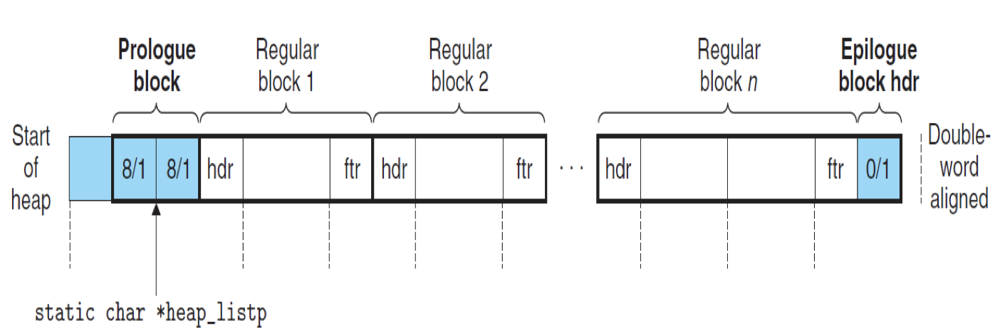
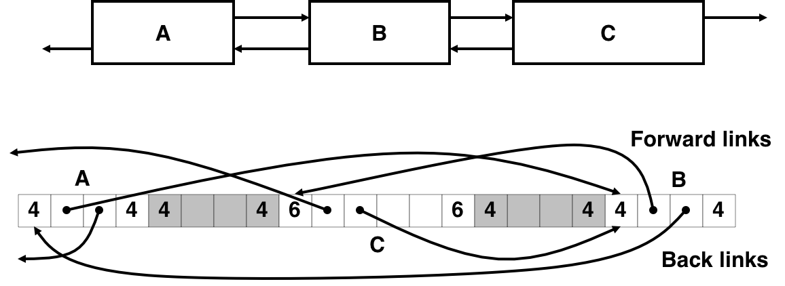

# 2.18 `malloc` (2)

> 再论「`malloc`」

## Textbook

* 9.9

## Outline

* 简单的 Allocator 实现
* 内存释放链表

## `myAllocator`

### Intro

为了简化，我们的 Allocator 做了一些妥协。

首先，就是无论空闲块还是非空闲块，统统都拥有 Header 和 Footer；分别占用 1 word。也就是说，这是个 Explicit 的链表，可以双向遍历。

另外，块序列存在特殊标记的头尾，用来定界。

所有块的容量都是双字对齐（因为 Header 和 Footer 加起来刚好也占用双字，因此不会影响对齐）。不过为了使得每个（给用户看到的、header 之後的那个块）是双字对齐，在 Prologue 之前需要加入一空块。



### Declarations

#### Basic

操作系统提供给我们的只是这么一个简单的接口，例如：

```c
void *kernel_malloc(size_t);
void kernel_free(void *);
```

首先，我们设计一套最基础的、C/C++ 风格的 Allocator API：

```c++
class Allocator {
public:
	Allocator();					// 声明构造函数
    ~Allocator();					// 声明析构函数
    void *mm_malloc(size_t size);	// 类似于 malloc(size_t)
    void mm_free(void *bp);			// 类似于 free(void *)
}
```

我们的分配器工作在 User App 和 OS Kernel 之间，没有完全的底层内存控制权，因此需要一些内部结构来保存一些必要信息：

```c++
class Allocator
{
    using namespace AllocUtils;

public:
    Allocator();               // 声明构造函数
    ~Allocator();              // 声明析构函数
    void *allocate(uInt size); // 类似于 malloc(size_t)
    void free(void *base_ptr); // 类似于 free(void *)

private:
    // 成员变量应当是 private 的
    void *mem_heap;     // 指向堆底的指针
    void *mem_brk;      // 指向（目前）堆顶的指针
    void *mem_max_addr; // OS 能容许的最高堆顶指针
    void *heap_listp;   // 堆链表的首地址

    static const uInt max_heap_size = 0x10000; // 堆的最大容量

    void *mem_sbrk(uInt incr);              // 内部方法：扩张堆
    void init_heap();                       // 内部方法：初始化堆
    void *extend_heap(uInt words);          // 内部方法：以 Block 为单位扩展堆
    void *coalesce(void *base_ptr);         // 内部方法：传入即将被释放的块，执行合并操作
    void *find_fit(uInt asize);             // 找一块放得下 size 的块返回
    void place(void *base_ptr, uInt asize); // 放一个 size 大小的块到 base_ptr 中去
}
```

`private:` 区段还包含了一些不公开的方法。

### Implementations

#### Constructor

首先来实现构造函数。这个函数需要通过 C 接口 `kernel_malloc` 从内核分配堆内存（`Allocator::heap_size` 大小），并设置好内部成员指针。最後，使用内部 `init_heap()` 函数来初始化元数据。

```c++
Allocator::Allocator() {
    void* tmp_heap_ptr = this->mem_heap = kernel_malloc(Allocator::max_heap_size);
    if (this->mem_heap == std::nullptr) {
        throw std::bad_alloc;
    }
    this->mem_brk = this->mem_heap;
    this->mem_max_addr = this->mem_heap + Allocator::max_heap_size;
    
    try {
    	this->init_heap();
    } catch (exception& e) {
        // 析构函数不会调用了
        // 要自己释放内存
        kernel_free(tmp_heap_ptr);
        std::cerr << "allocator: heap init exception: " << e.what() << std::endl;
        throw;
    }
}
```

> 大部分 `kernel_malloc` 不会用 C++ 而是 C 来写，因此会通过返回空指针来报告分配异常。这里采用错误检查的方式将其转换为 C++ 风格的异常。
>
> 在这个构造函数中抛出这个异常是安全的；因为既然返回空指针，就代表没有任何内存被分配，也就不存在内存泄漏的问题。

同理，析构函数做的就是释放而已：

```c++
Allocator::~Allocator() {
    kernel_free(this->mem_heap);
}
```

这部分没什么难处。

#### Extend Heap

这个函数的作用是：根据指定的大小扩展当前堆（如果剩余空间足够），并返回扩张前的堆顶地址。

> 简便起见，我们不实现堆的收缩功能。

```c++
void *Allocator::mem_sbrk(uInt incr) {
    void *old_brk = this->mem_brk;
    
    if (this->mem_brk + incr > this->mem_max_addr) {
        throw std::bad_alloc;
    }
    
    this->mem_brk += incr;
    return old_brk;
}
```

非常简单的一个函数；除了错误检查，真的在做事的就只是 11、12 两行了。甚至怀疑这有没有必要写成一个函数。

#### Utilities

为了接下来编码方便，我们声明一些辅助函数和常数：（不用 Macro！）

```c++
#include <cstdint>

namespace AllocUtils
{
    typedef uint32_t uInt;
    const uInt word_size = 4;              // bytes
    const uInt dword_size = 2 * word_size; // bytes
    const uInt chunk_size = (1 << 12);     // bytes
    inline uInt pack(uInt size, uInt alloc)
    {
        return size | alloc;
    }

    inline uInt get(void *p)
    {
        return *reinterpret_cast<uInt>(p);
    }

    inline void put(void *p, uInt val)
    {
        *reinterpret_cast<uInt>(p) = val;
    }

    inline uInt get_size(void *p)
    {
        return get(p) & ~0x7;
    }

    inline bool get_alloc(void *p)
    {
        return (get(p) & 0x1) != 0;
    }

    inline void *get_header_ptr(void *base_ptr)
    {
        return base_ptr - word_size;
    }

    inline void *get_footer_ptr(void *base_ptr)
    {
        return base_ptr + get_size(get_header_ptr(base_ptr)) - word_size;
    }

    inline void *get_next_block_ptr(void *base_ptr)
    {
        return base_ptr + get_size(base_ptr - word_size);
    }

    inline void *get_prev_block_ptr(void *base_ptr)
    {
        return base_ptr - get_size(base_ptr - dword_size);
    }
} // namespace AllocUtils
```

#### Initialize

```c++
void Allocator::mem_init() {
    this->heap_list_ptr = mem_sbrk(4 * word_size);		// might throw std::bad_alloc
    put(this->heap_list_ptr, 0);	// alignment padding
    put(this->heap_list_ptr + word_size, pack(dword_size, 1));	// prologue header
    put(this->heap_list_ptr + word_size * 2, pack(dword_size, 1));	// prologue footer
    put(this->heap_list_ptr + word_size * 3, pack(0, 1));	// epilogue header
    this->heap_listp += dword_size;
    
    // Extend the empty heap with a free block of chunk_size bytes
    extend_heap(chunk_size / word_size);	// may throw std::bad_alloc
}
```

注脚：`pack(0, 1)` 这一特殊的 Header 用来表明这一生的结束。查找到此就不能再往下了。

#### Extend Heap

上面用到的函数 `extend_heap` 用于以 block（也就是 word）为单位扩张栈。扩张栈要做的不仅仅是把指针增加一下，还需要保持原数据的有效性。

事实上，他做的事情就是在末尾块之后新加了一块空闲块，然后交给 `coalesce` 决定要不要向前合并。

```c++
void *Allocator::extend_heap(uInt words) {
    uInt size = (words % 2) ? ((words + 1) * word_size) : (words * word_size);
    
    void *base_ptr = mem_sbrk(size);	// might throw std::bad_alloc
    put(get_header_ptr(base_ptr), pack(size, 0));	// free block header
    put(get_footer_ptr(base_ptr), pack(size, 0));	// free block footer
    put(get_header_ptr(get_next_block_ptr(base_ptr)), pack(0, 1));	// new epilogue header
    
    return coalesce(base_ptr);
}
```

#### Free

释放相比申请要简单，我们先看这个。

```c++
void Allocator::free(void *base_ptr) {
    uInt size = get_size(get_header_ptr(base_ptr));
    put(get_header_ptr(base_ptr), pack(size, 0));
    put(get_footer_ptr(base_ptr), pack(size, 0));
    coalesce(base_ptr);
}
```

简单说，就是先获取块尺寸、改写 Footer、然后交给 `coalesce` 函数合并块。

超简单。

#### Coalesce

这里要考虑的 Case 相当复杂…

传入的是一个刚刚空闲下来的块的指针。现在要判断他能否和紧邻着她前後的块合并。

要返回的是合并之後的块的头指针。

```c++
void *coalesce(void *base_ptr) {
    // 确认紧邻的前後块是否空闲
    bool prev_alloc = get_alloc(get_footer_ptr(get_prev_block_ptr(base_ptr)));
    bool next_alloc = get_alloc(get_header_ptr(get_next_block_ptr(base_ptr)));
    
    uInt size = get_size(get_header_ptr(base_ptr));
    
    if (prev_alloc && next_alloc) {
        // case 1
        return bp;
    } else if (prev_alloc && !next_alloc) {
        // case 2
        size += get_size(get_header_ptr(get_next_block_ptr(base_ptr)));
        put(get_header_ptr(base_ptr), pack(size, 0));
        put(get_footer_ptr(base_ptr), pack(size, 0));
        return base_ptr;
    } else if (!prev_alloc && next_alloc) {
        // case 3
        size += get_size(get_header_ptr(get_prev_block_ptr(base_ptr)));
        put(get_footer_ptr(base_ptr), pack(size, 0));
        put(get_header_ptr(get_prev_block_ptr(base_ptr)), pack(size, 0));
        return get_prev_block_ptr(base_ptr);
    } else {
        // case 4
        size += get_size(get_header_ptr(get_prev_block_ptr(base_ptr))) + get_size(get_footer_ptr(get_next_block_ptr(base_ptr)));
        
        put(get_header_ptr(get_prev_block_ptr(base_ptr)), pack(size, 0));
        put(get_footer_ptr(get_next_block_ptr(base_ptr)), pack(size, 0));
        return get_prev_block_ptr(base_ptr);
    }
}
```

非常显然的四种情况。就是代码看起来有点让人绝望。

#### Allocate

终于…我们开始分配了。

```c++
void *Allocator::allocate(uInt size) {
    uInt asize = 0;	// adjusted_size
    if (size <= dword_size) {
        // 双字节对齐
        asize = 2 * dword_size;
    } else {
        asize = dword_size * ((size + 2 * dword_size - 1) / dword_size);
    }
    
    // find_fit 找出一块适合大小的块用来分配
    void *base_ptr = find_fit(asize);
    if (base_ptr != std::nullptr) {
        // place 把它放在合适的位置上
        place(base_ptr, asize);
        return base_ptr;
    } else {
        uInt extend_size = std::max(asize, chunk_size);	// 决定要扩展多大的堆
        void *base_ptr = extend_heap(extend_size / word_size); // 可能抛出 std::bad_alloc
        place(base_ptr, asize);
        return base_ptr;
    }
}
```

#### Find Fit

一再简单起见，我们就用 First Fit 好了。

> 应该不会有人用这个 `Allocator` 的吧

```c++
void *Allocator::find_fit(uInt asize) {
    void *base_ptr;
    for (base_ptr = this->heap_listp; get_size(get_header_pointer(base_ptr)); base_ptr = get_next_block_ptr(base_ptr)) {
        if (!get_alloc(get_header_ptr(base_ptr)) && asize <= get_size(get_header_ptr(base_ptr))) {
            // find it!
            return base_ptr;
        }
    }
    
    return std::nullptr;	// no fit...
}
```

#### Place it

放置就更简单了：大小合适就直接放，空闲块太大了就裁剪。

```c++
void Allocator::place(void *base_ptr, uInt asize) {
    uInt csize = get_size(get_header_ptr(base_ptr));
    if ((csize - asize) >= dword_size + overhead) {
        // 如果拆分值得一做的话
        put(get_header_ptr(base_ptr), pack(asize, 1));
        put(get_footer_ptr(base_ptr), pack(asize, 1));
        void *next_base_ptr = get_next_block_ptr(base_ptr);
        put(get_header_ptr(next_base_ptr), pack(csize - asize), 0);
        put(get_footer_ptr(next_base_ptr), pack(csize - asize), 0);
    } else {
        // 不值得拆
        put(get_header_ptr(base_ptr), pack(csize, 1));
        put(get_footer_ptr(base_ptr), pack(csize, 1));
    }
}
```

### Finally

终于…写了这么多个函数，我们实现了最为简单的 Explicit 双向链表内存管理法。



但是，只要某一个程序一不小心多写了一个字，改写了我们的 Footer，以至于另外的 Header，我们的分配器就报废了。

## Free Strategies

现在我们先把代码放一边，考虑一下：对于这一个「双向遍历」的内存分配法，是否有什么「策略上」的优化空间？

### Basic

很显然，上面的实现中问题最大的就是 `find_fit` 函数。它采用的简单 First Fit 策略被证明是不好的；但我们又不想每次分配都花 $O(n)$ 的时间查找一遍。有没有更好的办法？

### LIFO

「Last in, First out」，即后进先出原则。

这一原则的想法是：把刚刚 Free 掉的块重新排布，放到释放链表的最开头。其余方式都和 Basic 一致。

额外的开销只不过是常数时间的，但总之会让我们更快地找到一个可以放入的空闲块。

然而，研究表明这种策略会使得碎片化更严重。

### Segregated Storage

简单说，用类似于某种 Hash Table 的实现方法，这么做：


按照块的大小分成大概的类别，分类多链表存储。

这样，在知道要求分配容量的情况下，就比较容易找出要求的块了。

问题当然也很明显：耗费的额外空间太多了。而且如何分类也是个问题：分得太细会导致每条链都很短，链数太多导致浪费；而分得太粗就失去了分类的意义。

### Buddy Systems

伙伴系统：OS 课里面，ChCore 用的分配方法。

始终用「二分」法分配可用空间；因为相邻、等大二分的块很容易合并，且可以递归地完成。

具体去看 SE-315 Lab 2 的代码吧。

