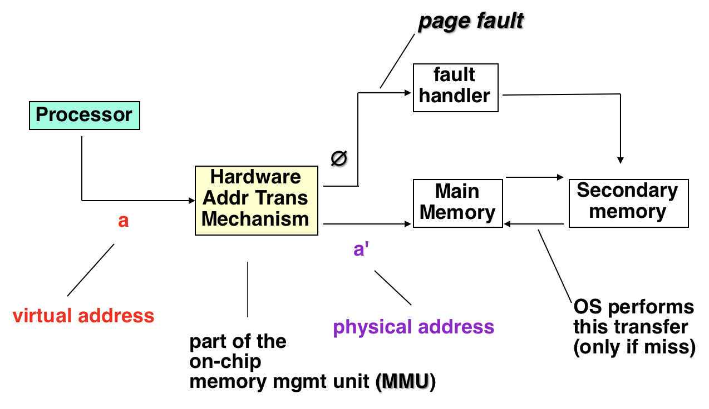
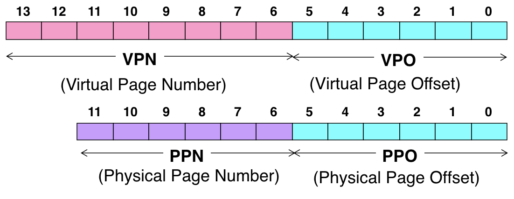
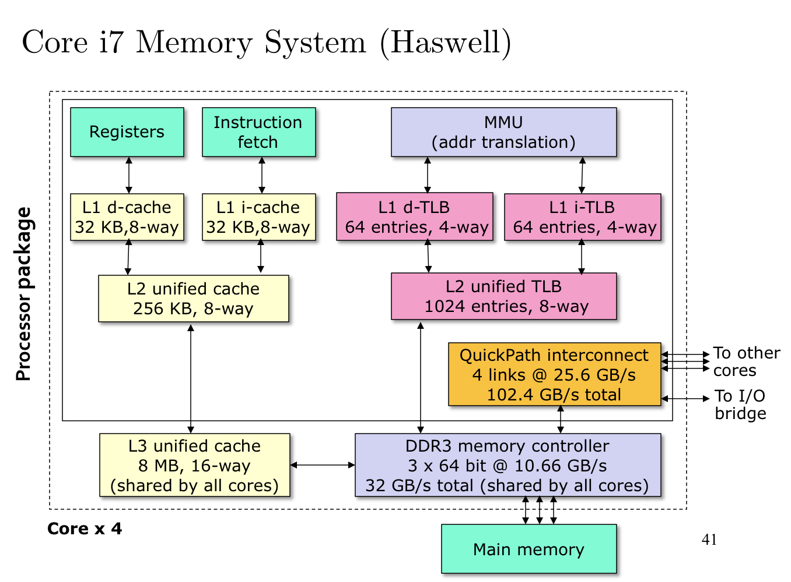
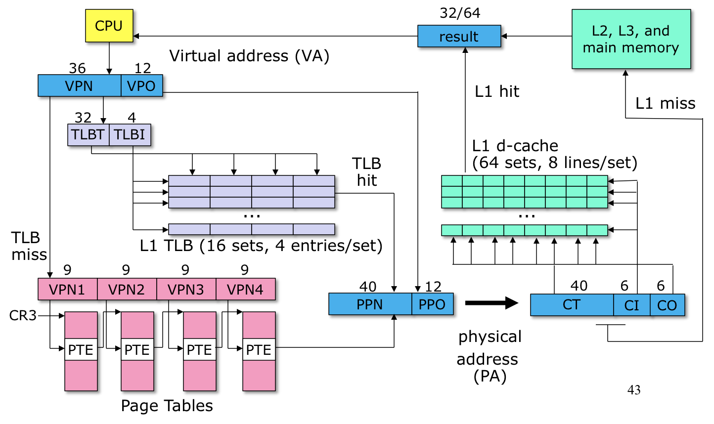

# 2.20 Address Translation

## Textbook

* 9.6
* 9.7.1

## Outline

* 虚拟地址翻译
* 优化翻译手段
	* TLB
	* 多级页表
* 实例：Core i7

## Address Translation

### Definition

首先，我们给出一个抽象的内存翻译模型：

虚拟内存地址为 $N$ 位，形如 $\{0, 1, \dots, N - 1\}$。

物理内存地址为 $M$ 位，形如 $\{0, 1, \dots, M - 1\}$。

> 一般来说，任何系统都不会让 $N \lt M$（那样肯定会导致部分物理内存浪费）。但是这里简便起见，我们不设定这个条件。

那么，地址翻译的过程可以表示成一个映射关系
$$
V \rightarrow P \cup \{\emptyset\}
$$
或者，用函数表示就是 $\mathrm{MAP}(a)$，当 $a$ 是一个有效的虚拟地址且位于主存之中时，返回其映射到的物理地址 $a'$。否则，返回 $\O$。

### Translate

#### Structure

从硬件上来说（2.19 提到了），一个专门的、叫做 MMU 的存储单元会截获采用虚拟内存的「访存请求」，将其翻译成物理内存後再进行实际寻址。

同时，这个 MMU 还要考虑到翻译失败的情况，并在此时通过「异常」报告这个错误。



####Basic Parameters

显然地，对于 MMU 来说，输入是一个长度为 $\log_2N = n$ 的虚拟内存地址；而他要得出的则是一个长度为 $\log_2 M = m$ 的物理内存地址。

同时，鉴于 2.19 中提到的「按页面对齐」，我们可以理解成只需要找出这个地址所在「页」的号码。而由于「按页对齐」保证，在虚拟页中的偏移就是物理页中的偏移。因此实际上内存地址（无论是物理还是虚拟的）的低 $\log_2 P = p$ 位是无需参与翻译的。

#### Obscure Terminologies

* 虚拟内存地址称之为 VA。
	* 其中高 $n - p$ 位称之为 VPN；也就是虚拟页号。
	* 低 $p$ 位称之为 VPO；也就是虚拟页内偏移量。

* 物理内存地址称之为 PA。
	* 其中高 $m - p$ 位称之为 PPN；也就是物理页号。
	* 低 $p$ 位称之为 PPO；也就是物理页内偏移量。

由于页面的严格对齐，对任何一堆「VA 到 PA 的映射」，VPO 始终等于 PPO。因此，我们要做的映射实际上可以认为是 VPN 到 PPN 的。



> 浅蓝色部分应该完全一致。

### Implementation

> Naïve

最为简单的页表实现是这样的：


> 即，在表中出现的索引位置就是 VPN；而每个条目中记录着映射到的 PPN，以及其是否有效的标识位。

肯定的，不会有人用这种寻址方式——每一个 Virtual Page、不管用没用到都消耗一个条目，那大家不要用内存好了，内存全拿来放页表了。

### Optimization I

> Space Issues

首要问题就是占用空间过大的问题。但是前提是，硬件实现的 MMU 功能太弱、对实时性要求很高（不能我做一个寻址，你循环了几百个 Cycle 吧），导致就算实现一个这样

```python
for vpn, ppn in entries:
    if vpn == target_vpn:
        return ppn
    
raise PageFault
```

的简单逻辑都不行。即，只有可能做简单的「基址 + 偏移量」索引的可能。

因此，解决方案就是，分层。

即，先用 VPN 的一部分先寻址一次，拿到下一层的基地址；再用 VPN 的另一部分对它寻址，循环往复。

这样有什么好处呢？好处就是那些在上一层中不 Valid 的条目，OS 就无须再生成下一层页表了；当然，其中的下下层（如果有）也就不必有了。

因为每一层的长度、寻址方式都是固定的，因此可以用硬件电路的方式实现，且维持稳定的常数时间复杂度。

### Optimization II

上面的寻址虽然仍然是常数时间的。但是，可以预见因为要多次寻址，而且含有严格的先后依赖。因此，$N$ 级页表的耗时就是普通页表的 $N$ 倍。

能不能做一下优化？

当然有了！根据局部性原理，我们完全可以把 VPN 到 PPN 的映射 Cache 起来。

> 因为显而易见的原因，VPO 和 PPO 没有必要放入。

这一部分缓存就叫做 TLB（TransLation Buffer）。一个一般的 App 会用到的物理页数不会太多。如果能把这些有限的 VPO 和 PPO 映射存起来，就能抵消掉多级页表的时间开销了。

## Example

考虑一个实际的 Core i7 系统。




TLB 的行为非常类似于缓存；传入的 36 位 VPN 被拆分成 32 位 TLBTag 和 4 位 TLBIndex。然后，被送入一个 16 Sets、4 Entries per Set 的缓存之中做测试。如果 Hit 就直接拿到 PPN 和 PO 拼成 PM；如果 Miss 再走四级页表。

拿到结果之后，再去走 L1、L2、L3、Main Memory 去拿到具体的值。



> 有点太复杂了。

