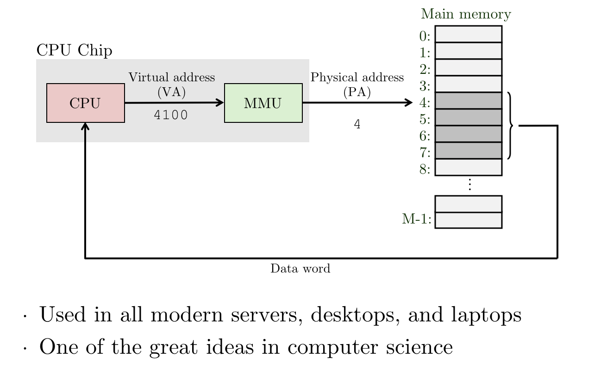
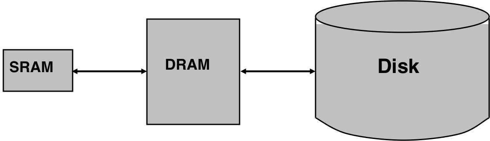

# 2.19 VM

> 所谓 Virtual Memory。

## Textbook

* 9.1
* 9.2
* 9.3
* 9.4
* 9.5

## Outline

* 物理内存地址、虚拟内存地址
* 地址空间
* VM 的意义
	* 做缓存
	* 内存管理
	* 体现隔离性

> 学了 CSE + OS，这节大概看一下就行了…

## Physical Address

### History

最早的「记忆体」出现时，就已经有「地址」的概念了。给一系列引脚通上高低电平来指定一个地址。

这个地址一般从 $0$ 开始，到 $2^n - 1$ 为止。而这也和内存物理布局一致——一大块连续的存储空间。

最早期的计算机、DSP、嵌入式控制器、超算等都是直接用物理地址来跟内存交互。

### Graph

对于「直接采用物理地址」和内存交互的 PC 来说，他们的计算机结构就比较淳朴。CPU 得到地址之后直接发给主存，主存直接把拿到的数据字交给 CPU。

这不是很简单吗？

的确，正是因为简单性，很多嵌入式控制系统都采用这种寻址方法。

### Problems

但是很显然，这种裸写的方式全靠程序自觉。最开始的 PC 没有多任务，OS 管的事情也少，程序跑飞了自己负责，反正也不干其他程序的事（不存在「别的程序」）。

但是在出现了多任务之後，这样的操作不可行了。一个程序不光要对自己负责。但是，对「物理内存寻址」方式来说，这就根本不可能做到隔离。内存的分布连续而有规律，完全可以通过遍历来读写任意位置（不知道属于谁！）的内存。

更糟糕的是，想要任意地写出一个 `hello_world & hello_world`（同时执行一个程序的多个实例）都很难做到：因为多个程序的副本中包含的硬编码地址应该是同样的；而按照物理内存的寻址会把他们映射到同一个位置。大概率不能正常运行。

> 因此，这里多加了一层抽象——虚拟内存地址来解决这个问题。

## Virtual Address

### Basic Idea

先来看一个简单的想法：每个程序都被分配一个（仿照物理内存）从 $0$ 到 $2^k - 1$ 的空间，可以任意在其中读取写入。OS 拿到虚拟地址之後对其进行翻译（翻译到不同的物理地址去），从而可以实现读取。

> 这里表示地址空间的字母采用 $k$ 而不是物理内存空间的 $n$，暗示两者可以不相等。

这个想法同样有问题：实际上程序代码在运行的时候，一条条指令就是在 CPU 中的，而不是「先交给 OS 过目」。

> 这就成了模拟器的做法——那样效率就成了问题。

因此 OS 要想做替换就必须从二进制中改写——但这个问题就很大了（想想我们的 Relocatable 工作量）。

因此，毫无疑问这件事不能交给软件来做，或者说，不能仅仅交给软件来做。

### Hardware's Job

还是交给 CPU 来做翻译吧！

那么就出现了一个问题：为了做虚拟内存到物理内存的「映射」，就必须要一张「表」来存储这些映射关系。

而且这张表的大小不是固定的：他和虚拟地址空间大小有关、和正在运行的程序数量有关（因为每个程序都要有一套独立的映射，否则加这一层就没有意义了）。显然，不能让 CPU 自己拿一块缓冲区来储存映射表。这不合理。

这么一想，最好的办法还是从物理内存中找一块来放这张「表」，然后交给 CPU 一个表头指针（当然得是物理内存地址了）。这样，硬件就可以通过他来索引到需要的地址，读到这张映射表，然后翻译出正确的地址了！

这样，对于每个程序我们只需要保留不同的表头指针，便可以实现翻译了。

### Specialize

一个程序做一件事。那么一个硬件单元也不应该有太多的功能。

我们把负责地址翻译的单元独立出来，而且放在 CPU **之後**。也就是，CPU 中存在的指令仍然是虚拟内存地址，但是在寻址的过程中被翻译。这样做效率会比较高。

> 当然了，这个部件实际上还是在 CPU Chip 里面。只不过表现在示意图上是这样罢了。

### Bulk Size?

显然，我们不应该对每个字节都进行一个 Mapping。

> 应该不会有人这么做吧

考虑一个典型的 64 位机器，支持的物理地址、虚拟地址都是 64 位。那么一个映射条目就耗费 128 位（16 字节）。

也就是说，为了保存 1 字节的映射，你花了 16 个字节。

> 这样，内存利用率大概不会超过 $6\%$。

但是，粒度太粗也不行；那样就失去了映射的灵活性。

采用 Cache 的思路来想，就是——把 Block Size 定多大比较合适？

一般来说我们把一个 Bulk 称作一个「内存页」。以页为单位进行数据的迁移。

这里，我们是把 DRAM 作为 SRAM 和 Disk 之间的一层 Cache 来用了。

稍微特别的一点是，他不依赖于独立的 Cache 硬件（因为要保证隔离性），而是采用特殊的硬件和软件的结合实现的。

这样，Page Miss（缺页）也就可以跟 Cache Miss 类比起来。

> 顺带一提，大部分 OS 的虚拟内存大小都是可以设置的；而且设置多大就会占用多大的硬盘空间。
>
> 这也体现了 DRAM 作为 Cache 的思想。

### Cache?

如果我们真就把它当做一个 Cache 来看，它的特征是什么样的呢？

* Line Size？

非常大。因为如果把 Line Size 弄得太细，会导致读大数据时频繁换页，使不得。

而且细粒度也要以 Meta-Data 的膨胀为代价。

* Associativity？

全相连。宁愿牺牲一点时间，绝对要避免 Miss（磁盘太慢啦！）

* Write Through Write Back？

Write Back。除非必要否则不写回。

比较特别的是，在这里我们并不需要关心「崩溃後的数据恢复」、「一致性」这些事情。因为实际上内存一掉电就全部丢失了；我们用内存也只是作为一个「即写即读」的盘子而已，并不是要持久化地存储数据。

> 所以，Write Through 在这个例子里完全没必要。

## OS's Job

OS 她要做的事情其实是很简单的。

> 以下内容基于 ARM 架构

* 在 CPU 刚刚通电唤醒的时候，MMU 不会被激活。
	* 这时候她拿到什么输入就输出什么，即不进行地址翻译。
	* 站在软件的立场来说，就是可以直接用物理地址做寻址。
* 这时候 OS 需要初始化内核页表，让自己後面的寻址不会失败。
* 在页表初始化完成之後，OS 把页表首地址放入寄存器，并且通过特殊手段（写入 CR）来启用 MMU。
* 从此以后，OS 就开始使用虚拟地址访问内存了。

在後面每次创建一个新进程的时候，OS 都会创建一张新页表，并将页表首地址放在其进程上下文中（因为进程切换的时候要用）。

现在，整个基于 MMU 的事情就完成了。

## Page Table

页表中的空洞很多。根据局部性原理，一个正常的程序不太可能会广泛地访问大范围的内存——绝大部分都集中在一块小区域里。

多级页表将地址分为几块，按顺序作为不同级页表的索引。这样，在上一级页表中没有实体的当前级页表就可以不创建；虽然多了一些 Meta-data，但总的来说还是大大节约了。

另外，为了简化 MMU 的工作，规定 Bulk Size 为页的大小（$2^{10}$ 字节）。而且，虚拟页和物理页一定按照这一大小对齐；即，任何一个映射的虚拟地址和物理地址的低 `10` 位都完全一致。

因此，可以说翻译的仅仅是从「虚拟页」到「物理页」的页号。

## TLB

加速翻译的小窍门。

对每一个进程来说，将那些常用页的映射保存在一级别缓存之中，应该也能提升效能。

这就是 TLB 的设计思路了。不过鉴于不同的进程有独立的地址空间、独立的页表，因此单个条目不能应用于所有的进程。

* 解决方案一：每次切换进程，都刷掉 TLB。
* 解决方案二：每个进程分配唯一 ID，TLB 条目中包含此信息。进程 ID 不匹配的 TLB 条目不 Hit。

## OS relies on MMU

为啥 OS 自己也要基于 MMU 呢？

本来是没必要的。因为「OS 用物理地址访问、App 用虚拟地址访问」这件事本身行得通。而且 ARM 架构也支持在特定的异常等级下禁用 MMU。

但是，Kernel 实际上并不是简单的一个程序。对于某些内核设计架构来说，很多驱动、服务都是跑在内核模式下的；甚至有些内核还是可扩展的。如果都采用「物理地址」来寻址，就降低了其灵活性，也增大了犯错的几率。

## Page Miss

CPU 在收到一条 Page Miss 的消息时，会通过异常的方式报告给 OS。OS 会通过 Exception Handler 中实现的方法，考虑下面的几种情况：

*  `*(void *)nullptr`？这个进程是在瞎读。杀掉她，报个 Segmentation Fault。
* 这个地址看起来是合法的，但是这个页好像没有映射上。
	* 那么，就帮助他填好页表中缺漏的项，然后将控制权交给造成异常的**同一条指令**。
	* 换句话说，就是让这条指令「再执行一次！」。

