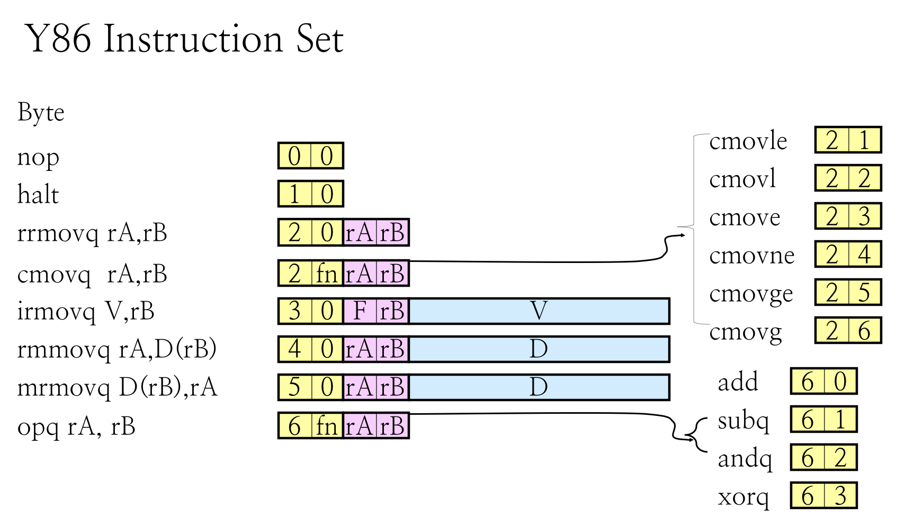
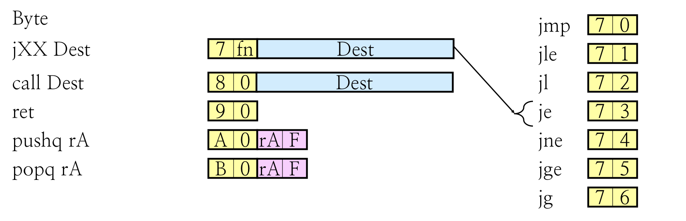
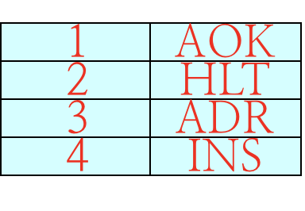
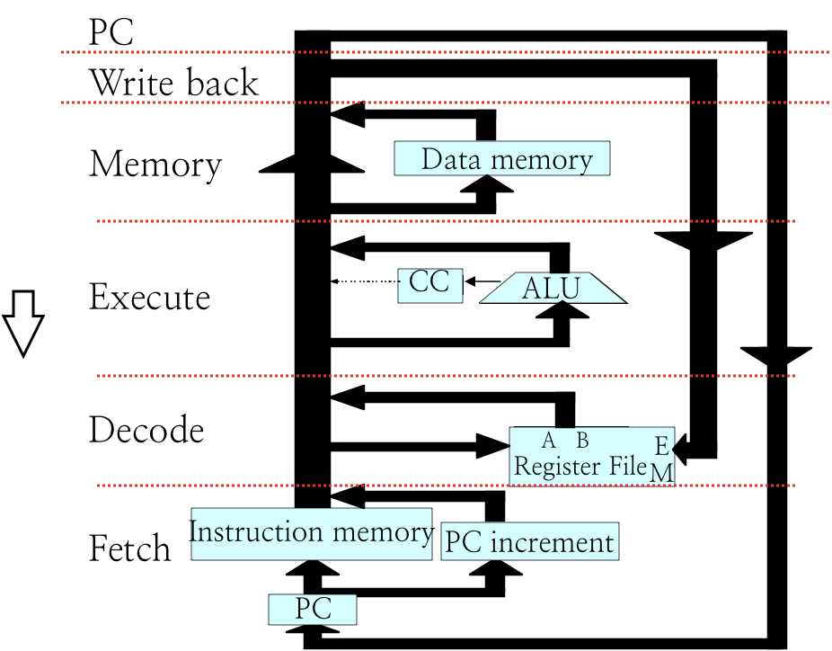
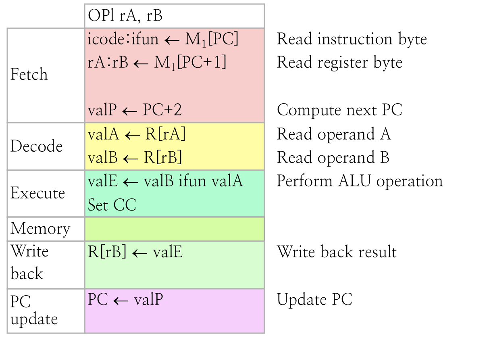
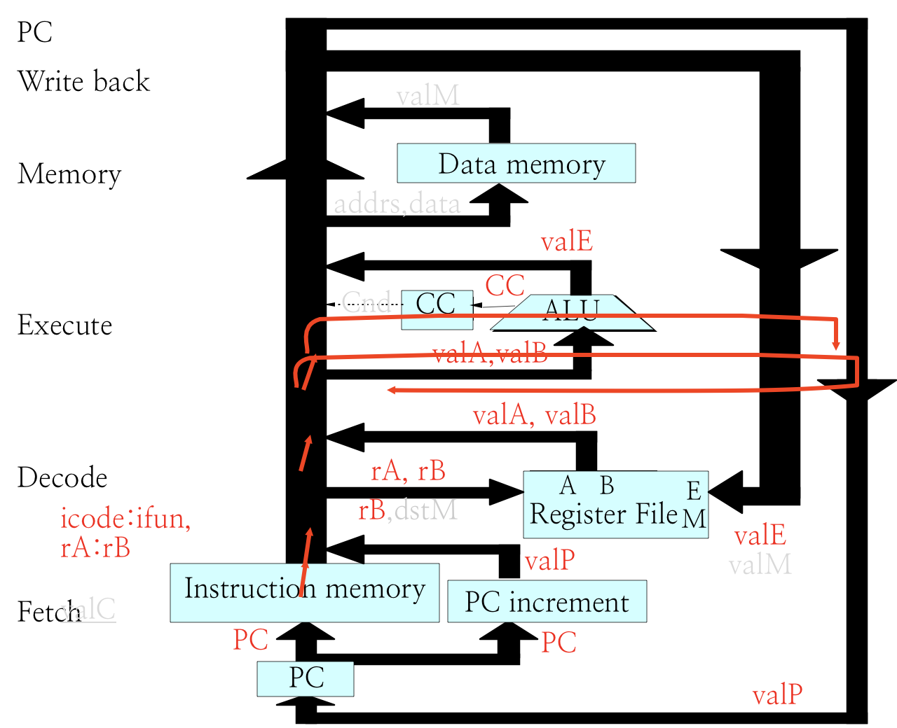

# 2.2 Sequential CPU Implementation

## Textbook

* 4.3.2
* 4.3.3

## Outline

* Y86_64 ISA
* 顺序硬件架构

## ISA

### Definition

所谓的 ISA，就是 Instruction Set Architecture（指令集架构）。主要定义了一套基本指令、编码方式及其作用。

#### Instructions

> 其中需要留意的是，`rA`、`rB` 中保存的都是寄存器 ID，占用 4 比特。
>
> `fn` 是功能代码，在带条件的指令中存放的是 Conditional Code（在什么条件下执行该条指令）；在算术运算指令中存放的是运算类型（加、减、和、异或）。都占用 4 比特。

`1-16-risc` 里的图更好看一些。

关于寄存器、CC 的内容也请去看 `1-16-risc`。

#### Status Code

这里的 Status Code 不是上面的 Condition Flag，而是如此编码的一个标识性寄存器。

* `AOK` 指的是当前 CPU 正在正常执行中
* `HLT` 指的是当前 CPU 被挂起了
	* 通常是通过一条 `hlt` 指令完成的
* `ADR` 指的是 CPU 遇到了一个寻址错误
	* 通常是因为在指令中提供了一个非法的地址
* `INS` 指的是 CPU 解码出了一条错误的指令
	* 无法按照上面的规则被分析

### Design

现在我们知道了一些大概的 CPU 架构、以及基本的 HCL 语言。可以开始着手实现 CPU 了！

#### Stages

我们把 CPU 处理的流程分为六个部分：

* Fetch
	* 取指
	* 通过 PC 从内存中取出需要执行的下一条代码
* Decode
	* 解码
	* 假如这条代码有用到某寄存器的内容，就去读
* Execute
	* 执行
	* 通过算术单元计算结果并返回 Conditional Codes
	* 在执行算数指令和内存偏移计算指令时都会用到
	* 注意，ALU 单元本身并不会主动更新 CC，因为他不能区分这是一个算术运算还是内存偏移计算（算内存偏移是不会更新 CC 的）。
* Memory
	* 访存
	* 读取或写入某个内存地址
	* 注意，在一个周期里，CPU 要么写入一块内存、要么读取一块内存，不可以同时做这两件事
	* 这也就是为何 CPU 不能提供一条 Memory 到 Memory 的移动指令
* Write Back
	* 写回
	* 假如这条代码要更新某寄存器的内容，在此时写回
	* 因为寄存器的读、写是在两个 Stage 里完成的，因此可以有 Register 到 Register 的移动指令
* PC Update
	* 更新 Program Counter
	* 根据当前指令长度递增 PC
	* 回到 Fetch 阶段取出新的指令

#### HCL

一条指令被执行的生命周期是：

* 出生前
	* 在 PC 阶段被更新的程序计数器指向了该条指令
* 出生
	* 在 Fetch 阶段被从内存中取出，进入 CPU
* 执行
	* 在 Decode、Execute、Memory、Write Back 阶段被分拆、利用
* 死亡
	* PC 被更新指向别的指令、Fetch 取出另一条指令覆盖了它

对 CPU 来说，他会无限循环这六个过程，直到六个 Stage 中的某一步发生了错误导致其挂起。

### Examples

#### Arithmetic Operation

以一条简单的「算术操作指令」为例。

这条指令会做的事情是 `put (rA <op> rB) to rB`。

* Fetch
	* 会取出 2 Bytes 的指令
* Decode
	* `rA` 跟 `rB` 都是源操作数，一并在此阶段中被读入 CPU
* Execute
	* 把得到的数字和 OpCode 交给算术单元（ALU）做运算
	* 同时更新 Conditional Codes
* Memory
	* 不需要进行内存读写
* Write Back
	* 将 ALU 计算的结果放回 `rB`
* PC Update
	* 因为当前这条指令长 2 字节，因此将 PC 递增 2

用一张图来表示，就是：

有一些术语需要留意：

`valX` 可以认为是 CPU 里的临时变量。长度均为 64 字节。

`icode`、`ifun` 是专用于保存指令 ID、功能 ID 的 4 字节内容。

`M[ADDR]` 会从主内存中取出 `ADDR` 位置的一字节内容。

因此可以看到，`M[PC]` 的结果被放入了 `icode:ifun`，意思是这一个字节内的 8 位被分为 4 位和 4 位，分别作为 `icode`（就是指令代码）和 `ifun`（就是功能码）两部分解读。

> 字节内的内存布局和大小端无关。

#### Hardware

表示在硬件中，就是像图里的这个样子。

每分析一条指令，进行一次循环。这就是最为简单的顺序执行（Sequential）CPU 的执行方式。

可以看到，这种执行方式导致 CPU 接近 $\dfrac 1 6$ 的时间都是浪费掉的。有没有办法提提速呢？

请看下集。