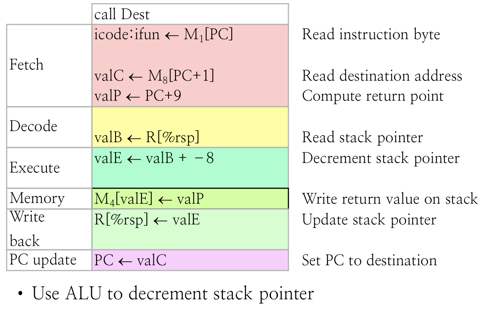

# 2.2.5 Sequential CPU II

## Textbook

* 4.3.1

## Outline

用 2.2 中的分 Stage 方法来实现更多指令。

## Stages

### `rrmovq`

很奇怪的是，`rrmovq` 在 Execute 阶段似乎什么都不用做（本身要做的事情就只是在 Fetch 阶段取出寄存器号、Decode 阶段读出寄存器内容、并在 Write Back 中写回寄存器），但是却在 Execute 阶段强行做了一个看似没有意义的移动（`valE <- 0 + valA`）。这是为什么呢？

为了简化起见，在 Memory 和 Write Back 阶段都尽量使用 Execute 产生的结果，这样可以减少信号传递的数量。

比如，这样做以后，我们用 `valE` 作为传递给 Write Back 阶段的内容，而不是 `valA`。这样就使得本指令的 Write Back 阶段和前面的 OPq 一模一样（无论是动作还是数据源）。

一个原则就是：尽可能使得每一步的操作都非常一致，这样就可以简化电路设计。

> Simplicity favors regularity.

### `irmovq`

跟 `rrmovq` 类似，只是 Decode 阶段都不用做事情了。

### `rmmovq`

我们要做的事情是：把一个寄存器中的值放入一块内存地址中。

那么首先，要读出这个寄存器的内容（Decode 阶段）、并且算出这个内存的有效地址（Execute 阶段）、然后写入内存（Memory 阶段）。

请一定注意，Effective Address 的计算也是依赖于 ALU 单元的。

> 所以 OPq 的操作数不能是一个内存地址。

### `mrmovq`

和 `rmmovq` 类似。没啥好说的。

### `pushq`

相当于一条指令做了两件事情：1. 把一个值放入栈顶指针中；2. 把栈顶指针的值 −8。

第一件事所需要的 Stage 是「Decode」、「Memory」；第二件事需要的 Stage 是「Decode」、「Execute」、「Write Back」。

他们不冲突，所以可以一个周期完成。

### `popq`

> 当有人写出 `popq %rsp` 这种代码的时候，我们要注意到在 Write Back 阶段，更新栈指针在写回值之前发生，因此最後的结果就是 `%rsp` 被覆盖为栈上的值。

### `jmpXXq`

这大概是最特别的一个指令。

在 Fetch 阶段，提前算好「跳转」和「不跳转」两种情况下的 Next PC。

在 Execute 阶段，利用当前的 CC 和 `ifun` 判断是否应该执行跳转，并且存在 `Cnd` 变量中。

在 PC Update 阶段，根据 `Cnd` 来决定是放入跳转後的 PC 还是不跳转的 PC。

### `callq`

类似于无条件的 `jmpq` 跳转，加上 `pushq %rip` 的结果。

### `ret`

类似于 `popq`，然后无条件跳转到该内存地址的结果。

### `cmovXXq`

可以看到，和 `jmpXXq` 的条件判定类似，采用 `Cnd` 来存储是否执行 `mov` 的条件。比起 `rrmovq` 来说只不过是增加了 Execute 中的 `Cnd` 计算，以及在 Write Back 中增加了 `Cnd` 作为执行 `movq` 的条件。

事实上，`rrmovq` 可以认定是 `cmovXXq` 在条件设定为 Unconditionally 时的特殊情况。去看看 Y86 的编码，可以发现 `rrmovq` 的指令代码就是这么设计的。

## General

一般化的步骤。

最左边是各个阶段的名称，中间是各个阶段可能要用到的信号。最右边是 OPq 对这种一般化的实现。

对于中间一栏，`dstE` 表示写寄存器时，从 Execute 阶段来的数据写到哪个寄存器；`dstM` 表示从 Memory 阶段来的数据写到哪个寄存器。

只要是对于同一个东西，但数据来源不一致的就有一个相应的信号名字给它，同时用电路将各个输入加以合并。

每个步骤所能读/写的 CPU 内部变量都是确定的（因为这涉及到硬件电路，不是能轻易更改的）。

以上这套步骤可以完全无歧义地实现 Y86_64 指令集，除了 `popq %rsp` 这种差劲情况和具体实现相关。

