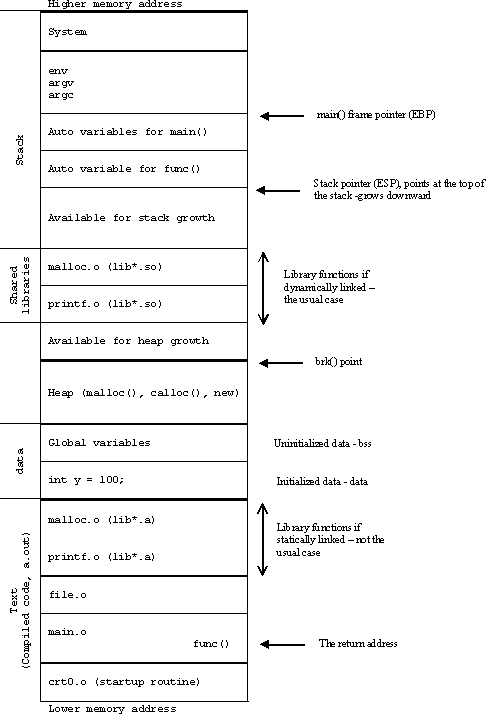
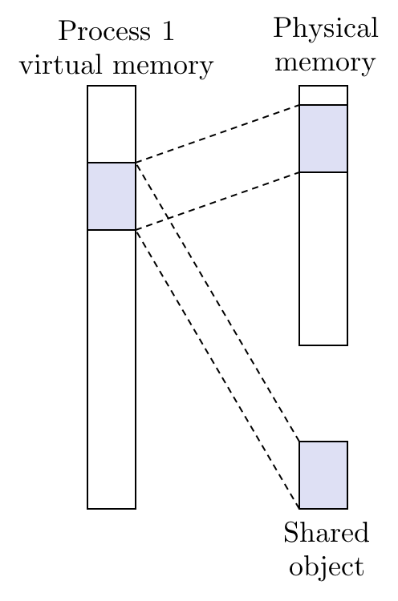

# 2.20 Linux Memory

## Textbook

* 9.7.2
* 9.8

## Outline

* Linux 的内存映射

## Architecture

> 这里也有等第…

### VM System

正是因为有了「虚拟内存映射」这一套手段，我们才可以任意地对任意 App 的地址空间进行排布，而不用考虑「不同 App 之间的地址重叠」和「地址空洞」问题。


这张图表现得更好（[Ref](https://stackoverflow.com/questions/18278803/how-does-elf-file-format-defines-the-stack)）：



### Areas

每个进程都会有自己的内存空间，作为进程的上下文保存在一个特殊结构 `task_struct` 之中。

```c
struct task_struct {
    // ...
    struct mm_struct* mm;
    // ...
}
```

而这个 `mm_struct` 中，保存着一些要紧的元数据。

例如，`pgd`（Page Global Directory Address）就指向了我们的四级页表头。OS 在切换进程上下文时，负责将其存入 `CR3` 寄存器（专门保存页表物理地址的寄存器）。

除此之外，还需要记录这个进程所映射的内存块（Areas），不能让你随便乱读。这个最小分配单元称之为 Area。

```c
struct mm_struct {
    // ...
    pm_addr pgd;
    struct vm_area_struct *mmap;
}
```

这个 `vm_area_struct` 只能保存一块连续的 Area。但是显然一个程序可能申领多块不连续的内存，因此 `vm_area_struct` 也具有链表结构，以便嵌套地声明 `vm_area_struct`：

```c
struct vm_area_struct {
    vm_addr vm_end;
    vm_addr vm_start;
    pgprot_t vm_prot;
    unsigned long vm_flags;
    // ...
    
    struct vm_area_struct *vm_next;
}
```

> Linux 实现中采用了双向链表格式组织，且保证了按虚拟内存地址排序。

> 请注意 `vm_addr` 和 `pm_addr` 的区分。

其中，每一个 `vm_area_struct` 结构代表了虚拟内存空间中从 `vm_start` 到 `vm_end` 这一段中的映射。`vm_prot` 和 `vm_flags` 记录一些元数据。

> `prot` 指 Protection。可设置位包括 `MAP_READ` 和 `MAP_WRITE`。

> `flags` 的可设置位包括 `MAP_PRIVATE` 和 `MAP_SHARED`，用来确认这块 Area 是此进程独享还是大家共享。
>
> `MAP_ANON` 也可以参与修饰 `flags`，代表这是个无初始值的区段。

#### Anonymous

具体地说一下 `flags` 的使用。

如果 `flags = MAP_PRIVATE | MAP_ANON`，那么这一次调用就会创建一块新的、无初始值的映射块。这样调用的意图通常是「分配一块初始值为 0 的内存块，我自己用」。

如果 `flags = MAP_SHARED | MAP_ANON` 呢？这类调用的意图通常是想要共享一块跨进程使用的内存，且不用初始值。

> 当然，这里也就完全不存在「写时复制」的事情。这块内存总会被共享。

如果 `flags = MAP_PRIVATE`，即代表这块映射到文件的内存是当前进程所独占的。这时候有可能触发「写时复制」机制。

如果 `flags = MAP_PUBLIC`，这就是共享库的做法——以一个公有的文件段映射到多个进程中。

因此，对每个进程而言，Linux 的虚拟内存架构应该是这样的：


### Mapping

如何新映射一块虚拟内存区域呢？

Linux 并不会在初始化时就在物理内存中开内存。

对于有一些需要初始化值的内存段（比如，加载 ELF 的那些段），就直接把它跟磁盘上的一个文件相关联。

但是，有一些不必初始化的内存段就不会映射到文件，也不进行任何内存分配，而是在初次 Page Fault 时立即分配一个全 0 的物理页。

上面这些都是初始化阶段的懒操作。一旦开始写入这些区段，这两者的区别就不存在了。

### Swap File

由 Kernel 管理，保存在 Disk 上的一个文件。

> Windows 下的 `pagefile.sys` 起类似的作用。

大小等于当前运行进程的已映射的所有虚拟页。这就相当于是把 Main Memory 当成是 CPU 和 Disk 之间的 Cache 用了。

事实：所有的虚拟内存页在被引用之前，不会被拷贝到物理内存之中。

> 被称为「Demand Paging」。

而在写虚拟页的过程中，数据将不断在 Memory 和 Swap File 之间拷贝。

> 这么说，一般的映射是以一个磁盘文件作为根本的；但是 `MAP_ANON` 代表不提供这文件，而是在 Swap File 中保留一块作为「源文件」。
>
> 大概这就是 Mapping Anonymously 的来源吧。

## APIs

### `exec`

当我们 `exec` 时，发生了什么？

#### Eliminate

首先，这个函数的调用者不会再存在了。因此，在创建新进程之前，必须先处理掉其资源。

按照 `vm_area_struct` 和 Page Table，逐块释放掉原先映射的内存页吧。

#### Re:Born

构造出新的进程上下文，以及需要用到的 `vm_area_structs` 及 Page Table。

> 一个进程基本需要的内存区段有：`stack`（栈）、`.bss`（无初始值的变量）、`.data`（有初始值的数据）、`.text`（程序段代码）、以及进程间共享的 Shared Libraries。

很显然，`.text` 和 `.data` 是映射到 ELF 文件中的特定区段的；而 `.bss` 和 `stack` 则是初始化为 0 的，被映射到 Anonymous 文件的块。

另外，`.text`、`.data`、`.bss`、`stack` 都是私有区段，而 Shared Libs 则是公有的（否则就体现不出 Shared 了）。

#### Start the Engine

现在，Linux 只要把 PC 设置为 `.text` 区段中，约定俗成的起始位置就好了。

接下来，切换回 User Mode 之后，PC 就会开始读出指令。`exec` 结束了。

### `mmap`

用户态程序一样也可以请求映射。完整的接口是这样的：

```c
void *mmap(void *start, int len, int prot, int flags, int fd, int offset);
```

用 `fd`（文件句柄）来指明要映射的文件，用 `offset` 来指明要映射的位置在文件内的偏移量。用 `len` 来指明要映射多少个字节。

> 能够指定偏移量和映射长度是必要的；否则就无法实现「将一个 ELF 的不同区段映射成不同的 Area」这件事。

`prot` 跟 `flags` 很明显，用来指明映射 Area 的权限信息。上面提过了。

最後一个 `void* start`，意思是「你比较想要把这块 Area 映射到虚拟内存空间中的哪里？」

不过这只是起一个建议性质，`mmap` 会尽量往这里放，但不保证放在这里。如果在这个位置没法放，就会随便选择。

> 如果对映射的结果地址没有偏好，就直接传 `NULL` 好了。

`mmap` 最後会把映射完成的位置返回。


表示成图就是这样。

表现在 `vm_area_struct` 链表之中，就是这样：


> 链表中多了一环而已。

#### Usage

对于那些需要要求文件访问效率的软件（例如 Web Servers），用 `mmap` 的方式读文件不需要将其拷贝到用户态。

> 只要只读、不写，就不会有拷贝开销。

```c
/* 
 * mmapcopy - uses mmap to copy file fd to stdout
 */
void mmapcopy(int fd, int size)
{
    char *bufp;
    /* map the file to a new VM area */
    bufp = mmap(0, size, PROT_READ, MAP_PRIVATE, fd, 0);
    /* write the VM area to stdout */
    write(1, bufp, size);
    return;
}
```

例如，这就是快速输出一个文件内容的方法。

> `1` 总是 `stdout` 的句柄。因此 `write(1, bufp, size)` 相当于把 `bufp` 指向的 `size` 个字节打印到标准输出流。就这样。

```c
// written by benaryorg @ gist

#include <stdio.h>
#include <assert.h>
#include <fcntl.h>
#include <sys/mman.h>

int main(int argc, char **argv)
{
    assert(argc == 2);
    int file = open(argv[1], O_RDONLY);
    assert(file > 0);
    struct stat st;
    fstat(file, &st);
    void *addr = mmap((void *)0xffffffff00000000, st.st_size, PROT_READ, MAP_PRIVATE, file, 0);
    assert(addr);
    fwrite(addr, st.st_size, 1, stdout);
    munmap(addr, st.st_size);
    close(file);
    return 0;
}
```

> 这也可以作为一种快速实现 `cat` 的方法。
>
> 注意，这里的 API 跟上面提到的有些微区别。

### `fork`

使用起来非常简单：`fork()`。根据返回值判断地位。就这么简单。

实现起来好像稍微复杂了点。

#### Copy... what?

首先——我们需要拷贝的东西有哪些？

`fork` 完，就分家了。不是一个进程了。

所以，`mm_struct`、`vm_area_struct`、以及页表都得复制一份。

但是复制完成後的此时，她们的内存映射还完全一致——因为 `vm_area_struct` 里面的内容都是原封不动 Copy 过来的。

如果要对他们进行隔离，好像势必得把整个虚拟页都 Copy 一份。能不能避免呢？

#### (Shared | Private) Object

补充说明一点。

Shared Object 映射特指跨进程共享、反映在 Disk 上更动的这一类映射体。即，如果你把一个文件的某一部分 `MAP_SHARED` 地映射到内存空间里，那么对其进行更动就会直接影响到其他映射此文件的程序，以及磁盘上实际存在的文件内容。

而 Private Object 则是采用 `MAP_PRIVATE` 映射到地址空间的文件部分。只是读的话并不会触发拷贝，但是一旦尝试写入其中，就会立即触发 CoW，将其拷贝一份到写者自己的内存空间中。此操作不会影响到任何其他映射此文件的进程，亦不影响磁盘上的文件。

> (Shared | Private) Area 的表现和上面类似；不同之处是它不存在一个「源文件」，不过也可以理解成是 Swap File 中的一部分。

#### CoW: Copy on Write

写时复制。看这个例子。

考虑这个进程：它包含一段到物理页的映射，以及一块共享对象（Shared Object）的映射。



现在，Process 1 使用 `fork()` 函数，将自己复制了一份。新得到的 Process 2 同样保留了这部分映射：


这里，对于 Shared Object 的处理没有问题——单一的这个对象本来就可以任意映射到多个进程。

但是问题是 Physical Memory 的那一段是 Process 1 的私有区段，不能够被 Process 2 映射的。怎么办呢？

答案是，在双方的 `vm_area_struct` 中，把脏继承来的私有区段标记设置成 `RONLY`（只能读，不能写）。这样，如果双方都只读这块内存，相安无事。但是一旦尝试写，就会触发保护错误。OS 截获这个错误时，再进行这一区段的拷贝及重映射。

> 注意，必须保证双方的 `vm_area_struct` 都为 `RONLY`，即不管谁先「修改共享内容」都必定要触发 Page Fault。


