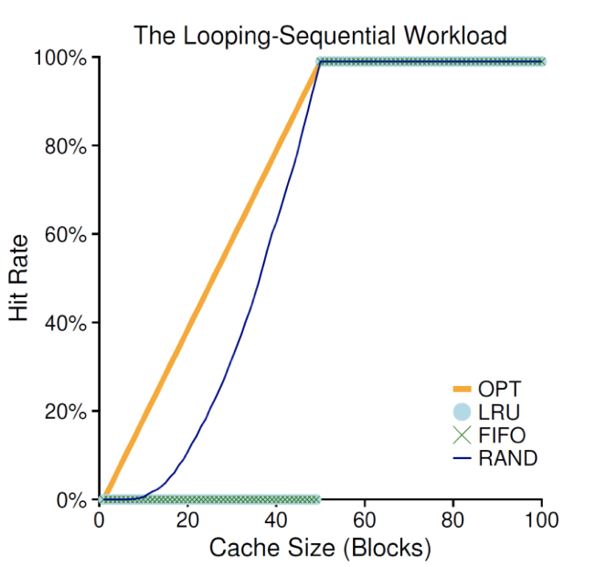

# 2.21 GC

> 所谓 Garbage Collection 事业。

## Textbook

### CS: APP

* 9.10
* 9.11

### OS: 3 Easy Pieces

* Chapter 22

## Outline

### CS: APP

* 垃圾回收
* C 语言中常见的、和内存相关的 Bugs

### OS: 3 Easy Pieces

* 缓存管理
* 最优的替换策略
* FIFO 策略
* 随机策略
* LRU 策略
* 具体应用

## Memory Management

### Conservative

在 C 中，不需要显式释放的空间只有「在栈上开的」那些。

例如，下面这段代码：

```c
some_scope {
    int x;
    float y;
    // do something
    
    return;
}
```

就不需要手动地释放 `x` 和 `y` 所占用的内存。

实际上，从汇编的角度来看，编译器实际上是生成了类似这样的代码：

```c
some_scope {
    // extend the stack
    %rsp -= 16;
    int *px, *py;
    
    // assign them on the stack
    px = %rsp + 8;
    py = %rsp;
    
    // shrink the stack back
    %rsp += 16;
}
```

就到此为止了。除此之外，C 中没有其他的隐式释放的策略。

例如，这么写的代码

```c
another_scope {
    int *p = malloc(1024);
    return;
}
```

之中，`malloc` 出来的那部分空间存在于 Heap 之中，不会被自动释放；好死不死，却把 `int *p` 所占用的空间释放了（指的是存放这个指针的空间，而非其指向的内存空间）。

`int *p` 的内容一旦丢失，就代表我们再也无法用正常手段释放这块空间了。

> 内存泄漏！

而 C 并没有 C++ 那样的、有隐式析构函数的 `class`，所以智能指针这套也就别想了。只能靠自己释放。

可能你会觉得这个问题太弱智，不会有人写出这种明显的内存泄漏代码。

但在函数体膨胀、运行分支复杂的时候，这一点就不那么明显了。例如，看下面的代码：

```c
dangerous_scope {
    int *p = malloc(4096);
    
    if (a > 0) {
        if (b > 0) {
            // memory leak!
            return;
        }
    }
    
    free(p);
    return;
}
```

很容易在某个分支之中过早 `return`，导致内存泄漏。

> 因此，早期出现了很多 C 的编码标准，「禁止」函数中途 `return`，以及那些「一处返回」的惯用法：

```c
// converge, and return

int hard_work() {
    int *p = malloc(1024);
    int err;
    
    if (a() < 0) {
        err = ERROR_A;
        goto ret;
    }
    
    if (b() < 0) {
        err = ERROR_B;
        goto ret;
    }
    
    if (c() < 0) {
        err = ERROR_C;
        goto ret;
    }

ret:
    free(p);
    return err;
}
```

> 这也是一种解决方案。
>
> 当然在 C++ 中，应该始终用智能指针式的策略；无论从任何位置 `return` 离开函数体，析构函数都会被调用。这样就可以随心所欲地 `return` 了。

### Fusion

C 中，`malloc` 和 `free` 的操作是需要用户显式地、正确地调用方可实现正常功能的。

同样，C++ 不仅继承了这一套，还加入了 `new`（`new []`）和 `delete`（`delete []`）。但是，由于 `class` 析构函数的特性，也可以实现基于引用计数、活跃 Scope 的自动回收。

因此，如果采用 `new T[N]` 来初始化数组，就必须在稍后 `delete []` 之；但如果使用的是 `std::vector<T>`，内存空间则会自动释放。

### Automatic

而更高级一些的语言，像是 Python、Java、………………（以及一万种语言），都是可以自动回收资源的。同时，（多数）不允许程序员掺合这一步骤。

> Sutter 云：「可以自行管理内存。」的另一面就是「得自己管理内存！」。哪一面都不是绝对的好事或坏事。

本节我们比较关心这一类「聪明」语言：她们的 GC 实现是怎样的？

## Implementation

### Question

我们先把问题想得简单一点：设想我们要给 C 语言加上 GC 功能（名叫 `gcc`（大雾））。即，`malloc` 功能照旧，但是不需要程序员编写 `free`，而是由编译器来分析源代码，判断在何处插入适合的 `free` 来回收内存，同时确保程序的运行如常（就是不要在还有代码引用这段内存的时候释放它）。

那么，很显然的一个问题来了：在何处释放它是安全的呢？

这个问题没有看起来那么简单。

### Pointers

很显然地，要引用一块内存地址，在 C 中只能通过「指针」来完成。假如我们要以「指针」来作为「是否引用一个内存块」的唯一判据，就至少要进行如下假设：

* 要能区分开「指针」和「非指针」。
	* 例如，`int *p = 0x40000` 和 `int v = 0x40000` 不能被混淆。
* 所有指针都指向块的开头。
	* 否则，`p[10]` 这样的数组下标访问就无法被视作是对内存块 `p` 的引用了。
* 不能够隐藏指针。
	* 例如「把指针转成整型，随後再转型回来使用」这种事不允许发生的。

### Example

来看一个实际的例子吧。

最显然的、环环相扣的内存访问实例，当然就是链表和树了。

```c
typedef struct List_
{
    struct List_ *link;
    int key;
} * List;

typedef struct Tree_
{
    int key;
    struct Tree_ *left;
    struct Tree_ *right;
} * Tree;

Tree make_tree();
void show_tree();
```

现在看一个简单的环状链表例子：

```c
#include <stdio.h>
#include "list_and_tree.h"

int main()
{
    List x = malloc(sizeof(struct List_));
    List y = malloc(sizeof(struct List_));

    x->link = y;
    x->key = 7;

    y->link = x;
    y->key = 9;

    while (1)
        ;
}
```


执行後的内存中，应该会存有这样的「垃圾」（货真价实）。

而树呢，情况就更复杂了：

```c
void build_tree()
{
	Tree p, r;
    int q;

    p = make_tree();
    r = p.right;
    q = r.key;

    show_tree(p);
}
```


栈上变量 `p`、`r` 作为指针引用着这棵树的不同部分。而 `int` 类型的 `q` 则不会体现出这种约束。只是个数字而已。

### Memory Graph's Approach

如何对程序的依赖进行分析？显而易见的应该使用图。

而且，为了体现出「相互依赖」的关系，这里我们采用有向图来表示。

把每一个内存块（而非语句块）都用图中的一个节点表示；每个指针都作为一条边出现在图中。

除此之外，当前分析 Scope 中的局部变量、以及全局变量作为整张图的根（Root）节点出现。他们不在 Heap 之中，不应该被释放；而他们就是内存依赖的基石。从他们之中能够被直接或间接访问的内存就不应该被释放；否则，就应该释放。

画成图的形式，大概就是这样：


这种策略可以很好地处理循环引用问题：即，两个垃圾互相引用彼此，他们算是有用的吗？

这种策略可以发现这些抱团的垃圾，并且释放他们。

> 问题也很明显：构造并维护这张图的开销很大。

### Mark & Sweep's Approach

这套策略的思路又不太一样。

首先，在内存足够的时候，完全不进行回收：要分配多少就往後 `sbrk`。但是，在每个分配块的头部保留 1 位，称之为 Mark Bit。

在内存不足的时候，Mark & Sweep 策略就开始了。

第一步（Mark）：跟 Graph 类似的策略，从已知不可动的 Root 块开始，迭代深入搜索，把所有不可移动的 Wired 块都标记为 Marked。

第二步（Sweep）：顺序地遍历一次所有块，释放那些 Unmarked 块。

这样做的好处就是平时的开销不大：只有在内存不足时才做一次清理。问题则是不稳定：搞不好某一次 `malloc` 运气不好，就碰上了内存不足，做一次 Mark & Sweep 开销极大。

## "Classical" Bugs

> Bug 恒久远，经典咏流传

### Dereferencing Bad Pointers

试图解引用一个无效的指针。

这么做的原因有很多，例如：

1. 手贱

```c
int main() {
    // dereferencing 0x42 will presumably fail
    int x = *(int *)0x42;
}
```

2. 没做返回值检查

```c
#define LUCKY 0
// no lucky...

int *try_allocate() {
    if (LUCKY) {
        return (int *)malloc(sizeof(int));
    } else {
        return NULL;
    }
}

int main() {
    int *p = try_allocate();
    
    // failure! dereferencing 0x0
    *p = 42;
}
```

3. 写错 `scanf`

```c
int main() {
    int val;
    // wrong! should pass &val
    scanf("%d", val);
    return val;
}
```

> 经典中的经典

### Reading Uninitialized Memory

「始终假定 `malloc` 出来的结果是全 0」是坏习惯。

```c
#include <stdio.h>

/* return y = Ax */
int *matvec(int **A, int *x)
{
    // too bad! should use calloc instead
    int *y = malloc(N * sizeof(int));
    int i, j;

    for (i = 0; i < N; i++)
        for (j = 0; j < N; j++)
            y[i] += A[i][j] * x[j];
    return y;
}
```

虽然大部分情况下这可能是对的，但是没有任何人保证过 `malloc` 出来的 Heap 内存就是全 0 的。

> 最遗憾的是，大部分时候这竟然是对的。

如果真的很依赖于这种保证，请在 `malloc` 之后立即 `memset`，或者直接用 `calloc`。

### Overwriting Memory

「读飞」的情况已经很糟糕了，而「写飞」只有更糟糕。

当然，也存在很多的情况：

1. 符号和无符号

```c
int values[] = { 1, 2, 3, 4, 5 };

int real_set_value(unsigned index, int value) {
    return values[index];
}

int set_value(int index, int value) {
    if (index >= 5) {
        return -1;
    }
    
    // too bad! (int) index was casted to (unsigned)
    return real_set_value(index, value);
}
```

这里，假如我们传入 `-1` 给 `get_const`，他会安全地通过 `index < 5` 的检查，并且进入 `real_get_const`。但是，在作为参数传入其中时，会产生有符号数到无符号数的转换；结果是一个很大的无符号数。这就会导致 `real_set_value` 写飞。

2. 分配空间计算错误

和 `calloc` 不同，`malloc` 的参数是以字节为单位的。也就是，我们很可能会不小心写出这种代码：

```c
int main() {
    // too bad! should be 10 * sizeof(int)
    int *array = malloc(10);
    for (int i = 0; i < 10; ++i) {
        array[i] = i * i;
    }
    
    return -1;
}
```

因为不可能有平台下的 `int` 只占用 1 字节（这是不合标准的），所以毫无疑问这段代码会写出缓冲区。

3. 不小心多写了一个

```c
int main() {
    int *array = calloc(10, sizeof(int));
    
    // too bad! should be i < 10
    for (int i = 0; i <= 10; ++i) {
        array[i] = i * i;
    }
    
    return -1;
}
```

你可能会说，多写了一个尾部，有很大的影响吗？

如果正在写的数组是 `char[]`，并且会被当作一个字符串读取的话，那么问题就大了——很可能不小心覆盖掉一个 `\0` 结束符，导致读取字符串时「读飞」。

4. 不带长度限制的字符串处理函数

例如，`sprintf` 这一「字符串打印函数」，就是不带长度限制的。

```c
char *pretty_format(int i) {
    char buf[10];
    sprintf(buf, "%04d", i);
    return buf;
}
```

这段代码会将 `i` 打印到缓冲区中，且若长度不足 4，会用 0 填充满 4 位。

但是，问题在于，如果传入的 `i` 很大，导致 10 字节长的 Buffer 放不下，就会导致写出异常。

> 注意这里的 `%04d` 中的 `4` 只指示了最小长度，而不限制最大长度。

同样的，从键盘获取输入而不检查长度的 `gets` 同样也存在这样的问题。

### Nostalgic Referencing & Releasing

使用一个指向「已不存在（被释放）的内存」的指针，应该绝对谨慎小心。

1. 返回栈指针：物是人非

```c
int *foo() {
    int val;
    return &val;
}
```

在 `foo()` 函数退出後，`val` 就被释放了。因此，任何调用 `foo()` 拿到的指针都是无效的。

提供栈指针给外部函数是完全没有必要的。拿到了也不能（安全地）使用。

2. 两次释放

拿着同一个指针，对一块内存释放了两次。

例如：

```c
void bar() {
    int *x, *y;
    
    x = malloc(N * sizeof(int));
    // play with x
    free(x);
    
    y = malloc(N * sizeof(int));
    // play with y;
    free(x);
    // !!! double-free x!
}
```

这几乎是肯定地会失败的。

> 可以改用这种形式的 `free(void **)`，传递 `free(&x)`，在释放之后自动清空 `x` 的值。

3. 引用已经被释放的块

```c
void baz() {
    int *x, *y;
    
    x = malloc(N * sizeof(int));
    // play with x
    free(x);
	
    y = malloc(N * sizeof(int));
    
    for (int i = 0; i < M; ++i) {
        // Evil!
        y[i] = x[i]++;
    }
}
```

不要跟已经被释放的块玩游戏。轻则读出不能理解的数据，重则直接 SegmentationFault。

### Memory Leaking

内存泄漏实在是太常见了。

忘记释放，过早 `return`，丢失指针，这都是有可能发生的。

Stay safe, and be well.

## Cache

为什么唐突地说道 Replacement Policy 呢？因为 GC 的驱逐策略让人联想到了这一点。

> 从此处开始，换看教材 OS: Three Easy Pieces。

### Terminologies

* AMAT
	* Average Memory Access Time
	* 平均内存访问时间
* T~M~
	* 从内存读取内容的耗时，大约是 100 纳秒（0.1 微秒）
* T~D~
	* 从磁盘读取内容的耗时，大概是 10 毫秒（10000 微秒）
* P~hit~
	* 缓存命中的概率
* P~miss~
	* 缓存不命中的概率

$$
\mathrm{AMAT} = P_{\mathrm{hit}} \times T_{\mathrm{M}} + P_{\mathrm{miss}} \times T_{\mathrm{D}}
$$

由于 $T_{\mathrm{D}} \gg T_{\mathrm{M}}$，因此 AMAT 关于 $P_{\mathrm{miss}}$ 较为显著。所以我们用 $P_{\mathrm{miss}}$ 来表记一个替代算法的有效性。

### Policies

#### Optimal Policy

> 也称为「上帝算法」。由 Belady 提出。

要使用这个策略的前提是：需要知道古往今来所有「缓存请求」的序列。在需要 Evict 一个条目的时候，选择哪个「在最远的将来被再用的」那个元素。

> 可以证明，不存在更好的替代策略（哪怕是对于任何一种特殊情况），使得 Miss Rate 更低。

例如，在已知访存序列 0、1、2、0、1、3、0、3、1、2、1，缓存容量为 3 的情况下，最优的策略是这样的：


> 缓存命中率是 $\dfrac 6 {11} \approx 54.5\%$。

#### FI, FO

先进，先出的策略。即，把缓存当作是一个队列，在需要 Evict 时，把进入 Cache 最早的那个元素清除出去。


> 缓存命中率是 $\dfrac 4 {11} \approx 36.4\%$。

#### Random

完完全全的随机。在需要 Evict 时，随便挑一个。

完全不稳定。看您的运气。

#### LRU

Least Recently Used。去看 Cache 那部分。

#### LFU

Least Frequently Used。去看 Cache 那部分。

> 基于假设：在过去（的一段时间内）最不常被访问的那个元素，在（可见的）将来也不太可能被经常访问。

> LRU 跟 LFU 共有的问题就是：保存那么多内存页的使用情况（无论是「上次被用的顺序」还是「被用的频率」）开销太大了。

### Example

#### No-Locality Workload


> 在一个完全没有局部性的引用序列中，大家的命中率都全凭运气。

#### 80-20 Workload

二八定律。即，在一个内存页之中，20% 的热门页面占了 80% 的引用；而剩下 80% 的冷门页面则只有 20% 的引用。

那么，在这个情景下的访问序列，可以看到下面的结果：


#### Looping Sequential Workload

严格地、顺序地循环访问 50 个页面。



> 显然，在 Cache Size >= 50 的情况下，缓存命中率肯定是 100%。
>
> 这种情况对 LRU 跟 FIFO 非常不友好（刚刚好每一次都把要用的页替换出去了）。

### Clock Algorithm

「钟」算法。

优点：几乎不占用额外的内存空间、实现跟 LRU 非常类似的效果。

#### Implementation

一个硬件式的实现。每一个页面对应一个 Bit；同时有一个 Ring 指向某一个 Bit。初始状态下大家都设定为 F。需要 Evict 的时候就开始转；经过一个为 F 的地方，就把它改成 T 然后继续；找到一个 T 就驱逐它，并设定为 F。

因为每一个页只占用 1 Bit，开销很低；而且由于硬件实现非常简单，因此速度超快。

#### Effects

面对二八工作集，效果是这样的：


可以看出，虽然跟真正的 LRU 略有差异，但已经足够好了。

