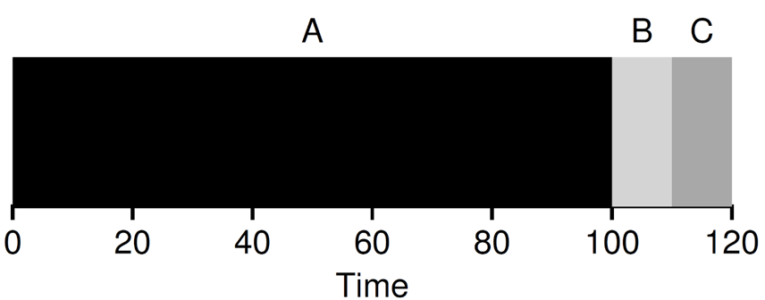
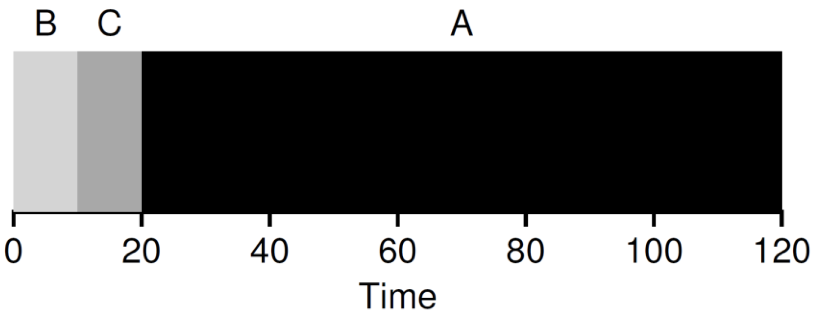
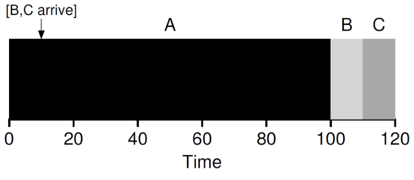
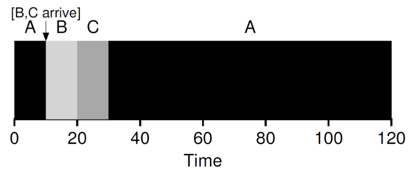
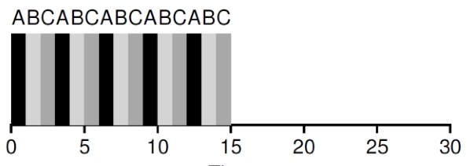
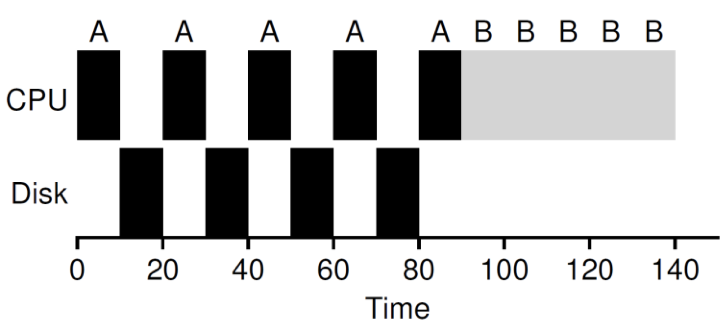
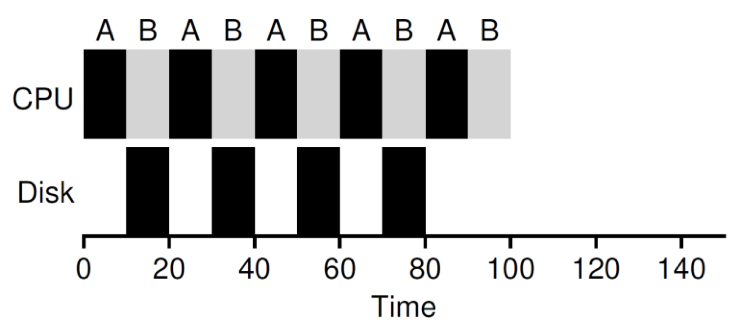

# 2.22 Scheduling

## Textbook

### OSTEP

* Chapter 7
* Chapter 8

## Outline

* 工作集
* 周转时间、响应时间
* FIFO、SJF、STCF
* Round Robin 调度
* 集成 I/O
* 多级反馈队列调度算法

## Abstract

* Mechanism
	* 所谓的「机制」。
	* 底层的方法或协议。
	* 不包括具体的实现。
	* 例如，Paging、Context Switch。
* Policy
	* 策略。
	* 基于「机制」的智慧。
	* 决策算法。
	* 例如，具体的调度策略、驱逐策略。

请注意区分两者的差异。

> 本节，我们会提到「任务调度」。

## Workload

### Metrics

#### Turnaround Time

也就是「周转时间」。

定义为「任务完成时刻」和「任务到来时刻」之间的时间。

#### Average Turnaround Time

平均的周转时间。把所有任务的周转时间求和，除以参与计算的任务数量。

#### Response Time

响应时间。定义为「任务第一次被调度的时刻」和「任务到来时刻」之间的时间。

> 提出响应时间的意义在于，对于某些分时操作系统而言，「完成了一部分」的任务也有意义。但是，完全没有被调度的任务对用户而言是无意义的；因此，尽量减少干等时间，对用户体验是有好处的。

#### Average Response Time

平均响应时间。把所有任务的响应时间求和，除以参与计算的任务数量。

### Lovely Assumptions

先考虑最简单的任务模型吧。

* 每个任务都消耗相同的时间
* 所有任务都在同时到来
* 任务不可以被中途打断
* 每个任务都只用 CPU，不依赖外部设备
* 每个任务的运行时间已知

> 当然，现实生活中的任务，以上条件一个都不满足。
>
> 残酷的现实啊

### Policies

来吧，我们来试试可能的几种调度策略。

#### First In, First Out

绝对有序队列。也被称为 First Come, First Served（FCFS）。

谁先来，谁先被处理；且一直到处理完成为止，不被打断。

> 如果多个任务同时到来，随机选择一个调度。

现在我们考虑去除了「条件一」的情形，即「不同的任务消耗不同的时间」。

这样，就有可能产生 Convey Effect——来得早、耗时长的任务导致了长时间的等待。

#### Shortest Job First

吸取 FIFO 的教训，在每次「需要调度新任务」的时候，我们选择预计耗时最短的那个任务上场。

现在，在耗时时间不等的任务一齐到来之际，调度器就会先安排执行耗时短的任务，而把耗时长的任务留到最後。

但是，现在我们取消掉假设二「所有任务都一齐到来」。会怎么样呢？

情况和上面类似；只不过，B、C 比 A 稍微晚到了一点。但是造成的结果就是他们不得不等在 A 的後面——因为 A 的调度已经开始，不能被打断。

那么，我们干脆同时废除掉假设三「一旦开始，任务不能被打断」。

#### Shortest Time-to-Completion First

改进之处是，每到来一个新任务，就触发一次调度。按照「离执行完成还剩余的时间」升序排序，尽量先把「快要完成了」的任务调度上去。

因此，面对上面的情形，B、C 到来时就会触发一次调度，把 A 换下来了。

最後，我们废除掉假设五：所有任务的执行时间已知。那么，SJF 和 STCF 都无法应用了。但是，这种「打断」的思路还可以留下来。

#### Round Robin

每隔一段时间，进行一次调度。所有任务做成一圈，轮流被调度。

因为也没有办法知道每个任务的预期耗时，因此也没有必要做区分、排序了。

一个一个慢慢来吧。反正最后都会结束的。

当然，一个执行完毕的任务会从任务环中被清除；新来的任务也是插入到任务环之中。

Round Robin 的客制化策略，大概就只有一个「调度频率」的问题了。

如何决定调度频率？实际上这是一个限制问题。

* 不能调度得太频繁。
	* 调度本身也有开销。
	* 要进入、退出内核态；要保存、恢复上下文。
	* 要刷 TLB。要清理指令预测、乱序执行的痕迹。
	* 这都是要花时间的。
* 也不能调度得太稀疏。
	* 总体上会延长任务的响应时间。
	* 或许，某些任务来了很久，都没被调度上一次。

最後，我们删除假设四「任务不会和 I/O 设备通信」。

为什么这是一个重要假设呢？因为如果任务和 I/O 设备有通信，那么 I/O 设备响应时间并不会纳入其调度时间内。

同时，这一部分「等待 I/O 响应的时间」也被浪费掉了——本来可以调度调度其他程序的。

换句话说，CPU 密集型的任务相比于 I/O 密集型的任务更不占优。

> 黑色和灰色部分各自代表一次调度中，A 和 B 受到的待遇。

#### Round Robin (I/O Inc.)

把 I/O 通信纳入考虑的 RR 算法如下：

* 当一个任务发出 I/O 请求时…

	* 通过一个系统调用，把请求发给 I/O 设备。

	* 打断这个等待中的任务，并且将此任务标记为不可调度。

	* 调度下一个任务。

	* > 不能让你干等。

* 当一个任务完成 I/O 请求时…

	* 一个中断来到 CPU 处。
	* 将原任务标记回可调度，但不立即调度他。
	* 在下一次 RR 到该任务时，他会收到请求成功的消息。

要诀就是：等 I/O 设备响应（这通常非常慢）时，不要让调用任务白等着。

将 I/O 请求和 CPU 调度重叠起来，能够最大化调度效率。

##MLFQ

> 多级反馈队列调度算法（Multi-Level Feedback Queue Scheduler）。

可以看出来，RR 算法完全不考虑「任务」剩余执行时间的问题，也不考虑其「使用率」的问题。

因此，他对任何进程都是「一视同仁」地放在 Round Robin 循环队列中，按照循环往复的规律调度他们。

但是，实际上我们有办法可以学习每个任务的「特性」，从而给出更好的调度策略。