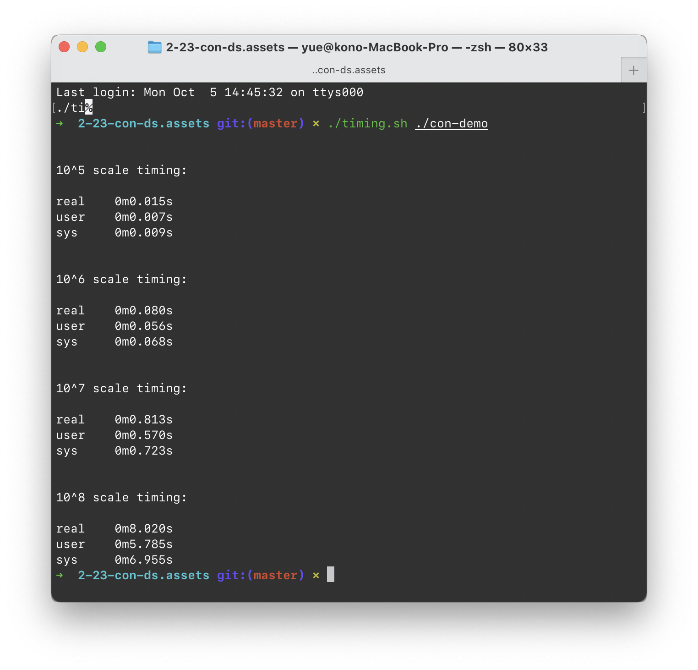
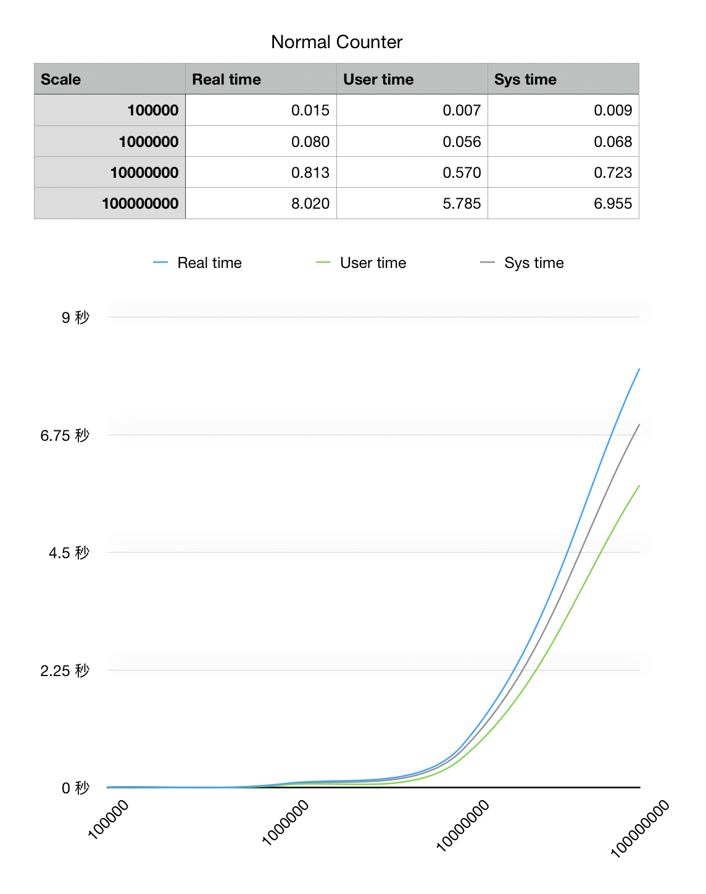
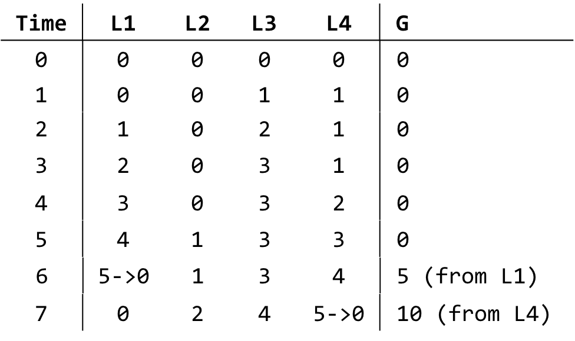
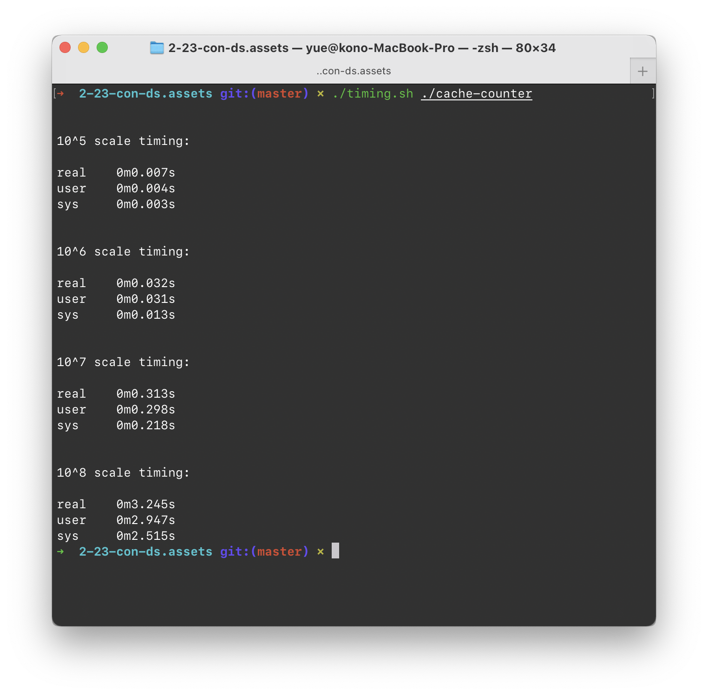
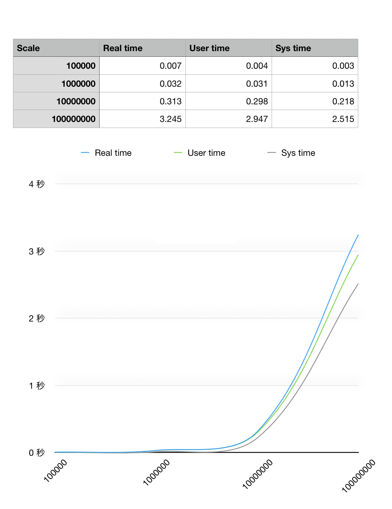
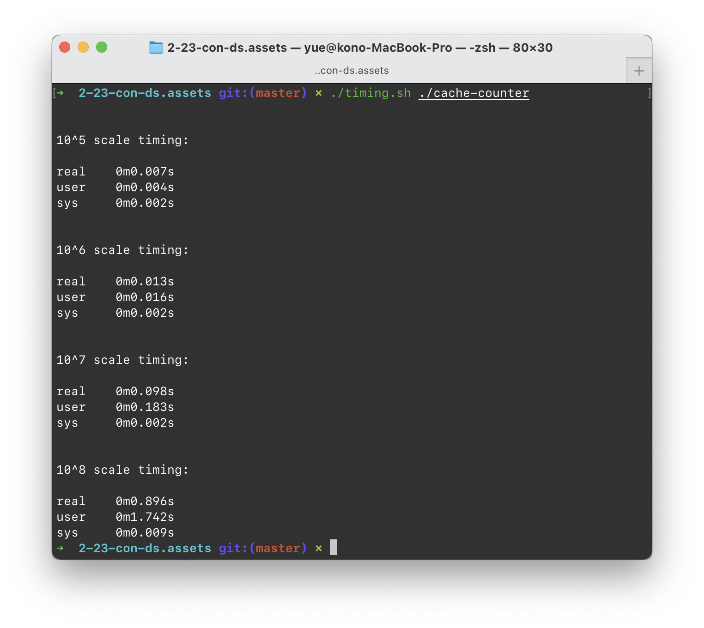
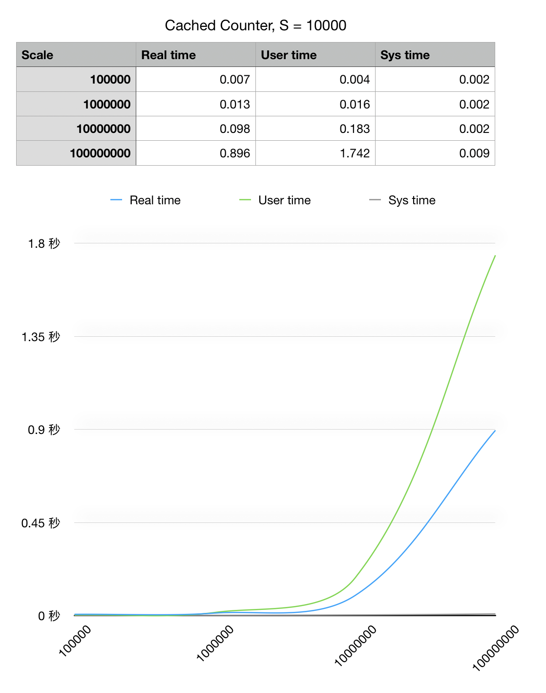
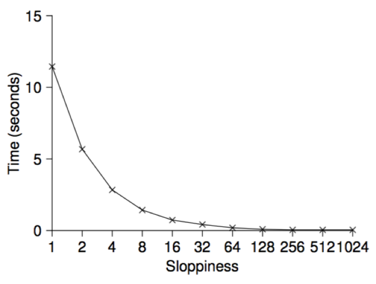
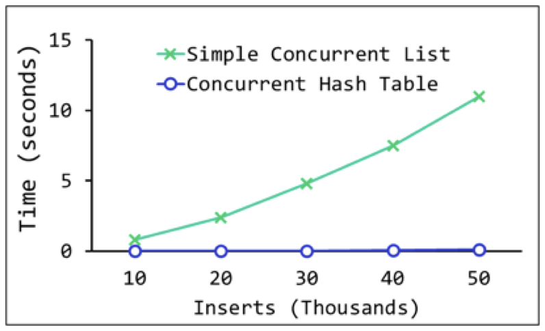

# 2.23 LbConDS

> 标题是 Lock-based Concurrent Data Structures 的简称。

要讨论的问题，是「基于锁的并发实现、所需要的数据结构」。

## Intro

### Protection

在我们开发「并发」程序时，最最需要注意的事情就是「保护」。

这里的情景并没有加害者和受害者之分；双方如果随便地交叉彼此的执行流，则程序有很大可能被破坏。

例如，看下面的「无保护」并发程序的例子：

```c
#include <iostream>
#include <thread>

static size_t number = 0;

void adder(size_t count)
{
    for (size_t i = 0; i < count; i++)
    {
        ++number;
    }
}

int main(int argc, char *argv[])
{
    assert(argc == 3);
    size_t count1 = std::stoi(argv[1]), count2 = std::stoi(argv[2]);
    auto thread1 = std::thread(adder, count1);
    auto thread2 = std::thread(adder, count2);

    thread1.join();
    thread2.join();
    std::cout << "I declare that " << count1 << " + " << count2 << " = " << number << "! (proudly)" << std::endl;
}
```

> 附：坑货 Apple Clang，编译默认不带 `-std=c++11`，捉了半天虫


可以看到，在没有保护的情况下，数量一大基本算不对。

### Lock it up

问题就在于：`++number`，即 `number = number + 1`，这件事情被打断了。

计算 `number + 1`、并赋给 `number`。如果两件事情之中插入了另一个线程，就造成了混乱和延迟。

即，在执行某一些操作时，我们是不希望有其他进程掺和进来的；这些中间状态如果被另一线程读到，就会产生问题。

> 把这些中间状态称为「Critical Section」。

为了保护程序执行关键段落时，没有其他人干扰，我们引入了「锁」。

```c++
class Lock {
public:
    Lock::Lock();
    Lock::~Lock();
    
    void get_lock();
    bool try_lock();
    void release_lock();
}
```

每一个 Lock 都只有两种状态：上锁和未上锁。调用 `get_lock()`，会导致调用者阻塞，直到该锁交给该调用者；`try_lock()` 如果当前锁空闲，则获取锁，并返回 `true`；如果当前锁不空闲，则返回 `false`。

`release_lock()` 用于锁持有者归还锁。

### POSIX

Posix 的实现叫做 `mutex`（**MUT**ual **EX**clusion，互斥量）。这也很形象：一个锁只有两个状态，同一时刻只能有一位持有。

初始化是这样的：

```c
#include <pthread.h>

// 第一初始化方法
pthread_mutex_t lock = PTHREAD_MUTEX_INITIALIZER;

// 第二初始化方法
pthread_mutex_t lock;
int rc = pthread_mutex_init(&lock, NULL);

// 第二初始化方法需要手动销毁，通过
pthread_mutex_destroy(&lock);
// 显式销毁时请确保锁已经被释放
```

拿锁和放锁是这样的：

```c
// 阻塞式上锁
pthread_mutex_lock(&lock);

// 尝试性上锁
pthread_mutex_trylock(&lock);

// 有超时的阻塞性上锁（最长阻塞这么长时间）
pthread_mutex_timedlock(&lock, TIMEOUT);
// TIMEOUT 是 struct timespec *类型

// 开锁
pthread_mutex_unlock(&lock);
```

### Usage

既然有了这一同步原语，我们就可以着手开始实现「多线程可用」的程序了。

#### Counter

首先来把我们的「多线程加法器」修改正确。

除去「锁」的初始化和销毁，关键代码就这么多：

```c++
pthread_mutex_lock(&mutex);
++number;
pthread_mutex_unlock(&mutex);
```


加上互斥量，计算就总是正确了。

更一般化的「Counter」递增器，同样是用一个全局锁就可以了。

```c++
class Counter {
public:
    Counter(int Value) {
        this->value = Value;
        pthread_mutex_init(&this->lock, NULL);
    }
    ~Counter() {
        pthread_mutex_destroy(&this->lock);
    }
    
    int getValue() { return this->value; }
    
    int increment() {
        pthread_mutex_lock(&this->lock);
        ++this->value;
        pthread_mutex_unlock(&this->lock);
    }
private:
    int value;
    pthread_mutex_t lock;
}
```

但是，随着使用您的优秀 Counter 实现的人越来越多，并发压力也越来越大。拿锁压力增大时，耗时自然延长。

下一段我们详细讨论「锁」对于「性能」的影响。

#### Linked List

链表的编辑，应该怎样才安全？

以具体的例子来看。

例如，对一个单向链表来说，增加一个节点的步骤是：

```python
def insert_node(node: Node, prev: Node):
    next = prev.next
    prev.next = node
    node.next = next
```

实际上就是更动「插入点前一个节点」的信息。但是，也同时涉及到「下一节点」的依赖；因为虽然没有更动其数据，但是如果在插入节点时，後一节点消失了，就会导致链表受损。

因此，需要连带地锁上插入点前後的节点。

删除节点很类似。

```python
def delete_node(node: Node, prev: Node):
    next = node.next
    prev.next = next
    del node
```

同样需要对删除节点前後的近邻节点进行上锁。

#### Queue

队列？大部分队列的实现都是基于链表，或者是用链表连接的小内存块（说的就是你，`std::queue`）。

总归一个思路：变更头部、尾部，不能放大为整块内存的更动。否则你这个 Queue 太低效率了。

参见上面的就好了。

### Performance

加锁会降低效率。这个当然，因为目的就是为了避免冲突；代价就是某些人得等一等，不能让任意代码以任意顺序执行。

但是，「效率的降低」也分级别；较好的锁实现，随着并发压力增大，时间延迟基本维持在一定水平；差劲的锁实现，会在并发压力增大时，爆炸式延迟。


那么，我们有没有更好的办法实现安全计算，同时使得效率更高呢？

#### Sloppy Counting

来看一个简单的例子。一枚有着 4 颗核心的 CPU，如果我们按照上面的「Simple Counter」方式来实现安全累加器，结果就是经常出现锁阻塞的情况——大家都得等。

先对我们目前的实现做一个简单的基准测试：



画成图是这样的：



很显然的一个结果是，我们这里尽力地保证了「每一次 Counter」都实时地落实到了公共 `counter` 上。但是这并不是必要的；例如，可以让每个 Counter 实例轮流更新 Counter，并且将它们写入的时间错开。



例如，在之前的实现之中，每一次增长都会同步地写入 Global Counter，从而造成其他四个线程的阻塞。可以理解成 `S = 1` 的特殊情况（不允许局部缓存）。

如果我们将 `S` 设定为 5，即「每收到 5 次指令」才去更新一次 Global Counter，可以想见的冲突会减少很多。

> 这里没有考虑最後几次调用能否成功写入的问题——解决方法很简单，加入超时机制即可。

在 Demo Counter 中，我们只要在每个子线程内包含一个局部变量，并且在其整除 `S` 时 Flush 即可。

特别的，我们在这里是知道总共 Increase 的次数的（作为参数传进来的），所以可以在最後干净地做收尾工作。





可以想见，`S` 调整得越大，效率就越高，但是精确性就越低。当然最终的正确性是可以保证的；但是在中途某一时刻中断执行、Local Cache 丢失所带来的代价就越高。

这是取 `S = 10000` 的效果：





如果规定 `S` 很大，甚至超过了我们测试的累加次数，那么结果就是完全放弃了实时正确性，仅仅在所有 Counter 结束後同步。

同样的，这带来的好处总归也有限——因为我们仍然需要保证「每个 Counter 内部累加的有序性」，因此最终这种优化方式存在天花板。



## Linked List

### Simple Version

简单的链表实现：

```c++
struct Node {
    int key;
    struct Node *next;
}

class List {
    struct Node *head;
    pthread_mutex_t lock;
    
    List() {
        pthread_mutex_init(&this->lock, NULL);
    }
    
    ~List() {
        pthread_mutex_destory(&this->lock);
    }
    
    void Insert(int key) throw (std::bad_alloc);
    void Modify(int key, int index) throw (std::bad_alloc);
    void Lookup(int index);
    void Delete(int index);
    
    int InsertSafe(int key);
    int ModifySafe(int key, int index);
    int LookupSafe(int index);
    int DeleteSafe(int index);
}
```

相当于是在普通的 List 中加了一把锁。

在不用考虑并发的情况下，代码可以这么写：

```c++
void List::Insert(int key) throw (std::bad_alloc) {
    Node *node = new Node(); // might throw std::bad_alloc
    node->key = key;
    node->next = this->head;
    this->head = node;
}
```

那么为了实现线程安全性，我们很自然地会这么写：

```c++
int List::InsertSafe(int key) {
    pthread_mutex_lock(&this->lock);
    List::Insert(key);
    pthread_mutex_unlock(&this->lock);
    return 0;
}
```

但是显然，`Insert` 函数没有考虑到分配失败的问题。

在 C  的 `malloc`（或者 C++ 的 `nothrow new`）失败时，会返回一个 NULL（或者 `nullptr`）指针。

而这里用的 C++ 普通 `new` 则会直接抛出 `std::bad_alloc` 异常。

因此 `InsertSafe` 可能会这么写错误处理代码：

```c++
int List::InsertSafe(int key) {
    pthread_mutex_lock(&this->lock);
    try {
    	List::Insert(key);
    } catch (std::bad_alloc) {
        std::cerr << "failed to allocate memory" << std::endl;
        // lock didn't get released!
        return -1;
    }
    pthread_mutex_unlock(&this->lock);
    return 0;
}
```

很明显的错误：过早返回导致死锁。

因此实际上我们一般会这么写代码：

```c++
int List::InsertSafe(int key) {
    pthread_mutex_lock(&this->lock);
    int err = 0;
    try {
    	List::Insert(key);
    } catch (std::bad_alloc) {
        err = 1;
        std::cerr << "failed to allocate memory" << std::endl;
        goto ret;
    }

ret:
    pthread_mutex_unlock(&this->lock);
    return 0;
}
```

通过「~~世界线~~控制流收束」到统一的释放代码，避免过早 `return`。

如果是 Python 的话可以用 `try - catch - finally` 的语法：

```python
def insertSafe(self, key: int) -> int:
    pthread_mutex_lock(self.lock)
    err: int = 0
    try:
    	self.insert(key)
    except std.BadAllocError:
        err = 1
        print("failed to allocate memory")
    finally:
		pthread_mutex_unlock(self.lock)
    	return err
```

确保释放代码总是被运行。

> 据说 Linux 内核中有 $40\%$ 的 Bug 都是因为「过早返回的控制流」造成的。

但是，有没有更好的办法？

考虑到一件事情：C++ 的 `new`（和 `delete`）师从 `xxalloc` 和 `free`，都是线程安全的。并且，用字面值设定新创建的对象的字段也不存在竞争。因此，我们可以尽量延迟拿锁的时间：

```c++
int List::InsertSafe(int key) {
    
    Node *node;
    try {
        node = new Node(); // might throw std::bad_alloc
    } catch (std::bad_alloc) {
        return -1;
    }
    node->key = key;
    
    // everything above isn't related to concurrency
    
    pthread_mutex_lock(&this->lock);
    node->next = this->head;
    this->head = node;
    pthread_mutex_unlock(&this->lock);
    return 0;
}
```

这样，连带地把 Early-Return 的 Bug 修了，同时还提高了性能（分配内存时没有必要占锁）。

但是，`Lookup` 就没那么好运；基本全是指针遍历，都得加锁。

```c++
int List::LookupSafe(int key) {
    int rv = -1;
    pthread_mutex_lock(&this->lock);
    Node *current = this->head;
    while (current) {
        if (current->key == key) {
            rv = 0;
            break;
        }
        current = current->next;
    }
    pthread_mutex_unlock(&this->lock);
    return rv;
}
```

> `Lookup` 还挺简单的，如果有这个 Key 就返回 0；否则返回 1。

### Optimization Idea

可能会想：「拿一把全局的大锁多耗时啊！应该对每一个节点分别加锁，避免大家一起等。」

这种思路称之为 Lock Coupling。由一大串锁链组成。尽管他确实减少了一些竞争，但是遗憾的是光是在那么多位置拿锁、等锁就会产生大量的 Overhead，最终导致这一方案完全不可行。

> MORE CONCURRENCY ISN'T NECESSARILY FASTER!
>
> 并非把程序并行起来，它的运行就会加快！如果你的锁设计写得不好，轻则性能降低，重则产生错误。

但是，对于特殊的 QueueList，其所有操作仅有「Enqueue」和「Dequeue」，这样如果我们对队头元素和队尾元素加锁的话，就能有效地提升性能（在元素较多的情况下，Enqueue 和 Dequeue 实现并行）。

## Hash Table

另一种「加速」的策略。

既然我们直接把链表拆成一个个的锁，粒度太细，那么干脆采用 Hashtable 的方式，把锁拆分成若干个 Bucket 进行处理。

```python
class NodeList:
    pass
    # containing node list definitions

class HashList:
    
    bucket_count: int
    buckets: list[NodeList]
    
    def __init__(self, bucket_count: int):
        self.bucket_count = bucket_count
        self.buckets = []
        for _ in range(bucket_count):
            self.buckets.append(NodeList())
            
    def insert(key: int):
        buckets[key % bucket_count].insert(key)
        
    def lookup(key: int) -> bool:
        return buckets[key % bucket_count].lookup(key)
```

这样，落在不同 Buckets 中的 `key` 操作便不会互相竞争了。真好！



> 可以看到性能提升很大。

