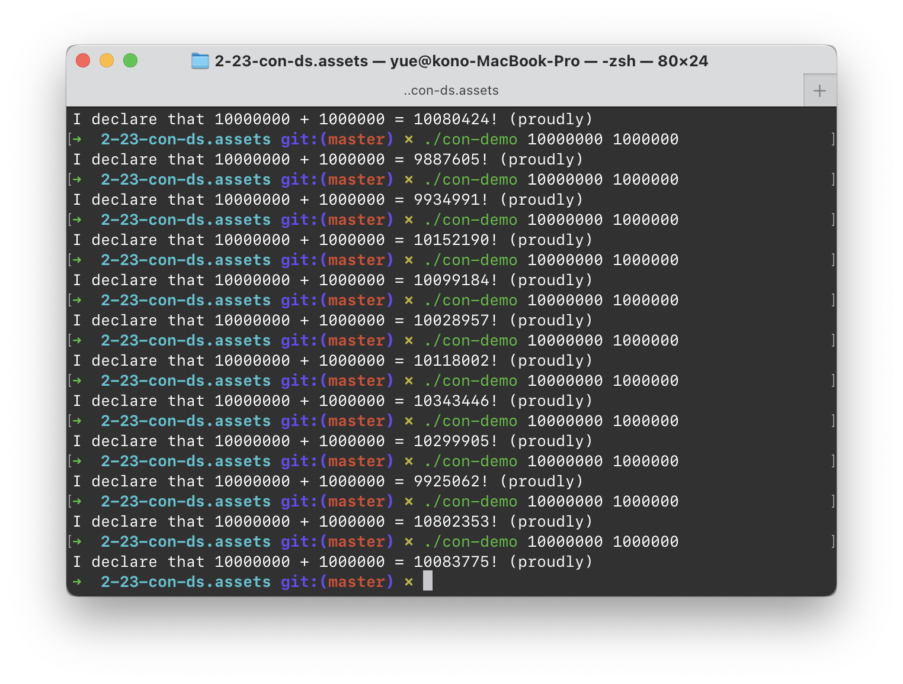
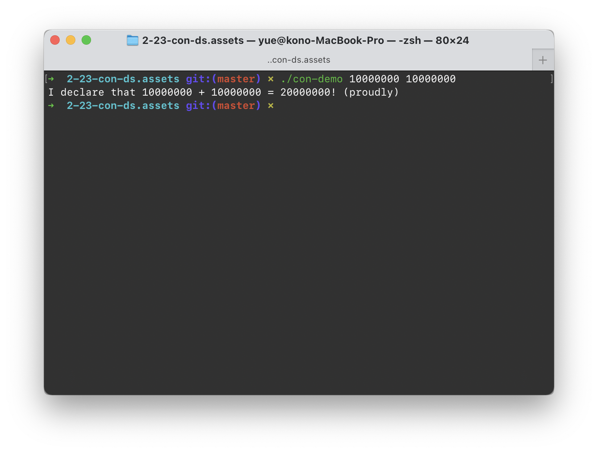
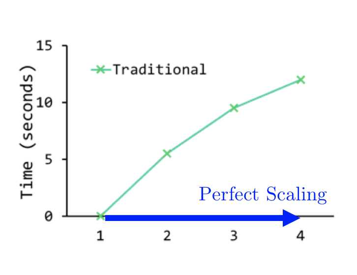

# 2.23 LbConDS

> 标题是 Lock-based Concurrent Data Structures 的简称。

要讨论的问题，是「基于锁的并发实现、所需要的数据结构」。

## Concurrency

### Protection

在我们开发「并发」程序时，最最需要注意的事情就是「保护」。

这里的情景并没有加害者和受害者之分；双方如果随便地交叉彼此的执行流，则程序有很大可能被破坏。

例如，看下面的「无保护」并发程序的例子：

```c
#include <iostream>
#include <thread>

static size_t number = 0;

void adder(size_t count)
{
    for (size_t i = 0; i < count; i++)
    {
        ++number;
    }
}

int main(int argc, char *argv[])
{
    assert(argc == 3);
    size_t count1 = std::stoi(argv[1]), count2 = std::stoi(argv[2]);
    auto thread1 = std::thread(adder, count1);
    auto thread2 = std::thread(adder, count2);

    thread1.join();
    thread2.join();
    std::cout << "I declare that " << count1 << " + " << count2 << " = " << number << "! (proudly)" << std::endl;
}
```

> 附：坑货 Apple Clang，编译默认不带 `-std=c++11`，捉了半天虫



可以看到，在没有保护的情况下，数量一大基本算不对。

### Lock it up

问题就在于：`++number`，即 `number = number + 1`，这件事情被打断了。

计算 `number + 1`、并赋给 `number`。如果两件事情之中插入了另一个线程，就造成了混乱和延迟。

即，在执行某一些操作时，我们是不希望有其他进程掺和进来的；这些中间状态如果被另一线程读到，就会产生问题。

> 把这些中间状态称为「Critical Section」。

为了保护程序执行关键段落时，没有其他人干扰，我们引入了「锁」。

```c++
class Lock {
public:
    Lock::Lock();
    Lock::~Lock();
    
    void get_lock();
    bool try_lock();
    void release_lock();
}
```

每一个 Lock 都只有两种状态：上锁和未上锁。调用 `get_lock()`，会导致调用者阻塞，直到该锁交给该调用者；`try_lock()` 如果当前锁空闲，则获取锁，并返回 `true`；如果当前锁不空闲，则返回 `false`。

`release_lock()` 用于锁持有者归还锁。

### POSIX

Posix 的实现叫做 `mutex`（**MUT**ual **EX**clusion，互斥量）。这也很形象：一个锁只有两个状态，同一时刻只能有一位持有。

初始化是这样的：

```c
#include <pthread.h>

// 第一初始化方法
pthread_mutex_t lock = PTHREAD_MUTEX_INITIALIZER;

// 第二初始化方法
pthread_mutex_t lock;
int rc = pthread_mutex_init(&lock, NULL);

// 第二初始化方法需要手动销毁，通过
pthread_mutex_destroy(&lock);
// 显式销毁时请确保锁已经被释放
```

拿锁和放锁是这样的：

```c
// 阻塞式上锁
pthread_mutex_lock(&lock);

// 尝试性上锁
pthread_mutex_trylock(&lock);

// 有超时的阻塞性上锁（最长阻塞这么长时间）
pthread_mutex_timedlock(&lock, TIMEOUT);
// TIMEOUT 是 struct timespec *类型

// 开锁
pthread_mutex_unlock(&lock);
```

### Usage

既然有了这一同步原语，我们就可以着手开始实现「多线程可用」的程序了。

#### Counter

首先来把我们的「多线程加法器」修改正确。

除去「锁」的初始化和销毁，关键代码就这么多：

```c++
pthread_mutex_lock(&mutex);
++number;
pthread_mutex_unlock(&mutex);
```



加上互斥量，计算就总是正确了。

更一般化的「Counter」递增器，同样是用一个全局锁就可以了。

```c++
class Counter {
public:
    Counter(int Value) {
        this->value = Value;
        pthread_mutex_init(&this->lock, NULL);
    }
    ~Counter() {
        pthread_mutex_destroy(&this->lock);
    }
    
    int getValue() { return this->value; }
    
    int increment() {
        pthread_mutex_lock(&this->lock);
        ++this->value;
        pthread_mutex_unlock(&this->lock);
    }
private:
    int value;
    pthread_mutex_t lock;
}
```

但是，随着使用您的优秀 Counter 实现的人越来越多，并发压力也越来越大。拿锁压力增大时，耗时自然延长。



下一段我们详细讨论「锁」对于「性能」的影响。

#### Linked List

链表的编辑，应该怎样才安全？

以具体的例子来看。

例如，对一个单向链表来说，增加一个节点的步骤是：

```python
def insert_node(node: Node, prev: Node):
    next = prev.next
    prev.next = node
    node.next = next
```

实际上就是更动「插入点前一个节点」的信息。但是，也同时涉及到「下一节点」的依赖；因为虽然没有更动其数据，但是如果在插入节点时，後一节点消失了，就会导致链表受损。

因此，需要连带地锁上插入点前後的节点。

删除节点很类似。

```python
def delete_node(node: Node, prev: Node):
    next = node.next
    prev.next = next
    del node
```

同样需要对删除节点前後的近邻节点进行上锁。

#### Queue

队列？大部分队列的实现都是基于链表，或者是用链表连接的小内存块（说的就是你，`std::queue`）。

总归一个思路：变更头部、尾部，不能放大为整块内存的更动。否则你这个 Queue 太低效率了。

参见上面的就好了。

### Performance

加锁会降低效率。这个当然，因为目的就是为了避免冲突；代价就是某些人得等一等。

