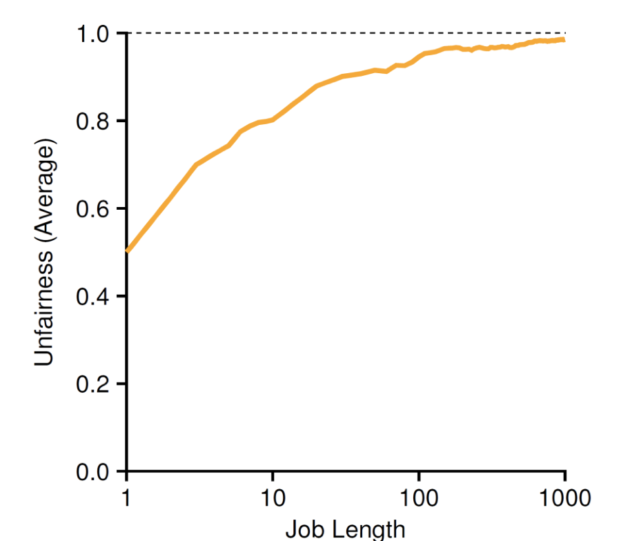

# 2.24 Schedule

## Textbook

### OSTEP

* Chapter 9
* Chapter 10

## Outline

* Proportional-Share Scheduler
* Multiprocessor Scheduler

## Scheduler

### Intro

上面的「锁」说到底，是凭运气的。如果多人同时来请求同一块资源，究竟谁能拿到是不确定的。

即，存在潜在的「饿死」可能——如果一个进程运气不好，一直拿不到资源的话。

因此，我们提出了一种「Proportional-Share」的调度器，他可以公平地进行资源分配调度。

> 注意，这里的公平并不是「人人平等」（享有同样的调度权），而是确保了在整个系统运行的过程中，每个进程占有资源比例的总和接近于一个预先设定好的值。
>
> > OS 特色公平

### Examples

#### Lottery Scheduling

最简单而容易实现的一种公平锁实现。

> 还记得 CSE、OS 吗？

思路很简单：无论谁请求资源，都会得到一张 Ticket。随后资源管理者根据 Ticket 叫号。

这就排除了随机因素，确保了资源请求者不至于饿死。

为了实现不同特权级的资源分配，只需要发放不同数量的 Ticket 即可。

> 这里，并没有「一定要按照 Ticket 生成的顺序进行调度」的限制。
>
> 实际上，大家可能都持有 $W_i$ 张 Ticket（不同的数量决定了其权值）。这样，乱序地选择幸运 Ticket 更适合调度场景。

##### Ticket Transfer

考虑这种情况：对于一个运行在本地的 Client − Server 模型程序组，在 Client 通过 RPC 发送请求给 Server 之後，她或许也希望把目前自己持有的 Ticket 也一并发给 Server。毕竟：

* Client 在发送请求之後、收到 Server 回覆之前不能做什么有价值的工作。至多也就是循环等待而已。
* Server 如果不能持有 Ticket，那么他就无法处理 Client 的请求。

如果 Server 能够继承来自 Client 的 Ticket，在处理结束後返还 Ticket，那么就抵消了大部分的 RPC 开销（当然上下文切换的还是免不掉），和 App 内线程通信的方式相比也不差太多。

##### Fairness

如何衡量一个调度算法的公平性呢？采用这种方法来估计：

* 给出两个相互竞争的 Jobs
* 每一个都有同样数量的 Tickets（例如，100）

但是，对每个调度算法来说，他们各自占用资源的时间 $T$ 就有一定的分歧了。

我们重复进行 $R$ 次实验，那么 $U = \lvert \dfrac {2T} R \rvert$ 就可以用来表示调度算法偏差的多少了。



> 做一下模拟实验，可以发现任务的耗时越长，$U$ 就越是接近于 $1$，从而公平性越高。

#### Stride Scheduling

虽然说 Job Length 越长，Unfairness 越小。但说到底这还是个随机算法。饿死的可能性虽然比随机调度的可能性小了，但还是存在。

要想规避这种情况，除非去除「随机元素」，彻底做一个 Determined 算法。

把 Ticket 的序列改成形如 $[a, b]$ 描述的区间。在调度时，确定地在区域内以一定的 Stride 步进，落到谁的区间内谁就获得调度权。

> 如果正确地选择区间大小和步进大小，就可以实现确定的均匀调度算法——确定在每一个周期内，持有相应 Ticket 的进程都被调度成比例的次数。

伪代码如下：

```python
while True:
    # 挑一个 queue 头部的 Client
    current = queue.deque()
    
    # 调度之
    schedule(current)
    
    # 以给定的 stride 步进
    current.passport += stride
    
    # 把它放回队列中
    queue.insert(current)
```

> 当然，Lottery Scheduling 也有好处。例如，他不需要维护一个全局的状态；只要每个拿到 Ticket 的人负责把它传递下去，就好了。

## Multiprocessor

考虑「多核心」的情况。

### Problems

多颗处理器核心引入了什么新问题呢？

* Cache Coherence
* Synchronization
* Cache Affinity
* ……

#### Cache Coherence

众所周知，每颗 CPU 核心都有自己的 Cache（缓存），至少 L1、L2 级是这样的。

这样就带来了「各家缓存不一致」的可能。

#### Synchronization

老生常谈同步问题。指令以任意顺序交错执行，还能否保持正确性？

#### Cache Affinity

程序在调度时，会比较期望自己被在同一颗 CPU 核心上调度。因为这样可以尽量提高自己的缓存命中率。如果程序的调度核心持续改换，那么局部性也就无从谈起了。

> 因此 OS Lab 中，在每个进程上下文中都提供了一个 Affinity，用来指定该进程希望被调度在哪一颗 CPU 核心上。

### Strategies

