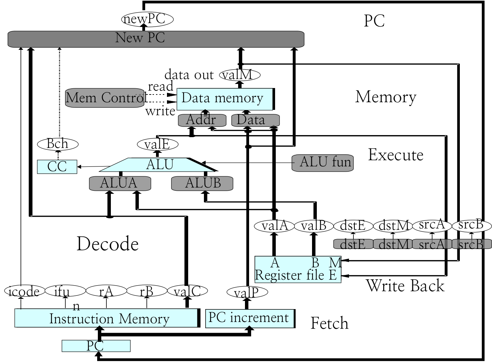
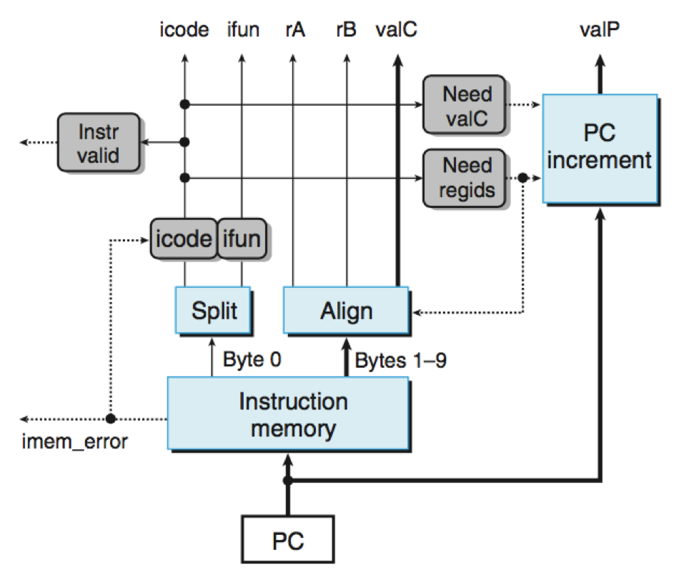
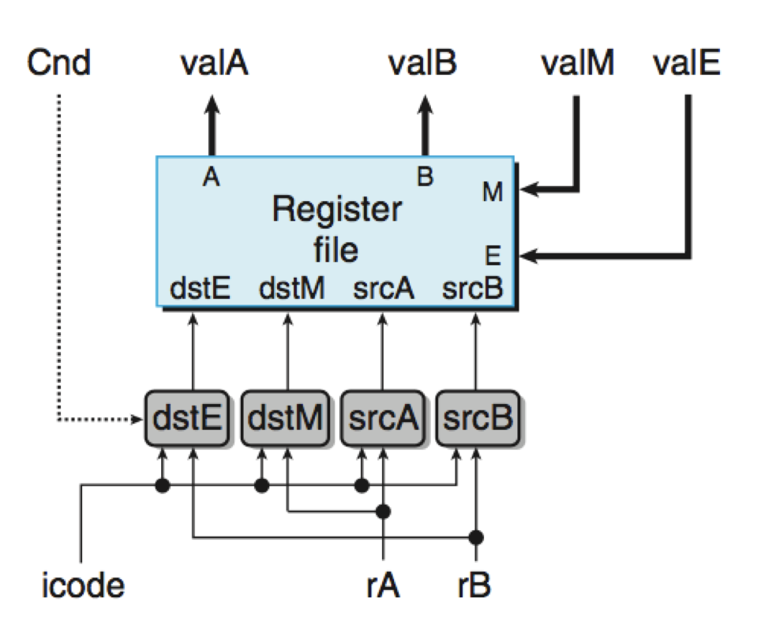
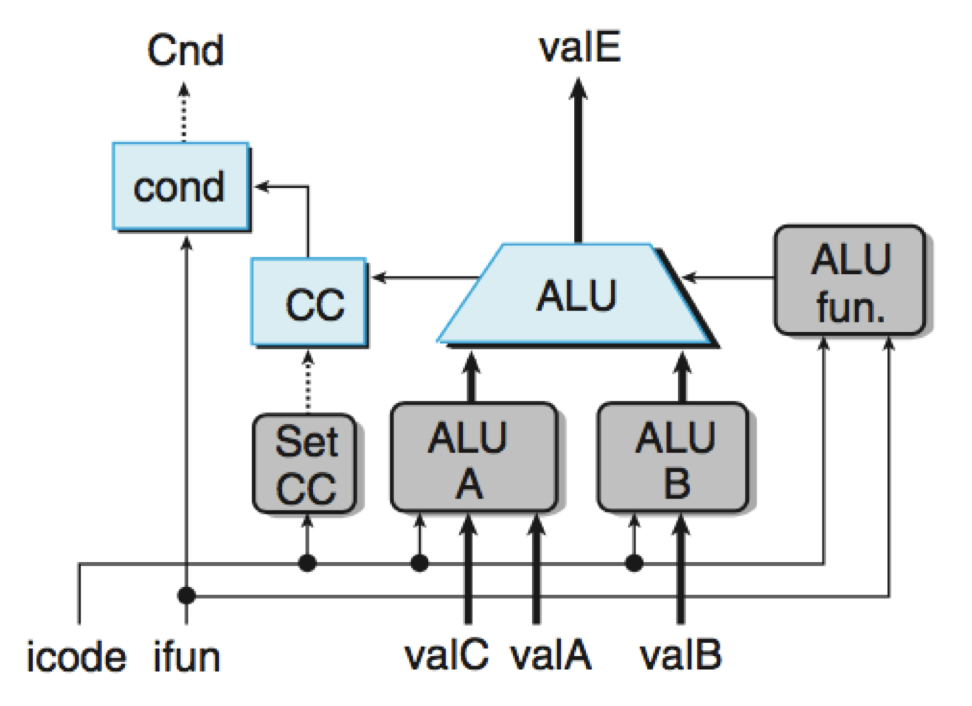
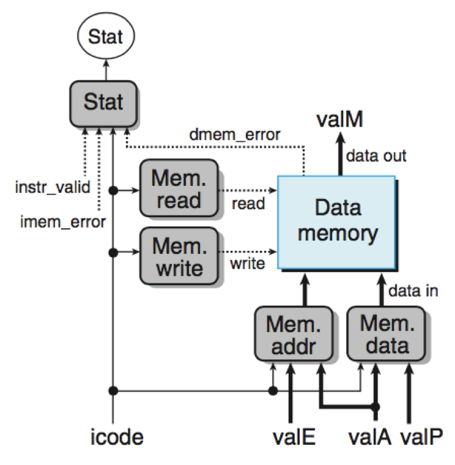
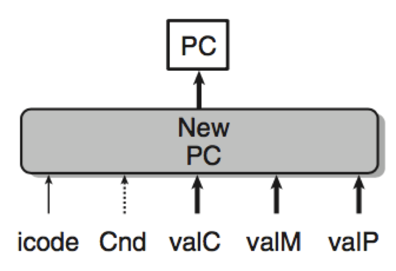
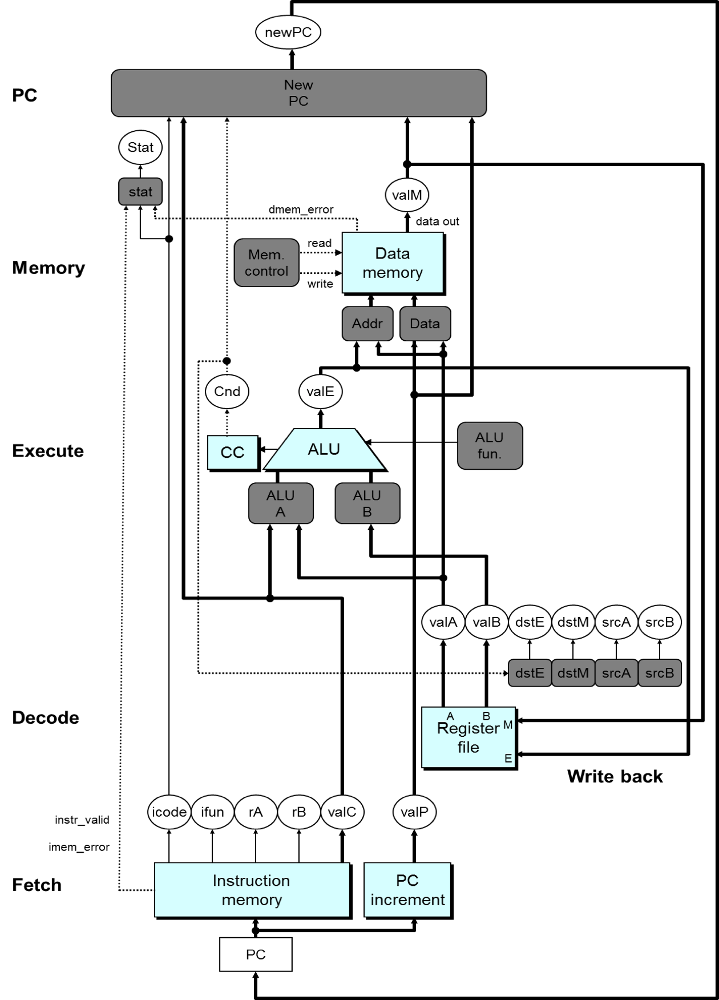

# 2.3 Sequential CPU III

## Textbook

* 4.3.4

## Outline

这里主要讲如何用硬件指令实现一颗顺序执行的 CPU。

## Sequential CPU

### Hardware Structure

硬件上来说，这颗 CPU 可以画成这样。

其中，不同的色块代表不同的意义。

*  蓝框代表预先设计好的、有特殊功能的硬件模块。
*  灰框代表我们写的 HCL 控制指令。
*  白色椭圆，代表 Labels 或者 Signals。
* 粗线条，代表一个 64 位的值。
* 细线条，代表一个 4 到 8 位的值。
* 虚线条，代表单个标识位的值。

### Fetch Logic

我们先来看看取指部分的逻辑。

预先定义好的硬件块有：

* PC（寄存器，保存程序计数器的值）
* Instruction Memory（指令内存，最多保存 10 字节的指令内容）
* Split（指令分割器，负责将保存 Instruction 的字节（第一个字节）分割成 `icode` 和 `ifun`。）
* Align（对齐器，负责获取 `rA`、`rB`、`valC` 的值）
* PC Increment（PC 递增器，负责计算在内存中紧邻着的下一条指令的内存地址，并将其存放到 `valP` 之中。）

需要进行的控制判断包括：

* 这条指令合法吗？
	* 如果不合法，应该由 `icode` 部分的逻辑提出异议。
* 这条指令需要寄存器 ID 吗？需要几个？
	* 因此 `icode` 逻辑需要跟 Align 互通，确保其取出了指令需要的值；并且由 `Need regids` 模块处理。
* 这条指令需要立即数（`valC`）吗？
	* 因此 `icode` 逻辑需要跟 Align 互通，并且由 `Need valC` 模块处理。
* 没有办法取出地址？
	* 如果遇到了 `imem_error`，即无法从内存中取出指令的情况，应该将这条指令设定为 `nop`，即什么也不做。

### Decode & Write Back Logic

这两个步骤共享同一部分模块。（他们都可以同时操作两个寄存器。）

根据 `icode`，确定是启用「读」模式还是启用「写」模式。然后，分配 `rA` 跟 `rB`。

注意，`rA` 在读时指向 `srcA`，在写时指向 `dstM`；`rB` 在读时指向 `srcB`，在写时指向 `dstE`。

另外，`Cnd` 也会来掺一脚；假如 `Cnd` 的值不是 `true`，则不会发生实际的写入。

#### `srcA`

这个读寄存器的值在 `icode` 属于 `IRRMOVQ`、`IRMMOVQ`、`IPOQ`、`IPUSHQ` 时，会通过指令中的 `rA` 给出；在 `icode` 属于 `IPOPQ`、`IRET` 时则会默认为 `RRSP`。否则，不需要 `srcA`，将其设置为 `RNONE`。

#### `dstE`

这个写寄存器的值在 `icode` 属于 `IRRMOVQ`、`IIRMOVQ`、`IOPQ` 时会通过指令中的 `rB` 给出；在 `icode` 属于 `IPUSHQ`、`IPOPQ`、`ICALL`、`IRET` 时则会默认为 `RRSP`。否则，不需要 `dstE`，将其设置为 `RNONE`。

> 当然，假如 `Cnd` 不为真，那么直接设 `RNONE` 即可。

`srcB` 和 `dstM` 的语句类似。参照上一节中每条指令所用到的寄存器值即可。

### Execute Logic

预先定义好的最重要的模块就是算术运算单元 ALU。

以及 CC，一个包含三个状态位的寄存器。

还有 `cond`，负责根据 `ifun` 和 `CC` 值判断当前条件是否满足。返回一个真/假 Bit。

运算的结果会默认放到 `valE` 里去。

#### Control Logic

其中，`Set CC` 判断此指令是否需要更新 CC。

> 假如 `icode` 是条算术运算指令，那么就应该更新 CC；否则，如果是为了计算有效地址而进入 Execute Logic，那就不需要更新 CC。

`ALU A` 指进入算术单元的第一个运算值。

> 可能的取值包括 `valA`、`valC`、`+8`、`-8`。具体来说，`IRRMOVQ` 和 `IOPQ` 以 `valA` 作为第一个值；`IIRMOVQ`、`IRMMOVQ`、`IMRMOVQ` 以 `valC` 作为第一个运算值；`ICALL`、`IPUSHQ ` 是 `-8`（因为需要增加栈），`IRET`、`IPOPQ` 是 `+8`（收缩栈）。

`ALU B` 指进入算术单元的第二个运算值。

> 可能的取值包括 `valB`、`0`。

`ALU fun` 判断对这两个操作数施加什么操作。对于 `IOPQ`，直接根据其在 `ifun` 中指定的来。对于计算内存偏移量的指令，则默认制定为 `+` 即可。

#### Memory Logic

和 Decode & Write Back 的逻辑类似。在一个时钟周期里，只能对单一一个内存地址做一次读，或者做一次写。

由 `icode` 决定是进行读还是写。如果是读，则由 `Mem addr` 算出要读的内存地址，并写到 `valM` 里；如果是写，则由 `Mem data` 算出要写的值。

`Mem addr` 在 `icode` 属于 `IRRMOVQ`、`IPUSHQ`、`ICALL`、`IMRMOVQ` 时，采用 `valE` 作为目标地址（指令给出的那个地址）。而在 `icode` 属于 `IPOPQ`、`IRET` 时，采用 `valA` 作为目标内存地址（`RRSP` 里拿出来的地址）。

至于判断是读是写…这太简单了，就不说了。

### PC Update Logic

这是比较有趣的一块逻辑。

主要原因是，存在「顺序往下执行」和「进行跳转」两种情况。

在「是 CALL 指令」的情况下，不由分说将 PC 设置为 `valC`。

在「是 RET 指令」的情况下，应该将 PC 设置为刚从栈上拿下来的那个地址 `valM`。

在「是跳转指令」而且「`Cnd` 被满足」的情况下，将 PC 设置为 `valC`（Fetch 阶段就拿到的目标位置）；

除开以上的所有情况，应该不进行跳转，正常往下执行，即拿出 Fetch 阶段中早就算好的 `valP` 放入 PC，准备下次取指。

## Summary

整张图就是这样。

每条指令都用简单的步骤来描述。

基本每条指令都遵循同样的数据流和控制流。

由控制逻辑模块将他们相连。

问题很明显，就是慢。一个时钟周期内，大部分模块都会闲置。

下一节，我们来找找解决方案吧（流水线）。