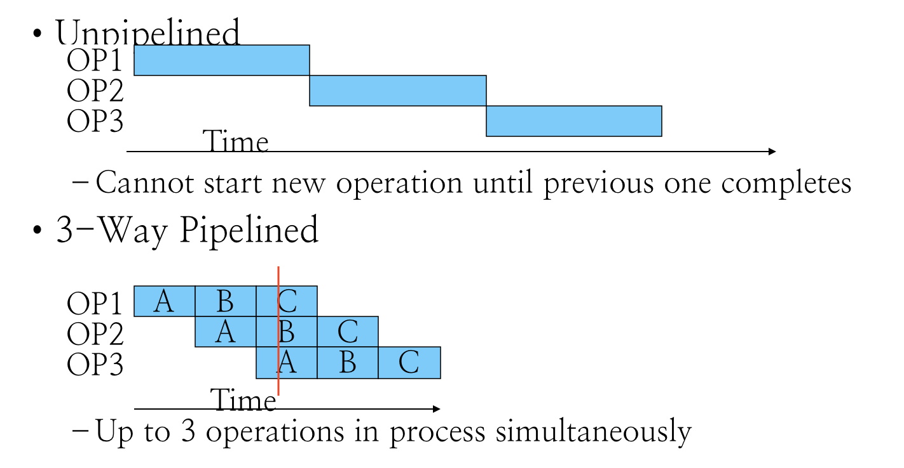
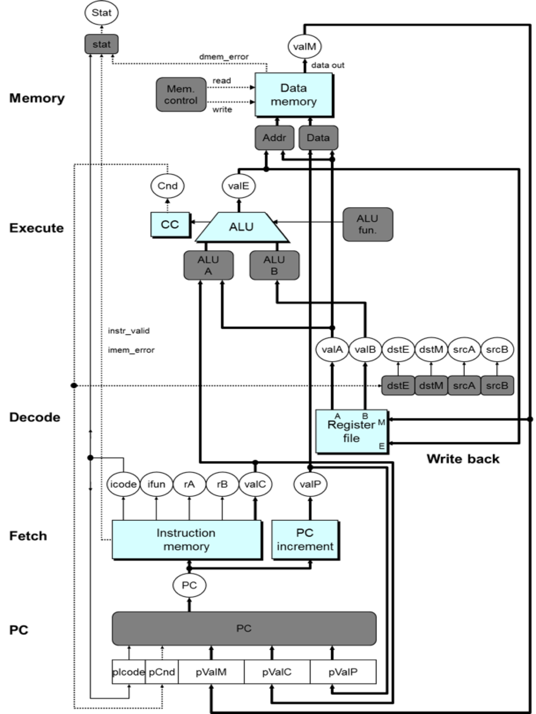
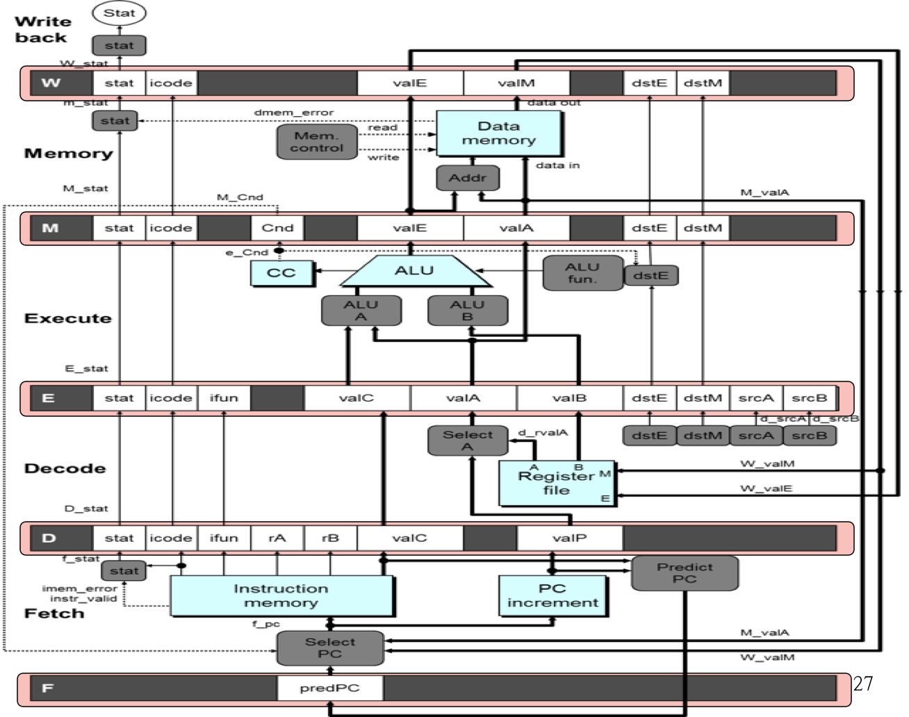
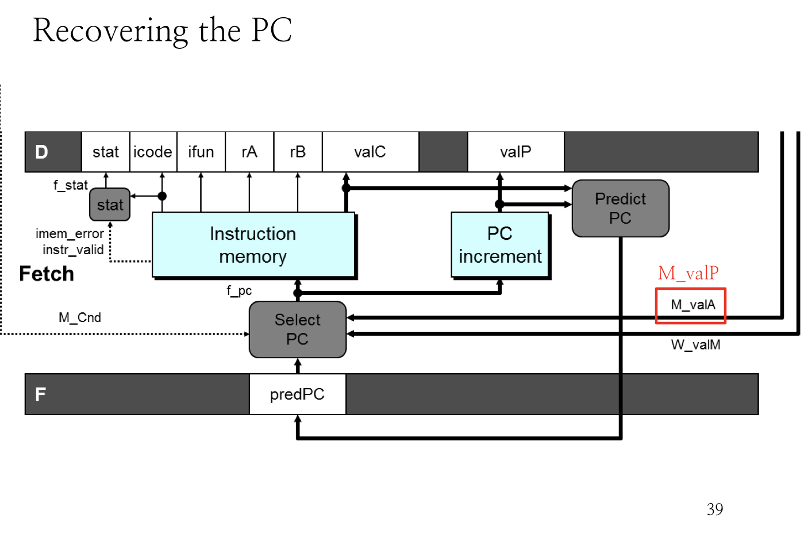
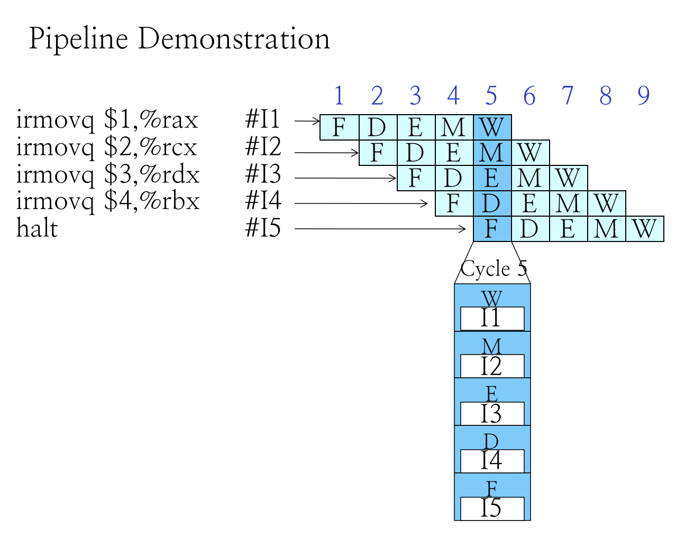

# 2.4 Principles of Pipeline

## Textbook

* 4.4
* 4.5.1 ~ 4.5.4

## Outline

* Goal of Pipelining
* Difficulties of Pipelining
* SEQ+  Implementations
* Naïve PIPE implementation
* Pipeline Feedback

## Pipelining

### Intro

首先，我们的 Sequential CPU 实现似乎没有任何问题：六个 Stage 独立的硬件单元协同工作来处理一条指令。

然而，致命的问题是：在执行一条指令期间，每一个 Stage 大约有 $\dfrac 5 6$ 的时间都是闲置的，在等待其他 Stage 处理信息。这也导致这种实现方法非常慢。

那么，我们能否提升指令处理的密度，以填满所有 Stage 的时钟周期呢？当然可以！

### Idea

可以看到，在实际生活中，也存在这种多 Stage 的系统；但是，并不一定要处理完成一个请求后，才能接受下一个请求，而是让 $n$ 个阶段的系统中同时处理 $n$ 个请求，流水线化的系统可以成 $n$ 倍提升效率。

然而实际上每个 Stage 所耗费的时间并不均等（例如，Update PC 这种水 Stage 相比于 Memory Stage 所耗费的时间肯定短得多了）。因此实际的效率提升取决于 Stage 的划分是否均匀合理。

### Limitations

但是想想也知道，天底下哪有这样的好事。不同的指令之间可能会存有依赖关系，假如贸然将所有的指令执行都流水线化，势必会产生错误。

我们先分析一下可能存在的依赖关系：

* 数据依赖

例如，`mrmovq` 和 `rmmovq` 两条指令连续出现以实现内存到内存的移动效果，那么在 `mrmovq` 的 Write Back 阶段之前，`rmmovq` 的 `Decode` 阶段就无法获取到正确的值。这就是数据依赖。

* 控制依赖

例如，`addq` 和带条件的 `jmp` 指令连续出现，那么在 `addq` 在 Execute 阶段算出结果、并更新 CC 之前，`jmpq` 都无法决定是否要执行跳转；但是正当 `addq` 要计算 CC 时，`jmpq` 之后新一条指令即将开始，已经需要决定去什么内存位置 Fetch 了。这就是控制依赖。

怎么解决这两种问题呢？

## SEQ+

首先，我们对 2.2 ~ 2.3 节中实现的 SEQ CPU 进行一些改进。

### Changes

其中最大的变化就是：取消了 PC Update 阶段，而是将其放在 Fetch 开头执行。

可能初看上去非常古怪。明明计算下条指令地址PC应该是在本指令快结束时才能进行的。为什么放到了指令的开始呢。

因为我们把计算下条指令地址变成了计算本条指令地址。也就是说算出来的PC(圆圈中的那个)不是下条指令的地址，而是本条指令的地址。

相当于对时序进行切分时向前移动了一点。

在这种情况下，虽然 lSA 说存在一个 PC 寄存器。但实际上并不存在这个寄存器。相反，存在其他几个寄存器`pIcode`、`pBch`、`pValM`、`pValC`、`pValP`。（但程序员不可见）

另外，这种变换也没有引起问题。例如相对跳转（PC-relative寻址（虽然 Y86 不存在这种寻址方式）），这种寻址方式实际上是在 Execute 阶段将 `valP` 的值 + 偏移量。所以没有使用 PC 的值，即使用了在 Fetch 之前新的 PC 也已经有了，所以对于其后的各个阶段来说 PC 和 SEQ 中的是一样的。

这种变换的主要目的是要说明 ISA 和实现之间并不需要一一对应，只要语义一致就可以了。

这种变换也方便了我们下面要实现的 PIPE。因为 PIPE 的地址预测是在 Fetch 阶段就做的。

### Unified

可以留意到，实际上改进後的 SEQ+ ISA，PC 跟 Fetch 可以在一个时钟周期内完成。因此我们修改语义，增加 Fetch 阶段的职责：

改进实现的最大意义就在于：每个 Stage 都能在单个 CPU 周期内完成，是流水线化的基础。

这些阶段会继承到下面的 PIPE CPU 中去。

## PIPE

### Hardware

在 PIPE+ 的实现中，Stage 的数量和 SEQ+ 一样缩减为了 5 个。因此同时最多存在 5 条不同的指令在 PIPE CPU 中被执行。所以，不像 SEQ 和 SEQ+ CPU 中我们可以把 `icode`、`ifun`、`rA`、`rB` 等作为「全局变量」使用，这里我们必须区分每个 Stage 所拥有的变量寄存器，因为他们的值是不同的。

先不讨论依赖问题，每当一个时钟周期上升沿到来时，D、E、M 阶段都会将自己指令相关的寄存器的值发送给对应的下家，即 E、M、W；与此同时 F 则会取出一条新指令，并将其发送给 D。而 W 阶段的寄存器内容则会被 M 来的内容覆盖，因为这条指令已经执行完毕，不必再保留。

### Naming

整个硬件框图。实际上大部分内容与SEQ+相比，是相当类似或者说相同的。而变化说明如下：

* 信号的重新组织与命名。
	* 在原有输入信号前面加上流水线寄存器名称（大写）以区分各自用到的信号。因为例如 icode 就在Decode、Execute、Memory 和 Write Back 阶段都存在，而且这些信号的内容还不同（因为属于不同的指令），所以用流水线寄存器来加以区分。
	* 因此这里有 `D_icode`、`E_icode`、`M_icode`、以及 `W_icode`。
	* 如果这些信号是某一阶段产生的，则以小写字母作前缀。例如 `valE` 是由 `Execute` 阶段产生的，所以在 `Execute` 阶段，他的名字叫 `e_valE`。

* 在 Fetch 阶段增加了 Predict PC 部件来预测下一条指令的地址。
* 将 `valP` 和 `valA` 在 Decode 阶段合并为一个信号，所以多了一个 Select A 部件（见书 P321）。
	* 主要用处是减少控制信号和寄存器的数目。因为只有 `callq` 指令会在 Memory 阶段用到 `valP`，只有 `jmpq` 指令会在 Execute 阶段用到 `valP`。这两种指令都不需要用到寄存器A。所以我们可以将这两个控制信号合并。这样，SEQ 中的 data 部件就不需要了。
	* 因为在 Fetch 阶段本身就有 Predict PC 部件。这样 `valP` 在其他场合也不需要传播到 Fetch 阶段之外的场合去。

### Hazards

冒险。在存在控制依赖而不能确定下一步的路径时，我们需要冒险。

#### PC Predicting

最明显的冒险就是当存在不可确定的路径依赖时，怎么决定要拿的下一条指令。在 CC 没被计算出来之前，存在跳转和不跳转的两种可能性，而 Fetch 同时仅能取一条指令。

##### Strategy

对于不转移控制流的语句（这其中也包括了 `cmov` 指令），直接认定 `next PC` 就是 `valP` 即可。这是不会出错的。

而对于 Call 和 Unconditional Jump（无条件跳转）来说，他们的跳转地址在 Fetch 时就可以确定了，直接认定 `next PC` 就是 `valC`（即 Destination）即可。这也是不会出错的。

会出错的两种情况就是 `cjmp` 以及 `ret`。

对于 `cjmp`，我们始终猜测 `next PC` 是 `valC`，也就是猜测跳转指令会被执行。显然这是会出错的（冒险总会出错），但在 $60\%$ 的情况下不会出错。待会我们再谈犯错了怎么办。

而对于 `ret`，在 Memory 阶段取出返回地址之前，几乎是不可能猜对下一条指令的位置的。因此这里放弃猜测，在取出指令之前暂停 Fetch 操作。

#### Recovering from Misprediction

在 PC 预测失准的情况下，会发生什么？

在 Execute 阶段运行的尾部，CC 被计算出来的时候，应该就能发现误判的事实了。这时 Execute 阶段应该也能拿到真正该跳转到的地址（也就是普通的 `valP`）了。这时，最坏的情况下有一条不该拿出的指令执行到了 Decode 阶段，另有一条执行到了 Fetch 阶段。

这两个操作都是完全无害的，只需要让 `M` 阶段的 `M_valP` 紧急写回，即可避免下一个 Fetch 读出更多异常指令。而这两条指令被执行，也没有什么影响，毕竟只不过从内存中拿出了一些没用的数据填入了临时寄存器，随后就被覆盖了。

## Summary

到目前为止，我们理解了 Pipeline 流水线作业的基本章程，发现了其中的两个问题（数据依赖和控制依赖），并解决了其中一个问题（控制依赖）的一小部分。

简单说，CPU 中仍然只有一套 FDEMW 结构，只不过通过仔细编排、并处理边缘情况之後可以让他们同时工作。

下一节（以及後面很多节…）我们都会讨论 PIPE 的实现问题。