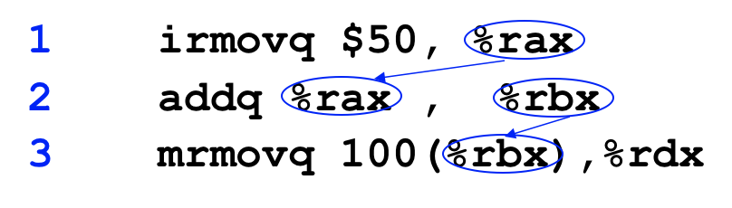

# 2.5 Hazards

## Textbook

* 4.5.5
* 4.5.6

## Outline

* Data Hazard
* Control Hazard
* Exception Handling

## Data Hazard

首先来看看「数据冒险」。

### Example

例如下面这三条连续的汇编指令。



由于指令中存在相同的寄存器，因此形成了 RaW 型（Read after Write，写後即读型）数据依赖；无法简单地将他们完全流水线化。

### Solution

#### Plan A: Inserting `nop`

最简单的解决方案就是：插入 `nop`，降低并行性。

例如，就以上面的 1 和 2 之间的指令依赖为例。既然必须等到 1 的 Write Back 之后 2 才能在 Decode 阶段读出正确的 `%rax` 值，那我直接插入三个 `nop`，强行让 2 的 Decode 在 1 的 WB 之后执行不就完了？

> 在这里必须要插入三条 `nop`，少一条都不行。

#### Plan B: Data Forwarding

插入那么多 `nop`，感觉好浪费。


但是我们仔细观察这个例子发现，实际上 2 语句中要加到 `%rbx` 中的数字，在语句 1 的 Fetch 阶段实际上就读出来了（`$50`）！而这个数字直到 2 语句的 Execute 阶段才被用到。实际上并不存在数据依赖，只不过受限于指令而无法并行。

那么，我们能否直接把数据绕过 SEQ 模型，传递给其他 Stage ，以避免这种不必要的数据依赖呢？

当然可以！实际上，因为每个 Stage 的模块都携带着当前指令的所有信息，完全可以静态地实现消息转发。

实际中，我们会在 Decode 阶段直接绕过寄存器值的读取，并从其他地方获得应该存入的值并写入 `rA`、`rB`。

这些数据可能来自 Execute 阶段的 `valE`（做运算的结果）、Memory 的 `valE`、`valM`（读写内存的结果）、Write Back 的 `valE`、`valM`（写回寄存器的内容）。

### Limitations

看起来，Data Forwarding 可以解决绝大多数问题了。但是，这里还有理论上的一个问题：如果产生数据的源和目的之间的最小 Stage 大于 1，那么就存在了真·数据依赖，即便做转发也做不到。

#### Load - Use

举个例子吧。

```assembly
	mrmovq	(__MEM_ADDR), %rax
	addq	%rbx, %rax
```

这里，第一条语句的值会在 Memory 被读取，并且在 Write Back 阶段被写入 `%rax`。而下一条语句则要求在 Decode 阶段读取 `%rax` 的值，并且在 Execute 阶段参与运算。

用 Plan A 来解决问题，Write Back 跟 Decode 阶段的 Stage 差等于 3，得插入 3 条 `nop` 才能保证正确性。

而如果我们采用 Plan B 呢？实际的数据在 Memory 阶段才能产生，却又要在 Execute 阶段的一开始被用到。这里的 Stage 差已经大于 1，所以即便是采用转发也无法将那个在 Memory 后半段才得到的内存数据转发给与此同时正在执行的、位于 Execute 阶段的下一条指令，因为在此时 Execute 应该已经要算出结果了，但操作数你还没给我。

因此，必须让下一条指令至少暂停一个时钟周期，才能使得这个转发机制生效。

> 每暂停一次时钟周期，称之为进行了一次 Stall。
>
> 此时引发 Stall 的 Stage，连同靠前的几个 Stages 都会暂停处理，或者说在当前时钟周期结束之後，不更新指令，仍然执行当前这条指令。
>
> 可以形象地理解成排队的时候，中间有个人不走了；排在他前面的人当然可以继续走，但是排在他后面的人就跟他一起停住了。

## Control Hazard

上一节非常粗浅地讲了一点点控制冒险的内容。

### Control Dependency

考虑下面的代码：

```assembly
loop:
	subq %rdx, %rbx
	jne targ
	irmovq $10, %rdx
	jmp loop
targ:
	halt
```

可以看到，在第二、三行出现了控制冒险。第二行的 CC 计算在 Execute 阶段完成，而在与此同时的 Fetch 阶段的一开始就得决定去取什么地方的指令。这里显然也存在一条指令的 Gap。

### Solution

#### Plan A: Inserting `nop`

当然，当然，本质上控制依赖也是一种数据依赖（依赖于 CC 这个数据）。所以，当然也能通过插入 `nop` 解决。但我们一般不采用这个方法。

有个例外：`ret` 语句实在是没有办法做任何靠谱的 Predict，因此实际中一般是插入三条 `nop`，等 `ret` 的 Memory 阶段过完拿出地址之后再执行下一条指令的 Fetch 操作。

这里又有一个术语：Bubble（泡泡），也就是这条语句被读入之後直接丢弃，不进入下一 Stage 执行下去，看起来就好像是语句完全没了一样（形同 `nop`）。

注意，Bubble 是提供给某一具体的 Stage；那么这个 Stage 在下一个时钟周期到来时接受到的指令就会被丢弃（上一个时钟周期已经执行了的指令无法消除）。

所以 `ret` 的一般实现是，读到一个 `ret`，立马释放三个 Bubble，让接下来读入的三条指令（当然就是 `ret` 之後跟着的三条）完全无效化，那不就相当于读了三个 `nop` 吗。

#### Plan B: Try to Perdict

分析表明，在汇编中超过 $60\%$ 的条件跳转语句都会成真。因此如果我们总是假定条件跳转为真，并且实行跳转的话，可以比较大概率地节约。

那么问题就转变成，错误地进行跳转之後，该怎么恢复的问题。

### Recovering

实际上恢复控制流本身不难；因为指令本身携带着「不跳转」时下一条指令的地址。所以很容易可以通知 Fetch 纠正其 PC，让其在下一次读取指令时不再犯错。

主要的问题在于…从 Execute 得到真正的 CC 并可以决定是否跳转的时候，已经有两条错误指令被读入了。一条执行完 Fetch 阶段，一条执行完 Decode 阶段。

这两条指令还好说，紧急给 Decode 跟 Execute 加 Bubble，这样下一时钟周期到来时，从 Fetch 跟 Decode 阶段出来的这两条错误指令就直接灰飞烟灭了。

## Exception Handling

上面的这些问题只能算是基本解决了正常执行时的问题。可还有不正常执行的情况呢。

众所周知，Y86_64 架构有异常模块。引发异常的指令之前的所有指令都应该被完全执行；而其后续的所有指令都应该完全不执行。

至于当前指令，根据语义决定要不要完成它。（例如 `halt` 指令当然要完成其功能；而无效指令就不要完成了比较好。）

在 SEQ CPU 中这个实现相当简单。但是 PIPE 之后，我们就得认真考虑一下了：怎么才能流水线化执行，并且表现得像是 SEQ 的 CPU？

### Exceptions

咱们先讨论一下有哪些异常吧。

#### `halt`

由同名指令引发的异常。这个异常在 Fetch 阶段就可以发现。

#### Bad Address

因为错误的内存寻址引发的异常。这个异常在 Memory 阶段发现。

#### Invalid Instruction

无效的指令。这个异常在 Fetch 阶段就能发现。

### Solutions

在 Fetch 阶段检查出来的指令，那太简单啦。这时候直接给 Fetch 加一堆 Bubble（拒绝其继续读入指令），等流水线净空之后该怎么处理怎么处理就行了。

不过对于 Memory 阶段检查出来的，那就比较难办了。此时已经有三条不该读入的语句被读入了流水线，其中有一条已经执行到了 Execute。

假如这条语句是个算术运算指令的话，那么 CC 就可能被修改了！这是唯一一种破坏性的情况。

这里的解决方案是在检测到异常的时候，禁止掉 CC 的写入。因为实际上 Execute 分为两步（一次计算，一次 Update CC），所以这件事情是来得及的。

### Another Problem

更大的问题：在 Memory 阶段发出异常的指令会导致三条不正常指令被读入内存；那假如这三条指令又引发了异常呢？

显然，新发出的异常不可能是 Memory 阶段爆出的（他活不了那么长），只可能是 Fetch 阶段的。那么解决方案就很简单：把这种 Exception 的 Handling 延迟；在发现异常的时候，仅仅把它加入当前 Stage 的状态位处，并且随着流水线的运转方向传递。等到 Write Back 阶段（这时候该爆的异常也都爆了）再统一处理。

无效的指令直接转化为 Bubble 消失。

### Finally

在一切结束之後，根据异常的类型跳转到异常处理函数解决。

这就不属于 CPU 该做的事情了。告辞。