# 2.6 PIPE CPU Implementation

## Textbook

* 4.5.7
* 4.5.8
* 4.5.9

## Outline

* 用之前我们说到过的 HCL 实现 PIPE CPU 的部分简单逻辑
* 实现流水线控制逻辑
* 分析流水线性能

## Fetch

### Figure

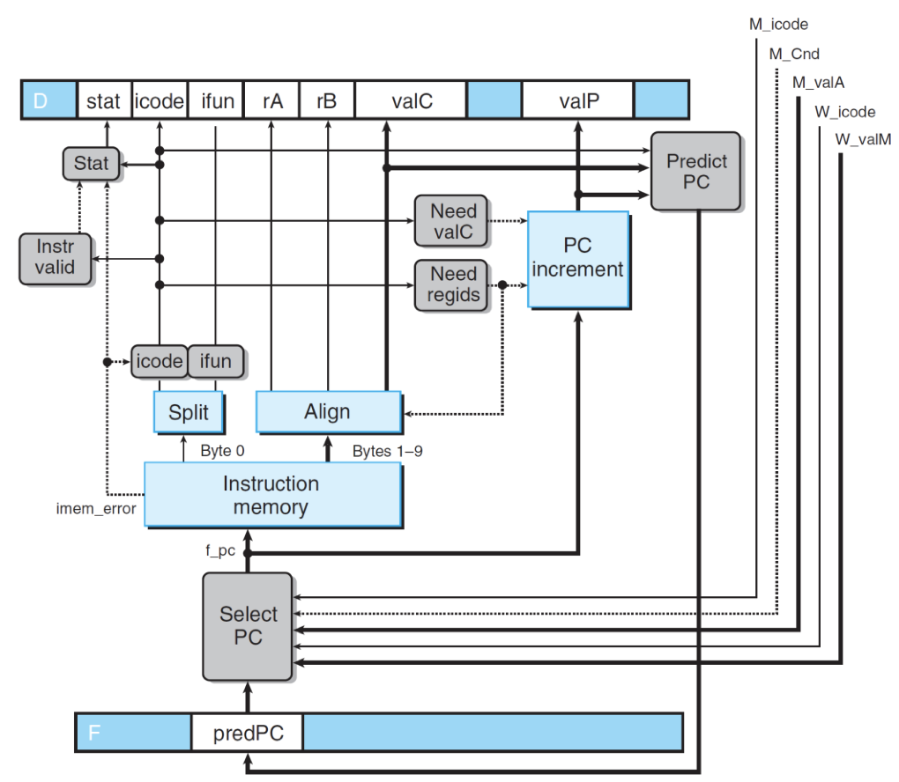

相比于 SEQ+，有变化的就是 `Stat` 部分以及 `Predict PC` 部分。

### Codes


## Decode

### Figure

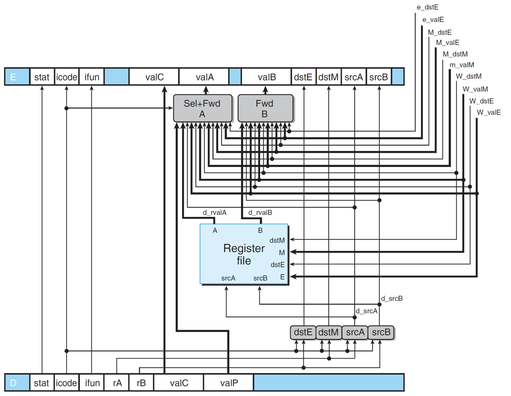

这里比较复杂，因为 Decode 阶段是数据转发的重灾区。

### Forwarding

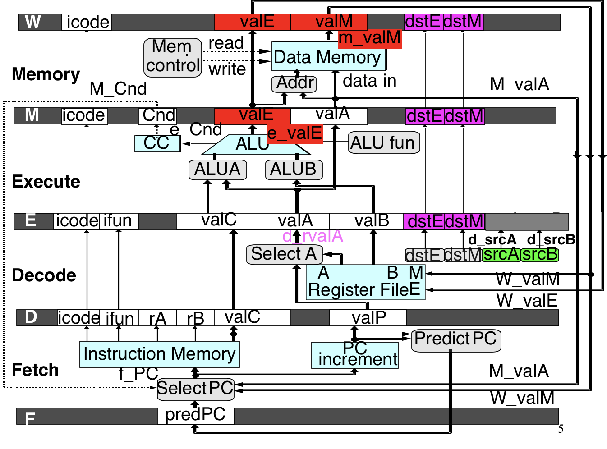

图中标注出了一些数据转发的路径。

### Codes

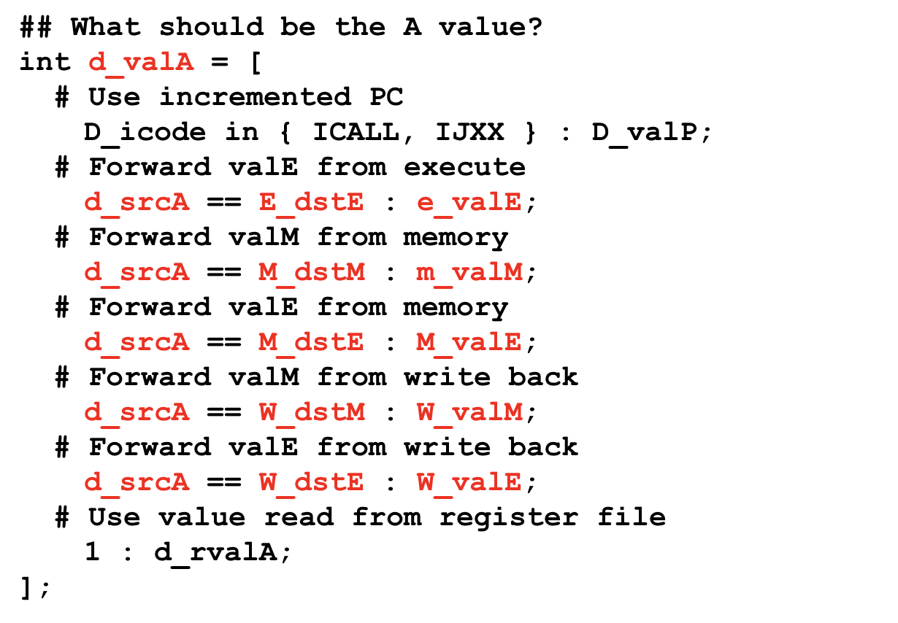

数据转发的目的地总是 Decode 阶段的值（用以取代本该从寄存器中读到的值）。

注意，我们一定要遵循的规则是「按顺序」。也就是，总是尽量先从靠近自己的後续 Stage 中读取数据。考虑这种情况：

```assembly
# demo.ys
0x000:	irmovq $10, %rdx
0x00a:	irmovq $3, %rdx
0x014:	rrmove %rdx, %rax
0x016:	halt
```

 在 `0x014` 执行到 Decode 阶段时，存在两种可能的数据转发路径：是从已经执行到 Memory 阶段的 `0x000` 指令中获取 `$10`，还是从执行到 Execute 阶段的 `0x00a` 指令中获取 `$3`？

显然，从语义来说应该读取的是最新的数据，因此数据转发也应该遵循这样的规则。

所以，在编写数据转发 HCL 代码时，要十分注意 HCL `switch - case` 语法的顺序性，否则容易犯错。

## Write Back

Write Back 阶段就没什么说的了，只要增加一个 `stat` 更新语句即可。

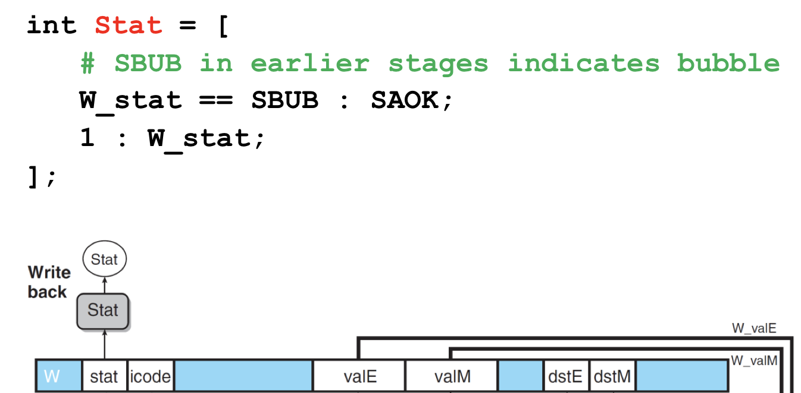

## Execute

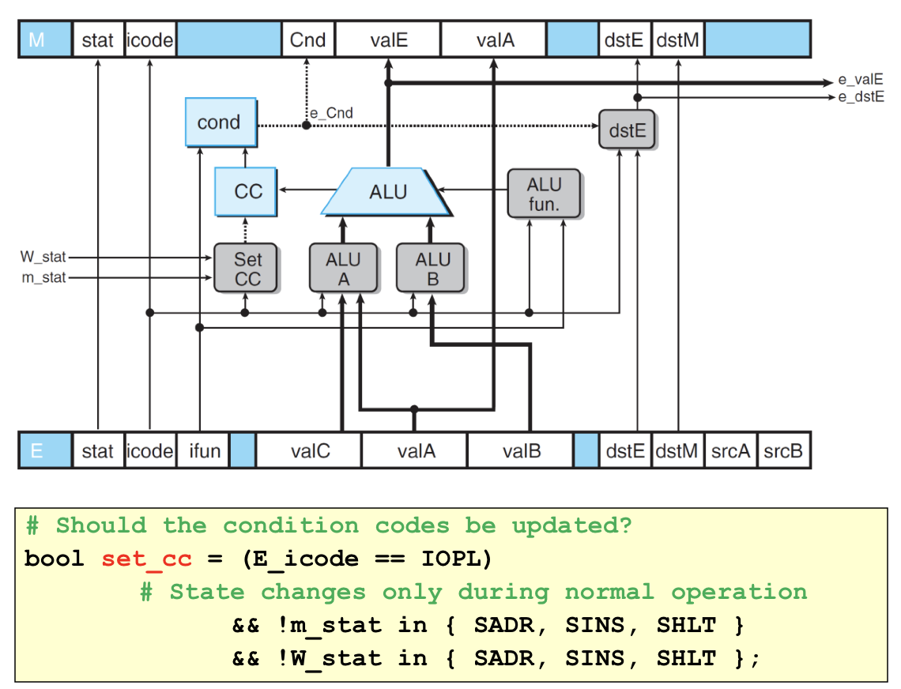

根据 2-5 中的讨论，Execute 部件只有在指令是 `OP` 时、且当前 Memory 部件不处于异常状态的时候才能更新 CC。

## Memory

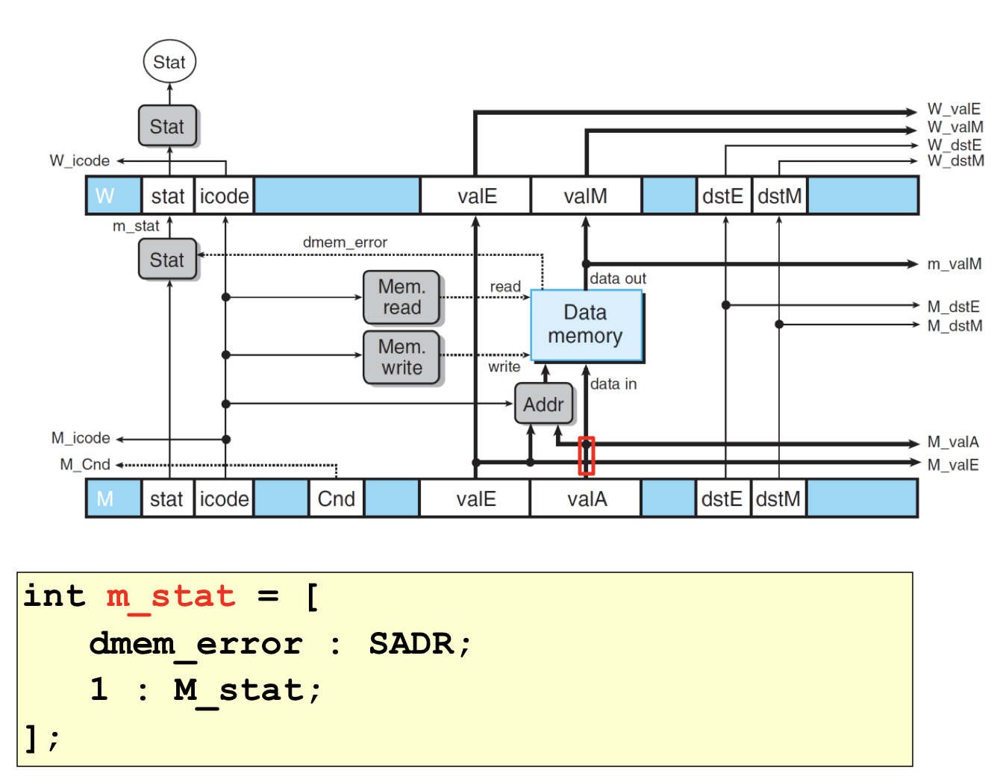

同样的，新增的部分只有更新一下状态而已。

## Pipeline Control

### Intro

之前我们已经实现了所有的「流水线步骤」逻辑，用 HCL 代码实现了数据转发（已经解决了大多数的数据依赖问题），并且讨论了「冒险」情况以及解决方案。

现在我们需要把这套解决方案实现成 HCL 代码，以控制流水线的逻辑（在需要的地方进行 Bubble / Stall）。

### Control Logic

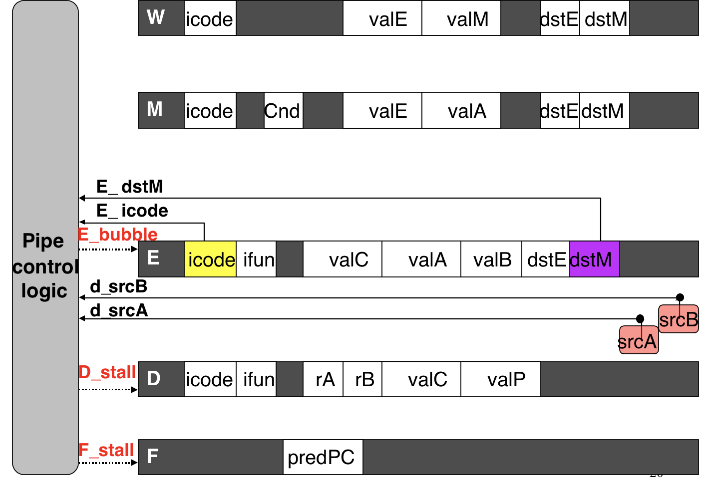

所有的 Stage 都需要受 Pipe Control Logic 调控。

### Load/Use Hazard

这是唯一一种「数据转发」解决不了的数据依赖问题。

#### Detection

Load/Use 冒险在什么时候发生？

显然，就是前一条指令从内存中读取一个值，下一周期马上用它的这种情况。

所以，我们的检测代码可以这么写：

```hcl
E_icode in { IMRMOVQ, IPOPQ } && E_dstM in { d_srcA, d_srcB }
```

注意，这里是在 Load/Use 冒险中的「Load 指令」正在 Execute 阶段，即将进入 Memory 阶段读内存的时候的检测方法。

> 注意到，从内存到寄存器搬移数据的指令不仅有 `IMRMOVQ`，还有 `IPOPQ`。

#### Solution

在 Load 指令即将进入 Memory 阶段时检测出了 Load/Use 冒险，那么该怎么解决呢？

| Condition        | F     | D     | E      | M      | W      |
| ---------------- | ----- | ----- | ------ | ------ | ------ |
| Load/Use  Hazard | stall | stall | bubble | normal | normal |

简单：让即将进入 Execute 阶段的 Use 指令消失（填入 Bubble），然后让 Fetch/Decode 阶段的指令不要前进，继续等待下一周期。

这样，相当于在 Load 和 Use 指令之间插入了一条 `nop`（是可怜的 Use 指令变的）。

> 澄清：无论是设置 Stall 还是 Bubble 也好，都不能对该阶段正在执行的指令生效。只能对下一个时钟周期到来时，进入该 Stage 的指令生效。
>
> 所以，更准确一点的说法可以是：将某个 Stage 的状态设置为 Bubble 意味着将下一条进入该 Stage 的指令当作 `nop` 处理（对于 Fetch 来说，就是不去内存中拿指令，而是直接填入一句 `nop`）。
>
> 将某个 Stage 的状态设置为 Stall 意味着无视下一条进入的指令（对于 Fetch 来说，就是不去取指令），而且将上一条执行的指令保留在 Stage 中，再执行一次。

### Mispredicted Branch

#### Detection

这个不需要控制中枢自己 Detect，一条跳转指令执行到了 Execute 阶段自己就发现了。然后他就会告诉控制中枢的。

#### Solution

| Condition            | F      | D      | E      | M      | W      |
| -------------------- | ------ | ------ | ------ | ------ | ------ |
| Mispredicted  Branch | normal | bubble | bubble | normal | normal |

首先，跳转失败之后，Fetch 会立即得到情报并作修正，即下一次他拿到的指令一定是正确 PC 所对应的那条。因此不需要干预 Fetch 的工作。

但是，跳转指令执行到 E 时发现错误，此时已经有两条指令错误地进入了 F 和 D 阶段。好在他们还没有造成什么影响，直接在 D、E 阶段设置 Bubble，在下一个时钟周期一捕获到他们就把它们 `nop` 掉。

至于 M 阶段的那个 `jmp` 指令…你把它 bubble 掉或者不 bubble 也没什么影响了（他也不会读写内存，也不会写寄存器）。

### Return Hazard

#### Detection

大概是最好 Detect 的一个了…在该指令进入 Fetch 阶段时就可以检测到。这没啥好说的。

#### Solution

因为我们是不对 `ret` 的跳转位置做预测的，所以遇到 `ret` 直接当当当插入三个 `nop` 就是了。也就是，在 `ret` 指令进行到 Memory、并且设置好正确 PC 之前，所有指令都不准执行下去。

因此，只要在 D、E、M 阶段的任何一处发现了 `ret` 指令的踪迹，F 阶段就应该停止（stall），D 阶段就应该 bubble。

| Condition       | F     | D      | E      | M      | W      |
| --------------- | ----- | ------ | ------ | ------ | ------ |
| Processing  ret | stall | bubble | normal | normal | normal |

> Stall 住 F 的原因是，RISC 的标准保证了 `ret` 之后至少还有一条指令，但不保证更多。
>
> 因此为了不产生异常（假如指令不够了强行读，那就会异常），F 会一直保持着 `ret` 之后一条指令的内容。

### Final Codes

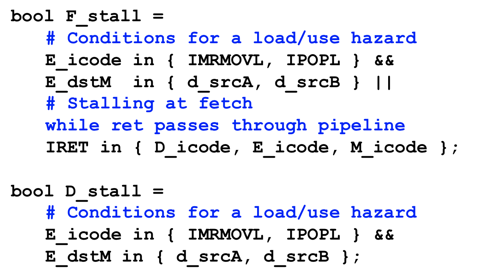

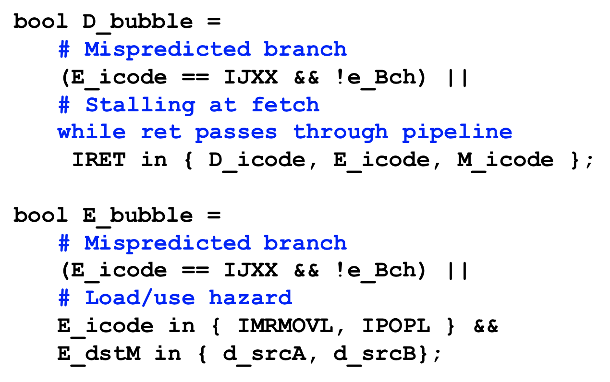

其他几个 Stage 的代码过于简单，不列出。

## Combination

这个就复杂了！组合起来的冒险情况，我们只考虑这几种：

### `jmp` & `ret`

#### Description

```assembly
# ...
	addq %rax, %rbx
	# if this jmp shouldn't be executed
	jmpzq target
target:
	ret
```

也就是，在执行 Predict Jump 时，目标位置恰好是个 `ret`；而事後证明这个 Predict 错了。这该怎们办呢？

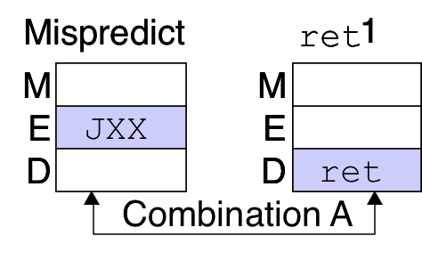

#### Solution

也就是，我们需要同时处理双倍的糟糕现场：1）为了处理 `ret` 的控制冒险的控制逻辑；2）为了从 Mispredicted Jump 中恢复的控制逻辑。

在 `jmpzq target` 执行到 Execute 阶段的后期（发现自己做了错误的跳转）时，`ret` 已经到了 Decode 阶段，并且在 F 和 D 阶段做 Stall 和 Bubble。

| Condition            | F      | D      | E      | M      | W      |
| -------------------- | ------ | ------ | ------ | ------ | ------ |
| Processing  ret      | stall  | bubble | normal | normal | normal |
| Mispredicted  Branch | normal | bubble | bubble | normal | normal |
| Combination          | stall  | bubble | bubble | normal | normal |

这时我们的确应该继续 Stall 住 F（因为在下一周期 `jmpq` 指令进入 M 阶段后，才有办法去更新 PC）；并且，将 E 阶段直接 Bubble 掉，因为下一个周期到来时 `ret` 指令就该进入 E 了。

### `load - use` & `ret`

#### Description

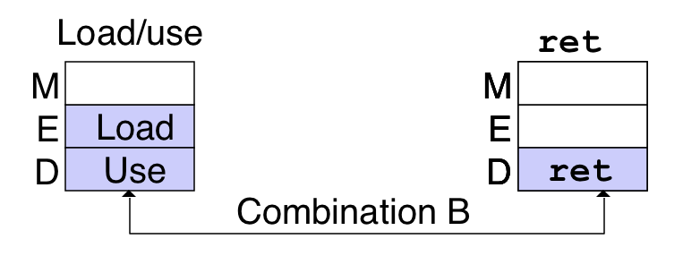

#### Solution

在发生了一个 Load Use 冒险的时候，我们本该 Stall 住 F 和 D，然后 Bubble 掉 E，相当于在 Load 和 Use 之间插入了一条 `ret`。

但如果这个 Use 恰恰好是一条 `ret` 指令呢？那么问题就来了：

| Condition        | F     | D              | E      | M      | W      |
| ---------------- | ----- | -------------- | ------ | ------ | ------ |
| Processing  ret  | stall | bubble         | normal | normal | normal |
| Load/Use  Hazard | stall | stall          | bubble | normal | normal |
| Combination      | stall | bubble + stall | bubble | normal | normal |

观察可以发现，本质上他们做的事情是同一件：插入 `nop`。只不过 `ret` 插入 `nop` 的途径是把即将进入 D 的那条指令作为牺牲品，并让 F 再来一条一样的；`LU hazard` 的途径则是牺牲即将进入 E 的那条指令，并让 F、D 都再来一次。

结果就是 D 不知该怎么办了：同时 Bubble 又 Stall 是做不到的。这就会引发流水线异常。

其实在存在这种冒险的时候，直接令 D stall 或者 bubble 即可。反正他们都不应该也不会被执行，又由于 F 的 stall，他们拿到的只不过是在 `ret` 後面、标准规定的一条占位指令而已。

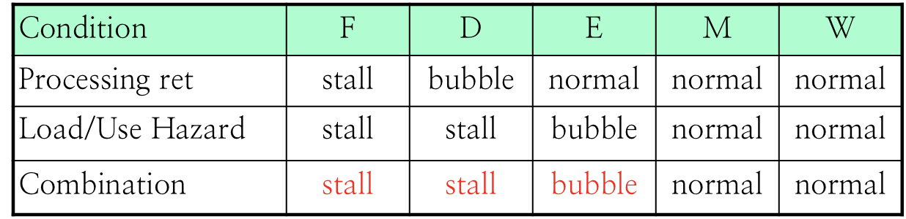

## Performance

#### Terminology

* CPI
	* Cycles per Instructions 的简称。
	* CPU 每个时钟周期能执行的指令的数量。

> 对于流水线（PIPE）来说，实际上 CPI 也不能小于 1，并且存在大约 5 个周期的延迟。
>
> 不过对于顺序执行架构（SEQ 和 SEQ+）来说，CPI 大约等于 Stage 的数量，延迟不变。

#### Formulation

CPI 的计算公式是：
$$
V_{\mathrm{CPI}} = \dfrac C I = \dfrac {I + B} I = 1 + \dfrac B I
$$
其中，$I$ 是完成执行指令的条数，$B$ 是插入 Bubble 的数量。

> 因为在目前的实现中，有 Stall 必然伴随着 Bubble，即 Stall 产生的多余指令全部会在将来被 Bubble 掉。因此计算 CPI 时只需要考虑 Bubble 数量即可。

注意在计算的时候一定要看清楚，插入 Bubble 的数量以及条件。有的时候条件只在一个周期内满足，但却带来了多个 Bubble 的插入；有时候条件连续在多个周期内满足（例如 `ret` 在 D、E、M 阶段时都会触发 Bubble），也会带来多个 Bubble 的插入。