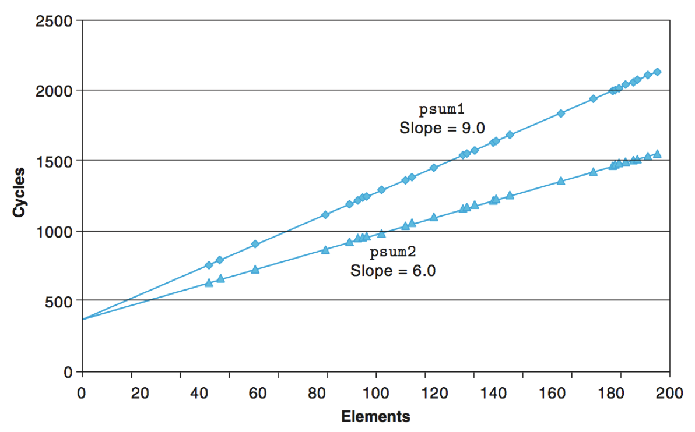
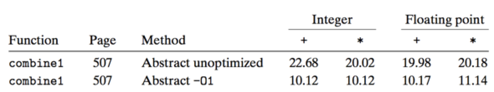
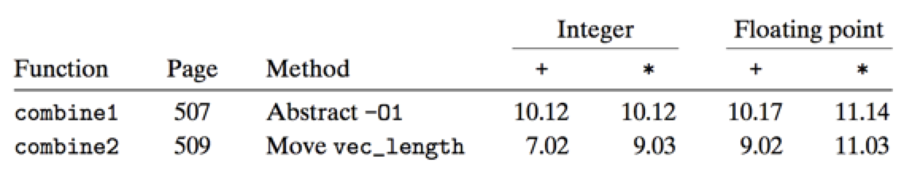
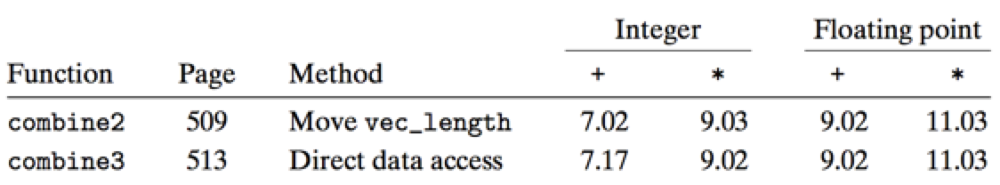
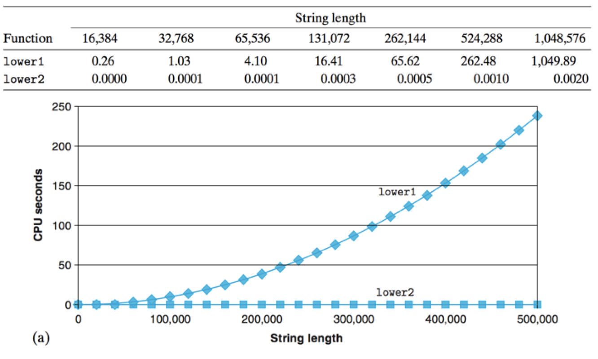
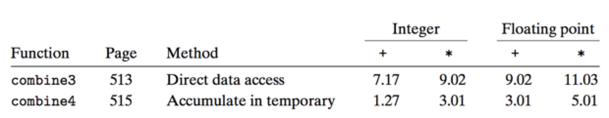
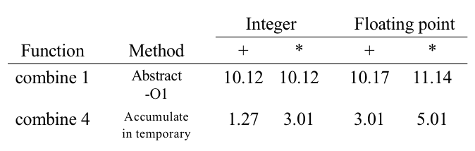

# 2.7 Machine Independent Optimization

## Textbook

* 5.1 ~ 5.6

## Outline

* 机器无关优化
	* 代码路径
	* 内存优化
* 优化障碍
	* 内存别名
	* 函数调用副作用

## Motivation

### Idea

如果，能够做到复杂度上的优化当然很好，例如将 $O(n^2)$ 优化到 $O(n \log n)$。但是，就算仅仅是做到常数级别的优化，例如耗时从 $10n$ 变成了 $3n$，那也是相当大程度的优化了。

因此，我们不应该仅仅拘泥于「算法」层面的优化，「数据表示」、「过程」、「循环」等等「蚊子腿」里都有优化空间。

当然，要进行更深层的优化，我们就得理解得更深入。

### Timing

#### Time Scales

我们要对计算机执行的效率有一个基本印象。

每条指令所耗费的时间大约是 $10^{-9}$ 秒。

对于一颗 `100MHz` 的 CPU 来说，每秒钟时钟 Tick $10^8$ 次，每个时钟周期的长度是 10 纳秒。而对 `2GHz` 的 CPU 来说，则仅有 0.5 纳秒。

#### Cycles per Element

俗称的 CpE；用来衡量那些操作「向量」或是「列表」之类代码的效能。

例如，对于一个输入为 `n` 长度数组的函数，所耗时间
$$
T = \mathrm{CpE} \times n + \mathrm{Overhead}
$$
也就是，刨开不可避免的 Overhead 时间以外，处理数组中的每个元素平均所耗费的时间。

#### Example

```c
void psum1(float a[], float p[], long n) {
    long i;
    p[0] = a[0];
    for (i = 1; i < n; i++) {
        p[i] = p[i - 1] + a[i];
    }
}
```

```c
void psum2(float a[], float p[], long n) {
    long i;
    p[0] = a[0];
    for (i = 1; i < n - 1; i += 2) {
        float mid_val = p[i - 1] + a[i];
        p[i] = mid_val;
        p[i + 1] = mid_val + a[i + 1];
    }
    if (i < n) {
        p[i] = p[i - 1] + a[i];
    }
}
```



可以看到，在取不同的数组长度 $n$ 时，耗 Cycles 基本呈现线性地增长。而且，在没有输入元素（$n = 0$）时，依然耗费了一些 Cycles。这就是我们说的 Overhead，而这条直线的斜率就是 CpE。

### Vector Addressing

不同的语言有不同的数组寻址机制。

#### C

对于 C 而言，取出数组对应索引的元素（也就是 `array[index]`），实际上做的事情是 `*(array + index)`。

> 这也就是 `array[index] == index[array]` 的原因。

C 无法对数组做边界检查，因为其原生数组本质上就是一个头指针，无法携带长度信息。

> 因此通常的 C-Style API 在传递数组时，一般会以 `fun(..., int array[], int length)` 这样的方式提供数组长度。

#### C++

至于 C++ 标准库中的 `vector`，在直接采用 `vec[index]` 进行寻址时，如果提供了一个不合法的 `index`，则属于标准未定义的行为（UB）。

但如果需要做边界检查，则使用 `vec.at(index)`，这会在 `index` 越界时给出一个 `out_of_range` 异常。

> 这么设计的原因是，`vector` 是作为 C 原生数组的替代品而被设计出来的，因此不进行越界检查以避免额外开销。

当然，也可以直接拿出 `vec.data` 当作原生数组用。

> Swift: "Unsafe Unsafe Unsafe"

#### Java

Java 始终会对数组进行边界检查。性能对 Java 来说没那么重要。

#### Generalized

为了不拘泥于特定的语言，我们给 C 也包了一层「边界检查」。提供了 `get_vec_element` 方法来做「包含边界检查」的索引，以及 `vec_length` 来获取数组长度。

### Optimization

#### `combine`

我们来看一段非常简单的代码。

```c
void combine1(vec_ptr v, data_t *dest)
{
    long i;
    *dest = IDENT;
    for (i = 0; i < vec_length(v); i++)
    {
        data_t val;
        get_vec_element(v, i, &val);
        *dest = *dest OP val;
    }
}
```

其中，`OP`、`IDENT` 以及 `data_t` 都是可以动态调整的。参见 `defs.h`。



可以看到，优化基本上把所耗的时间折半了。这是怎么做到的？

#### Don't Loop Constant Things

可以看到，我们在每一次 `for` 循环执行前，都会先判断一次 `i < vec_length(v)`。然而，实际上在循环体中，数组的长度是不会变的。那我们似乎就没有必要在 `for` 循环中每次都去运算一次。可以改写成这样：

```c
void combine2(vec_ptr v, data_t *dest)
{
    long i, length = vec_length(v);
    *dest = IDENT;
    for (i = 0; i < length; i++)
    {
        data_t val;
        get_vec_element(v, i, &val);
        *dest = *dest OP val;
    }
}
```

原来为了读取 `vec_length`，就得去调用一次函数；就算内联了，寻址还是跑不掉。

但是，这里 `length` 运气好的话可以进入寄存器，这样时间耗费就小多了。



可以看到 `combine2` 已经相当接近于 `-O1` 优化的 `combine1` 了。

再次，我们可以发现 `get_vac_element` 实际上只不过是做了一次 `val = v.data[i]` 而已。

这样，实际上我们算 `v.data` 也是重复的。由此我们可以想出 `combine3`：

```c
void combine3(vec_ptr v, data_t *dest)
{
    long i;
    long length = vec_length(v);
    data_t *data = get_vec_start(v);

    *dest = IDENT;
    for (i = 0; i < length; i++)
    {
        *dest = *dest OP data[i];
    }
}
```



这基本上没什么作用了。

#### Another Example: `strlen`

```c
/* Convert string to lowercase: slow */
void lower1(char *s)
{
    long i;
    for (i = 0; i < strlen(s); i++)
        if (s[i] >= 'A' && s[i] <= 'Z')
            s[i] -= ('A' - 'a');
}
```

可以看到，这里实际上存在两个多余的重复运算：`strlen(s)`，以及 `'A' - 'a'`。後一个还好，但是第一个的耗时真的非常长。连续进行 `strlen(s) + 1` 个内存寻址，很费时。

```c
/* Convert string to lowercase: faster */
void lower2(char *s)
{
    long i;
    long len = strlen(s);
    char offset = 'A' - 'a';

    for (i = 0; i < len; i++)
        if (s[i] >= 'A' && s[i] <= 'Z')
            s[i] -= offset;
}
```

这样就好多啦。

```c
/* Sample implementation of library function strlen */
/* Compute length of string */
size_t strlen(const char *s)
{
    long length = 0;
    while (*s != '\0')
    {
        s++;
        length++;
    }
    return length;
}
```

由于每次 `strlen` 的耗时是 $O(n)$ 级别的，而你又在一个 $n$ 次的循环内反复调用了它。那么时间复杂度就爆炸到了 $O(n^2)$，而这件事本来可以 $O(n)$ 解决的。



#### Eliminate Unneeded Memory References

上面的 `combine3` 优化效果不理想。我们来读读他的汇编：

```assembly
.L17: 			         			## loop:
	vmovsd 	(%rbx),  %xmm0			## Read product from dest
	vmulsd 	(%rdx), %xmm0, %xmm0	## Multiply product by data[i]
	vmovsd 	%xmm0, (%rbx)			## Store product at dest
	addq 	$8, %rdx				## Increment data + i
	cmpq 	%rax, %rdx				## Compare to data + length
	jne 	.L17					## If !=, goto loop
```

可以看到，在每一个循环里，我们不仅要做一次「读内存」（访问 `data[i]`），还要将其写入结果内存（写入 `dest`）。但是实际上我们没必要强制让这个累计值放在内存里。如果放到内存里，那就可以大大节约开销。

基于这种心理，我们可以写出 `combine4`：

```c
void combine4(vec_ptr v, data_t *dest)
{
    long i;
    long length = vec_length(v);
    data_t *data = get_vec_start(v);
    data_t acc = IDENT;
    for (i = 0; i < length; i++)
        acc = acc OP data[i];
    *dest = acc;
}
```

先用 `acc` 来临时保存运算结果（很大可能被放入寄存器里），最後再写回 `*dest`。

```assembly
.L25: 								## loop:
	vmulsd 	(%rdx), %xmm0, %xmm0	## Multiply acc by data[i]
	addq 	$8, %rdx 		    	## Increment data+i
	cmpq 	%rax, %rdx 		    	## Compare to data+length
	jne 	.L25 			    	## If !=, goto loop
```



这样做的时间复杂度大大降低了。

### Optimizing Approaches

#### Tactics

一般来说，我们要想做优化，可以从这些方面入手：

* 在循环中
	* 减少重复的函数调用
	* 减少重复的内存引用
* 在编译器中
	* 优化寄存器分配策略
	* 做一些微小的安全优化

#### Blockers

但是，在 `combine` 实现中，我们观察到编译器的优化实际上是没有发挥多少作用的。

主要原因是编译器不能做过于激进的优化，尤其是对这种「输入不确定」的函数。

我们把那些「阻碍优化」的点称为 Blockers。

##### Memory Aliasing

我们来看一段代码片段。

```c
void twiddle1(int *xp, int *yp)
{
    *xp += *yp;
    *xp += *yp;
}

void twiddle2(int *xp, int *yp)
{
    *xp += 2 * *yp;
}
```

例如，`twiddle1` 跟 `twiddle2` 是等价的吗？也就是，编译器可以自作主张，把 `twiddle1` 优化成 `twiddle2` 吗？

考虑 `xp = yp` 的情况。这时候，`twiddle1(p, p)` 会使得 `*p` 的值变成原来的四倍，然而 `twiddle2(p, p)` 则会让 `*p` 的值变成原来的三倍。

即使在绝绝大多数情况下 `twiddle1` 和 `twiddle2` 都是等价的，而且 `twiddle2` 还有 $50\%$ 的性能提升，编译器也不能做这种优化。这种优化只能由程序员来做。

##### Memory Overlapping

事实上，这里还有一种更加隐蔽的内存别名问题。

考虑一下 `combine3` 跟 `combine4` 的区别。假如我们提供的 `dest` 指针的位置恰好就是原数组的一部分，那会怎么样？

对于 `combine3` 来说，事实上求 `combine` 会发生错误；靠前一部分的数字会被计算两次。然而 `combine4` 则不会，因为在 `combine` 完全结束前，不会真的写入 `dest` 内存。这就是语义的区别，也是编译器无法帮我们做 `combine3 => combine4` 优化的原因。

##### Function Call and Side Effect

```c
int f(int);

int func1(x)
{
    return f(x) + f(x) + f(x) + f(x);
}
int func2(x)
{
    return 4 * f(x);
}
```

这个很显然。没有人可以保证 `f(x)` 调用没有副作用，甚至不能保证每次的结果是一致的。

编译器做这种优化，那纯属脑子进水。

#### Solutions

* 习惯于使用局部变量。
	* 因为使用了局部变量代表编译器无需考虑「内存别名」问题，让编译器更容易地进行针对性优化。

* 不要依赖编译器优化。
	* 编译器只有在确认了某一优化「在任何情况下都不会改变程序行为」的时候，才会施加该优化。
	* 
	* 可见，再好的优化也没办法挽救写得烂的代码。