# 2.8 Optimization

## Textbook

* 5.7
* 5.8 ~ 5.11

## Outline

* 现代处理器的优化方法
	* 超标量运算
	* 乱序执行
* 更多代码层面的优化方法

## Modern Processor Optimization

### Perspective

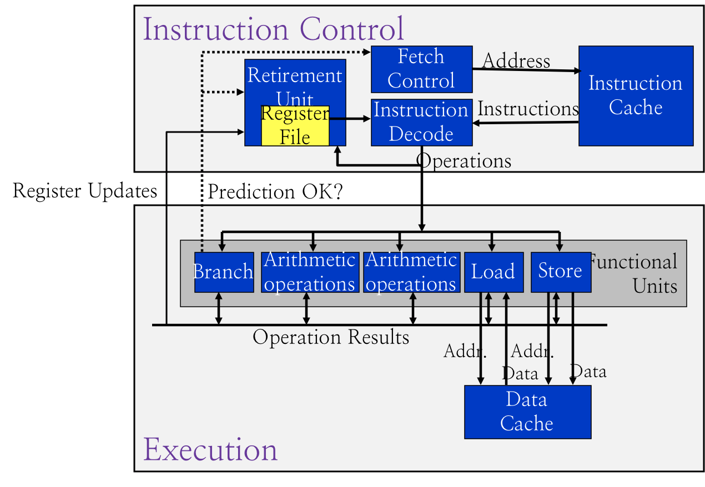

目前为止，我们能画出的 CPU 结构是这个样子的。

但实际上，指令并非是这么一条一条执行的。还有更多 CPU 处理器层面的优化。

### Parallel Execution

例如，在一颗 Haswell Core i7 上，多条指令可以同时执行。

```
0. Integer arithmetic, FP multiplication, integer and FP division, branches 
1. Integer arithmetic, FP addition, integer multiplication, FP multiplication 
2. Load, address computation 
3. Load, address computation 
4. Store 
5. Integer arithmetic(basic operations) 
6. Integer arithmetic, branches 
7. Store address computation 
```

上面的八个功能模块可以独立工作。

#### Performance

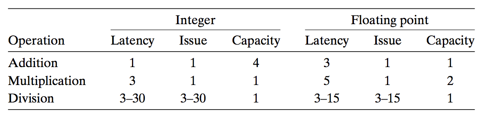

不同类型的指令执行时间也不同。

以最简单的针对「整数、浮点数」的「加法、乘法、除法」为例。

这张表中，Latency 代表每条指令所耗费的时间、Issue 代表每两条指令之间至少需要间隔的时钟周期数、而 Capacity 代表最多可以同时执行的指令数量。

CPE，即每条指令执行所消耗的周期数，理论上是可以降低到 $\dfrac L C$ 的；也就是，完全并行的情况下，有 $C$ 个独立的运算单元可以让平均每条指令消耗的周期数 $\le L$。

### Cache

同时，CPU 还会对内存中的指令、数据进行 Cache（缓存）。这就是为何我们之前的 `combine3` 优化没起什么作用的原因：`v.data` **的地址**（注意不是其内容）始终不变，因此被缓存了。所以后续的寻址也没有花太多时间，所以这个优化没有起多大作用。

同样，因为我们的代码通常都是符合局部性的（不会到处乱飞），而且有独立的 Instruction Cache 来保存我们的指令，因此不必太过担心指令寻址的开销。

## Data-Flow Graphs

数据流图是一种通用的、表示数据依赖的办法，可以用于分析程序的性能瓶颈。

### Codes

```c
void combine4(vec_ptr v, data_t *dest)
{
	long i;
	long length = vec_length(v);
	data_t *data = get_vec_start(v);
	data_t x = IDENT;

	for (i = 0; i < length; i++)
		x = x OP data[i];
	*dest = x;
}
```

同时，在 `defs.h` 中定义

```c
#define data_t float
#define OP *
```

以这个程序为例。

### Assembly

观察其汇编内容，发现：

```assembly
.L25:		 						# Loop:
    vmulsd (%rdx), %xmm0, %xmm0		# t *= data[i]
    addq $8, %rdx					# Increment data+i
    cmpq %rax, %rdx					# Comp to data+len
    jne .L25						# if !=, goto Loop
```

### μ Code

汇编无法直观地表示数据依赖的问题。看下面这种表示法：

```
load (%rdx.0) -> t.1
mulq t.1, %xmm0.0 -> %xmm0.1
addq $8, %rdx.0 -> %rdx.1
cmpq %rax, %rdx.1 -> cc.1
jne-taken cc.1
```

μ Code 怎么读呢？可以理解成 `.x` 是「版本号」；如果在这段循环中，更新了一些寄存器（包括 CC 寄存器）的内容，则就更新一个版本。

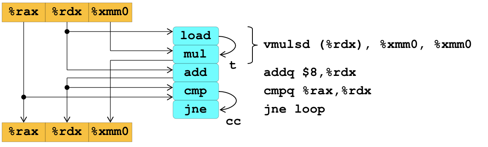

用图的形式来展现比较直观。上面一排可以看成是「Before」寄存器，下面一排看成「After」寄存器。

`vmulsd` 指令可以看成是 `load` 和 `mul` 的组合。

`load` 得到的结果通过 `t` 直接飞过来。

因为 `load` 没改 `%rdx`，所以这跟 `add` 读到的 `%rdx`  一致，直接飞过来。

`mul` 读了 `%xmm0`，同时写入 `%xmm0` 寄存器。

下面的 `addq` 就是中规中矩，读 `%rdx` 写 `%rdx`。

`cmp` 要读的是 `addq` 刚刚改的 `%rdx`（也就是 `%rdx.1`），因此必须从 `addq` 里拿，而不能从 `%rdx.0` 中取。

最後，`jne` 所用的 `cc` 当然也是 `cmp` 提供的。

最後，用最新版本的寄存器内容写入物理寄存器中，准备下一个循环。

### Refinement

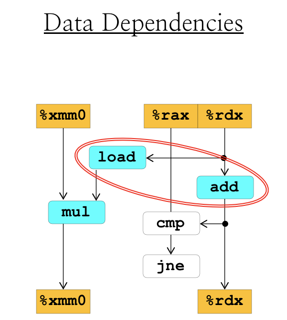

也就是，不再严格按照指令的前後来画图，而是根据数据的「流动路径」来画。

然后，我们把每个「Before」跟「After」的寄存器连缀起来，就得到了循环中的图：

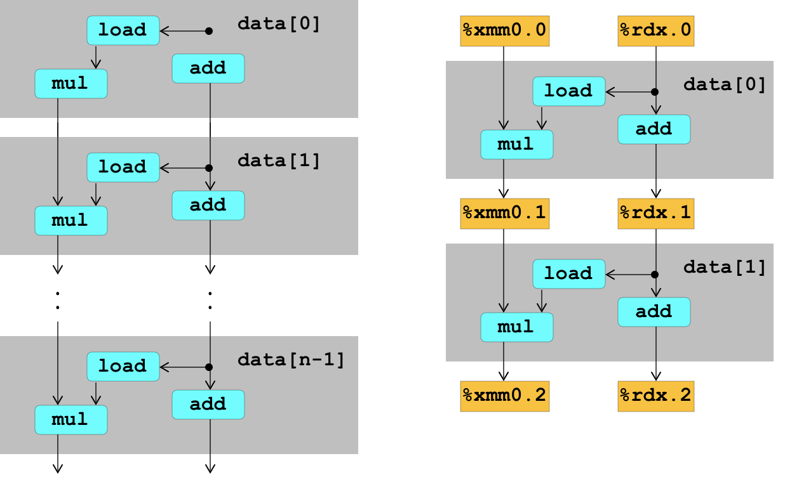

寄存器的「版本号」也可以就这么递增下去。

由此我们可以看出有两条数据以来链：更新 `x` 的乘法，以及更新 `i` 的加法。

由于 `mul` 的延迟是 5，而 `add` 的延迟只有 1，所以显然，`combine4` 的每个循环延迟是 5。

## More Code Optimization

### Loop Unrolling

所谓的循环展开。

问个问题：你觉得

```c
float loop1(int array[], int count) {
    float sum = 0f;
    for (int i = 0; i < count; ++i) {
        sum += array[i];
    }
    return sum;
}
```

和

```c
// assume count % 2 == 0 always
float loop2(float array[], int count) {
    int sum = 0f;
    for (int i = 0; i < count; i += 2) {
        sum += array[i] + array[i + 1];
    }
    return sum;
}
```

会有区别吗？

还是画出数据流图：

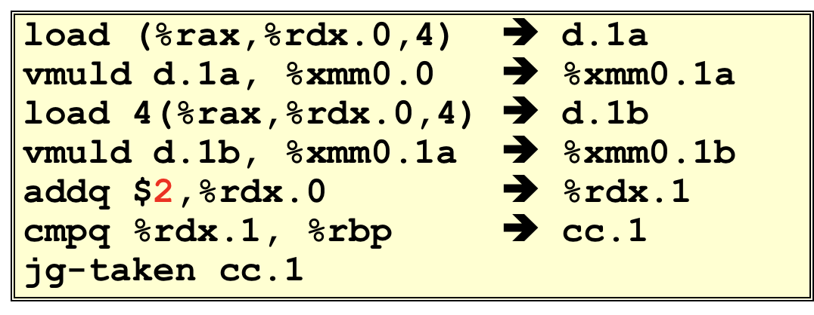

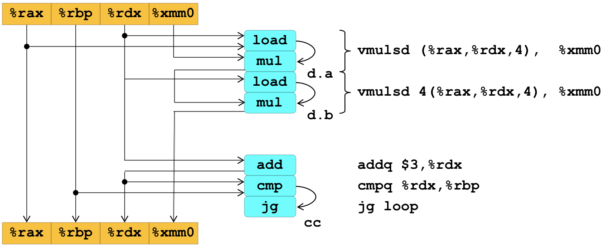

重整之後的图形就是这样子：

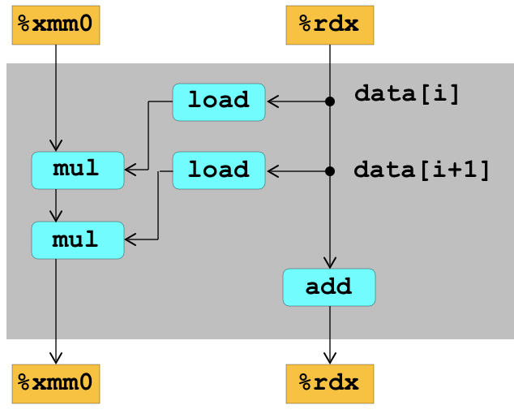

要想循环展开有效果，最重要的就是要有足够多的运算单元来并行化一个周期内的所有计算。

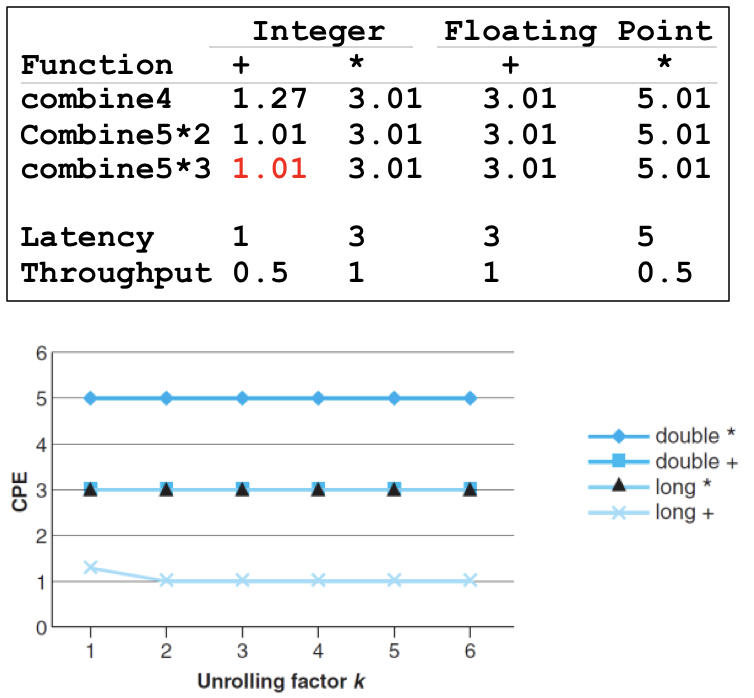

可以看到，如果无限增大循环展开节 $k$，那也没有用，因为运算单元的个数本身是有限的，性能不可能无限提升。

> 可以看出，这里优化效果最好的就是整型数的加法，因为有足够多的运算单元。

### Multiple Accumulator

循环展开时，我们的代码实际上还是没有完全并行；因为两个运算的结果还是需要写入同一处内存，还是存在依赖。

那如果我们这么写，彻底拆分成两部分做加法，最後再加合，如何呢？

> 参见 `combine6.c`。

这样，在汇编看来相当于用了两个独立的寄存器 `%xmm1` 和 `%xmm2`。这样他们就可以并行了！

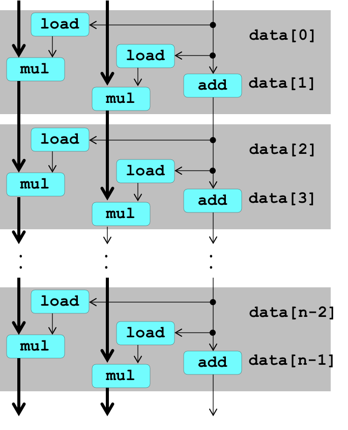

现在，就有了两条完全独立的关键路径（粗线条标出）。

这样的优化方法可以利用更多的独立运算单元的实力。

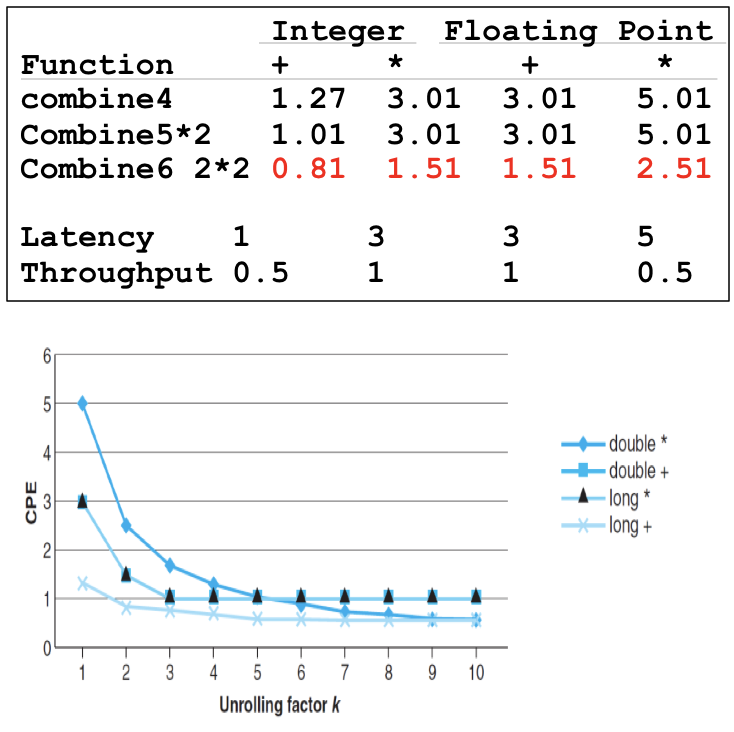

#### Question

考虑一下，Integer Multiplication 跟 Floating-point Addition 都只有一个运算单元。也就是说，这样的并行按道理说不会给他们带来什么好处。但是为什么他们的 CpE 也下降了呢？

这省下来的大概就是索引 `i` 递增的时间吧。之前每个循环的计算依赖于上一个循环的完成，这导致整体的 Latency 相当于单个乘法运算的 Latency；因为没有多个运算单元，这也没法并行。但是在我们做了循环展开之後，虽然还是不能完全并行，但是可以完全流水线化了（因为 Issue 只有 1）。

这也就可以说明为何最後他们都逼近 1（Issue 时间），而不能更低。因为在最好的情况下，也就是循环展开到「完全没有循环」的地步的时候，就是这样完全流水线化、但也完全不并行的情况。

### Register Spilling

并不是展开得越多越好的——因为很明显，无论是浮点寄存器还是算数寄存器，数量都是有限的。

所以如果你疯狂地做 $20 \times 20$ 循环展开的话，那寄存器已经不够用了；势必有一些暂存值要被放在内存里。

而这个开销可就不是一两个 Cycle 那么简单了。

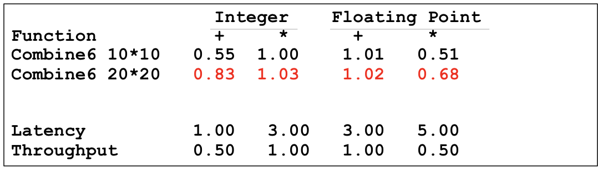

明显地，在做疯狂展开之后，性能有了不少劣化。

### Branch Prediction

这个其实之前也讲到过了；主要问题就是：做分支预测，好处能有多少；而预测错误时，代价有多少。

总归，这里的乱序指令执行，就没讲了（太复杂了）。一些比较高级的 CPU 还会根据历史跳转情况来做未来预测。

但是我们总归应该知道，如何写出适合做分支预测的代码。重点就是：尽可能降低随机性，提高可预测性。

例如，比较下面两段代码：

```c
void minmax1(int a[], int b[], int n)
{
    int i;
    for (i = 0; i < n; i++)
    {
        if (a[i] > b[i])
        {
            int t = a[i];
            a[i] = b[i];
            b[i] = t;
        }
    }
}
```

```c
void minmax2(int a[], int b[], int n)
{
    int i;
    for (i = 0; i < n; i++)
    {
        int min = a[i] < b[i] ? a[i] : b[i];
        int max = a[i] < b[i] ? b[i] : a[i];
        a[i] = min;
        b[i] = max;
    }
}
```

看起来他们所做的事情没有任何区别。

但是实际上，`minmax1` 的跳转带来的后果区别特别大：如果预测错误，就有三条赋值指令要被消除，这是非常大的问题。

但是反过来 `minmax2` 的条件判断十分短小，就算错误也只不过是覆写一个数而已，代价不大，随机性小。适合分支预测。

简而言之，就是尽量避免写这样的代码：

```c
void bad_example() {
    if (...) {
        do_a();
        do_b();
        do_c();
        return OK;
    } else {
        do_a();
        do_b();
        do_c();
        do_d();
        return ERROR;
    }
}
```

一旦预测失败，就得撤回很多代码（本来不必要的），导致效率下降。

而是写

```c
void good_example() {
    do_a();
    do_b();
    do_c();
    if (...) {
        return OK;
    } else {
        do_d();
        return ERROR;
    }
}
```

尽量减少程序的**随机性**（执行序列的随机程度），才能让 CPU 更好地做预测执行。

### Predicting-friendly Codes

另外，在 OS Lab 中有两个帮助宏 `likely(...)` 和 `unlikely(...)`；在写 `if` 的时候可以用他们包裹条件，从程序员的角度来暗示这个分支是「非常有可能为真」还是「非常不可能为真」。

本质上是借用了 `gcc` 编译器的 `builtin_expect` 宏，来提供程序员层面的分支预测。

```c
#ifdef __GNUC__
#define likely(x) __builtin_expect(!!(x), 1)
#define unlikely(x) __builtin_expect(!!(x), 0)
#endif
```

> `!!x` 的意思就是 `!(!x)`。也就是 `x = 1 if x else 0`（Python Style）的意思。

这可以帮助编译器生成更好的机器码。

### Branch Misprediction Recovery

最後一条建议：不要过分地追求避免错误跳转。

Core i7 下，错误的分支预测大概会浪费 19 个时钟周期，不是很多。

别太浪费你的时间在这上面。

