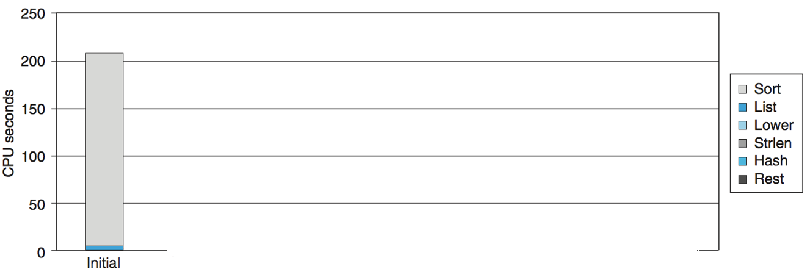
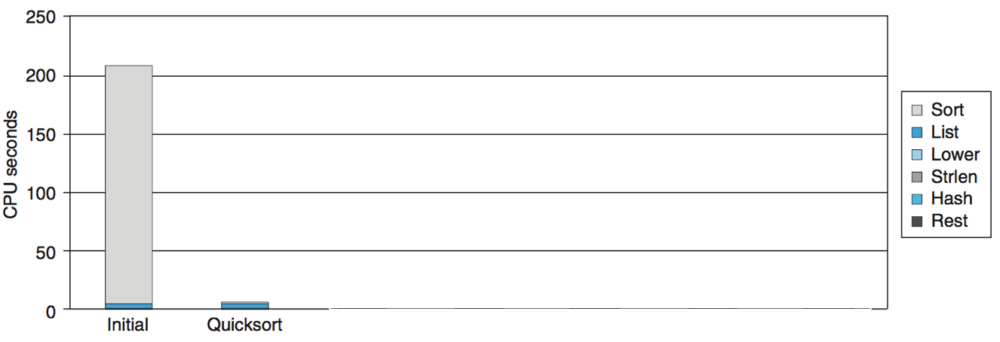
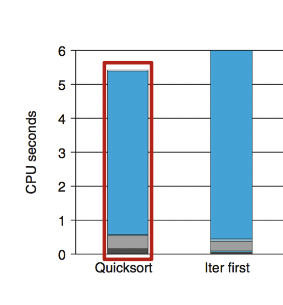
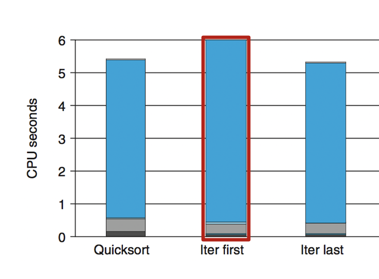
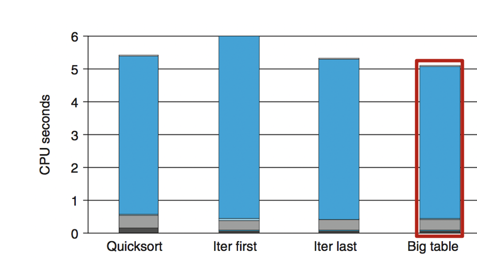
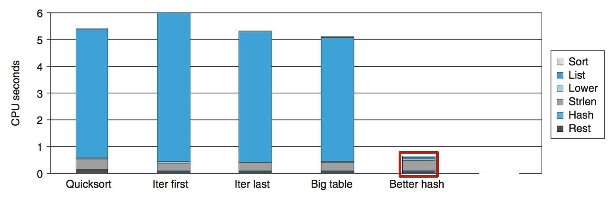
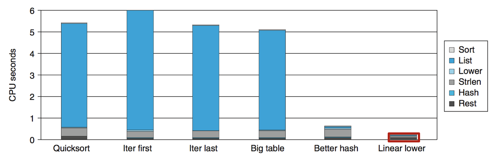

# 2.9 Memory Performance

## Textbook

* 5.12
* 5.14

## Memory Performance

> 上一节的收尾

内存性能是如何制约程序性能的。

首先，内存的读写是依赖于 CPU 跟内存之间的总线的。因此，每个时钟周期仅能读/写一回。

换句话说，涉及到内存读写的操作，其 Issue 必然是 1.0。

## Performance Tuning

### Example

我们以一个标准的例子来作为性能衡量的标准。

给出一个包含一堆词汇的文件，读取并分析它，统计出每个词出现的频率，并且按照频率排序输出。

> `shakespeare.txt`

我们以莎士比亚全集为例，其中包含 965,028 个单词，但是刨去重复的就只有 23,706 个。

### Implementation

#### Basic steps

对一个 $n$ 字符（其中有 $k$ 个不同的字符）的文件而言，有：

* 把所有的字符串都转成小写的（$O(n)$）
* 遍历所有字符，将其存入哈希表中（$O(n)$）
	* 也就是做了 `Counter` 的事情
* 对结果进行排序（$O(k \log k)$）

根据 Amdahl 规则，对越耗时的部分进行优化，效果越好。

但我们该怎么找出这样的部分（通常被称为 Hottest Part）呢？

#### Identify the Hottest Part

事实上，`gcc` 已经替我们提供了解决方案。

只要在编译时在源代码中加一点私货（在每个函数的入口出口处做标记），就能在执行时了解到每个函数的耗时情况。

1. 在用 `gcc` 编译可执行文件时，打开 `-pg` 开关。

2. 执行一次该程序。

3. 用 `gprof` 程序生成刚刚执行的结果报告。

	> `$gprof prog > report.log`

4. 查看报告内容即可。

这个报告的格式大概是这样的：

```
 %       cumulative     self                   self        total
time     seconds        seconds    calls       s/call      s/call       name
97.58    203.66         203.66      1          203.66      203.66     sort_words
2.32     208.50          4.85     965027        0.00        0.00     find_ele_rec
0.14     208.81          0.30    12511031       0.00        0.00       strlen
```

以表格的形式组织。从左到右依次为：占用时间百分比、执行到该函数时累计耗费的时间、因为执行该函数而耗费的时间、函数被调用次数、平均每次调用所耗费的时间（不包括下层子调用的时间）、平均每次调用所耗费的时间（包括下层调用耗费的时间）、以及函数名称。

#### Go Optimizing

很明显地，我们可以看出 `strlen` 被调用了超多次（这是当然的了！），但是总的时间占用并不是很多。反过来，是仅仅被调用了一次的 `sort_words`（对结果进行排序）函数，占用了超过 97% 的时间。

画成图来看就是这样：



这是怎么回事？一看代码，原来写的是个「冒泡排序」。也就是说，其时间复杂度达到了 $O(k^2)$。

难怪如此之慢！

#### Change Sorting Implementation

赶快换用 `qsort`，时间复杂度一下子降低到了 $O(k \log k)$。对于「莎士比亚全集」这个输入来说，时间复杂度降低了几个数量级。



现在这个图已经不好看了，所以我们去掉 Initial 图，只看後面的实现。

#### Change Recursive to Iterative

通过链表来组织数据，遇到新数据就把它放在头节点位置。




这么一番操作之後，发现性能居然下降了。

主要原因是，词汇太多了。最常见的词一般都会较早出现，而到了后期才出现的词汇大概率也不是那么常用。

因此，「把後发现的词放到链表最前」是个很不好的主意。

#### Fixed: Iterative Last

把新出现的词放在链表最后，怎么样呢？



相比 Quicksort 方法，好处不明显。

告辞。

#### Big Table

最开始的 Hash 实现，我们用了 1021 个 Bucket 存储。平均每个 Bucket 中有 $\dfrac {363039} {1021}$，大约是 355 个 Bigrams。

那如果我们大量增加 Bucket 的数量，会怎么样呢？



结果是仅仅变好了一点点。原因是，这里的字符串 Hash 策略是，每个字母对应一个码，他们的乘积模一个特定的数作为 Bucket ID。

显然，这套 Hash 方法区别不开 `rat` 跟 `tar`。也就是说，有大部分 Bucket 是一个元素都没装进去的。也就是浪费掉了。

#### Better Hash

尝试用一些更加良好、区分度更高的 Hash 算法。



此时，时间降低到了 0.4 秒。

#### Extract Loop

到此时，`Strlen` 的耗时变得比较明显了。

> 这个 `Strlen` 是在最开始把所有字母小写化的循环中被用到的。

这时候我们再把 `Strlen` 提取出循环，才能看到比较明显的优化效果，时间降低到了 0.2 秒。



> 试想如果我们在一开始就对 `Strlen` 优化，那结果一定是很不明显的。

所以，优化之前先看看 `gprof` 怎么说，会对优化过程很有帮助。