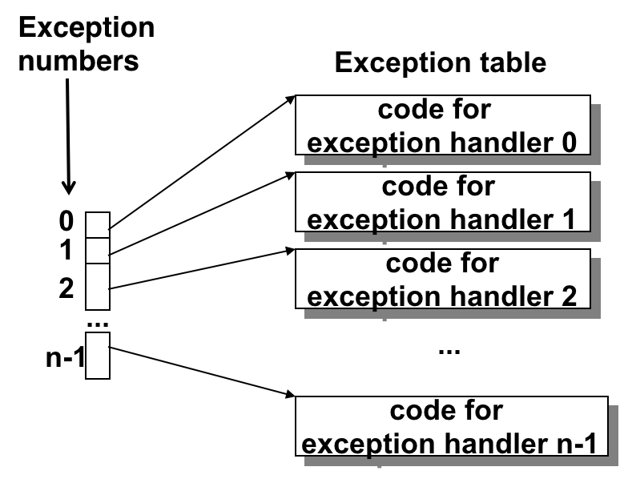
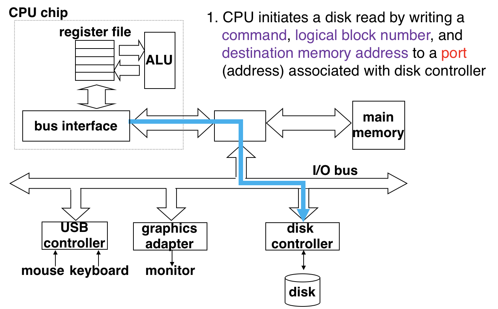
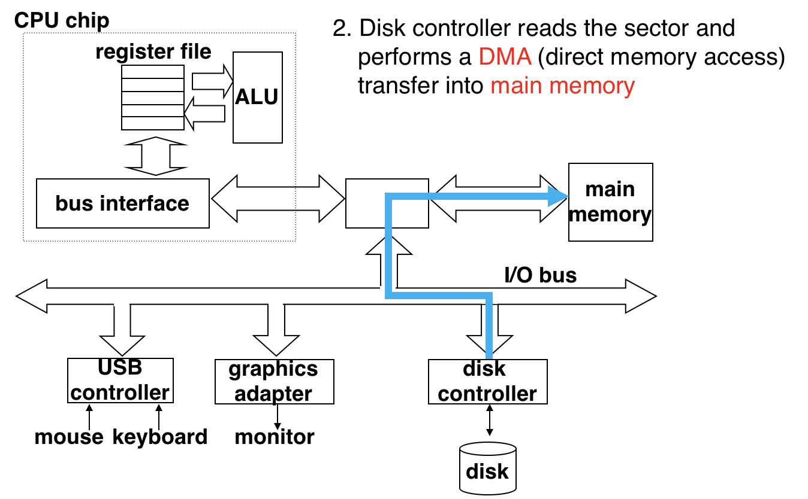
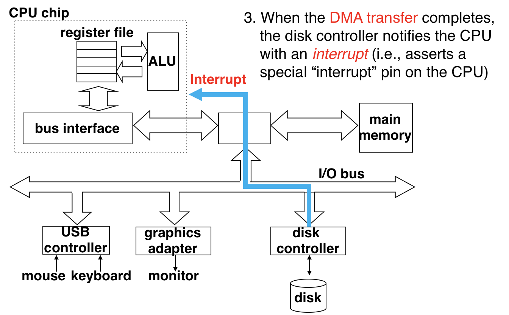

# 3.1 OS

## Outline

* Operating Systems
* Processes
* Exceptions

## Textbook

* 1.7
* 8.1

## Operating Systems

### Intro

抽象地考虑计算机的硬件组成，可以将其大略略地分成「处理器」（Processor）、「主存」（Main Memory）、「I/O 设备」（Input / Output Devices）。

那么他们又如何能够协调工作呢？理想状况下，Processor 逐条处理指令，并在需要的情况下对主存和 I/O 设备进行读取、写入。

OS 的地位类似于「中介」，介于软硬件之间的存在。


> 不过到底说，也不过是软件。是交给 Processor 逐条执行的指令代码的集合。

因此更恰当的绘图应该是这样：


* 用户 App 放弃了直接同 I/O 通信的能力，通过 OS 提供的统一接口来实现，从而换取自己的可移植性。
* 对于 Processsor 和 Main Memory…倒未必那么隔离。因为从事实上来说，用户态的指令的确是在 CPU 上直接执行，每次内存的访问也是确实走到总线上了的（虽然有地址翻译单元掺一脚），并不是由 OS 模拟出来的。但 OS 在这个过程中的确是做了辅助（例如，维护页表来提供内存虚拟化、进行进程调度来保证每个 App 无知地正确运行）。

因此，再修正一下我们的绘图，可以画成这样：


> OS 和 App 共同分享处理器时间和主存空间。只不过 OS 通过执行特定代码来实现进程调度、往主存中写页表数据来实现虚拟内存，体现了自己的较高地位。
>
> 但是，I/O 设备是完全包装过的。用户态的代码无可能直接同他们通信。

### Purposes

提供一层抽象的意图是什么？

* 保护。
	* 防止程序之间的干扰、防止恶意程序占有全部资源。
* 简化。
	* 提供一套简单的、可移植的应用程序开发方法，而无需关心具体的硬件细节。

抽象了哪些东西？

* 进程
	* 为了实现 CPU 时间、主存资源的合理分配
* 虚拟内存
	* 为了实现主存资源的隔离和保护
* 文件
	* 为了隐藏具体 I/O 设备的细节


巧妙的是，这三种抽象刚好覆盖了三大硬件设备的不同部分。

> 较难理解的是 Virtual Memory 为什么涉及到 I/O Devices？因为有一种 I/O 设备读写的实现方式就是将其映射到特定的虚拟内存区段。

### Illusion

每个程序都认为自己是特别的。

他们会认为当前的机器上只有自己一个程序在运行。

在执行的过程中，从没有写过「等待别的进程」这样的代码。

内存空间里，好像空空的只有自己的代码和数据。

其他的东西，好像只有 OS，提供了他所需要的一切 System Call。

这是怎么回事？

### Definitions

#### Processes

一个正在运行程序**的实例**叫做一个进程。

> 注意，同一个程序可以被多次运行，产生多个进程。

每个进程有自己独立的地址空间、上下文。例如，在这个程序看来，内存空间的布局是这样的：


高高在上的 OS 代码；靠下层的、自己的代码；中间的数据段，从低向高的堆，从高向低的段。这就是他所知的全部。

> 注意，进程也分为内核进程和用户进程两种。区别只在能执行的特权指令级别、访问地址的限制等方面。
>
> 内核进程一般是 OS 实现所引入的（OS 也不能就靠一个 Mainloop 实现啊）；而用户态进程就是用户程序运行时产生的实例了。

#### Virtual Memory

早期的计算机就一块主存，但是要应对很多程序——共用同一块主存的程序。

结果就是完全没有隔离性和安全性；任意程序可以读取任意地址的内容。在这种情况下，「同一个程序产生多个实例」也是不太可能的——他们的地址空间首先就冲突了。

IBM 的 System/360 用「内存分块」、「加标识位」的方式实现了简单的隔离，但没有完全消除依赖性；每个程序都确切的知道自己所在的物理内存地址，并且可以据此推断出整个系统中的内存布局。

后来大家想：那么干脆不要让每个进程知道自己所在的地址了，直接给每个进程一张映射表，通过这张表查出具体的地址。

问题是怎么用最少的内存、时间开销来完成这件事情。当然，後面的多级页表节约空间、MMU 硬件实现，大家都已经知道了。

#### Files

Unix 的设计逻辑是，尽量把「实体」抽象成文件（拥有 Read、Write（、Seek）能力的字节流）。因此所有的 I/O 操作都借助了类似文件系统的 API 实现。

另外，唯一定位一个文件的方式就是一个 `fd` / File Descriptor（或者，文件句柄）。说到底就是一个 OS 承认的数字而已。不过，这里和「虚拟内存」不同的是，用户程序想拿着这个 `fd` 做任何事情都需要经由 OS 提供的 System Call，而不像虚拟内存地址直接交给 MMU。

因此，没必要给每个程序分配不同的 `fd`。反正 OS 可以从中鉴权，大家共用 `fd` 反而更方便。

## Hardware

要想实现这些梦幻般的功能，单靠 OS 是实现不了的。

### Intro

不会有程序在其代码中写这样的内容：

```python
work_force("hey!")

# have a good rest
sleep(10)

work_force("ho!")

# i'm done, schedule me out!
os.yield_work()
```

即，不会有那个程序主动向 OS 提出放弃执行权，再次进行调度。那么岂不是一旦调度，就无法停下来了（因为目前执行的代码已经不属于 OS 了）？

这件事显然单凭 OS 的力量做不到，至少做不漂亮。

### Alter the flow

OS 所谓的「调度」，就是降低自己运行着的特权等级（从 Kernel Level 到 User Level），并且指向一个特定的位置开始执行。这是比较容易的。

但是，逆向操作，即「提升特权等级」、「并且把控制流交还给 OS」并不是那么直接。显然，这件事不能全交给用户代码去做；否则他们铁定会滥用这种方法来给自己提升权限。

控制流的切换主要有下面几类

#### System Calls

通过 OS 提供的特殊接口（System Call），来告知 OS 执行某一需要特权的操作。OS 在处理完毕後，将结果放入 `sysret` 中返回给用户态程序，程序流流到「下一条指令」处继续执行。

> 为什么是下一条么…因为引发 Altering 的那条指令就是 `syscall` 啊。要是回到那一条那不是停不下来了。
>
> > 注意「回到原处」和「去往下一处」的不同之处。


例如，下面的代码执行中其实就发生了一次控制流流动：

```c
int main()
{
    write(1, "hello, world\n", 13);
    return 0;
}
```

> 用 `printf` 或者 `puts` 的话，就是 C 标准库帮你做了这个系统调用。

甚至，就算你什么都不写，隐含的程序退出代码 `exit(RETV)` 也隐含地进行了一次 `ID = 60` 的系统调用。

在 x86_64 下，产生的汇编代码是这样的：

```assembly
movq	$1, %rax		# system call ID
movq	$1, %rdi		# Arg1: stdout desc ID
movq	$string, %rsi	# Arg2
movq	$len, %rdx		# Arg3
syscall
```

执行 `syscall` 指令就会将控制流转换给 OS。OS 会根据那时上下文中的寄存器值来决定进行什么操作、怎么进行操作。

> 问：为什么要用寄存器来传递参数呢？
>
> 答：没有别的地方了。如果放在内存里，那你还得用别的方式把「对应的虚拟内存地址」告知 OS。作为指令的一部分传也不好；指令长度不够放那么多东西进去。

> 当然这也造成了「能传递的参数量有限」的问题；只有 %rdi、%rsi、%rdx、%r10、%r8、%r9 这几个寄存器是可以用的。另外，和普通的函数调用类似，Callee Saved 寄存器的值也会被破坏。

#### Vector Table

很明显，我们通过更改 `%rax` 寄存器的值来指明我们要进行的系统调用号。对于 OS 来说，则会以系统调用号作为索引，查找一张名为「异常向量表」的条目。

这里面，每个条目都指向一段代码，是他们各自的处理函数（Handler）。



再具体一点，执行的是这样的代码：

```assembly
mulq	%rax, $8	# each pointer requires 8 bytes to store
addq	%rdx, %rax	# %rdx contains the table address
jmpq	%rax		# go to the exception handler
```

> 当然，异常处理函数都应该在内核状态下运行的。

### Classification

异常的种类，可以粗略地分成这么几类：

####Synchronous

同步的异常（Synchronous Exceptions），即「由于执行一条指令而引发的」异常。

例如，进行 System Call，是因为执行了 `syscall` 指令；执行缺页处理程序，是因为进行了寻址。

这一些都属于同步异常。

再具体一点区分，可以分成三种：

* System Call
	* 系统调用，功能性。
	* 在 Handler 结束後，前往下一条指令继续执行。
	* 例如，所有的系统调用都是这样的。
* Faults
	* 错误，但可以恢复。
	* 在 Handler 结束後，回到那一条指令再次执行。
	* 由于 Handler 的操作，下一次执行应当不会失败了。
	* 例如，触发缺页错误的情况。
* Aborts
	* 中断，不可恢复的错误。
	* 不会返回到触发代码处。
	* 例如，执行时遇到奇怪的代码，试图除以零，或者非法访问了内存。

#### Asynchronous

相比于 Synchronous 的异常，其来源并非是因为「执行某一条指令」，而是来自外部的某一事件。

例如，用户敲击了一下键盘，网络中传来一个数据包，等等。

异常同样有调用号，有携带的参数。但区别是其处理函数直接传到 OS，而和用户态正在执行的进程上下文无关。

> 因为异步异常的来源不是某一条用户态指令，因此处理函数也不应该依赖于某个特定的进程上下文。

当然，在执行完成之後也应该回到正常的控制流执行。在 User Mode App 的角度看起来，完全不知道发生了 Exception Handling 这件事。

## DMA

Direct Memory Access，直接内存访问。

对某些 I/O 设备来说，可以不经过 CPU 的处理直接和 Main Memory 进行数据交换。这种形式就被称为 DMA。

例如，读取一个 Disk Sector 的值的数据流动是这样的：

1. CPU 给出要读取的 Disk 的逻辑页号，连同要暂存的内存地址。



2. Disk Controller 通过 DMA，直接将所请求的值转发给 Main Memory。



3. 在转移完成之後，Disk Controller 发送一个中断，来通知 CPU，您的请求已经顺利地完成了。



那么，CPU 就可以通过读取映射到 Main Memory 中特定的位置，来取得她所请求的磁盘内容了。

> 写入的操作非常类似，这里就不单说了。

> 为什么需要用 DMA 机制来进行数据转移呢？
>
> 主要原因是，Disk 的读/写实在是太慢了。毫秒级别的时间内，CPU 可以执行好多好多代码了。
>
> 因此，就通过这种，不依赖于 CPU 的异步数据转移机制，来尽量地提高 CPU 的利用率，而不是浪费在等待 Disk I/O 上。

