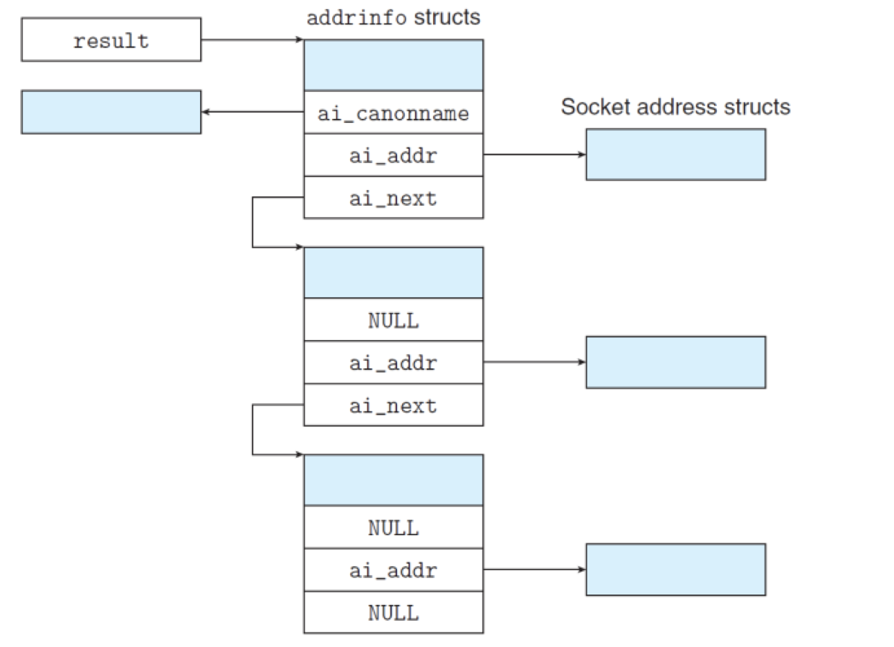

# 3.9 `socket`

## Outline

* 套接字编程
* 写一个自己的 `echo_client` 和 `echo_server`

## Textbook

* 11.4

## Socket

### Intro

首先，我们目前在用的 Socket 标准，起源于 Berkeley 的 BSD Unix。该系统在八十年代就已经实现了早起的 Internet 协议。

> 不过要注意，Socket 本身是无关乎具体 Internet Protocol 的。他只是一套网络通信的标准接口罢了。

关键在于：提供了一套类似于标准文件 I/O 的方式来进行网络通信。

### Graph


### Definition

#### Socket

一种提供给 Client 和 Server App 进行通信的抽象。

双方通过「套接字描述符」来实现信息交换。

#### Data Structure

```c
// "/usr/include/netinet/in.h"

/* Internet address */
struct in_addr {
    uint32_t s_addr; /* 32-bit IP address */ 
};
```

首先是基础的「IP 地址表示结构」。

```c
/* IP socket address structure*/
struct sockaddr_in {
    uint16_t sin_family; 			/* address family (AF_INET) */
    uint16_t sin_port;  			/* port number */
    struct in_addr sin_addr;		/* ip address */
    unsigned char sin_zero[8];		/* pad to “sockaddr” */
};
```

`sin_family` 标识位指明使用的地址格式。`sin_port` 就是常说的「埠序号」。和 `sin_addr` 代表的 IP Address 共同确定一个唯一的 `sockaddr_in`。

```c
/* Generic socket address structure */
struct sockaddr {
    uint16_t sin_family;		/* protocol family */
    char     sa_data[14];		/* address data */
};
typedef struct sockaddr SA;
```

`sockaddr` 本质上是泛化的 `sockaddr_in`。除去 `sin_family` 的两个字节，你可以发现 `sin_port`（2 字节）+ `struct in_addr`（4 字节）+ `sin_zero`（8 字节）就是 `sa_data` 对应的 14 字节。

> 这就是 C 所能做到的泛化方式：提供一个所谓「基类」（`struct sockaddr`），给你一些自由空间（这里是 14 字节）让你自由设计保存数据的方式。
>
> `sockaddr_in` 就拿其中的 2 字节用来存储端口号、4 字节存储 IP，剩余 8 字节空置。这样 `struct sockaddr *` 被作为 `struct sockaddr_in *` 提领时，可以保持其尺寸正确性。
>
> > 垃圾 C，换成 C+…（被打死

还有用来保存网络地址的链表结构：

```c
struct addrinfo {
    int ai_flags;				/* hints argument flags */
	int ai_family;				/* first arg to socket function */
	int ai_socktype;			/* second arg to socket function */
	int ai_protocol;			/* third arg to socket function */
	char *ai_canonname;			/* canonical hostname */
	size_t ai_addrlen;			/* size of ai_addr struct */
	struct sockaddr *ai_addr;	/* ptr to socket address structure */
	struct addrinfo *ai_next;	/* ptr to next item in linked list */
};
```

注意这里泛化的代价：`sockaddr` 的尺寸未定，导致我们需要（很 C 地）记录 `struct sockaddr *` 指向的内存尺寸，在 `size_t ai_addrlen` 里头。

#### Enumerates

有这么一些重要的枚举量：

* `family` 系列
	* `AF_INET`（IPv4）
	* `AF_INET6`（IPv6）

* `sockettype` 系列
	* `SOCK_STREAM`（基于连接的协议，几乎和 TCP 同义）
	* `SOCK_DGRAM`（基于数据报的协议，几乎和 UDP 同义）
	* `SOCK_RAW`（全裸协议，自己实现一切）

#### Functions

对于 C 来说，`struct` 就真的只是一堆数据而已。只有通过其他非成员函数小心调用才能发挥其作用。

> 说「非成员函数」其实也没必要。因为 C 就没有成员函数这一说

先拿着两个函数来说：

`getaddrinfo` 和 `getnameinfo`。

这两个函数用来在 Binary Socket Address Structure 和 String Representation of Host + Port Addresses 之间做转换。

例如，这个简单的 Host Info 程式，其功能一目了然：

```shell
linux> ./hostinfo twitter.com
199.16.156.102
199.16.156.230
199.16.156.6
199.16.156.70
```

实现也是很简单的：

```c
#include "csapp.h"

int main(int argc, char **argv)
{
    struct addrinfo *p, *listp, hints;
    char buf[MAXLINE];
    int rc, flags;

    if (argc != 2)
    {
        fprintf(stderr, "usage: %s <domain name>\n", argv[0]);
        exit(0);
    }

    /* Get a list of addrinfo records */
    memset(&hints, 0, sizeof(struct addrinfo));
    hints.ai_family = AF_INET;       /* IPv4 only */
    hints.ai_socktype = SOCK_STREAM; /* Connections only */
    if ((rc = getaddrinfo(argv[1], NULL, &hints, &listp)) != 0)
    {
        fprintf(stderr, "getaddrinfo error: %s\n", gai_strerror(rc));
        exit(1);
    }

    /* Walk the list and display each IP address */
    flags = NI_NUMERICHOST; /* Display address string instead of domain name */
    for (p = listp; p; p = p->ai_next)
    {
        Getnameinfo(p->ai_addr, p->ai_addrlen, buf, MAXLINE, NULL, 0, flags);
        printf("%s\n", buf);
    }

    /* Clean up */
    Freeaddrinfo(listp);

    exit(0);
}
```

注意，由于 `getaddrinfo` 返回的数据结构 `struct addrinfo` 天生是链表结构，即 `getaddrinfo` 自然支持了「一 Host 多 IP」查找功能。所以这里我们用到了一个 `for` 循环来打印全部的 IP 信息。

> 另外，所有的动态数据结构都是 `getaddrinfo` 分配的——自然也应该用其提供的 `freeaddrinfo` 来回收。
>
> `Freeaddrinfo` 是 `"csapp.h"` 中提供的 `freeaddrinfo` 包装函数。



`getaddrinfo`（连带 `freeaddrinfo`）的声明如下：

```c
#include <sys/types.h>
#include <sys/socket.h>
#include <netdb.h>
int getaddrinfo(const char *host, const char *service, 
			    const struct addrinfo *hints,
			    struct addinfo **result);
// returns 0 if ok, non-zero error code on error

void freeaddrinfo(struct addinfo *result);
// returns nothing 

const char *gai_strerror(int errocde);
// returns error message
```

`getnameinfo` 本尊的声明如下：

```c
int getnameinfo(const struct sockaddr *sa, socklen_t salen, 
			    char *host, size_t hostlen,  char *service, size_t servlen,
			    int flags);

// returns 0 if ok, non-zero error code on error
```

提供了名字和指针类型，都还挺显而易见的。

## Echo

### Demo


是这个样子的。`echoserver` 支持 `echoclient` 与其维持长连接：在 `echoclient` 传来 ASCII 字符串时，`echoserver` 会将其转为全大写并发回；遇到 `EOF` 则关闭连接。

### Connection


Socket 套接字通信的过程中，发生了这些事情：

* 双方各自都先 `getaddrinfo`，通过传递 `''`（空值）来得到自己的套接字 `socket`；
* Server 需要对得到的套接字进行 `bind` 和 `listen`，以便 Server 套接字处于可以连接的状态；
	* `bind` 表示「我想要同这些位置的 Hosts 通信！」
	* 是可以用通配符来指定的——一般的通用服务器就不作限制。
	* `listen` 表示「这个套接字可以用来接受 `connect` 请求！」。
	* 感觉都是没干什么事的函数…
* Server 对套接字调用 `accept`，开始循环阻塞等待 Client 的到来；
* Client 调用 `connect`，发起一个连接请求。如果此时 Server 正好在 `accept` 循环等待，碰上了，那就成了。

完成这几个步骤，Client 跟 Server 就算连上了。下面是链接上後他们可以做的事情：

* 彼此用 `read` 和 `write` 系列函数发送消息。

注意他们的地位是完全均等的——`read` 就是获取对方稍早前的 `write`——`write` 就是让对方稍後可以 `read`。

> 这里是没有考虑缓冲区的情况。如果考虑缓冲区，那么有可能还要加上双方和本地临时缓冲区的信息交换部分。

* 调用 `close` 终止一段连接。

不过在实际操作中，一般是 Client 在 `close` 之前先发送一个 EOF 信号给 Server，被 Server 收到之後也 `close`，并回到 `accept()` 另觅新欢。

### Source Code

```c
int main(int argc, char **argv)
{
    int clientfd;
    char *host, *port, buf[MAXLINE];
    rio_t rio;

    if (argc != 3)
    {
        fprintf(stderr, "usage:%s <host> <port>\n", argv[0]);
        exit(0);
    }
    host = argv[1];
    port = argv[2];
    clientfd = open_clientfd(host, port);
    Rio_readinitb(&rio, clientfd);

    while (Fgets(buf, MAXLINE, stdin) != NULL)
    {
        Rio_writen(clientfd, buf, strlen(buf));
        Rio_readline(&rio, buf, MAXLINE);
        Fputs(buf, stdout);
    }
    Close(clientfd);
}
```

实际为了简单期间，我们把「开始一段关系中 Client 要做的事」总结——就是 `getaddrinfo`，得到 `socket` 之後调 `connect`——包装成 `open_clientfd` 函数；把「开始一段关系中 Server 要做的事」——就是 `getaddrinfo`，得到 `socket` 之後 `bind`、`listen`——包装成 `open_listenfd` 函数。

> 注意 `open_listenfd` 函数并不会帮你阻塞地 `accept()`。那一步还是要自己踏出。
>
> 但是 `open_clientfd` 真的会因为调用 `connect` 而阻塞的。
>
> 因为如果 `open_clientfd` 不调用 `connect`，那他就等于是只调用了一次 `getaddrinfo(MYSELF)`，存在的意义就丧失了…

```c
#include "csapp.h"

void echo(int connfd);

int main(int argc, char **argv)
{
    int listenfd, connfd;
    socklen_t clientlen;
    struct sockaddr_storage clientaddr; /* Enough space for any address */
    char client_hostname[MAXLINE], client_port[MAXLINE];

    if (argc != 2)
    {
        fprintf(stderr, "usage: %s <port>\n", argv[0]);
        exit(0);
    }

    listenfd = Open_listenfd(argv[1]);
    while (1)
    {
        clientlen = sizeof(struct sockaddr_storage);
        connfd = Accept(listenfd, (SA *)&clientaddr, &clientlen);
        Getnameinfo((SA *)&clientaddr, clientlen, client_hostname,
                    MAXLINE, client_port, MAXLINE, 0);
        printf("Connected to (%s, %s)\n", client_hostname, client_port);
        echo(connfd);
        Close(connfd);
    }
    exit(0);
}
```

注意，Server 存在 `listenfd` 和 `connfd` 的区分。他们之间的区别在哪里呢？


* 首先，`client` 只有一个天真的 `clientfd`。
* 而 `server` 为了 `client` 能连得上，所以维系着一个 `listenfd` 持续侦听。
* 在 `client` 发出连接请求、被 `listenfd` 捕获後，双方并不会在 `listenfd` 上开展通信——而是在 `server` 的另一个独立套接字上。

例如，这里的 `echo_server` 就不会在自己执行 `listenfd` 的那个套接字上开展 `echo` 工作，而是通过调用 `echo()` 函数，在另一个套接字上通信。

通常，正经的服务器会在此处 `fork()` 出一个新进程处理请求；这样单个的 `accept()` 可以很快返回，并在后台进程中处理刚连上的请求，同时不影响新请求的来临。

不过 Demo 重在简单，所以我们就怎么简单怎么写吧：

```c
// echo (synchronized version)
void echo(int connfd)
{
    size_t n;
    char buf[MAXLINE];
    rio_t rio;
    Rio_readinitb(&rio, connfd);

    while ((n = Rio_readlineb(&rio, buf, MAXLINE)) != 0)
    {
        printf("server received %d bytes\n", n);
        Rio_writen(connfd, buf, n);
    }
}
```

## EOF

澄清您的误解：EOF 不是一个特殊的 Byte。实际上，他并不出现在正经的数据包文里——如果你去看，是找不出那个 Byte 的——而是写在了通信协议之中（一般是在包头部设置特殊的状态标识来提示 EOF）。

在 Unix I/O 中也是一样——当到达文件结尾处时，并不是说真的读到了一枚「EOF」字节，使得读取终止了；而是 Unix Kernel 发现读取到了终结时，设置了数据结构中的某一特殊状态。

表现在用户态代码中，就好像是「遇到了 EOF」。

其实不是的，是 EOF 遇到了你。

