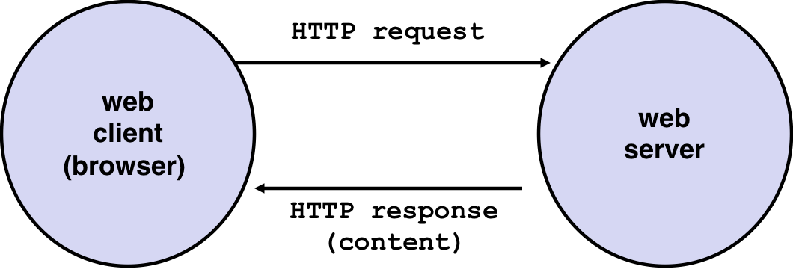
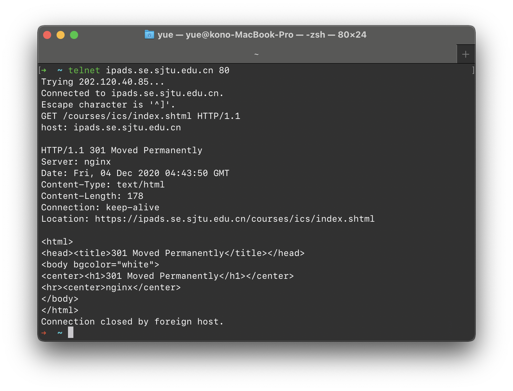
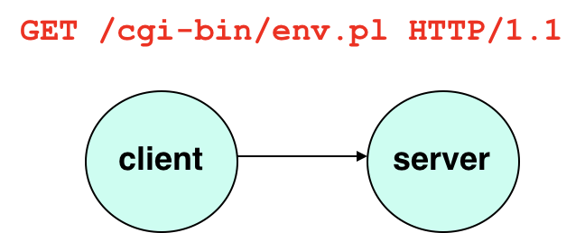
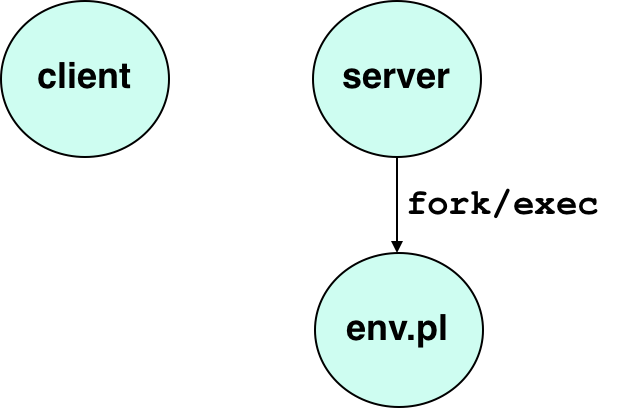
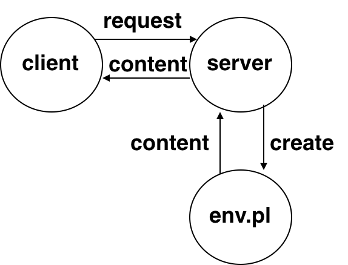
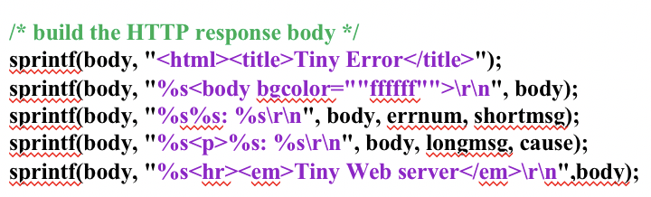
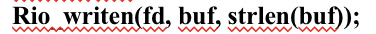

# 3.11 Web

## Outline

* Web 伺服器
* HTTP 协议
* Web 内容
* CGI
* Tiny Web Server

## Textbook

* 11.5
* 11.6

> 日常使用的互联网，建立在这么了不起的架构上
>
> > 或者说，这么了不起的架构，现在被一塌糊涂地用糟了

## Servers

### Intro

我有没有告诉过你，在网络中大家的地位其实是平等的？



不管是 Web Client 还是 Web Server，在网络之中都是 Host 而已。

只不过那些不断 Loop 地 `accept()` 的 Host 就被称为 Server；那些没有这种能力的、四处拈花惹草的呢，就称为 Client。

### Protocols

日常使用的传输层，从上到下，可以粗粗地分成高级的 HTTP（Web 内容）、TCP（流化的消息传输）、IP（纯粹的报文）。

相比于 HTTP，TCP 不知道他传输的内容是什么。

相比于 TCP，IP 不知道传输的目的地在哪里。


### Web Content

HTTP 协议通过一套名叫 MIME 的类型识别方案来标记传输的内容。

* `text/html`
	* 可读文本内容
	* 内容可以作为 HTML 标记语言来渲染
* `text/plain`
	* 纯纯的可读文本
* `application/postscript`
	* 应用程序专属
	* 是符合 PostScript 标准的可渲染文档
* `image/gif`
	* 图片格式
	* 依 Graphics Interchange Format 的规定
* `image/jpg`
	* 图片格式
	* 依 Joint Photographic (Experts) Group 的规定
* ……

HTTP 返回内容还区分一个「静态」、「动态」。

静态（Static）指的是唯读类型的数据，你请求了，就给你看一看。

> 例如页面背景资源文件、数据库等等。
>
> 浏览器一般会对这种数据做缓存，以免重复请求浪费带宽。

动态（Dynamic）指的是根据您这次请求的内容，动态生成的数据。

> 例如早期前端不存在的时候，整个 HTML 页面都是 Web 服务器渲染好之後，用 `text/html` 格式传过来的动态内容。
>
> 动态内容就不能缓存了…

### URL

Universal Resources Locator。统一资源定位器。

URL 是 URI（Universal Resources Identifier，统一资源标识符）的一种表现形式。

例如，像这样的就属于 URL：

* `http://ipads.se.sjtu.edu.cn:80/courses/ics/index.html`
* `http://ipads.se.sjtu.edu.cn:/courses/ics/index.html`
* `http://ipads.se.sjtu.edu.cn/courses/ics/`

来看下面这个 Adder 服务的 URL 位址：

`http://www.cs.cmu.edu:8000/cgi-bin/adder?15000&213`

其中：

* `http://` 是通讯协议的名称。
	* 例如这里就指明了采用（基于 TCP/IP 的）HTTP 协议

* `www.cs.cmu.edu` 是域名
	* Domain Name（语义化的）
* `:` 後的 `8000` 是端口（埠）号
* `/cgi-bin/adder` 是该服务器上的具体路径
* `?` 後的 `15000&213` 是参数。
	* 每个参数用 `&` 隔离。

所以，这个 URL 位址应该解读为：

* 采用 HTTP 协议、
* 位于 `www.cs.cmu.edu` 域名对应的服务器、
* 其标记为 `8080` 的侦听端口、
* 以 `/cgi-bin/adder` 为资源位置、
* 发送 `15000` 和 `213` 参数。

## `telnet`

Telnet 可以用来发送请求到指定的域名、服务器。

### Request

例如，我们可以：

```shell
unix> telnet ipads.se.sjtu.edu.cn 80
```

`telnet` 打印了这些输出：

```shell
Trying 202.120.40.88...
Connected to ipads.se.sjtu.edu.cn.
Escape character is '^]'.
```

注意，此时仅仅是同服务器建立了 TCP/IP 连接，并没有发起任何 HTTP 请求（没到那个抽象等级！）。

我们来用 `HTTP/1.1` 的语法实际发个请求试一试：

```shell
GET /cources/ics/index.shtml HTTP/1.1
```

这些纯粹的 ASCII 字母会通过 TCP/IP 被发送给服务器。

`GET` 开头代表了请求的类型。

`/courses/ics/index.shtml` 代表了请求的资源（在服务器上的）位置。

`HTTP/1.1` 代表了采用的 HTTP 协议版本。

还需要一行：

```shell
host: ipads.se.sjtu.edu.cn
```

> HTTP 协议是需要你明确指出「你要发给谁呀？」的。
>
> > 考虑到 IP 跟 Domain Name 不存在单向的映射关系。

给出这些信息之後，齐了。

> 当然，HTTP/1.1 的协议是很简单的…纯文本的。

然後，敲一个空行来结束 HTTP 请求头。



get。

### Response

服务器发回来的响应是这样的：

```shell
HTTP/1.1 301 Moved Permanently
```

> 协议版本、返回状态码、还有返回值s的具体说明。

```shell
Server: nginx/1.0.4
```

> 服务器的类型和版本。

```shell
Date: Fri, 04 Dec 2020 04:43:50 GMT
```

> 返回数据的具体日期和时间。

```shell
Content-Type: text/html
Content-Length: 178
```

> 返回内容的类型（上面提到的那些）和长度。

注意，Headers 可以包含类似于 `Key: Value` 的多余对。

例如，本地电脑上还包含了用于保存 HTTP 状态的两项：

```shell
Connection: keep-alive
Location: https://ipads.se.sjtu.edu.cn/courses/ics/index.shtml
```

其中 `Connections:` 用来指明要不要保留这条 TCP/IP 连接会话。设置成 `keep-alive` 可以让后续会画复用同一条通道，减少资源浪费。

`Location:` 是因为我键入的这个 URL 位址已经被移动了（返回 301 Moved Permanently 也是因此），所以服务器很贴心地返回了新地址位置。

另外，标准情况下通过一个空行（也就是连续的两个换行符号）来标识头的结束。这对 Request 和 Response 来说都适用。

### Payload

Response 会带有 Payload Body 自不必说。

但是，自从 HTTP/1.1 提供了 POST 方法，Request 也可以在头中带上 `Content-Type` 跟 `Content-Length`，从而实现「向服务器发送一大块 Chunk Data」的效果。

Body 里面呢，如果是 `text/html` 类型的 `Content-Type`，那自然一定是个可以渲染的 HTML 语言文档。如果是 `text/plain`，那就是纯文字。

现在，随着前端的兴起，很少有 HTML 是纯粹由后端渲染的了。大部分都是由前端 JavaScript 发送 AJAX 请求。这些请求，大部分又是 `application/json` 格式的。

### CGI

> 有点点危险的

CGI 呢，是实现「Server 动态生成内容」的方法。

通过特殊的配置，在收到 HTTP 请求时，自动根据请求体的内容执行对应的可执行文件（在那个年代，常常是 Perl 脚本来的），并将其打印到 `stdout` 的结果借由网络发回 Client。

> 这种实现方法就给 CTF 命题提供了广阔的空间

通常，脚本的内容都是事先写好的，客户端能决定的就只是传什么参数而已。另外，为了「安全」（说说而已），一般会限定只能执行特殊文件夹（`/cgi-bin`）里的可执行文件。

#### Implementation

首先，在请求来到 Server 时，她会剖析这是否可能是一个 CGI 请求呢？



如果是，那么他就通过 `fork` 复制一份自己，并且通过 `exec` 来将那个 CGI 程序放入内存。



通过 Unix 的 `dup2` 描述符重定向，把 `stdout` 重定向到套接字（或者，先转发到 Server 原身，再由 Server 负责处理）即可。



注意哦，在 `?` 之後的参数部分是唯一可以被发送给 CGI Application 的内容。就是那一串 `i_love_you&you_dont_love_me` 一样的东西。

说是有什么格式，`a=b&c=d` 的键值表示也可。实际上所有的东西都是「约定俗成」。Client 愿意发什么，CGI Application 愿意收什么，只要能对得上，不干外人事。

> 只不过，有一套专门的按照 `&` 做拆分的 Argument Parser 库…所以大家都习惯于这么用。

使用的方法，在 Unix 里是通过「环境变量」（`envp`）来取用的。

有这些特别的环境变量可以用：

```
QUERY_STRING (contains GET args)
SERVER_PORT
REQUEST_METHOD (GET, POST, etc)
REMOTE_HOST (domain name of client)
REMOTE_ADDR (IP address of client)
CONTENT_TYPE (for POST, MIME type of the request body )
CONTENT_LENGTH (for POST, length in bytes)
```

## Tiny Server

实现这种 Tiny 服务器就很无聊了…

通常来说，先 `sprintf` 到字符串。

> `sprintf` 同 `printf` 有类似的地方：如果传入的缓冲区不是空的，他会自动往後找到第一个 `\0` 的字节位，从那里开始打印。
>
> > 当然，诚如 Herb Sutter 所言，你实在不该放弃 `snprintf` 用 `sprintf`。
> >
> > 不然天天哪来那么多 Buffer Overflow 哦。



打完之後用 `rio_writen` 发给 `fd` 就好。



今天的 Lab 是实现一个 Proxy。Proxy 对 Client，表现成 Server；面对 Server，又表现成 Client。

所以实现 Proxy，相当于同时学会了写 Server 跟 Client。实在是很好的练习题啊。