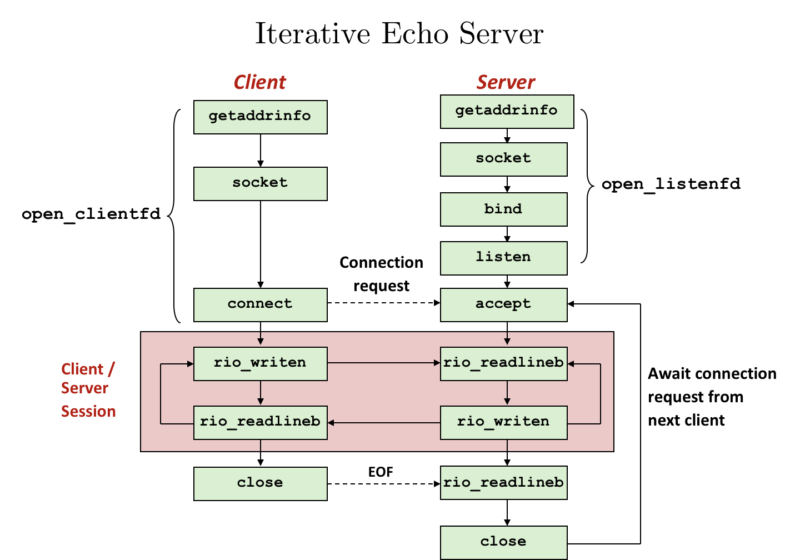
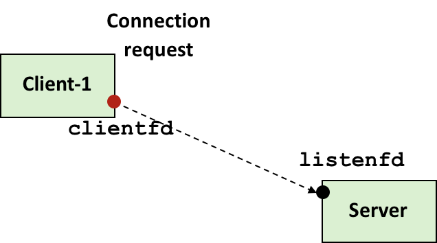
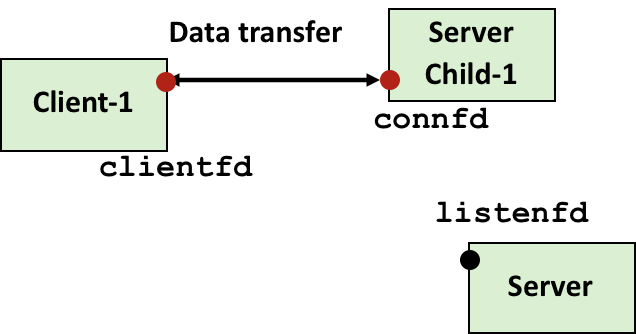
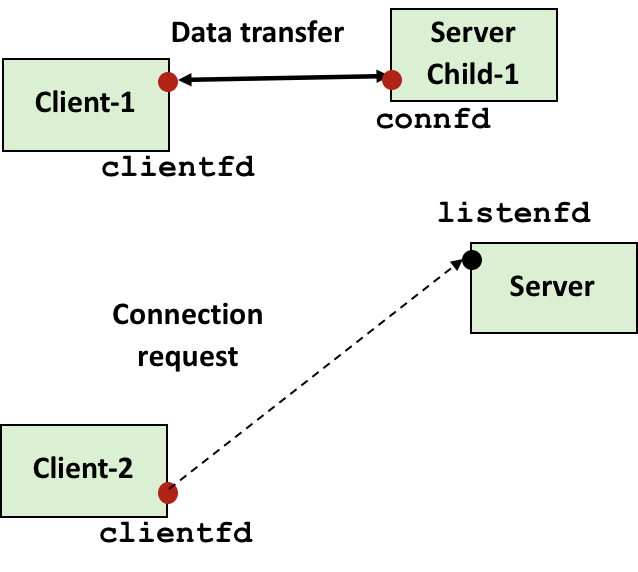
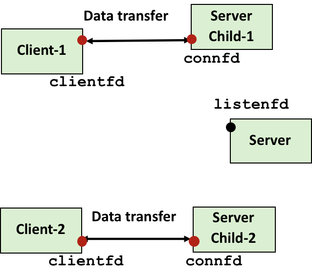
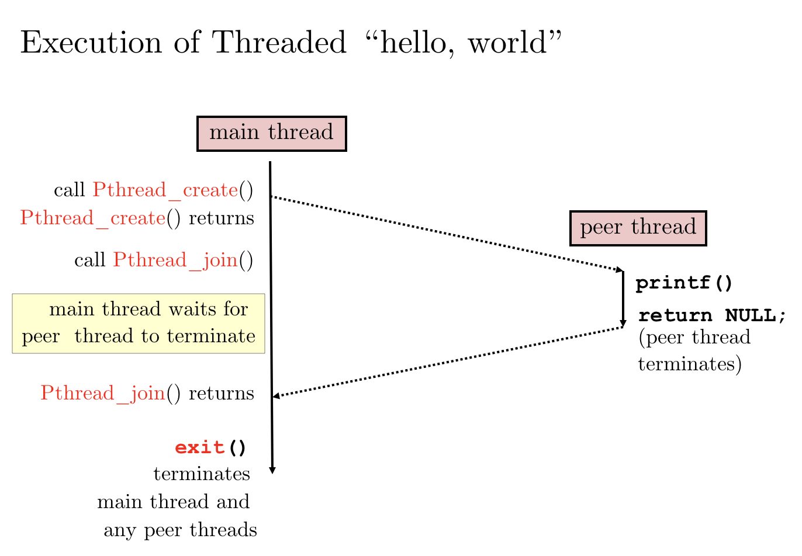

# 3.12 Concurrent Programming

## Outline

* 进程的并发编程
* 线程的并发编程
* 多路 I/O 的并发编程

## Textbook

* 12.1
* 12.2
* 12.3

## Concurrency

### Intro

并行性实际上是个通用的概念。甚至不仅是计算机中的概念。

只要存在有限的资源，就势必存在竞争（Race）。如果不是绝对地隔离（那必然是低效的），就必然存在并行（Concurrency）。

除了资源上的并行，也请不要忘记时间上的并行。

也就是，并不是所有的程序都只有单一执行流。

* 硬件来的 Exception Handler 函数
* 进程、线程
* Unix 信号处理函数

都会产生「CPU 时间」上的竞争。

从目的来看，有这些原因都要求「Concurrency」的出现：

* 应对异步事件
* 多处理器编程
* 访问很慢的 I/O 设备
* 处理人类交互（可以把人理解成响应超慢的 I/O 设备）
* （伪）同时服务许多客户端

### Ideas

首先，要记住这一条规则：

> 并发编程是很难的。

不论是人类还是（人类制造的）计算机，都倾向于「Sequential」地思考。

但是，人类是有极限的：

> 在竞争关系不是很平凡时，要考虑到所有竞争情况是不可能的
>
> > 好在我们不需要分析所有竞争情况来证明存在问题——只要情况足够复杂，几乎肯定会有出错的情形。

所以，唯有通过一些经过证明的「范式」/「原语」来对竞争关系进行约束，才能写出并发安全的代码。

但是但是，「约束」本身也不是很安全的。

如果约束没写好，也可能会造成问题，包括但不限于：

* 没有起到保护作用，仍然产生了数据竞险。
* 循环依赖，死锁。
* 资源分配不平衡，饿死。

## Example

考虑到这些问题之後，我们再来审视一个例子：

就是我们的 Echo Server。



客户端不应该存在什么竞险问题（资源并不由他持有），主要看看服务端。

咱们来考虑一下最简单的实现：

```c
int main(int argc, char **argv) 
{
   int listenfd, connfd;
   struct sockaddr_in clientaddr;
   socklen_t clientlen = sizeof(clientaddr);

   listenfd = Open_listenfd(argv[1]);
   while (1) {
      connfd = Accept(listenfd, (SA *)&clientaddr, &clientlen);
      echo(connfd);
      Close(connfd);
   }
   exit(0);
}
```

由于 Socket 的基础实现，在指定的服务端调用 `Accept` 之前，客户端的 `Connect` 会持续阻塞。

所以，在 `echo(connfd)` 执行期间（他们都是同步的！），新来的客户端无法得到响应；他们可能会在 Socket 缓冲区中等待，也可能过了超时自动失效。


可以看到，Server 处理 Client 1 跟 Client 2 之间的执行流是完全隔离的。

但实际上 `echo` Handler 大部分时间是在等待 Client 的字符串来到、处理（也就是转个大小写）基本不花时间，所以这就带来了大量的资源闲置浪费。

理想中的情况应该是：接受更多（当然也不是无限多）的 Client 来，并在另外的线程中进行等待 + 响应工作。

这样，处理线程的等待就不会引起全机资源的大浪费。

用图的形式表示，是这样的：

* Client 和 Server 交换确认



* Server `fork` 出子进程来处理



* 新请求到来，如法炮制





好处就是，几乎任何时候 Server 都能保持着 `Accept()` 状态，能够快速对客户端程序进行响应。Good！

同时，还从更高的层级确保了「不同 Clients 请求」之间的隔离性——恶意的 Client 想要从其他 Client 会画中窃取数据更困难了——不仅需要跨越服务器代码的隔离约束，还有宿主 OS 的线程隔离约束；而后者通常是比较可信的。

那么，可以写出：

```c
int main(int argc, char **argv)
{
   int listenfd, connfd;
   struct sockaddr_in clientaddr;
   socklen_t clientlen = sizeof(clientaddr);

   Signal(SIGCHLD, sigchld_handler);
   listenfd = Open_listenfd(argv[1]);
   while (1)
   {
      connfd = Accept(listenfd, (SA *)&clientaddr, &clientlen);
      if (Fork() == 0)
      {
         Close(listenfd); /* Child closes its listening socket */
         echo(connfd);    /* Child services client */
         Close(connfd);   /* Child closes connection with client */
         exit(0);         /* Child exits */
      }
      Close(connfd); /* Parent closes connected socket (important!) */
   }
}
```

> 这里采取的策略是每个 Subprocess 和 Client 请求一一对应——Client 请求一旦结束，子进程也自杀。
>
> 实现中可能承担不起反复创建、杀死进程的开销；这就涉及到复杂调度、线程池的设计了。点到为止。

## Basic Functions

复习到这里要是您也摩拳擦掌，想试试写那么几个并发程序的话，Unix 提供了这些函数：

* `pthread_create`
	* 传入函数指针（和一些 `flags`），就可以创建连带运行一个「函数充当的」线程！
* `pthread_join`
	* 收割线程——或者说，阻塞，直到那个线程结束。
	* 另外，还会隐含地强迫 OS 回收该线程的资源。
	* 如果不调用此函数而令您的子线程自生自灭？
		* 那么该子线程的资源可能无法及时得到回收，即使其执行流已经退出了。
		* 不显式调用此函数表明了一种漠不关心的心态；因此 Unix 也同样漠不关心地推迟了资源的回收。
* `pthread_self`
	* 我的线程 ID 是什么？
	* 如果你不曾被人用 `pthread_create` 显式制造出来，那么你很可能是幸运儿——某个进程的主线程（Main Thread）。
* `pthread_cancel`
	* 结束某个线程。传入的参数是你希望结束的线程。
* `pthread_exit`
	* 自我了断。同时传点什么返回值回去。
* `exit`
	* 结束整个进程——连带您创建的所有线程。
* `return`
	* 放在这里其实有点偏；`return` 实质上是 C 的关键字。
	* 只不过，在 `return` 出现在顶级 Scope 里时（例如，`main` 函数以及用于创建线程的函数），编译器会隐含地在其尾部添加结束线程的系统调用。
	* 请不要误会了。

所以，来看看这个例子：

```c
/* hello.c - Pthreads "hello, world" program */
#include "csapp.h"

/* thread routine */
void *thread(void *vargp) {
	printf("Hello, world!\n"); 
	return NULL;
}

int main() {
    pthread_t tid;
	Pthread_create(&tid, NULL, thread, NULL);
	Pthread_join(tid, NULL);
	exit(0);
}
```

其执行流是这样流动的：



由于 `pthread_create` 之後立即 `pthread_join`，所以异步的感觉没发挥出来…

但是要相信，从 OS Kernel 的角度来看，的的确确是创建、回收了一个新线程的。

## Threads? Processes?

### Costs

开销上不必多言。

如果你创建了一个进程，那么你至少也创建了一个线程（她的主线程）。所以，Processes 的开销无疑高于 Threads。

量化一下，我们有如下的经验结论：

* 创建、回收一个进程，您大概需要付出两万个 CPU Cycles。
* 而创建、回收一个线程，只需要**不到**一万个 CPU Cycles。

### Data Flow

时常会有从其他进程 / 线程获取数据的需求。

Threads 间交换信息简直不要太简单——实际上他们之间除了寄存器不共享，几乎啥都共享了。

> 栈的「隔离」，实际上是通过分配不同区段的栈内存，并调整 `%rsp` 指针位置来实现的。不能说是完全的隔离。

最简单的，写一个全局变量都可以。

> 通常，这类变量会用 `volatile` 饰词修饰——确保了对其的多余读、重复写不会被优化掉。
>
> > Effective Modern C++ 的条款 40 对此有更详细的论述。

但是 Processes 之间…你必须显式地通过 Kernel 提供的进程间通信手段来完成这件事。不仅麻烦，代价也并不低。

话虽如此，实际上有不少的 Bug 都是由于「无意间的」线程数据共享导致的。

所以，或许像 C++ 的强制类型转换一样，把数据共享 API 设计得丑一点或许更好。

## I/O Multiplex

I/O 的多路复用。也称作「事件驱动」。

### Intro

意在解决下面这样的问题：

假设这里来了 1000 个 Echo Client 进程，都要求 Echo Server 的服务。

但是，因为他们的数据都来得特别慢（半天憋不出一句 Hello world 的那种），所以实际上数据流量并没有超过理论吞吐量的最大值。

但是，如果我们按照上面的简单 Concurrency 编程的方式实现，问题就大了——我们会创建出 1000 个子线程！而且，同一时刻，其中几乎所有的线程都阻塞着——在等待 Echo Client 数据的到来。

首先，这对性能的影响是毁灭性的。

线程越多，占用的内存越多。以每个线程 2M 栈空间为例，其占用的内存空间都到了不可接受的地步。

除此之外，由于绝大多数线程不做任何事情，CPU 调度的效率也急剧降低。大部分时间浪费在上下文切换上；而大部分调度都不能前往实际做事情的线程。

一句话，逊爆了。

### Select

```c
#include <sys/select.h>

int select (int maxfd, fd_set *readset, NULL, NULL, NULL);
```

这个函数的语义是：挂起当前进程，直到 `readset` 里指定的那些文件描述符中有至少一个变成了「可以读」的状态。

`maxfd` 用来指明提供的 `readset` 的个数。

> 类比 C 的标准数组传递方式 `(int arr[], int size)`。

> 一般来说，如果你要监听的最大 `fd` 是 $x$，那么就需要传递 $x + 1$ 大小的数组。因为 `fd` 从 0 开始数。

当然，Unix 也提供了一大堆宏来编辑 `fd_set`：

```c
/* clear all bits in fdset. */
void FD_ZERO(fd_set *fdset);
/* clear bit fd in fdset */
void FD_CLR(int fd, fd_set *fdset);
/* turn on bit fd in fdset */
void FD_SET(int fd, fd_set *fdset);
/* Is bit fd in fdset on? */
int FD_ISSET(int fd, *fdset);
```

用这种佶屈聱牙的 API 进行操作的可能原因是，这里采用了 per Bit 的优化策略来减少内存占用。例如，一个 Char 掰成八瓣花，可以用来存储 8 个 `fd` 的状态。

> `std::vector<bool>` 流泪

### Programming

`select` 能够如何提高效率呢？且看下面的代码：

```c
while ( 1 ) {
    ready_set = read_set;
    Select( listenfd + 1, &ready_set, NULL, NULL, NULL );
    if (FD_ISSET(STDIN_FILENO, &ready_set)
        /*read command line from stdin */
        command();	
    if (FD_ISSET(listenfd, &ready_set)){
        connfd = Accept( listenfd, ( SA* )&clientaddr, &clientlen );
        echo( connfd );
    }
}
```

在 `listenfd` 尚未被设定为 Readable 时，该程序将一直睡眠。

能做到这一点的要诀是，`fd` 管理和程序调度，都是 OS Kernel 的权限。它可以根据 `fd` 的情况来决定调度谁。

换句话说，OS Kernel 可以做到「基于数据流」的消息追溯。因为数据都是他所管理的程序、用他的 API 来发送的，它自然可以根据预先知道的信息，进行更有效的控制权交接，以提高数据流动的速度。

