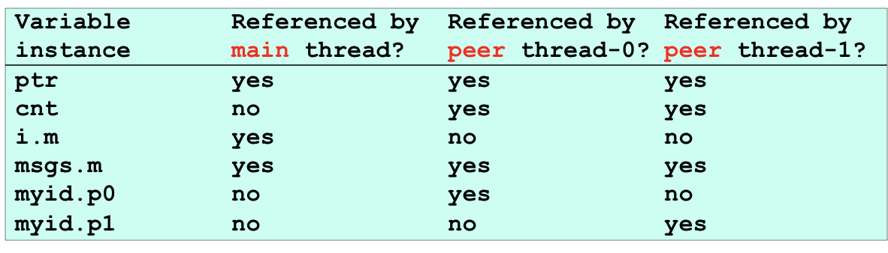
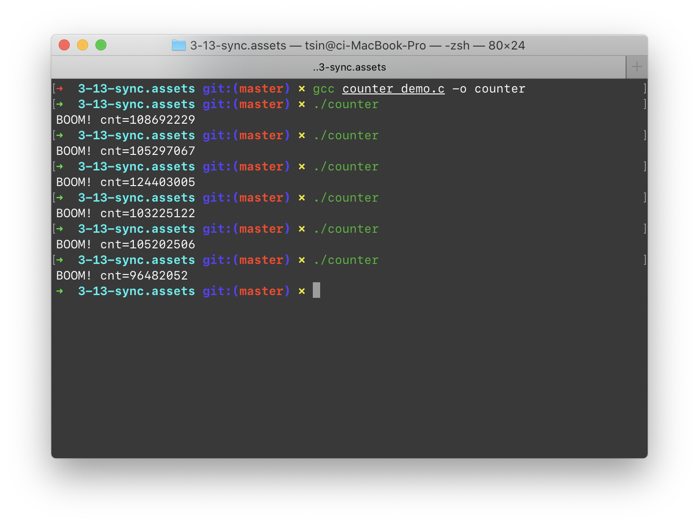
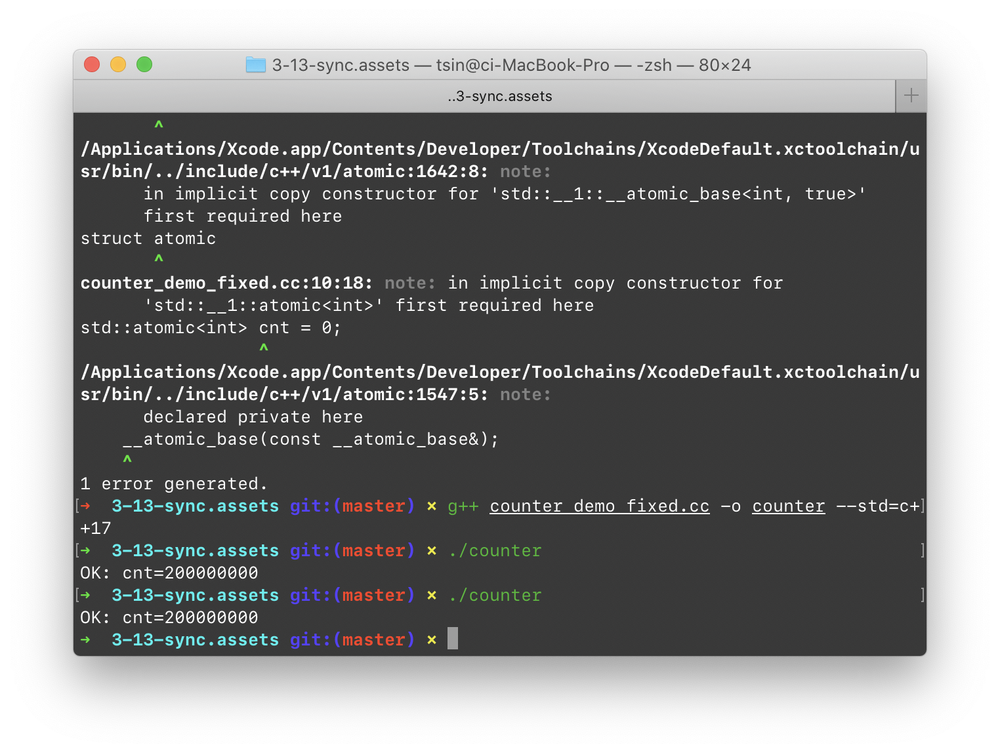
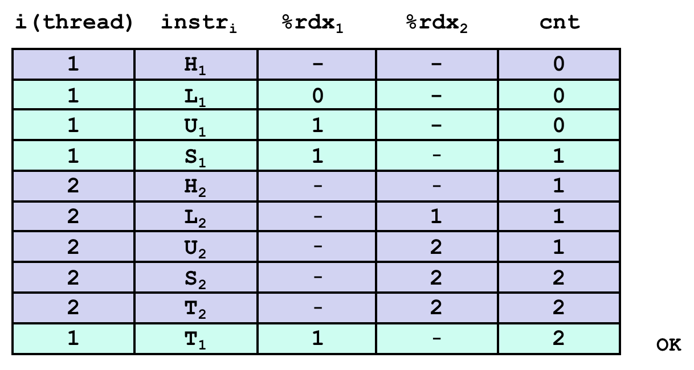
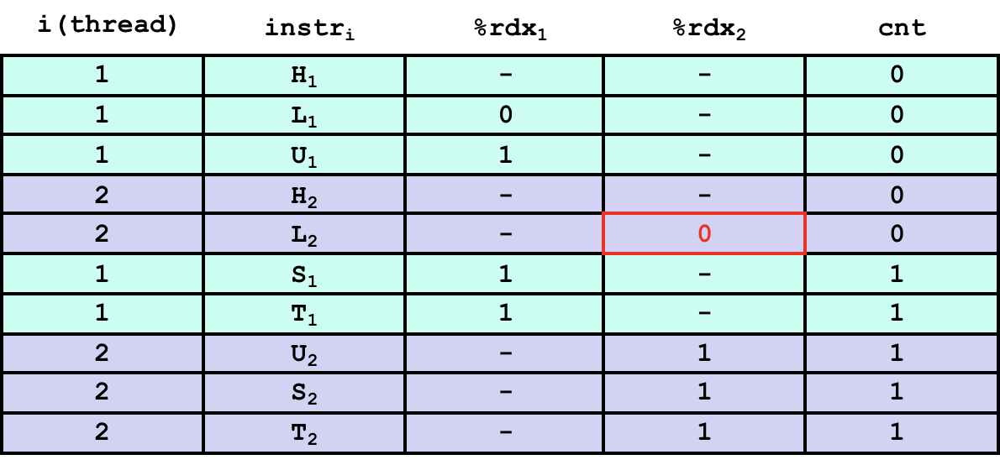
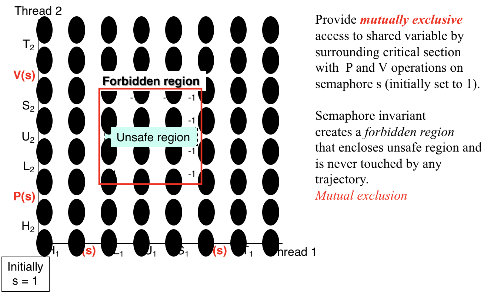

# 3.13 Synchronize

## Outline

* Shared Variables
* Synchronizing with Semaphores

## Textbook

* 12.4
* 12.5

## Concurrency

并发编程简单吗？可能不是。

假如我们只追求纯粹的「并行」，那么多买几颗 CPU 就可以实现。但那对绝大多数任务来说都无法起到加速作用。

难点是「如何在执行顺序随意链接」时，保持某些一致性，从而提供解决问题的工具。

### Multi-Thread

先从最简单的「多线程」看起。

借助 Win32 API 写一个简单的多线程程序：

```c
DWORD WINAPI foo( LPVOID lpParameter ) {
    while (true) {
        // do nothing
    }
}

int main() {
    CreateThread( nullptr, 0, foo, nullptr, 0, nullptr );
    while (true) {
        // do nothing
    }
}
```

> 因为线程的切换同样涉及 OS 的调度，因此是存在平台依赖的。

父线程和子线程共享着所有的代码段、堆、内存空间、数据。实际上栈空间也共享，只是由于 `%rsp` 不共享，带来了他们之间独立的假象。内存空间共享是因为他们共享页表基地址，因此相同的虚拟地址都会被翻译成一样的物理地址。

不共享的，就只是一套寄存器 + 状态码而已。这是最少的上下文信息了（不保存这些，代码就无法正确执行）。

因此我们可以回答出「共享」的问题：栈上的数据不共享。堆上的数据、只读数据、全局数据都共享。

* 寄存器（包含特殊寄存器，如 PC、SP 等）是真的隔离。这些东西是保存在 OS 线程上下文里的
* 栈是表面隔离，实际上是通过映射 `%rsp` 到不同位置实现的假隔离。如果能拿到其他线程的内存地址，哪怕是在栈上的，一样也可以任意读写。

### Sharing

看下面这个例子：

```c
#include "csapp.h"
#define N 2
void* thread(void* vargp);

char** ptr;
/* global variable */

int main()
{
    int i;
    pthread_t tid;
    char* msgs[N] = {
        "Hello from foo",
        "Hello from bar"
    };

    ptr = msgs;
    for (i = 0; i < N; i++)
        Pthread_create(&tid, NULL, thread, (void*)i);
    Pthread_exit(NULL);
}

void* thread(void* vargp)
{
    int myid = (int)vargp;
    static int cnt = 0;

    printf("[%d]:%s(cnt=%d)\n", myid, ptr[myid], ++cnt);
}
```

留意到，这里创建的 `N` 个子线程统统可以访问到位于主线程只读内存里的字符串。同时，还访问到了全局变量 `char **ptr`。



这张表展示了完整的（变量名字）共享信息。

C 中的 `static` 用途是，保证当前变量在当前作用域内定义且仅初始化一次。顺便，阻止外部对此变量的可见性。

同时，在大括号 Scope 中定义的栈上变量，其名字也不能被子线程发现。

> 由于内存空间的共享性，所以其实上面所有这些标记为 `no` 的变量，都可以通过「泄漏指针」的方式实现跨线程访问。

有一条统一规则可以判别可见性：

> A variable `x` is shared iff multiple threads reference at least one instance of `x`.

总归还挺明显的。

### Racing

现在尝试用内置的多线程写一个分部计数器吧。



当然，这已经不新鲜了——大家都知道 `i += 1` 不是原子的，虽然看起来很像。

会生成这样的汇编代码：

```assembly
.L3:
	movq cnt(%rip),%rdx # Load
	addq %rdx           # Update
	movq %rdx,cnt(%rip) # Store
```

主要原因是 C 语言不保证存在原子的递增；这段代码被翻译处理完之后成了 `Store(Plus(Load(i), 1)` 的样子。

因此虽然部分指令集存在原子的 `INC` 指令（但是限制也颇多，例如只能递增 / 递减很小的数字），C 依然只能按照 `i = i + 1` 的形式来翻译。

用 Modern C++ 提供的标准库 `std::atomic` 就可以实现正确的递增。



> 不过，这样跑可以明显地感觉得到，比不正确的那个版本慢很多。

### Programming

我们把所有的程序执行流看成一维的状态的陆续切换。

那么，如果有两条执行流同时作用，就可能有乘法个数的交错执行可能了。

列成一张表的形式，就是：





> 这种表的读法是：
>
> 从上往下，每一行都是一个状态。
>
> 写着数字的是内存/寄存器的值。
>
> `instr_i` 代表将要执行的语句。
>
> 底色的不同区分了不同的进程。
>
> 同种底色的指令，其顺序一定和源代码中的顺序一致。
>
> 不同底色的指令，交错顺序不能保证。

这样画起来还是很难看。我们用 $2 \times 2$ 的图表形式来绘制，如何呢？


每一个可能的状态都表现为一个点。注意，由于「Thread 内部」的顺序性必须保证，因此数据流的每一条边只能向右、或向上移动 1 格。

例如，


这样的数据流图就表示了 **H1, L1, U1, H2, L2, S1, T1, U2, S2, T2** 的执行顺序。

不难看出，L、U、S 应该是一组原子性的操作。若是两个线程的 LUS 交错了，即执行流走到了双方 LUS 交集的位置上去，那就破坏了 LUS 的正确性，自然产生了不对的结果。

## Semaphore

天才 Dijkstra 提出的 P/V 信号量。P 和 V 分别是 Proberen (test) 和 Verhogen (increment) 的首字母缩写。

用编程语言的方式描述更容易理解：

```python
s = 1
def P():
    global s
    while (s == 0):
        wait()
    s -= 1
    
def V():
    s += 1
```

总归，`P` 不停地找机会把 `s` 减小；如果 `s` 是 0，那么就阻塞。`V` 则是把 `s` 递增；因为 `s` 没有上限，因此 `V` 不会阻塞。

请注意这里有一个「阻塞」的不变量：`s` 不能小于 0。这相当于给数据的流动施加了限制。

例如，把上面的代码这样改写：

```python
def count():
    P()
    count += 1
    V()
```

这就退化成了我们常见的 `Lock.acquire()` 和 `Lock.release()` 了。



从图的角度来看，加上信号量的实现阻止了控制流进入某些区域。这就保证了正确性。