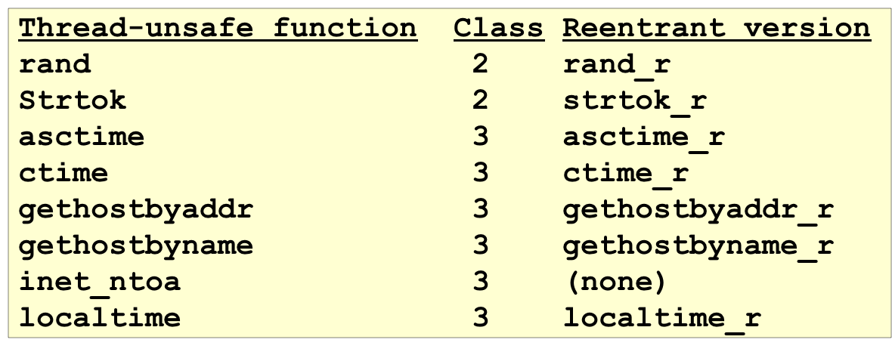
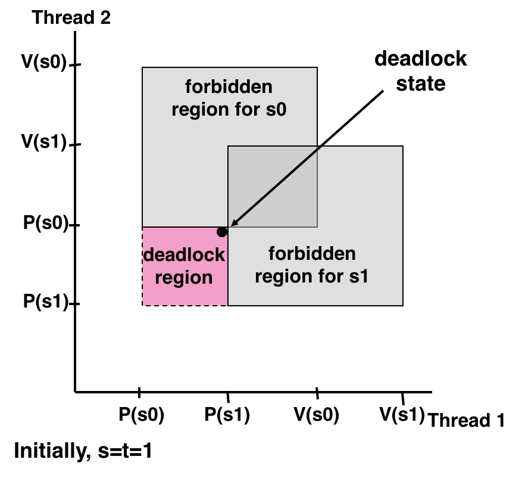

# 3.14 Concurrency Issues

## Outline

* 生产者/消费者问题
* 读者/写者问题
* 基于 `pthreading` 的并发服务器
* 并发带来的问题

## Textbook

* 12.5
* 12.6
* 12.7

## Typical Questions

来看两个典型的问题。

### Producer & Consumer

非常常见的一个多线程分离情形，就是「一个进程制造、另一个进程读取」。他们之间共享同一块缓冲区。

事实：在系统中只有一个生产者和接受者的时候，不需要加锁即可保证不存在竞险。只要遵循这样的规则：

* 生产者总是先将物品放置到位，再更新该位置的 Flag
* 消费者总是先拿走该物品，再更新该位置的 Flag

这都是很显然的规则。因为如果反过来，就会出现「消费者看到了不完整的物品」，或是「生产者把消费者正准备读的东西覆盖了」的问题。

但是在存在多个生产者，或多个消费者时，生产者之间、消费者之间势必会产生竞险；这是调整 Flag 更新顺序所无法解决的问题。

不过仍然要留意，虽然消费者之间存在「检查 Flag、读取数据结构、更新 Flag」的竞险、生产者之间存在「检查 Flag、写入数据结构、更新 Flag」的竞险，但生产者和消费者之间仍然是没有竞险的。没必要加上一把大锁把大家都锁上；分为「`producer_lock`」 和「`consumer_lock`」 就好了。

### Reader & Writer

在 P/C 模型中，实际上不论是生产者还是消费者，都对缓冲区进行了修改（消费者消费的过程，也存在「将某个位标记为『空闲』状态」的过程）。

下面是更为泛化的读/写模型：

1. 读者线程只会读取数据的内容。
2. 写者线程会更新数据的内容。

那么，就有下面的推论：

3. 多个读者可以共同享有对象的读取权。
4. 多个写着不可以共享对象的读取权。
5. 读者和写者不可以共享对象的读取权。

但是，这里就存在一个设计决策的区别了。如果我们加入一条设定：

6. (a) 如果当前没有写者在等待的话，新的读者才能获得所有权。

或者，相对的：

6. (b) 写者需要一直等待，直到所有的读者和其他的写者都释放後才能获取所有权。

前者 (a) 的实现偏向写者，确保了写的内容可以尽快生效。

但是 (b) 的实现偏向读者，只要有读者源源不断前来，那么对象会一直被读者占有。换句话说，写者会等待一茬又一茬的读者前来，而无法更新其中的内容。

虽然上面说了一堆看起来很复杂的样子，但实现却非常简单。

只需要有两个锁 `w`、`mutex` 就好了。

这是偏向读者的实现方法：

```c
int readcnt; /* Initially 0 */
sem_t mutex, w; /* Both initially 1 */

void reader(void)
{
    while (1) {
        P(&mutex);
        readcnt++;
        if (readcnt == 1) /* First in */
            P(&w);
        V(&mutex);

        /* Reading happens here */

        P(&mutex);
        readcnt--;
        if (readcnt == 0) /* Last out */
            V(&w);
        V(&mutex);
    }
}

void writer(void)
{
    while (1) {
        P(&w);

        /* Writing here */

        V(&w);
    }
}
```

也就是，由第一个进入读取区的读者持有锁，并且由最后一个退出读取区的读者释放锁（这项计数的正确性由 `mutex` 保证）。

这就保证了写者只有在读取区净空的时候才能拿到锁 `w`。

偏向写者的呢？也很简单：

```c
int readcnt = 0; /* Initially 0 */
sem_t mutex, w, r; /* Both initially 1 */

void reader(void)
{
    while (1) {
        P(&r);
        P(&mutex);
        readcnt++;
        if (readcnt == 1) /* First in */
            P(&w);
        V(&mutex);
        V(&r);

        /* Reading happens here */

        P(&mutex);
        readcnt--;
        if (readcnt == 0) /* Last out */
            V(&w);
        V(&mutex);
    }
}

void writer(void)
{
    while (1) {
        P(&r);
        P(&w);

        /* Writing here */

        V(&w);
        V(&r);
    }
}
```

只有拿到 `r` 锁，新的读者才能进入。而 `writer` 在试图拿到 `w`锁之前，先把 `r` 锁拿掉。这样，只要有 `writer` 阻塞在 `P(&w)` 里（正在等前朝余读结束），新的读者就来不了。

这种策略也存在问题。假如 `writer` 不停地过来，一直持有 `r` 锁，那么所有读者都无法进入读。

`boost` 库提供了很多种不同的锁，请务必了解。

## Thread Safe Functions

线程安全的函数？

原始 K&R C 标准库中的所有函数都是安全的。

> 只要实现 `_mutex_` 魔法函数，C 的标准库里不存在不安全的函数。
>
> 堆上分配内存的管理加了锁、获取异常也是安全的、`stdio` 也是。
>
> > 注意，`stdio` 线程安全并不意味着两个线程打印出来的东西不会交错或者混淆。

> 但是，绝少部分的函数，像是 `mbrlen` 多字节字符串转换的函数不知道为什么没加锁，因此不是线程安全的。

绝大多数 Unix 系统调用都是线程安全的（除了下面这些）：



而且也提供了对应的 `_r` 后缀安全版本。

但是，C++ 的标准库不提供任何程度的线程安全保证。

原则上，你可以期待跨线程的多个读是安全的，以及同线程内的读和写是安全的。

其他的就不要指望了。哪怕是针对 `std::vector` 的单个读者 + 单个写者都是不安全的——写者的一个 `push_back ` 就可能引发缓冲区的重新分配，从而导致读者的迭代器失效——这都是没有办法的。

## Dead lock

禁止区域可能不止一个。假如两个禁止区域形成了这样的形状：



即，存在某些「合法」位置，其上、右方都是禁止区域。那么，执行流早晚会抵达死锁状态（禁止区域的边界），从而无法继续前进。

> 程序是无法回头的。

## Summary

纯粹的并行意味着正确性无法保证。

加上 Mutex 势必会导致性能的下降。